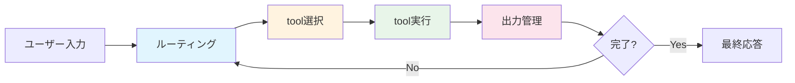
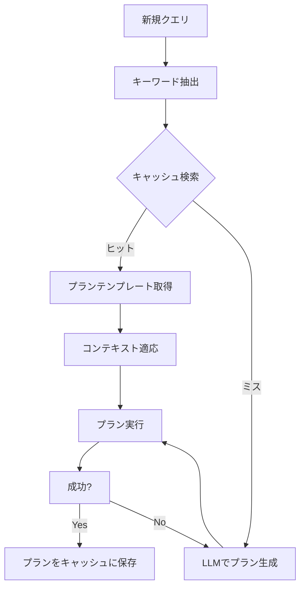

# AI Agentのtool最適化実装ガイド：選択キャッシュからアウトプット管理まで

## この記事でわかること

- AI Agentにおけるtool選択・実行・出力管理の全体アーキテクチャと最適化ポイント
- セマンティックキャッシュによるtool選択の高速化とコスト削減の実装方法
- LangGraph ToolNodeのインターセプタを活用したtool実行の制御パターン
- Anthropic Tool Search ToolやProgrammatic Tool Callingによるコンテキスト節約術
- tool出力のストア設計と、エージェントループ全体のルーティング最適化

## 対象読者

- **想定読者**: 中級〜上級のAI Agent開発者
- **必要な前提知識**:
  - Python 3.11+の基本文法とasync/awaitの理解
  - LangChain / LangGraph の基本概念（ノード、エッジ、ステート）
  - LLMのFunction Calling（tool_use）の仕組み
  - ベクトル検索の基本概念（コサイン類似度など）

## 結論・成果

AI Agentのtool最適化は、**選択（Selection）・実行（Execution）・出力管理（Output Management）** の3層で構成されます。各層に適切なキャッシュとルーティング戦略を導入することで、以下の効果が報告されています。

- **セマンティックキャッシュ**: LLM APIコールを最大69%削減、応答速度15倍向上（Redis LangCacheのベンチマーク）
- **プランキャッシュ**: コスト46.62%削減、精度96.67%維持（arXiv論文の実験結果）
- **Tool Search Tool**: コンテキストウィンドウ使用量95%削減、精度49%→74%向上（Anthropic公式レポート）
- **Programmatic Tool Calling**: トークン使用量37%削減（Anthropicの計測結果）

これらの最適化手法を組み合わせることで、本番運用でのコストとレイテンシを大幅に改善できます。

## AI Agentのtool処理アーキテクチャを理解する

AI Agentがtoolを使う処理は、大きく4つのフェーズに分かれます。まずこの全体像を把握してから、各フェーズの最適化に入りましょう。

### 4フェーズの全体フロー



| フェーズ | 役割 | 主なボトルネック | 最適化手法 |
|---------|------|----------------|-----------|
| ルーティング | 入力をどのエージェント/処理に振り分けるか | 推論コスト | モデル階層化、意図分類キャッシュ |
| tool選択 | どのtoolを使うか判断 | コンテキスト肥大化 | Tool Search Tool、セマンティックキャッシュ |
| tool実行 | toolを呼び出し結果を取得 | レイテンシ、エラー処理 | 並列実行、リトライ、インターセプタ |
| 出力管理 | tool結果を保存・フィルタリング | コンテキスト汚染 | 仮想ファイルシステム、Programmatic Calling |

### 各フェーズでのコスト内訳

1回のユーザーリクエストで、エージェントは複数回のLLM推論を行います。Anthropic公式ブログによると、5つのtoolを順次実行するワークフローでは5回の推論パスが発生し、**トークン予算は期待値の5倍**を見込む必要があります。

この構造を理解したうえで、各フェーズの最適化パターンを見ていきましょう。

## tool選択を最適化する：セマンティックキャッシュとTool Search Tool

tool選択フェーズの最適化は2つのアプローチに大別されます。**使えるtoolの数を絞る**方法と、**過去の選択結果を再利用する**方法です。

### Tool Search Toolでコンテキストウィンドウを節約する

Anthropicが2025年末に発表した**Tool Search Tool**は、tool定義の動的ロードを実現する仕組みです。従来は全toolの定義（50個で約72Kトークン）をプロンプトに含めていましたが、Tool Search Toolでは必要なtoolだけをオンデマンドで検索・ロードします。

```python
# Anthropic APIでのTool Search Tool設定例
# tool定義に defer_loading: true を指定すると
# 初期ロードから除外され、検索時にのみ読み込まれる

tools = [
    # 検索ツール自体は常にロード（約500トークン）
    {"type": "tool_search_tool_regex_20251119", "name": "tool_search_tool"},
    # 以下のtoolは検索時にのみロード
    {
        "name": "create_pull_request",
        "description": "GitHubにPRを作成する",
        "defer_loading": True,  # 初期ロードしない
        "input_schema": {
            "type": "object",
            "properties": {
                "title": {"type": "string"},
                "body": {"type": "string"},
                "base": {"type": "string", "default": "main"}
            },
            "required": ["title", "body"]
        }
    },
    # ... 他のtoolも同様に defer_loading: True で定義
]
```

**なぜこの実装を選んだか:**

- 50個以上のtoolを持つエージェントでは、tool定義だけで72Kトークンを消費する
- Tool Search Toolを使うと約8.7Kトークンに削減（Anthropic公式レポートの計測値）
- Opus 4でのtool選択精度が49%→74%に向上したと報告されている

**注意点:**

> Tool Search Toolは **regex型** と **BM25型** の2種類が提供されています。カスタムのembedding型検索を実装することも可能ですが、まずはBM25型で十分なケースが多いです。また、検索ヒットするにはtool名とdescriptionの品質が重要になるため、**tool定義のdescriptionを具体的に書く**ことが前提条件になります。

### セマンティックキャッシュでtool選択結果を再利用する

同じ意図のクエリに対して毎回LLMにtool選択を依頼するのは非効率です。**セマンティックキャッシュ**は、過去の類似クエリに対するtool選択結果をベクトル検索で再利用する手法です。

Walmart社が本番運用しているwaLLMartCacheの設計は、以下の2層構造を採用しています。

```python
import numpy as np
from typing import Optional


class SemanticToolCache:
    """tool選択結果のセマンティックキャッシュ（簡易実装例）"""

    def __init__(
        self,
        embedding_model,
        similarity_threshold: float = 0.85,
    ):
        self.embedding_model = embedding_model
        self.threshold = similarity_threshold
        self.cache: list[dict] = []  # 本番ではベクトルDBを使用

    def _cosine_similarity(
        self, a: np.ndarray, b: np.ndarray
    ) -> float:
        """コサイン類似度を計算"""
        return float(
            np.dot(a, b) / (np.linalg.norm(a) * np.linalg.norm(b))
        )

    def get(self, query: str) -> Optional[dict]:
        """類似クエリのキャッシュを検索"""
        query_embedding = self.embedding_model.embed(query)

        best_match = None
        best_score = 0.0

        for entry in self.cache:
            score = self._cosine_similarity(
                query_embedding, entry["embedding"]
            )
            if score > self.threshold and score > best_score:
                best_match = entry
                best_score = score

        if best_match:
            return {
                "tool_name": best_match["tool_name"],
                "tool_args": best_match["tool_args"],
                "similarity": best_score,
            }
        return None

    def put(
        self,
        query: str,
        tool_name: str,
        tool_args: dict,
    ) -> None:
        """tool選択結果をキャッシュに保存"""
        embedding = self.embedding_model.embed(query)
        self.cache.append({
            "query": query,
            "embedding": embedding,
            "tool_name": tool_name,
            "tool_args": tool_args,
        })
```

Redis LangCacheのベンチマークでは、セマンティックキャッシュの導入により**最大70%のコスト削減**と**応答速度15倍の高速化**が報告されています。ただし、この数値はキャッシュヒット時の改善率であり、実際の改善率はヒット率に大きく依存します。

**ハマりポイント:**

類似度の閾値（threshold）設定を誤ると問題が発生します。閾値が低すぎると異なる意図のクエリに誤ったtoolを返し（偽陽性）、高すぎるとキャッシュヒット率が低下します。本番環境では**0.85〜0.92の範囲**で、ドメインに応じたチューニングが必要です。また、時刻に依存するクエリ（「今日の天気」など）はキャッシュ対象から除外するフィルタが必要です。

### プランキャッシュ：tool選択パターンの再利用

個別のtool選択だけでなく、**タスク全体の実行計画（プラン）をキャッシュ**するアプローチも研究されています。arXivで発表された手法では、以下の仕組みでキーワードベースのプランマッチングを実現しています。



この手法では、**コスト46.62%削減**を達成しつつ、**精度の96.67%を維持**したと論文で報告されています。オーバーヘッドは総コストの1.04%程度に収まるため、キャッシュミス時のペナルティも小さい設計になっています。

**制約条件:**

> プランキャッシュはデータ依存性の低いタスク（定型的な分析手順など）で効果を発揮します。一方、入力データによって処理フローが大きく変わるタスク（自由形式の質問応答など）では、キャッシュヒット率が低下するため効果が限定的です。

## tool実行を最適化する：インターセプタと並列実行

toolの選択が最適化できたら、次は実行フェーズの最適化です。ここではLangGraph ToolNodeの機能を活用したパターンを見ていきます。

### LangGraph ToolNodeのインターセプタでキャッシュとリトライを実装する

LangGraph 1.0のToolNodeは、`wrap_tool_call`（インターセプタ）機能を提供しています。これにより、tool呼び出しの前後にキャッシュ参照やリトライ処理を挟み込めます。

```python
from langgraph.prebuilt import ToolNode
from langgraph.prebuilt.tool_node import ToolCallRequest
from langchain_core.messages import ToolMessage
import hashlib
import json
from functools import lru_cache


# tool結果のインメモリキャッシュ
_tool_result_cache: dict[str, str] = {}


def _make_cache_key(tool_name: str, args: dict) -> str:
    """toolの呼び出しパラメータからキャッシュキーを生成"""
    raw = json.dumps(
        {"tool": tool_name, "args": args},
        sort_keys=True,
    )
    return hashlib.sha256(raw.encode()).hexdigest()


async def caching_interceptor(
    request: ToolCallRequest,
) -> ToolCallRequest | ToolMessage:
    """
    read-onlyなtoolの結果をキャッシュするインターセプタ。
    キャッシュヒット時はtool実行をスキップしてToolMessageを直接返す。
    """
    # 書き込み系toolはキャッシュしない
    write_tools = {"create_file", "update_database", "send_email"}
    if request.tool_call["name"] in write_tools:
        return request

    cache_key = _make_cache_key(
        request.tool_call["name"],
        request.tool_call["args"],
    )

    if cache_key in _tool_result_cache:
        # キャッシュヒット: tool実行をスキップ
        return ToolMessage(
            content=_tool_result_cache[cache_key],
            tool_call_id=request.tool_call["id"],
            name=request.tool_call["name"],
        )

    # キャッシュミス: 通常実行（結果は別途保存が必要）
    return request


# ToolNodeにインターセプタを設定
tool_node = ToolNode(
    tools=[search_tool, calculator_tool, db_query_tool],
    wrap_tool_call=caching_interceptor,
)
```

**なぜこの実装を選んだか:**

- ToolNodeのインターセプタはtool単位で介入でき、キャッシュ・リトライ・ログ出力を統一的に扱える
- `ToolCallRequest`は不変オブジェクトなので、`override()`メソッドで安全にパラメータを変更できる
- キャッシュヒット時は`ToolMessage`を直接返すことで、tool実行自体をスキップできる

### 並列tool実行でレイテンシを削減する

ToolNodeはデフォルトで複数のtool呼び出しを並列実行します。同期処理にはスレッドプール、非同期処理には`asyncio.gather()`が使われます。

```python
import asyncio
from langchain_core.tools import tool


@tool
async def search_web(query: str) -> str:
    """Webを検索して結果を返す"""
    # 外部API呼び出し（I/O待ち）
    result = await external_search_api(query)
    return result


@tool
async def query_database(sql: str) -> str:
    """データベースにクエリを実行する"""
    result = await db_connection.execute(sql)
    return str(result)


# LLMが同時に2つのtool呼び出しを生成した場合、
# ToolNodeは asyncio.gather() で並列実行する
# → 直列実行に比べてレイテンシが約半分に短縮
```

LangGraph v2モードでは、`create_react_agent`がSend APIを使って**各tool呼び出しを個別のToolNodeインスタンスに分散**します。これにより、特定のtoolだけにinterrupt（人間介入）を設定するといった細かな制御が可能になっています。

**注意点:**

> 並列実行は**独立したtool呼び出し**にのみ適用されます。「toolAの結果をtoolBの引数に使う」ような依存関係がある場合は、LLMが1回の推論で1つのtool呼び出しだけを返すように設計する必要があります。無理に並列化しようとすると、レースコンディションやデータ不整合の原因になります。

### エラーハンドリング戦略

ToolNodeの`handle_tool_errors`パラメータで、エラー時の挙動を柔軟に制御できます。

```python
from langgraph.prebuilt import ToolNode


# パターン1: 全エラーをToolMessageに変換（LLMが自己修復を試みる）
tool_node_safe = ToolNode(
    tools=my_tools,
    handle_tool_errors=True,  # エラーメッセージをToolMessageとして返す
)

# パターン2: 特定の例外タイプのみキャッチ
tool_node_selective = ToolNode(
    tools=my_tools,
    handle_tool_errors=(ValueError, TimeoutError),
)

# パターン3: カスタムエラーハンドラ
def custom_error_handler(error: Exception) -> str:
    """エラー種別に応じたリカバリガイダンスを返す"""
    if isinstance(error, TimeoutError):
        return "タイムアウトしました。クエリを簡略化して再試行してください。"
    if isinstance(error, PermissionError):
        return "権限がありません。管理者に問い合わせてください。"
    return f"予期しないエラー: {type(error).__name__}"


tool_node_custom = ToolNode(
    tools=my_tools,
    handle_tool_errors=custom_error_handler,
)
```

| エラー戦略 | 用途 | トレードオフ |
|-----------|------|------------|
| `True`（全キャッチ） | プロトタイプ、対話型エージェント | LLMが自己修復を試みるがトークン消費増 |
| 型フィルタ | 本番環境 | 想定外のエラーはそのまま例外送出 |
| カスタムハンドラ | エンタープライズ | 実装コストは高いが最も制御性が高い |

## tool出力を管理する：コンテキスト汚染を防ぐ3つのパターン

tool実行結果がそのままLLMのコンテキストに入ると、**コンテキスト汚染**（大量の中間結果でコンテキストウィンドウが埋まる問題）が発生します。この章では、出力管理の3つのパターンを紹介します。

### パターン1: Programmatic Tool Callingで中間結果を隔離する

Anthropicが提供する**Programmatic Tool Calling**は、Claudeがtoolを逐次呼び出す代わりに、**Pythonコードを生成して一括実行**するアプローチです。tool結果はコード実行環境内で処理され、最終結果のみがLLMのコンテキストに返されます。

```python
# Anthropic APIでのProgrammatic Tool Calling設定例
# allowed_callers を指定すると、
# Claudeはtoolを直接呼び出す代わりにPythonコードを生成する

tools = [
    {
        "name": "get_team_members",
        "description": "指定チームのメンバー一覧を取得する",
        "allowed_callers": ["code_execution_20250825"],
        "input_schema": {
            "type": "object",
            "properties": {
                "team": {"type": "string"}
            },
            "required": ["team"]
        }
    },
    {
        "name": "get_expenses",
        "description": "指定ユーザーの経費データを取得する",
        "allowed_callers": ["code_execution_20250825"],
        "input_schema": {
            "type": "object",
            "properties": {
                "user_id": {"type": "string"},
                "quarter": {"type": "string"}
            },
            "required": ["user_id", "quarter"]
        }
    },
]

# Claudeが生成するコード例（実際にはAPIレスポンスに含まれる）:
# team = await get_team_members("engineering")
# expenses = await asyncio.gather(*[
#     get_expenses(m["id"], "Q3") for m in team
# ])
# total = sum(e["amount"] for e in expenses)
# print(f"Engineering Q3 total: ${total:,.2f}")
```

Anthropicの計測によると、20以上のtool呼び出しを含むタスクで**19回以上の推論パスを削減**し、**平均37%のトークン使用量削減**（43,588→27,297トークン）が達成されています。

**なぜこの実装を選んだか:**

- 従来の逐次tool呼び出しでは、各ステップの結果がコンテキストに蓄積される
- Programmatic Callingでは、コード実行環境内でデータ処理が完結する
- LLMのコンテキストには最終結果のみが返され、中間データによる汚染を防げる

### パターン2: 仮想ファイルシステムでtool出力をオフロードする

LangGraph 1.0のDeep Agents機能は、**仮想ファイルシステム**を使ってtool出力を外部に退避する仕組みを提供しています。大量のtool結果をファイルとして保存し、必要な部分だけを読み出すことで、コンテキストウィンドウの消費を抑えます。

```python
from langgraph.prebuilt import create_react_agent
from langchain_core.tools import tool


@tool
def write_analysis_result(
    filename: str,
    content: str,
) -> str:
    """分析結果をファイルに保存する（仮想FS）"""
    # LangGraphのStore APIでファイルを保存
    store.put(
        namespace=("agent", "workspace"),
        key=filename,
        value={"content": content},
    )
    return f"Saved to {filename} ({len(content)} chars)"


@tool
def read_analysis_result(filename: str) -> str:
    """保存した分析結果を読み出す"""
    item = store.get(
        namespace=("agent", "workspace"),
        key=filename,
    )
    if item is None:
        return f"File not found: {filename}"
    return item.value["content"]


@tool
def search_results(query: str) -> str:
    """保存済みの分析結果からキーワード検索する"""
    items = store.search(
        namespace=("agent", "workspace"),
        query=query,
        limit=5,
    )
    return "\n".join(
        f"- {item.key}: {item.value['content'][:200]}"
        for item in items
    )
```

このパターンは、以下のような状況で有効です。

- 10MB以上のログファイルを処理するエージェント
- 複数のデータソースから情報を収集して統合するパイプライン
- 長時間実行されるタスクで中間結果を保持する必要がある場合

**制約条件:**

> 仮想ファイルシステムはコンテキスト汚染を防げますが、**LLMがファイル操作のオーバーヘッドを理解してくれない**場合があります。頻繁な読み書きがかえってトークンを消費するケースもあるため、「大量データを一時退避して必要部分のみ参照する」ユースケースに限定することを推奨します。

### パターン3: LangGraph Store APIで長期記憶を実装する

エージェントが複数セッションにまたがって動作する場合、tool出力の一部を**長期記憶**として永続化する必要があります。LangGraph Store APIは、名前空間ベースのキーバリューストアとベクトル検索を組み合わせた長期記憶を提供します。

```python
from langgraph.store.memory import InMemoryStore

# インメモリストアの初期化（本番ではPostgresやRedisを使用）
store = InMemoryStore(
    index={
        "dims": 1536,  # embeddingの次元数
        "embed": embedding_model,
    }
)

# セッション横断でのtool結果保存
store.put(
    namespace=("user", "user_123", "preferences"),
    key="search_settings",
    value={
        "preferred_sources": ["arxiv", "github"],
        "language": "ja",
        "last_updated": "2026-03-01",
    },
)

# セマンティック検索で関連する過去の結果を取得
results = store.search(
    namespace=("user", "user_123", "preferences"),
    query="ユーザーの検索設定",
    limit=3,
)
```

## ルーティングを最適化する：エージェント間の効率的な振り分け

ルーティングは、ユーザーの入力を適切なエージェントや処理パスに振り分けるフェーズです。ここでの最適化は、**不要な推論コストの削減**と**正確な振り分け**の両立がポイントになります。

### 階層的モデルルーティング

**Plan-and-Execute パターン**を応用し、ルーティング判断には軽量モデル、実行には高性能モデルを使い分ける設計が、2026年現在のベストプラクティスとして広く採用されています。

```python
from langchain_anthropic import ChatAnthropic
from langgraph.graph import StateGraph, MessagesState, START, END


# ルーティング判断には軽量モデルを使用
router_llm = ChatAnthropic(
    model="claude-haiku-4-5-20251001",
    max_tokens=100,
)

# 実行には高性能モデルを使用
executor_llm = ChatAnthropic(
    model="claude-sonnet-4-6-20260305",
    max_tokens=4096,
)


ROUTER_PROMPT = """以下のユーザー入力を分析し、
最適な処理パスを1つ選んでください。

処理パス:
- search: 情報検索が必要なクエリ
- calculate: 計算・データ分析が必要なクエリ
- generate: 文章生成が必要なクエリ
- chat: 雑談・簡単な質問

入力: {query}
処理パス:"""


async def route_query(state: MessagesState) -> dict:
    """軽量モデルでルーティング判断"""
    query = state["messages"][-1].content
    response = await router_llm.ainvoke(
        ROUTER_PROMPT.format(query=query)
    )
    route = response.content.strip().lower()
    return {"route": route}


async def execute_search(state: MessagesState) -> dict:
    """検索パス: 高性能モデル + 検索ツール"""
    return await executor_llm.ainvoke(
        state["messages"],
        tools=[search_tool, web_fetch_tool],
    )


# グラフ構築
graph = StateGraph(MessagesState)
graph.add_node("router", route_query)
graph.add_node("search", execute_search)
graph.add_node("calculate", execute_calculation)
graph.add_node("generate", execute_generation)
graph.add_node("chat", execute_chat)

graph.add_edge(START, "router")
graph.add_conditional_edges(
    "router",
    lambda state: state.get("route", "chat"),
    {
        "search": "search",
        "calculate": "calculate",
        "generate": "generate",
        "chat": "chat",
    },
)
```

Haiku級のモデルでルーティングし、Sonnet/Opus級のモデルで実行することで、**全リクエストにOpusを使う場合と比べて30〜50%のコスト削減**が見込めます（モデル価格差に基づく推計）。

**よくある間違い:**

最初はルーティング精度を上げるためにOpusをルーターに使おうと考えがちですが、ルーティングは**分類タスク**であり、Haikuでも十分な精度が出ます。むしろルーターのプロンプトを改善する方がコスト対効果が高いです。

### ルーティング結果のキャッシュ

同一パターンのクエリに対するルーティング結果は、意図分類キャッシュで再利用できます。

```python
from functools import lru_cache
import hashlib


class RoutingCache:
    """ルーティング結果のキャッシュ"""

    def __init__(self, max_size: int = 1000):
        self._cache: dict[str, str] = {}
        self._max_size = max_size

    def _normalize_query(self, query: str) -> str:
        """クエリを正規化してキャッシュキーを生成"""
        # 小文字化、余分な空白除去で正規化
        normalized = " ".join(query.lower().split())
        return hashlib.md5(normalized.encode()).hexdigest()

    def get_route(self, query: str) -> str | None:
        """キャッシュされたルーティング結果を取得"""
        key = self._normalize_query(query)
        return self._cache.get(key)

    def set_route(self, query: str, route: str) -> None:
        """ルーティング結果をキャッシュ"""
        if len(self._cache) >= self._max_size:
            # LRU的に古いエントリを削除（簡易実装）
            oldest_key = next(iter(self._cache))
            del self._cache[oldest_key]
        key = self._normalize_query(query)
        self._cache[key] = route
```

## よくある問題と解決方法

| 問題 | 原因 | 解決方法 |
|------|------|----------|
| セマンティックキャッシュのヒット率が低い | 閾値が高すぎる、またはクエリの多様性が高い | 閾値を0.85→0.80に調整、ドメイン特化embeddingモデルの使用 |
| Tool Search Toolでtoolが見つからない | descriptionが抽象的すぎる | toolのdescriptionに具体的なユースケースと入出力例を記載 |
| 並列tool実行でレースコンディション | 依存関係のあるtoolを並列実行している | tool間の依存関係をDAGで定義し、独立したもののみ並列化 |
| コンテキストウィンドウが枯渇する | tool結果が大きすぎる | Programmatic Tool CallingまたはStore APIで中間結果を外部退避 |
| ルーターの分類精度が低い | プロンプトが曖昧、またはカテゴリが多すぎる | Few-shot例を追加、カテゴリを5個以下に限定 |
| プランキャッシュのヒット率が低い | タスクの多様性が高い | キーワード抽出をドメイン特化に調整、汎用プランテンプレートを作成 |

## まとめと次のステップ

**まとめ:**

- AI Agentのtool最適化は**選択・実行・出力管理・ルーティング**の4層で構成され、各層に独立した最適化戦略が存在する
- **Tool Search Tool**（コンテキスト95%節約）と**セマンティックキャッシュ**（コスト最大70%削減）でtool選択を効率化する
- **ToolNodeインターセプタ**でキャッシュ・リトライ・ログを統一的に実装し、**並列実行**でレイテンシを削減する
- **Programmatic Tool Calling**（トークン37%削減）や**仮想ファイルシステム**でコンテキスト汚染を防ぐ
- **階層的モデルルーティング**（Haiku→Sonnet/Opus）でコスト30〜50%削減が見込める

**次にやるべきこと:**

- まずTool Search Toolを導入し、tool定義のdescription品質を改善する（コンテキスト節約効果が最も即効性がある）
- セマンティックキャッシュはRedis + LangCacheで小規模にPoC（概念実証）を実施し、ヒット率と精度を計測する
- 本番環境ではOpenTelemetryなどの分散トレーシングを導入し、各フェーズのレイテンシ・コストを可視化する

## 参考

- [AI Agent Architecture: Build Systems That Work in 2026 - Redis](https://redis.io/blog/ai-agent-architecture/)
- [Introducing advanced tool use on the Claude Developer Platform - Anthropic](https://www.anthropic.com/engineering/advanced-tool-use)
- [Cost-Efficient Serving of LLM Agents via Test-Time Plan Caching - arXiv](https://arxiv.org/html/2506.14852v1)
- [Semantic Caching for AI Agents - devkanisk](https://devkanisk.com/blog/2026/semantic-caching-for-ai-agents/)
- [ToolNode and Tool Execution - LangGraph DeepWiki](https://deepwiki.com/langchain-ai/langgraph/8.2-toolnode-and-tool-execution)
- [Don't Break the Cache: Prompt Caching for Long-Horizon Agentic Tasks - arXiv](https://arxiv.org/html/2601.06007v1)
- [How to implement tool use - Claude API Docs](https://platform.claude.com/docs/en/agents-and-tools/tool-use/implement-tool-use)

---

## 関連する深掘り記事

この記事で紹介した技術について、さらに深掘りした記事を書きました：

- [論文解説: Agentic Plan Caching — LLMエージェントのコスト削減テスト時計画キャッシュ](https://0h-n0.github.io/posts/paper-2506-14852/) - arxiv解説
- [Anthropic Advanced Tool Use解説: Tool Search Tool・Programmatic Tool Calling](https://0h-n0.github.io/posts/techblog-anthropic-advanced-tool-use/) - tech_blog解説
- [論文解説: Don't Break the Cache — プロンプトキャッシュ最適設計](https://0h-n0.github.io/posts/paper-2601-06007/) - arxiv解説
- [論文解説: Toolshed — RAGベース大規模ツール選択](https://0h-n0.github.io/posts/paper-2410-14594/) - arxiv解説
- [論文解説: AutoTool — グラフベースの効率的ツール選択](https://0h-n0.github.io/posts/paper-2511-14650/) - arxiv解説

:::message
これらの記事は修士学生レベルを想定した技術的詳細（数式・実装の深掘り）を含みます。
:::

---

:::message
この記事はAI（Claude Code）により自動生成されました。内容の正確性については複数の情報源で検証していますが、実際の利用時は公式ドキュメントもご確認ください。
:::
