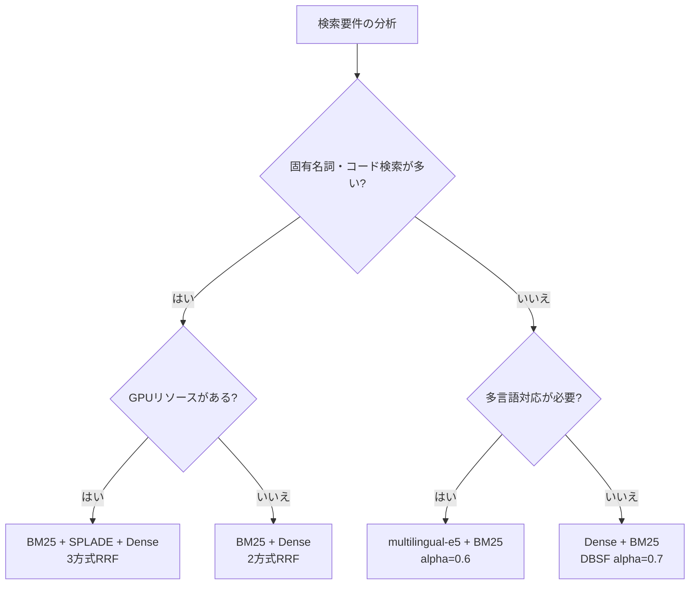

# BM25・SPLADE・ベクトル検索の3方式比較：スコア融合とDB別実装で選ぶハイブリッド検索

## この記事でわかること

- BM25・ベクトル検索・Learned Sparse Retrieval（SPLADE/ELSER）の**動作原理と得意・不得意の違い**を数式で理解する
- スコア融合手法（**RRF・DBSF・Convex Combination**）の数式・特性・使い分けを把握する
- **Qdrant・Elasticsearch・Weaviate**の3つの検索エンジンでハイブリッド検索を実装するコードを手に入れる
- 公開ベンチマーク（BEIR・WANDS）の**NDCG@10数値**から自分のユースケースに合う構成を選べるようになる
- ハイブリッド検索導入時の**典型的な落とし穴と対処法**を事前に知る

## 対象読者

- **想定読者**: RAGシステムや検索基盤の精度改善に取り組む中級エンジニア
- **必要な前提知識**:
  - Python 3.10+の基本的な文法
  - ベクトル検索（Embedding + コサイン類似度）の基礎概念
  - BM25やTF-IDFの用語レベルの理解
  - Docker環境でのコンテナ起動経験

## 結論・成果

ハイブリッド検索は単一手法に対してNDCG@10を**7〜15%改善**できることが複数のベンチマークで報告されています。Elasticsearch上のWANDSデータセットでは、BM25単体のNDCG 0.6983に対してハイブリッド構成で0.7497を達成しています（[SoftwareDoug, 2025](https://softwaredoug.com/blog/2025/03/13/elasticsearch-hybrid-search-strategies)による計測）。ただし、最適な構成はデータセットとクエリ特性に大きく依存するため、**自分のデータでの評価が不可欠**です。本記事では3つの検索方式と3つの融合手法を実装コード付きで比較し、選定の判断材料を提供します。

:::message
**関連記事**: BM25とベクトル検索のハイブリッド検索の基礎実装については、以下の既存記事もあわせて参照してください。
- [BM25×ベクトル検索のハイブリッド実装ガイド：RRFとalpha調整でRAG精度を30%向上させる](https://zenn.dev/0h_n0/articles/46d801df9b61de)
- [ハイブリッド検索の評価駆動チューニング：NDCG計測とα最適化の実践](https://zenn.dev/0h_n0/articles/829610b38d8280)

本記事はこれらを前提に、Learned Sparse Retrieval（SPLADE/ELSER）の追加、複数スコア融合手法の比較、3つの検索エンジンでの実装差異に焦点を当てています。
:::

## 3つの検索方式の原理と特性を比較する

ハイブリッド検索を設計するには、まず各検索方式が**何を捉え、何を見落とすか**を正確に理解する必要があります。ここではBM25・密ベクトル検索・Learned Sparse Retrievalの3方式を数式レベルで比較します。

### BM25：語彙的マッチングの基盤

BM25はクエリ中の各単語がドキュメント中に出現する頻度と希少性をスコア化する手法です。スコア計算は以下の式で表されます。

$$
\text{BM25}(q, d) = \sum_{t \in q} \text{IDF}(t) \cdot \frac{f(t, d) \cdot (k_1 + 1)}{f(t, d) + k_1 \cdot \left(1 - b + b \cdot \frac{|d|}{\text{avgdl}}\right)}
$$

ここで $f(t, d)$ は単語 $t$ のドキュメント $d$ 内の出現回数、$k_1$（通常1.2〜2.0）は頻度飽和パラメータ、$b$（通常0.75）はドキュメント長正規化パラメータです。

**BM25の強み**:
- 固有名詞、エラーコード、型番など**完全一致が重要なクエリ**で高い精度を発揮
- 計算が軽量で、転置インデックスにより大規模コーパスでもミリ秒単位で応答
- チューニングパラメータが少なく、導入コストが低い

**BM25の弱み**:
- 「機械学習」と「ML」のような**同義語・表記揺れに対応できない**
- クエリとドキュメントで語彙が異なる場合（vocabulary mismatch）、関連文書を見逃す
- 語順や文脈を考慮しないため、否定表現の区別が困難

### 密ベクトル検索：意味的類似性の捕捉

密ベクトル検索は、テキストを事前学習済みモデル（Sentence Transformersなど）で固定長の密ベクトルに変換し、コサイン類似度やドット積で類似性を計算します。

$$
\text{sim}(q, d) = \frac{\mathbf{v}_q \cdot \mathbf{v}_d}{\|\mathbf{v}_q\| \cdot \|\mathbf{v}_d\|}
$$

2026年3月時点で広く使われている代表的なモデルは以下のとおりです。

| モデル | 次元数 | MTEB Retrievalスコア | 備考 |
|--------|--------|---------------------|------|
| `all-MiniLM-L6-v2` | 384 | 41.9 | 軽量・高速、プロトタイプ向け |
| `bge-large-en-v1.5` | 1024 | 54.3 | 英語特化、本番利用実績多数 |
| `multilingual-e5-large-instruct` | 1024 | 56.2 | 多言語対応、日本語を含む |
| `voyage-3-large` | 1024 | 62.4 | Voyage AI提供、高精度 |

**密ベクトル検索の強み**:
- 同義語、パラフレーズ、言語間の意味的類似性を捕捉
- 「ログインできない」→「認証エラーの解決方法」のような意図ベースのマッチング

**密ベクトル検索の弱み**:
- 固有名詞や数値の正確な一致には不向き（「Python 3.11.4」と「Python 3.12.0」を区別しにくい）
- Embeddingモデルのドメイン適応が必要な場合がある
- ベクトルインデックスの構築にメモリとストレージを消費

### Learned Sparse Retrieval：BM25とベクトルの中間地点

Learned Sparse Retrieval（LSR）は、Transformerモデルを使ってテキストを**疎ベクトル**に変換する手法です。代表的な実装としてSPLADE（Naver Labs）とELSER（Elastic社）があります。

SPLADEの出力は語彙空間上の疎ベクトルで、各次元が単語に対応します。

$$
\mathbf{w}_j = \log(1 + \text{ReLU}(x_j)) \quad \text{(SPLADE-max pooling)}
$$

入力テキストに含まれない単語にも重みが付与される**クエリ拡張**が自動で行われる点が、従来のBM25との根本的な違いです。たとえば「深層学習の推論」というクエリに対して、SPLADEは「neural」「inference」「model」などの関連語にも重みを割り当てます。

| 特性 | BM25 | SPLADE/ELSER | 密ベクトル |
|------|------|-------------|-----------|
| マッチング方式 | 語彙一致 | 学習済み語彙拡張 | 意味的類似度 |
| 同義語への対応 | 不可 | 対応 | 対応 |
| 固有名詞の精度 | 高 | 中〜高 | 低 |
| 推論コスト | 低（CPU） | 中（GPU推奨） | 中（GPU推奨） |
| インデックスサイズ | 小 | 中 | 大 |
| 学習データ要否 | 不要 | 事前学習済み | 事前学習済み |

**注意点:**
> SPLADEは非ゼロ要素数がBM25の転置インデックスより多くなる傾向があり、検索レイテンシが増加します。ElasticsearchのELSERドキュメントでは、ELSERの推論にはPlatinumライセンスが必要と明記されています。自前でSPLADEを利用する場合はGPU環境を前提としてください。

## スコア融合手法を実装して比較する

異なる検索方式の結果を統合するスコア融合は、ハイブリッド検索の精度を左右する重要な設計判断です。ここでは実務で使われる3つの手法を、数式と特性の両面で比較します。

### Reciprocal Rank Fusion（RRF）

RRFは各検索方式から得た結果の**ランク順位のみ**を使ってスコアを統合します。元のスコア値を使わないため、異なるスケールのスコアを正規化する必要がありません。

$$
\text{RRF}(d) = \sum_{r \in R} \frac{1}{k + \text{rank}_r(d)}
$$

$k$ は定数で、通常60が使われます（Cormack et al., 2009の原論文のデフォルト値）。$k$ を大きくするほど上位と下位の差が縮まり、小さくするほど上位結果を強く優先します。

```python
from collections import defaultdict

def reciprocal_rank_fusion(
    results_list: list[list[str]],
    k: int = 60
) -> list[tuple[str, float]]:
    """複数の検索結果リストをRRFで融合する.

    Args:
        results_list: 各検索方式の結果（ドキュメントIDのリスト、ランク順）
        k: 定数パラメータ（デフォルト60）

    Returns:
        (doc_id, score) のリスト（スコア降順）
    """
    scores: dict[str, float] = defaultdict(float)
    for results in results_list:
        for rank, doc_id in enumerate(results, start=1):
            scores[doc_id] += 1.0 / (k + rank)
    return sorted(scores.items(), key=lambda x: x[1], reverse=True)
```

**RRFの特性**:
- スコアの正規化が不要で実装が容易
- 外れ値（極端に高い/低いスコア）に対してロバスト
- ランク情報しか使わないため、スコアの微妙な差を反映できない

### Distribution-Based Score Fusion（DBSF）

DBSFは各検索方式の**スコア分布を統計的に正規化**してから加重平均する手法です。3シグマルールを用いてスコアを $[0, 1]$ の範囲に正規化します。

$$
\text{norm}(s) = \frac{s - (\mu - 3\sigma)}{(\mu + 3\sigma) - (\mu - 3\sigma)}
$$

正規化後のスコアを加重平均します。

$$
\text{DBSF}(d) = \alpha \cdot \text{norm}(s_\text{dense}(d)) + (1 - \alpha) \cdot \text{norm}(s_\text{sparse}(d))
$$

```python
import numpy as np

def distribution_based_score_fusion(
    dense_scores: dict[str, float],
    sparse_scores: dict[str, float],
    alpha: float = 0.5,
) -> list[tuple[str, float]]:
    """DBSFで密・疎スコアを融合する.

    Args:
        dense_scores: {doc_id: dense_score}
        sparse_scores: {doc_id: sparse_score}
        alpha: 密ベクトルの重み（0.0-1.0）

    Returns:
        (doc_id, score) のリスト（スコア降順）
    """
    def normalize(scores: dict[str, float]) -> dict[str, float]:
        values = np.array(list(scores.values()))
        mu, sigma = values.mean(), values.std()
        lower = mu - 3 * sigma
        upper = mu + 3 * sigma
        width = upper - lower
        if width == 0:
            return {k: 0.5 for k in scores}
        return {k: np.clip((v - lower) / width, 0, 1) for k, v in scores.items()}

    norm_dense = normalize(dense_scores)
    norm_sparse = normalize(sparse_scores)

    all_docs = set(norm_dense) | set(norm_sparse)
    fused: dict[str, float] = {}
    for doc_id in all_docs:
        d = norm_dense.get(doc_id, 0.0)
        s = norm_sparse.get(doc_id, 0.0)
        fused[doc_id] = alpha * d + (1 - alpha) * s

    return sorted(fused.items(), key=lambda x: x[1], reverse=True)
```

### Convex Combination（線形結合）

Convex Combinationは最もシンプルな融合手法で、正規化済みスコアの重み付き和を計算します。

$$
\text{score}(d) = \alpha \cdot s_\text{vector}(d) + (1 - \alpha) \cdot s_\text{keyword}(d)
$$

Weaviateではこの方式が採用されており、$\alpha = 1.0$ で純粋なベクトル検索、$\alpha = 0.0$ で純粋なキーワード検索になります。

### 3手法の比較

| 特性 | RRF | DBSF | Convex Combination |
|------|-----|------|-------------------|
| 入力 | ランク順位 | 生スコア | 正規化済みスコア |
| パラメータ | $k$（通常60） | $\alpha$（0.0-1.0） | $\alpha$（0.0-1.0） |
| スコア正規化 | 不要 | 自動（3σ） | 事前に必要 |
| 外れ値への耐性 | 高 | 中 | 低 |
| スコア差の反映 | なし | あり | あり |
| 採用DB | Qdrant, ES | Qdrant | Weaviate |

**なぜRRFが広く使われるか:**
- 検索方式ごとのスコアスケールが大きく異なる場合でも安定した結果を返す
- 実装が容易で、チューニングの必要性が低い
- Assembled社のRAG実験では、RRFによるハイブリッド検索でanswer accuracy が+8〜10%、comprehensivenessが+30〜40%改善したと報告されている（[Assembled Blog](https://www.assembled.com/blog/better-rag-results-with-reciprocal-rank-fusion-and-hybrid-search)）

**注意点:**
> ただし、RRFはスコアの大小を反映しないため、1位と2位のスコアが僅差のケースと大差のケースを区別できません。スコアの分布に意味がある場合（リランキングとの組み合わせなど）はDBSFの方が適切な場合があります。

## Qdrantでハイブリッド検索を実装する

Qdrant 1.11+のQuery APIでは、`prefetch`メカニズムを使って密ベクトルと疎ベクトルの検索結果を取得し、RRFまたはDBSFで融合できます。実装してみましょう。

### コレクションの作成とデータ投入

```python
# hybrid_search_qdrant.py
from qdrant_client import QdrantClient, models

client = QdrantClient(url="http://localhost:6333")

DENSE_MODEL = "sentence-transformers/all-MiniLM-L6-v2"
SPARSE_MODEL = "prithivida/Splade_PP_en_v1"
COLLECTION = "documents"

# コレクション作成（密+疎ベクトル）
if not client.collection_exists(COLLECTION):
    client.create_collection(
        collection_name=COLLECTION,
        vectors_config={
            "dense": models.VectorParams(
                size=client.get_embedding_size(DENSE_MODEL),
                distance=models.Distance.COSINE,
            )
        },
        sparse_vectors_config={
            "sparse": models.SparseVectorParams()
        },
    )

# ドキュメント投入（FastEmbed統合）
documents = [
    "Pythonの例外処理ではtry-exceptブロックを使用します",
    "RuntimeErrorが発生した場合のデバッグ手順を解説します",
    "機械学習モデルの推論を高速化するためのTensorRT活用法",
    "PyTorchでGPUメモリ不足エラーが出た場合の対処方法",
]

vectors = [
    {
        "dense": models.Document(text=doc, model=DENSE_MODEL),
        "sparse": models.Document(text=doc, model=SPARSE_MODEL),
    }
    for doc in documents
]
payloads = [{"text": doc} for doc in documents]

client.upload_collection(
    collection_name=COLLECTION,
    vectors=vectors,
    payload=payloads,
)
```

### RRFによるハイブリッド検索

```python
def hybrid_search_rrf(
    client: QdrantClient,
    query: str,
    limit: int = 5,
) -> list[dict]:
    """QdrantのQuery APIでRRFハイブリッド検索を実行する.

    Args:
        client: Qdrantクライアント
        query: 検索クエリ文字列
        limit: 返却件数

    Returns:
        検索結果のリスト
    """
    results = client.query_points(
        collection_name=COLLECTION,
        query=models.FusionQuery(fusion=models.Fusion.RRF),
        prefetch=[
            models.Prefetch(
                query=models.Document(text=query, model=DENSE_MODEL),
                using="dense",
                limit=20,  # 各方式からの候補数
            ),
            models.Prefetch(
                query=models.Document(text=query, model=SPARSE_MODEL),
                using="sparse",
                limit=20,
            ),
        ],
        limit=limit,
    ).points

    return [{"id": p.id, "score": p.score, "text": p.payload["text"]} for p in results]
```

### DBSFへの切り替え

DBSFを使う場合は、`Fusion.RRF` を `Fusion.DBSF` に変更するだけです。

```python
# RRFの行を以下に置き換えるだけ
query=models.FusionQuery(fusion=models.Fusion.DBSF),
```

**なぜQdrantのprefetch方式を選ぶか:**
- 密・疎ベクトルの検索をサーバーサイドで並列実行し、通信を1往復に抑える
- RRFとDBSFをサーバーサイドで切り替え可能

**注意点:**
> Qdrant 1.11未満ではQuery APIが利用できません。また、`prithivida/Splade_PP_en_v1` は英語に最適化されたモデルです。日本語テキストの場合は `Qdrant/bm25` を疎ベクトル生成に使い、事前にトークナイザで分かち書きを行う必要があります。

## Elasticsearchでハイブリッド検索を実装する

Elasticsearch 8.17+では、`sub_searches` と `rank` パラメータを使ったRRFベースのハイブリッド検索がGAになっています。実装してみましょう。

### インデックスの作成

```python
# hybrid_search_es.py
from elasticsearch import Elasticsearch

es = Elasticsearch("http://localhost:9200")

INDEX = "documents"

# 密ベクトル + テキストフィールドのマッピング
if not es.indices.exists(index=INDEX):
    es.indices.create(
        index=INDEX,
        body={
            "mappings": {
                "properties": {
                    "text": {"type": "text", "analyzer": "standard"},
                    "embedding": {
                        "type": "dense_vector",
                        "dims": 384,
                        "index": True,
                        "similarity": "cosine",
                    },
                }
            }
        },
    )
```

### RRFによるハイブリッド検索

```python
from sentence_transformers import SentenceTransformer

model = SentenceTransformer("all-MiniLM-L6-v2")


def hybrid_search_es(
    es: Elasticsearch,
    query: str,
    limit: int = 5,
    rrf_rank_constant: int = 60,
    rrf_window_size: int = 100,
) -> list[dict]:
    """ElasticsearchでRRFハイブリッド検索を実行する.

    Args:
        es: Elasticsearchクライアント
        query: 検索クエリ
        limit: 返却件数
        rrf_rank_constant: RRFのk値
        rrf_window_size: 各sub_searchの候補数

    Returns:
        検索結果のリスト
    """
    query_vector = model.encode(query).tolist()

    response = es.search(
        index=INDEX,
        size=limit,
        body={
            "sub_searches": [
                {
                    "query": {
                        "match": {"text": query}
                    }
                },
                {
                    "query": {
                        "knn": {
                            "field": "embedding",
                            "query_vector": query_vector,
                            "num_candidates": rrf_window_size,
                        }
                    }
                },
            ],
            "rank": {
                "rrf": {
                    "rank_constant": rrf_rank_constant,
                    "rank_window_size": rrf_window_size,
                }
            },
        },
    )

    return [
        {
            "id": hit["_id"],
            "score": hit["_score"],
            "text": hit["_source"]["text"],
        }
        for hit in response["hits"]["hits"]
    ]
```

### ELSERを加えた3方式ハイブリッド

ELSERを使う場合は、`sub_searches` に `text_expansion` クエリを追加します。ELSERの利用にはPlatinumライセンスが必要です。

```python
# sub_searchesに以下を追加
{
    "query": {
        "text_expansion": {
            "elser_embedding": {
                "model_id": ".elser_model_2_linux-x86_64",
                "model_text": query,
            }
        }
    }
}
# rank.rrfはそのまま3方式の結果を融合
```

**なぜElasticsearchのsub_searches方式か:**
- 1回のリクエストで複数の検索方式を同時実行し、サーバーサイドでRRF融合を完結
- ELSER、BM25、kNNの3方式を柔軟に組み合わせ可能

**注意点:**
> `sub_searches` + `rank` はElasticsearch 8.14以降のGA機能です。8.13以前では `_msearch` で各方式を個別に実行し、クライアント側でRRFを計算する必要があります。また、ELSERは英語に最適化されており、日本語のLearned Sparse Retrievalには[Hugging FaceのSPLADEモデル](https://huggingface.co/naver)をElandでデプロイする方法が選択肢になります。

## Weaviateでハイブリッド検索を実装する

Weaviateはalpha値による**Convex Combination**と**RelativeScoreFusion**の2方式をサポートしています。

### コレクション作成と検索

```python
# hybrid_search_weaviate.py
import weaviate
from weaviate.classes.config import Configure, Property, DataType
from weaviate.classes.query import HybridFusion

client = weaviate.connect_to_local()  # localhost:8080

# コレクション作成
collection = client.collections.create(
    name="Document",
    vectorizer_config=Configure.Vectorizer.text2vec_transformers(),
    properties=[
        Property(name="text", data_type=DataType.TEXT),
    ],
)

# ドキュメント投入
documents = [
    "Pythonの例外処理ではtry-exceptブロックを使用します",
    "RuntimeErrorが発生した場合のデバッグ手順を解説します",
    "機械学習モデルの推論を高速化するためのTensorRT活用法",
]

with collection.batch.dynamic() as batch:
    for doc in documents:
        batch.add_object(properties={"text": doc})


def hybrid_search_weaviate(
    collection: weaviate.collections.Collection,
    query: str,
    alpha: float = 0.5,
    limit: int = 5,
    fusion_type: HybridFusion = HybridFusion.RELATIVE_SCORE,
) -> list[dict]:
    """Weaviateでハイブリッド検索を実行する.

    Args:
        collection: Weaviateコレクション
        query: 検索クエリ
        alpha: ベクトル検索の重み (1.0=ベクトルのみ, 0.0=キーワードのみ)
        limit: 返却件数
        fusion_type: 融合アルゴリズム

    Returns:
        検索結果のリスト
    """
    response = collection.query.hybrid(
        query=query,
        alpha=alpha,
        fusion_type=fusion_type,
        limit=limit,
    )

    return [
        {"id": str(obj.uuid), "text": obj.properties["text"]}
        for obj in response.objects
    ]
```

**alpha値の選び方:**
- $\alpha = 0.7$〜$0.8$: ベクトル検索寄り。意味的検索が主体のRAG向け
- $\alpha = 0.3$〜$0.5$: BM25寄り。固有名詞やコード検索が多い社内検索向け
- **最初は0.5から始め、評価データセットでNDCG@10を計測しながら調整**するのが定石

**fusion_typeの選択:**
- `RANKED`: RRF相当。スコアの分布が不明な場合に安定
- `RELATIVE_SCORE`: 各方式のスコアを $[\min, \max]$ で正規化して合算。AutoCutとの相性が良い

## ベンチマーク結果からユースケース別の最適構成を選ぶ

ここまで紹介した3つの検索方式と3つの融合手法の組み合わせを、公開されているベンチマークデータで比較します。

### WANDSデータセット（Eコマース検索）

SoftwareDoug (2025) がElasticsearch上で計測した結果です。

| 構成 | Mean NDCG | Median NDCG |
|------|-----------|-------------|
| BM25 cross-fields | 0.6983 | 0.7799 |
| kNN（密ベクトル） | 0.6953 | 0.7723 |
| RRF（BM25 + kNN） | 0.7068 | 0.7663 |
| Hybrid + filter | 0.7093 | 0.7800 |
| Hybrid + vector fallback | 0.7083 | 0.7802 |
| Hybrid + all-terms clause | 0.7191 | 0.8048 |
| Hybrid + name boost | **0.7497** | **0.8418** |

単純なRRFでは**1.2%の改善**にとどまりますが、語彙的マッチングの工夫（全語句一致のブースト、商品名フィールドの重み付け）を加えると**7.4%の改善**に達しています。

### BEIRベンチマーク（汎用情報検索）

BEIR（Benchmarking IR）は18の多様なデータセットを含むベンチマークです。SPLADE v3とその後継モデルの比較です。

| モデル | BEIR平均 NDCG@10 | 特徴 |
|--------|-----------------|------|
| BM25（ベースライン） | 0.437 | チューニングなし |
| SPLADE v2（distil） | 0.497 | 蒸留ベース |
| SPLADE v3 | 0.520 | マルチハードネガティブ |
| Echo-Mistral-SPLADE | 0.555 | Mistralベース、SPLADE v3比+3〜5pt |

Echo-Mistral-SPLADEの数値は[EmergentMind](https://www.emergentmind.com/topics/echo-mistral-splade)で報告されている値です。

### ユースケース別の推奨構成



| ユースケース | 推奨構成 | 融合手法 | 理由 |
|------------|---------|---------|------|
| 社内ドキュメント検索 | BM25 + Dense | RRF | 固有名詞と意味検索のバランス |
| Eコマース商品検索 | BM25 + Dense + フィールドブースト | RRF | 商品名の完全一致が重要 |
| 学術論文検索 | SPLADE + Dense | DBSF | 語彙拡張による同義語対応 |
| カスタマーサポートQA | Dense + BM25 | CC (alpha=0.7) | 意図ベースのマッチング重視 |
| コードスニペット検索 | BM25 + Dense | RRF | 関数名・変数名の完全一致 |

## よくある問題と解決方法

ハイブリッド検索を本番導入する際に遭遇しやすい問題と、その対処法をまとめます。

| 問題 | 原因 | 解決方法 |
|------|------|----------|
| 固有名詞の検索精度が低い | ベクトル検索が意味的に類似した別の名詞を返す | BM25の重みを上げる（alpha=0.3〜0.4） |
| 日本語SPLADEの精度が低い | 英語事前学習モデルでは日本語の語彙拡張が不十分 | Qdrant/bm25 + 形態素解析（MeCab/Sudachi）を使用 |
| 検索レイテンシが目標を超える | SPLADE推論のGPU処理時間がボトルネック | SPLADEをオフライン事前計算に切り替え、クエリ側のみリアルタイム実行 |
| RRFの結果が期待と異なる | kパラメータのデフォルト60が不適切 | k=10〜100で評価データセット上でグリッドサーチ |
| DBSFで特定方式が支配的 | スコア分布の偏りで正規化後も一方が優勢 | alphaの調整またはRRFへの切り替え |
| Embeddingモデルのドメイン適応が必要 | 汎用モデルでは業界特有の用語に弱い | Fine-tuningまたはmatryoshka表現の活用 |

**最初はBM25とベクトル検索の2方式RRFでベースラインを確立し、そこから評価データセットを使って段階的に最適化する**のが、実務での推奨アプローチです。

## まとめと次のステップ

**まとめ:**
- BM25は語彙一致、密ベクトルは意味類似、SPLADE/ELSERは学習済み語彙拡張という**異なる強みを持つ3方式**がある
- スコア融合はRRF（ランクベース、ロバスト）、DBSF（分布ベース、スコア差反映）、CC（線形結合、シンプル）の**3手法から選択**できる
- WANDSベンチマークでBM25単体NDCG 0.6983に対してハイブリッド構成で**0.7497（+7.4%）** を達成
- Qdrant・Elasticsearch・Weaviateの3つの検索エンジンでサーバーサイド融合が利用可能
- 最適な構成はデータセットに依存するため、**NDCG@10を計測しながらalpha/kを調整する評価駆動アプローチ**が不可欠

**次にやるべきこと:**
- 自分のデータセットで評価セット（query + 正解ドキュメント、最低50ペア）を作成する
- BM25 + Dense のRRF構成でベースラインNDCG@10を計測する
- alphaまたはkのグリッドサーチで融合パラメータを最適化する
- 必要に応じてSPLADE/ELSERやリランキング（Cohere Rerank、cross-encoder）を追加する

## 参考

- [Qdrant Hybrid Search with FastEmbed](https://qdrant.tech/documentation/tutorials-search-engineering/hybrid-search-fastembed/)
- [Elasticsearch Hybrid Search Recipes - Benchmarked](https://softwaredoug.com/blog/2025/03/13/elasticsearch-hybrid-search-strategies)
- [Weaviate Hybrid Search Explained](https://weaviate.io/blog/hybrid-search-explained)
- [BM42: New Baseline for Hybrid Search - Qdrant](https://qdrant.tech/articles/bm42/)
- [SPLADE for Sparse Vector Search Explained - Pinecone](https://www.pinecone.io/learn/splade/)
- [Elasticsearch Sparse Vector Embeddings](https://www.elastic.co/search-labs/blog/sparse-vector-embedding)
- [Understanding RRF and DBSF with Examples](https://dev.to/irajjelodari/understanding-math-behind-rrf-and-dbsf-with-examples-4bec)
- [Advanced RAG: RRF in Hybrid Search (glaforge.dev)](https://glaforge.dev/posts/2026/02/10/advanced-rag-understanding-reciprocal-rank-fusion-in-hybrid-search/)
- [Better RAG with RRF and Hybrid Search - Assembled](https://www.assembled.com/blog/better-rag-results-with-reciprocal-rank-fusion-and-hybrid-search)
- [NAVER SPLADE GitHub Repository](https://github.com/naver/splade)

---

:::message
この記事はAI（Claude Code）により自動生成されました。内容の正確性については複数の情報源で検証していますが、実際の利用時は公式ドキュメントもご確認ください。
:::
