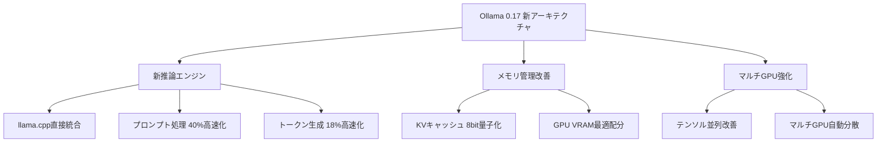
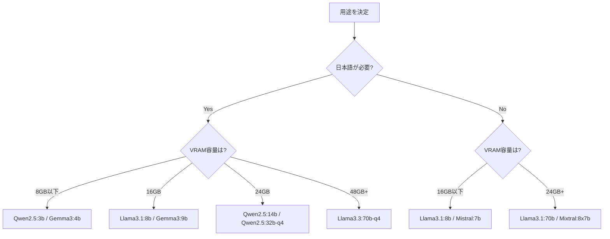
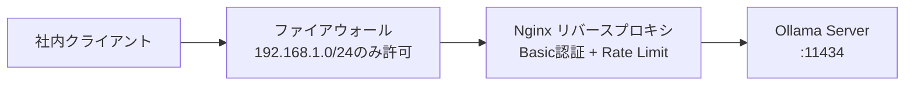

# Ollama 0.17でオンプレLLM推論環境を構築する実践ガイド

## この記事でわかること

- Ollama 0.17の新アーキテクチャとパフォーマンス改善点の理解
- Docker Compose + GPUでOllamaをオンプレ環境に本番デプロイする具体的手順
- OpenAI互換APIを使った既存アプリケーションとの統合方法
- VRAM要件に基づくモデル選定とKVキャッシュ最適化の実践
- 社内ネットワークでのセキュリティ設定とマルチユーザー運用の構成

## 対象読者

- **想定読者**: 中級者のインフラエンジニア・MLエンジニア
- **必要な前提知識**:
  - Docker / Docker Composeの基本操作
  - NVIDIA GPUドライバとCUDAの基礎知識
  - REST APIの基本的な利用経験
  - Linuxのシステム管理（systemd、ファイアウォール）

## 結論・成果

Ollama 0.17を使ったオンプレLLM推論環境は、クラウドAPI比で**年間コストを98%削減**できる構成です。Kong社の2025 Enterprise AIレポートによると、44%の組織がデータプライバシーとセキュリティをLLM導入の障壁として挙げており、オンプレ構成がその解決策となります。Ollama 0.17ではプロンプト処理が**最大40%高速化**され、KVキャッシュ8bit量子化により同一GPUで**コンテキスト長を約2倍**に拡張可能です。ただし、マルチユーザー高負荷環境ではvLLMのスループットが大幅に上回るため、ユースケースに応じた使い分けが必要です。

## Ollamaの位置づけとツール選定を理解する

ローカルLLM推論ツールは2026年時点で複数の選択肢があります。まずは主要ツールの特性を把握し、Ollamaが適するケースを明確にしましょう。

### 主要推論ツールの比較

| ツール | シングルユーザー速度 | マルチユーザースループット | セットアップ難易度 | 主な用途 |
|--------|---------------------|--------------------------|-------------------|----------|
| **Ollama** | llama.cppと同等（6%以内の差） | 41 TPS | 低（3コマンド） | 開発・中小規模本番 |
| **vLLM** | やや遅い | 793 TPS | 中〜高 | 大規模マルチテナント |
| **llama.cpp** | 最速 | 低い | 高（ビルド必要） | エッジ・組み込み |
| **Docker Model Runner** | Ollama同等 | 低い | 低 | Docker環境の開発用途 |

上記のベンチマークは、Red Hatの検証記事で報告された数値です。シングルユーザーではllama.cpp（Ollamaのバックエンド）が最速ですが、差は6%以内です。マルチユーザー環境ではvLLMがOllamaの約19倍のスループットを達成しています。

**なぜOllamaを選ぶのか:**

- **セットアップの容易さ**: `curl -fsSL https://ollama.com/install.sh | sh` で即座にインストール完了
- **OpenAI互換API**: 既存のOpenAIクライアントコードをほぼ無修正で移行可能
- **モデル管理の統一**: `ollama pull`でモデルのダウンロード・バージョン管理が完結
- **Docker統合**: GPU対応のDocker Composeテンプレートが公式で提供

> Ollamaはシングルユーザーや少人数チーム（10名程度まで）でのオンプレ運用に適しています。同時接続100名超の大規模環境では、vLLMへの移行を検討してください。

関連記事として、Docker Model Runnerを使ったLLMコンテナ化については[Docker Model Runner完全ガイド](https://zenn.dev/0h_n0/articles/9f176e6cc6c104)も参考になります。

### Ollama 0.17の主要な改善点

2026年2月にリリースされたOllama 0.17は、内部アーキテクチャの大幅な刷新を含むメジャーアップデートです。



主な変更点は以下の3つです。

**1. 新推論エンジン**: llama.cppとの統合を深化させ、スケジューリングとメモリ管理をOllama独自のレイヤーで制御するようになりました。これにより、モデルのロード・メモリ配分・並行リクエスト処理がきめ細かく制御できます。

**2. KVキャッシュ8bit量子化**: デフォルトの16bit表現に比べ、キャッシュのメモリオーバーヘッドを**約半分**に削減できます。出力品質への影響は軽微とされています。

**3. マルチGPUテンソル並列**: 複数のNVIDIA GPUにモデルを分散配置する効率が改善され、70B以上の大型モデルの運用が現実的になりました。

## Docker ComposeでGPU対応のOllama環境を構築する

ここからは実際にOllamaをDockerでデプロイする手順を見ていきましょう。本番運用を見据えた構成として、Docker Compose + NVIDIA GPU + ボリューム永続化の構成を採用します。

### 前提条件の確認

デプロイ前に、以下のソフトウェアがインストールされていることを確認してください。

```bash
# Docker バージョン確認（24.0以上推奨）
docker --version

# Docker Compose バージョン確認（v2.20以上推奨）
docker compose version

# NVIDIA ドライバ確認（535以上推奨）
nvidia-smi

# NVIDIA Container Toolkit確認
nvidia-ctk --version
```

NVIDIA Container Toolkitが未インストールの場合は、以下でセットアップします。

```bash
# NVIDIA Container Toolkit のインストール（Ubuntu/Debian）
curl -fsSL https://nvidia.github.io/libnvidia-container/gpgkey \
  | sudo gpg --dearmor -o /usr/share/keyrings/nvidia-container-toolkit-keyring.gpg

curl -s -L https://nvidia.github.io/libnvidia-container/stable/deb/nvidia-container-toolkit.list \
  | sed 's#deb https://#deb [signed-by=/usr/share/keyrings/nvidia-container-toolkit-keyring.gpg] https://#g' \
  | sudo tee /etc/apt/sources.list.d/nvidia-container-toolkit.list

sudo apt-get update && sudo apt-get install -y nvidia-container-toolkit
sudo nvidia-ctk runtime configure --runtime=docker
sudo systemctl restart docker
```

### Docker Compose構成ファイル

以下のdocker-compose.ymlでOllamaをGPU対応でデプロイします。

```yaml
# docker-compose.yml
# Ollama GPU対応 本番構成
services:
  ollama:
    # 本番ではlatestではなく特定バージョンをピン留め
    image: ollama/ollama:0.17.0
    container_name: ollama-server
    restart: unless-stopped
    ports:
      - "11434:11434"
    volumes:
      # モデルデータの永続化（コンテナ再起動でモデル再DLを防ぐ）
      - ollama_data:/root/.ollama
      # カスタムModelfileのマウント
      - ./modelfiles:/modelfiles:ro
    environment:
      # 社内ネットワークからのアクセスを許可
      - OLLAMA_HOST=0.0.0.0
      # 並列リクエスト数（GPUメモリに応じて調整）
      - OLLAMA_NUM_PARALLEL=4
      # 同時ロードモデル数上限
      - OLLAMA_MAX_LOADED_MODELS=2
      # KVキャッシュ量子化（VRAM節約）
      - OLLAMA_KV_CACHE_TYPE=q8_0
      # CORSオリジン制限（社内ネットワークのみ）
      - OLLAMA_ORIGINS=http://192.168.1.0/24,http://10.0.0.0/8
    deploy:
      resources:
        reservations:
          devices:
            - driver: nvidia
              count: 1  # GPU数を指定（allで全GPU）
              capabilities: [gpu]
    healthcheck:
      test: ["CMD", "curl", "-f", "http://localhost:11434/api/tags"]
      interval: 30s
      timeout: 10s
      retries: 3
      start_period: 40s

volumes:
  ollama_data:
    driver: local
```

**なぜこの構成を選んだか:**

- `image: ollama/ollama:0.17.0`: `:latest`ではなくバージョンを固定し、意図しないアップデートによる互換性問題を防止
- `OLLAMA_NUM_PARALLEL=4`: RTX 4090（24GB VRAM）想定。VRAM不足時は2に下げる
- `OLLAMA_KV_CACHE_TYPE=q8_0`: 16bitに比べKVキャッシュメモリが約半分に削減され、長いコンテキストを扱える
- `ollama_data`ボリューム: コンテナ再作成時もモデルデータが保持される

> **注意**: `OLLAMA_NUM_PARALLEL`を大きくしすぎると、GPUメモリ不足（OOM）でプロセスがクラッシュします。RTX 3090（24GB）で7Bモデルを使う場合、4が目安です。RTX 4060 Ti（16GB）では2程度に抑えてください。

### モデルの事前ダウンロードとModelfile

コンテナ起動後、使用するモデルをダウンロードします。本番環境では、起動時に自動でモデルを取得するentrypointスクリプトを用意すると運用が楽になります。

```bash
#!/bin/bash
# scripts/entrypoint.sh
# コンテナ起動時にモデルを事前ダウンロード

set -euo pipefail

# Ollamaサーバー起動（バックグラウンド）
ollama serve &
OLLAMA_PID=$!

# サーバーの起動を待機
echo "Waiting for Ollama server to start..."
for i in $(seq 1 30); do
    if curl -sf http://localhost:11434/api/tags > /dev/null 2>&1; then
        echo "Ollama server is ready."
        break
    fi
    sleep 1
done

# 必要なモデルを事前ダウンロード
echo "Pulling required models..."
ollama pull llama3.1:8b-instruct-q4_K_M
ollama pull nomic-embed-text

# カスタムModelfileからモデル作成（存在する場合）
if [ -f /modelfiles/company-assistant.Modelfile ]; then
    ollama create company-assistant -f /modelfiles/company-assistant.Modelfile
    echo "Custom model 'company-assistant' created."
fi

echo "All models ready. Ollama is serving."
# フォアグラウンドで待機
wait $OLLAMA_PID
```

Modelfileを使うと、モデルのパラメータやシステムプロンプトをカスタマイズできます。

```dockerfile
# modelfiles/company-assistant.Modelfile
# 社内アシスタント用カスタムモデル

FROM llama3.1:8b-instruct-q4_K_M

# 温度を低めに設定（社内文書の正確な要約向け）
PARAMETER temperature 0.3
PARAMETER top_p 0.9
PARAMETER num_ctx 8192

# システムプロンプト
SYSTEM """
あなたは社内の技術ドキュメントアシスタントです。
質問に対して、正確かつ簡潔に日本語で回答してください。
不明な点がある場合は「情報が不足しているため回答できません」と明示してください。
社外秘情報の取り扱いには十分注意してください。
"""
```

### 起動と動作確認

```bash
# コンテナ起動
docker compose up -d

# ログ確認
docker compose logs -f ollama

# モデル一覧の確認
curl -s http://localhost:11434/api/tags | python3 -m json.tool

# 推論テスト
curl -s http://localhost:11434/api/generate \
  -d '{
    "model": "llama3.1:8b-instruct-q4_K_M",
    "prompt": "Dockerのヘルスチェックとは何ですか？50文字以内で説明してください。",
    "stream": false
  }' | python3 -m json.tool
```

## OpenAI互換APIで既存アプリケーションと統合する

Ollamaの強みの一つは、OpenAI互換のREST APIを標準で提供していることです。既存のOpenAI SDKを使ったコードを、エンドポイントの変更だけでOllamaに移行できます。

### Pythonでの統合実装

```python
# ollama_client.py
"""Ollama OpenAI互換クライアント実装例"""

from openai import OpenAI


def create_ollama_client(
    base_url: str = "http://localhost:11434/v1",
) -> OpenAI:
    """Ollama用のOpenAIクライアントを生成する。

    Args:
        base_url: OllamaサーバーのOpenAI互換エンドポイント

    Returns:
        設定済みのOpenAIクライアント
    """
    return OpenAI(
        base_url=base_url,
        api_key="ollama",  # Ollamaでは認証不要だが、SDKの必須パラメータ
    )


def chat_completion(
    client: OpenAI,
    prompt: str,
    model: str = "llama3.1:8b-instruct-q4_K_M",
    temperature: float = 0.7,
    max_tokens: int = 1024,
) -> str:
    """チャット補完を実行する。

    Args:
        client: OpenAIクライアント
        prompt: ユーザーメッセージ
        model: 使用するモデル名
        temperature: 生成温度（0.0-1.0）
        max_tokens: 最大トークン数

    Returns:
        モデルの応答テキスト
    """
    response = client.chat.completions.create(
        model=model,
        messages=[
            {
                "role": "system",
                "content": "あなたは技術ドキュメントの要約アシスタントです。",
            },
            {"role": "user", "content": prompt},
        ],
        temperature=temperature,
        max_tokens=max_tokens,
    )
    return response.choices[0].message.content


def embedding(
    client: OpenAI,
    text: str,
    model: str = "nomic-embed-text",
) -> list[float]:
    """テキストの埋め込みベクトルを取得する。

    Args:
        client: OpenAIクライアント
        text: 埋め込み対象のテキスト
        model: 埋め込みモデル名

    Returns:
        埋め込みベクトル（float配列）
    """
    response = client.embeddings.create(
        model=model,
        input=text,
    )
    return response.data[0].embedding


if __name__ == "__main__":
    client = create_ollama_client()

    # チャット補完の実行
    answer = chat_completion(
        client,
        prompt="Kubernetesのポッドとは何ですか？3行で説明してください。",
    )
    print(f"回答: {answer}")

    # 埋め込みの取得
    vector = embedding(client, "Docker Composeによるマルチコンテナ管理")
    print(f"埋め込み次元数: {len(vector)}")
```

**なぜOpenAI互換APIを使うのか:**

- **移行コストの最小化**: 既存のOpenAI SDKベースのコードを`base_url`の変更だけで移行可能
- **フレームワーク互換**: LangChain、LlamaIndex、DSPyなどがOpenAI互換エンドポイントをサポート
- **段階的移行**: クラウドAPIとオンプレを並行運用し、トラフィックに応じて切り替えられる

**注意点:**

> OpenAI APIとの完全な互換性はありません。Function Callingは対応モデルが限られ、Structured Output（response_format）はOllama 0.17時点で一部モデルのみサポートです。移行前にAPIの互換性を検証してください。

### ストリーミングレスポンスの実装

チャットアプリケーションではストリーミングが必須です。以下は、Server-Sent Events形式でストリーミングする例です。

```python
# ollama_streaming.py
"""Ollamaストリーミングレスポンスの実装例"""

from openai import OpenAI


def stream_chat(
    client: OpenAI,
    prompt: str,
    model: str = "llama3.1:8b-instruct-q4_K_M",
) -> None:
    """ストリーミングでチャット応答を表示する。

    Args:
        client: OpenAIクライアント
        prompt: ユーザーメッセージ
        model: 使用するモデル名
    """
    stream = client.chat.completions.create(
        model=model,
        messages=[{"role": "user", "content": prompt}],
        stream=True,
    )

    for chunk in stream:
        content = chunk.choices[0].delta.content
        if content is not None:
            print(content, end="", flush=True)
    print()  # 改行


if __name__ == "__main__":
    client = OpenAI(
        base_url="http://localhost:11434/v1",
        api_key="ollama",
    )
    stream_chat(client, "PythonのGILとは何ですか？")
```

## VRAM要件に基づくモデル選定と最適化を行う

GPUメモリ（VRAM）はオンプレLLM運用で最も重要な制約です。モデルサイズ、量子化レベル、KVキャッシュの3要素がVRAM消費を決定します。

### モデルサイズ別のVRAM要件

以下は、Q4_K_M量子化での各モデルサイズにおけるVRAM要件の目安です。

| モデルサイズ | Q4_K_M VRAM | 推奨GPU | 日本語対応例 | トークン速度（目安） |
|-------------|-------------|---------|-------------|-------------------|
| **1.5-3B** | 2-3 GB | RTX 3060 (12GB) | Qwen2.5:3b | 60+ tok/s |
| **7-8B** | 4-5 GB | RTX 4060 Ti (16GB) | Llama3.1:8b, Gemma3:9b | 40+ tok/s |
| **13-14B** | 8-10 GB | RTX 4090 (24GB) | Qwen2.5:14b | 25+ tok/s |
| **32-34B** | 20-22 GB | RTX 4090 (24GB) | Qwen2.5:32b | 12+ tok/s |
| **70B** | 40-48 GB | A100 (80GB) / 2×RTX 4090 | Llama3.3:70b | 5+ tok/s |

上記のトークン速度はGPU単体での推論時の目安です。実際の速度はプロンプト長、生成長、バッチサイズにより変動します。

**VRAM計算の基本式:**

$$
\text{Total VRAM} = \text{Model Weights} + \text{KV Cache} + \text{Runtime Overhead}
$$

ここで:

- $\text{Model Weights}$ : パラメータ数 × 量子化ビット数 / 8（例: 7B × 4bit / 8 = 3.5 GB）
- $\text{KV Cache}$ : コンテキスト長に比例（8192トークンで約0.5-1.5 GB）
- $\text{Runtime Overhead}$ : 通常0.5-1 GB

### KVキャッシュ最適化の実践

Ollama 0.17のKVキャッシュ8bit量子化を活用すると、同じVRAMでより長いコンテキストを処理できます。

```bash
# KVキャッシュ量子化の設定（環境変数）
# q8_0: 8bit量子化（品質への影響は軽微）
export OLLAMA_KV_CACHE_TYPE=q8_0

# コンテキスト長を拡張して推論テスト
curl -s http://localhost:11434/api/generate \
  -d '{
    "model": "llama3.1:8b-instruct-q4_K_M",
    "prompt": "長いドキュメントの要約...",
    "options": {
      "num_ctx": 16384
    },
    "stream": false
  }'
```

| KVキャッシュ設定 | メモリ使用量（8Bモデル、8Kコンテキスト） | 品質への影響 |
|-----------------|----------------------------------------|------------|
| f16（デフォルト旧版） | 約1.5 GB | なし |
| q8_0（0.17推奨） | 約0.8 GB | 軽微 |
| q4_0 | 約0.4 GB | やや低下 |

**ハマりポイント:**

最初は`num_ctx`を32768（32K）に設定して7Bモデルを動かそうとしましたが、RTX 4060 Ti（16GB）ではOOMが発生しました。KVキャッシュのVRAM消費はコンテキスト長に**線形に比例**するため、VRAMに余裕がない場合は`num_ctx`を8192〜16384に抑える必要があります。

### モデル選定のフローチャート



## 社内ネットワークでセキュリティを設定する

Ollamaを社内ネットワークで公開する際、APIに**認証機能がない**点は特に注意が必要です。ファイアウォールとリバースプロキシによる多層防御が必須です。

### ネットワーク構成



### Nginxリバースプロキシの設定

```nginx
# /etc/nginx/conf.d/ollama.conf
# Ollama リバースプロキシ設定（Basic認証 + Rate Limit）

# レートリミット: 1分あたり30リクエスト/IP
limit_req_zone $binary_remote_addr zone=ollama_limit:10m rate=30r/m;

upstream ollama_backend {
    server 127.0.0.1:11434;
    keepalive 32;
}

server {
    listen 8080;
    server_name ollama.internal.example.com;

    # 社内ネットワークのみ許可
    allow 192.168.1.0/24;
    allow 10.0.0.0/8;
    deny all;

    # Basic認証
    auth_basic "Ollama API";
    auth_basic_user_file /etc/nginx/.htpasswd;

    # レートリミット適用
    limit_req zone=ollama_limit burst=10 nodelay;

    location / {
        proxy_pass http://ollama_backend;
        proxy_set_header Host $host;
        proxy_set_header X-Real-IP $remote_addr;

        # ストリーミングレスポンス対応
        proxy_buffering off;
        proxy_cache off;
        chunked_transfer_encoding on;

        # タイムアウト（大型モデルの推論に時間がかかるため長めに設定）
        proxy_read_timeout 300s;
        proxy_send_timeout 300s;
    }
}
```

```bash
# Basic認証ユーザーの作成
sudo apt-get install -y apache2-utils
sudo htpasswd -c /etc/nginx/.htpasswd ollama-user
```

### ファイアウォール設定（UFW）

```bash
# Ollamaポートへのアクセスを社内ネットワークに制限
sudo ufw allow from 192.168.1.0/24 to any port 8080 proto tcp comment "Ollama proxy"
sudo ufw allow from 10.0.0.0/8 to any port 8080 proto tcp comment "Ollama proxy"

# 外部からの直接アクセスを遮断（Ollamaのポートは外部に公開しない）
sudo ufw deny 11434/tcp comment "Block direct Ollama access"

sudo ufw reload
```

**セキュリティに関するトレードオフ:**

Nginxを介すことでレイテンシが数ミリ秒増加しますが、認証・レートリミット・アクセスログを一元管理できます。社内の開発環境でレイテンシを重視する場合は、`OLLAMA_ORIGINS`とファイアウォールのみで運用し、Nginxを省略する構成も可能です。ただし、その場合はAPIへの不正アクセスや過負荷に対する防御が弱くなります。

### 環境変数による追加のセキュリティ設定

```bash
# systemd環境の場合（/etc/systemd/system/ollama.service.d/override.conf）
[Service]
Environment="OLLAMA_HOST=0.0.0.0"
Environment="OLLAMA_ORIGINS=http://192.168.1.0/24,http://10.0.0.0/8"
Environment="OLLAMA_MODELS=/data/ollama/models"
```

`OLLAMA_ORIGINS`にはCORSで許可するオリジンをカンマ区切りで指定します。ブラウザベースのフロントエンドからアクセスする場合に必要です。

## よくある問題と解決方法

| 問題 | 原因 | 解決方法 |
|------|------|----------|
| `Error: model requires more system memory` | GPU VRAM不足 | より小さいモデル（8B→3B）に変更、またはQ4_K_M量子化を使用 |
| `connection refused on :11434` | Ollamaが`localhost`のみリッスン | `OLLAMA_HOST=0.0.0.0`を設定 |
| 推論が極端に遅い（1 tok/s以下） | GPUが認識されずCPU推論にフォールバック | `nvidia-smi`でドライバ確認、`docker run --gpus all nvidia/cuda:12.4.0-base-ubuntu22.04 nvidia-smi`で動作テスト |
| `CUDA error: out of memory` | KVキャッシュ + モデルでVRAM超過 | `num_ctx`を8192に下げる、`OLLAMA_KV_CACHE_TYPE=q8_0`で圧縮 |
| Docker内でGPUが見えない | NVIDIA Container Toolkit未設定 | `nvidia-ctk runtime configure --runtime=docker`を実行後、Docker再起動 |
| モデルダウンロードが途中で止まる | ネットワークタイムアウト | `OLLAMA_KEEP_ALIVE=60m`を設定、プロキシ環境ではHTTPS_PROXYを指定 |

## まとめと次のステップ

**まとめ:**

- Ollama 0.17は内部アーキテクチャの刷新により、プロンプト処理が最大40%、トークン生成が18%高速化された
- Docker Compose + NVIDIA GPUで、本番運用可能なオンプレLLM推論環境を構築できる
- OpenAI互換APIにより、既存のコードベースを最小限の変更で移行可能
- KVキャッシュ8bit量子化で、同一GPUでのコンテキスト長を約2倍に拡張できる
- APIに認証機能がないため、ファイアウォール + Nginxリバースプロキシの多層防御が必須

**次にやるべきこと:**

- `docker compose up -d`でOllama環境を起動し、7B〜8Bモデルで動作確認する
- 自社のユースケースに合ったModelfileを作成し、システムプロンプトとパラメータを調整する
- 同時接続数が増えた際のスループットをベンチマークし、vLLMへの移行判断基準を定める

## 参考

- [Ollama公式ドキュメント - Docker](https://docs.ollama.com/docker)
- [Ollama 0.17リリースノート（WebProNews）](https://www.webpronews.com/ollama-0-17-arrives-with-massive-performance-gains-and-a-new-architecture-that-could-reshape-local-ai-deployment/)
- [Ollama vs. vLLM: A deep dive into performance benchmarking（Red Hat Developer）](https://developers.redhat.com/articles/2025/08/08/ollama-vs-vllm-deep-dive-performance-benchmarking)
- [Ollama VRAM Requirements: Complete 2026 Guide（LocalLLM.in）](https://localllm.in/blog/ollama-vram-requirements-for-local-llms)
- [Self-Hosted LLM Guide: Setup, Tools & Cost Comparison 2026（Prem AI）](https://blog.premai.io/self-hosted-llm-guide-setup-tools-cost-comparison-2026/)
- [Dify × Ollamaで構築するオンプレミス生成AI基盤（Lifematics）](https://blog.lifematics.co.jp/entry/2026/01/30/090000)
- [Ollama Setup Guide: Run Local LLMs Like a Pro 2026 Edition（Nerd Level Tech）](https://nerdleveltech.com/ollama-setup-guide-run-local-llms-like-a-pro-2026-edition)

---

:::message
この記事はAI（Claude Code）により自動生成されました。内容の正確性については複数の情報源で検証していますが、実際の利用時は公式ドキュメントもご確認ください。
:::
