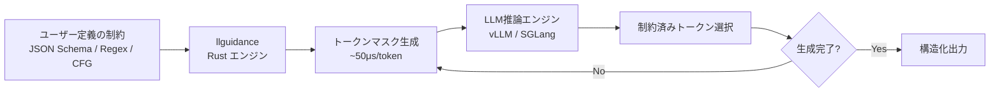
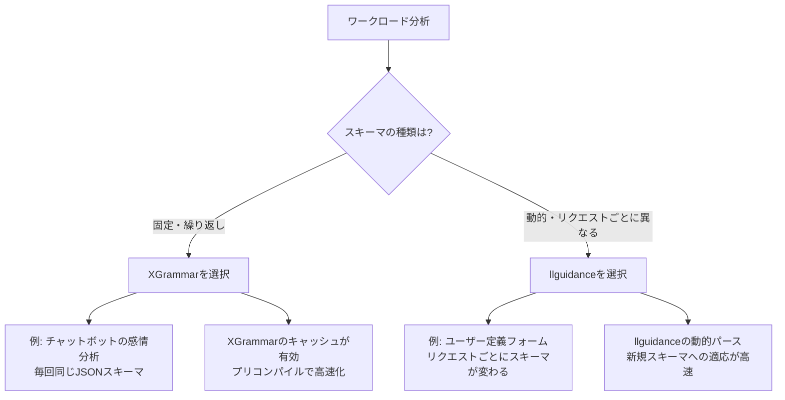

# Guidance 0.3×llguidance実践ガイド：vLLM/SGLang連携で本番運用

## この記事でわかること

- Guidance 0.3のアーキテクチャとRust製エンジンllguidanceの内部構造
- vLLM・SGLangでllguidanceバックエンドを有効化し、本番環境で構造化出力を運用する方法
- `gen()`・`select()`・`json()`・再帰文法を組み合わせた高度な制約パターンの実装
- llguidance vs XGrammarの使い分け判断基準とパフォーマンスチューニング手法
- 本番運用で遭遇する典型的な問題のトラブルシューティング

## 対象読者

- **想定読者**: LLMアプリケーションを本番運用している中級〜上級エンジニア
- **必要な前提知識**:
  - Python 3.10+の基礎文法とasync/await
  - LLM推論サーバー（vLLMまたはSGLang）の基本的な使い方
  - JSON SchemaとPydanticの基本理解
  - Guidanceライブラリの基本概念（`gen()`、`select()`の基礎は既知）

:::message
Guidanceの基本的な使い方については、関連記事「[Guidance言語でLLM出力を制御：構造化データ生成で30%コスト削減を実現する実践ガイド](https://zenn.dev/0h_n0/articles/69e37b35076338)」をご参照ください。本記事はその発展編として、本番環境での運用に焦点を当てています。
:::

## 結論・成果

Guidance 0.3とllguidanceエンジンをvLLM/SGLangに統合することで、以下の成果が報告されています。

- **JSONSchemaBenchの8データセット中6つで最高カバレッジ**を達成（JSONSchemaBench論文より）
- **無効JSON生成率0.12%**（XGrammarの2.21%と比較、SqueezeBitsベンチマークより）
- **トークンあたり約50μsのCPU処理時間**で128Kトークンのボキャブラリに対応（llguidance公式ドキュメントより）
- SGLangとの組み合わせで**構造化出力のオーバーヘッドをベースラインに対しほぼゼロ**に抑制（SqueezeBitsベンチマークより）

これらの数値は特定のベンチマーク条件下での結果であり、実際のワークロードでは結果が異なる可能性があります。

## Guidance 0.3とllguidanceのアーキテクチャを理解する

Guidance 0.3系の内部構造を理解することは、本番環境でのパフォーマンスチューニングに不可欠です。ここでは、Guidanceとllguidanceがどのように連携して構造化出力を実現しているかを見ていきます。

### llguidanceの内部動作

llguidanceはGuidanceの中核となるRust製の文法エンジンです。従来のPython実装からRustへの移行により、トークンマスク計算のパフォーマンスが大幅に向上しました。



llguidanceの主要な技術的特徴は以下のとおりです。

- **Earleyアルゴリズムベースのパーサー**: 正規表現の微分に基づくレキサーの上に構築されたCFGパーサー
- **プレフィックスツリー走査**: トークンマスクの計算にプレフィックスツリーを効率的に走査
- **50μs/tokenの処理速度**: 128Kトークンのボキャブラリに対して、公式ドキュメントによると平均50μs以下のマスク計算
- **バッチ処理対応**: 公式ドキュメントによれば、16コア・10msのフォワードパスの条件下でバッチサイズ3200まで対応可能

### Guidance 0.3のリリース変遷

Guidance 0.3系は0.2系から大幅な設計変更を経ています。本番運用にあたっては、各バージョンの変更点を把握しておくことが重要です。

| バージョン | リリース日 | 主な変更点 |
|-----------|-----------|-----------|
| 0.2.2 | 2024/06/19 | OpenAI API強化、高レベルAST導入、Interpreter抽象層 |
| 0.3.0 | 2024/09/09 | Groq/MistralAI対応、OpenAI function tools、llguidance統合 |
| 0.3.1 | 2025/02/03 | Monitor guided inference、ONNX Runtime GenAI対応、Python 3.14互換 |

**注意点:**
> v0.3.0でローカルモデルの直接呼び出しサポートが一時的に削除されました。ローカルモデルを使う場合はvLLMまたはSGLang経由での利用が推奨されます。

### サポートされる制約フォーマット

llguidanceが対応する制約フォーマットを整理します。

| フォーマット | 用途 | 対応状況 |
|------------|------|---------|
| JSON Schema | API応答、データ抽出 | 大部分のサブセットをサポート |
| 正規表現 | 日付、ID、数値範囲 | 完全サポート |
| 文脈自由文法（CFG） | プログラミング言語、数式 | Lark互換の記法でサポート |
| Pydantic Model | 型安全なJSON生成 | JSON Schema経由でサポート |

## vLLM・SGLangでllguidanceを本番運用する

llguidanceは2025年にvLLMとSGLangの両方に公式統合されました。ここでは、各フレームワークでのセットアップと運用パターンを実装していきます。

### vLLMでのセットアップと基本実装

vLLM v0.8.2以降でllguidanceバックエンドが利用可能です。まずはインストールと起動方法を見ていきましょう。

```bash
# vLLMとllguidanceのインストール
pip install "vllm>=0.8.2" llguidance

# llguidanceバックエンドを指定してvLLMサーバーを起動
python -m vllm.entrypoints.openai.api_server \
    --model meta-llama/Llama-3.1-8B-Instruct \
    --guided-decoding-backend guidance \
    --max-model-len 4096
```

vLLMのOpenAI互換APIを使って構造化出力を要求するPythonコードの例です。

```python
# vllm_guidance_example.py
from openai import OpenAI
from pydantic import BaseModel, Field

# vLLMサーバーに接続
client = OpenAI(
    base_url="http://localhost:8000/v1",
    api_key="dummy",  # vLLMではAPIキー不要
)

# Pydanticモデルで出力スキーマを定義
class TechArticleSummary(BaseModel):
    title: str = Field(description="記事タイトル")
    category: str = Field(description="カテゴリ")
    key_points: list[str] = Field(
        description="要点リスト",
        min_length=1,
        max_length=5,
    )
    difficulty: int = Field(
        description="難易度（1-5）",
        ge=1,
        le=5,
    )

# JSON Schemaを指定して構造化出力を要求
response = client.chat.completions.create(
    model="meta-llama/Llama-3.1-8B-Instruct",
    messages=[
        {
            "role": "user",
            "content": "以下の技術トピックを要約してください: Rustの所有権システム",
        }
    ],
    extra_body={
        "guided_json": TechArticleSummary.model_json_schema(),
    },
)

# パース結果は必ず有効なJSONになる
import json
result = json.loads(response.choices[0].message.content)
summary = TechArticleSummary(**result)
print(f"タイトル: {summary.title}")
print(f"難易度: {summary.difficulty}/5")
print(f"要点: {summary.key_points}")
```

**なぜvLLM + llguidanceを選ぶか:**
- OpenAI互換APIでアプリケーションコードの変更が最小限
- 既存のvLLMインフラにバックエンド指定だけで導入可能
- JSON Schema制約がサーバーサイドで強制されるため、クライアント側の検証ロジックが簡素化

**注意点:**
> vLLMでは構造化出力を有効化すると、SqueezeBitsのベンチマークによるとバッチサイズ8以上でベースラインに対して顕著なスループット低下が報告されています。大規模バッチ処理が必要な場合はSGLangの方が適しています。

### SGLangでのセットアップと基本実装

SGLangはCPU-GPU並列処理のアーキテクチャにより、構造化出力のオーバーヘッドをほぼゼロに抑えられると報告されています。本番環境で高スループットが求められる場合に適した選択肢です。

```bash
# SGLangとllguidanceのインストール
pip install "sglang[all]>=0.4.4" llguidance

# llguidanceバックエンドを指定してSGLangサーバーを起動
python -m sglang.launch_server \
    --model-path meta-llama/Llama-3.1-8B-Instruct \
    --grammar-backend llguidance \
    --port 30000
```

SGLangのネイティブAPIを使った構造化出力の実装例です。

```python
# sglang_guidance_example.py
import sglang as sgl
from pydantic import BaseModel, Field

class CodeReview(BaseModel):
    file_path: str = Field(description="レビュー対象ファイル")
    severity: str = Field(description="重大度: low/medium/high")
    issue: str = Field(description="指摘内容")
    suggestion: str = Field(description="改善提案")

@sgl.function
def review_code(s, code_snippet: str):
    s += sgl.system("あなたはコードレビューの専門家です。")
    s += sgl.user(f"以下のコードをレビューしてください:\n```\n{code_snippet}\n```")
    s += sgl.assistant(
        sgl.gen("review", max_tokens=512, regex=None)  # JSON制約はスキーマで指定
    )

# SGLangのランタイムで実行
runtime = sgl.Runtime(
    model_path="meta-llama/Llama-3.1-8B-Instruct",
    grammar_backend="llguidance",
)
sgl.set_default_backend(runtime)

# JSON Schema制約付きで実行
state = review_code.run(
    code_snippet="def add(a, b): return a + b",
    json_schema=CodeReview.model_json_schema(),
)

print(state["review"])
```

**なぜSGLangを選ぶか:**
- **CPU-GPU並列処理**: SqueezeBitsのベンチマークによると、文法マスク計算（CPU）とモデル推論（GPU）が並列実行され、構造化出力のオーバーヘッドがベースラインに対してほぼゼロ
- **RadixAttention**: KVキャッシュの効率的な再利用により、繰り返し同じスキーマを使うワークロードでスループット向上
- **ネイティブな構造化生成サポート**: フレームワークレベルで最適化

### vLLM vs SGLangの選定基準

実際のプロジェクトでどちらを選ぶべきかは、ワークロードの特性によります。

| 観点 | vLLM | SGLang |
|------|------|--------|
| API互換性 | OpenAI互換（移行容易） | 独自API（学習コストあり） |
| 構造化出力時のスループット | バッチサイズ増加で低下傾向 | ベースラインに近い性能を維持 |
| 動的スキーマ性能 | llguidanceで良好 | llguidanceで良好 |
| エコシステム | 広いコミュニティ、多くの事例 | 急成長中、研究用途に強い |
| 推奨ユースケース | 既存OpenAI APIからの移行 | 高スループットが必要な本番環境 |

上記の比較はSqueezeBitsによるベンチマーク結果に基づいており、特定の条件下での測定結果です。実際のワークロードで検証することを推奨します。

## 高度な制約パターンを実装する

Guidanceの真価は、単純なJSON出力を超えた複雑な制約パターンにあります。ここでは`gen()`・`select()`・再帰文法を組み合わせた実践的なパターンを見ていきましょう。

### パターン1: 条件分岐付きの構造化出力

出力の一部のフィールドが、別のフィールドの値に依存するケースです。たとえば、エラーの種類によって詳細情報の構造が変わるログ分析の場面で使えます。

```python
# conditional_output.py
from guidance import models, gen, select, guidance

@guidance(stateless=True)
def error_report(lm):
    # エラー種別を選択肢から制約
    lm += '{"error_type": "'
    lm += select(
        ["timeout", "validation", "authentication"],
        name="error_type",
    )
    lm += '", "message": "'
    lm += gen("message", stop='"', max_tokens=100)
    lm += '"'

    # error_typeに応じて追加フィールドを分岐
    # timeoutの場合はduration_msフィールドを追加
    lm += ', "duration_ms": '
    lm += gen("duration", regex=r"\d{1,6}")

    lm += ', "retry_recommended": '
    lm += select(["true", "false"], name="retry")
    lm += "}"
    return lm

# ローカルモデルまたはvLLM経由で利用
lm = models.Transformers("microsoft/Phi-4-mini-instruct")
result = lm + "システムエラーの分析結果: " + error_report()

print(result["error_type"])   # "timeout" | "validation" | "authentication"
print(result["duration"])      # 数値文字列（1-6桁）
print(result["retry"])         # "true" | "false"
```

**なぜこのパターンが有効か:**
- `select()`で列挙型フィールドを厳密に制約し、不正な値の生成を防止
- `gen(regex=...)`で数値範囲を制約し、後段のパース処理を簡素化
- フィールド間の論理的な依存関係をPythonの制御フローで表現可能

### パターン2: 再帰文法による複雑な構造生成

Guidanceは文脈自由文法（CFG）をサポートしているため、再帰的な構造も制約付きで生成できます。たとえば、数式やネストしたデータ構造の生成に有用です。

```python
# recursive_grammar.py
from guidance import models, select, gen, guidance

@guidance(stateless=True)
def math_expression(lm, depth: int = 0):
    """再帰的な数式を生成する制約"""
    if depth > 3:
        # 再帰の深さを制限して無限ループを防止
        lm += gen("number", regex=r"\d{1,3}")
        return lm

    lm += select(
        [
            gen("number", regex=r"\d{1,3}"),                            # 数値リテラル
            "(" + math_expression(depth=depth + 1)                      # 括弧付き部分式
                + select([" + ", " - ", " * ", " / "])
                + math_expression(depth=depth + 1) + ")",
        ],
        name=f"expr_{depth}",
    )
    return lm

lm = models.Transformers("microsoft/Phi-4-mini-instruct")
result = lm + "計算式を生成: " + math_expression()
# 出力例: "(42 + (7 * 3))"
```

**注意点:**
> 再帰文法は便利ですが、深さの制限を設けないとトークン生成が指数的に増加します。本番環境では`depth`パラメータでの上限設定が必須です。再帰の深さ3-4程度が実用的な上限とされています。

### パターン3: ツール呼び出しとの連携

Guidance 0.3では`gen(tools=[...])`による関数呼び出しの構造化が可能です。LLMが生成した引数をそのまま関数に渡せるため、エージェントワークフローでの利用に適しています。

```python
# tool_calling.py
from guidance import models, gen, guidance

@guidance
def search_database(lm, query: str, limit: int):
    """データベース検索ツール"""
    # 実際のDB検索ロジック
    results = [
        {"id": 1, "title": f"Result for: {query}"},
    ]
    lm += f"\n検索結果（{len(results)}件）:\n"
    for r in results:
        lm += f"- {r['title']}\n"
    return lm

@guidance
def calculator(lm, expression: str):
    """計算ツール"""
    try:
        # 安全な評価（本番ではastモジュール等を使用）
        result = eval(expression, {"__builtins__": {}})  # noqa: S307
        lm += f"\n計算結果: {expression} = {result}\n"
    except Exception:
        lm += f"\n計算エラー: {expression}\n"
    return lm

# ツールを指定してLLMに選択させる
lm = models.Transformers("microsoft/Phi-4-mini-instruct")
lm += "ユーザーの質問に答えてください: 売上データを検索して合計を計算\n"
lm += gen(
    "response",
    tools=[search_database, calculator],
    max_tokens=500,
)
```

**なぜGuidanceのツール呼び出しか:**
- LLMが生成するツール引数が文法制約によって常に有効な形式
- 関数シグネチャから自動的にJSON Schemaを生成
- 再試行なしで正確な引数を一発生成

### パターン4: 正規表現による精密な出力制御

日付、URL、バージョン番号など、特定のフォーマットを厳密に制御する場合は`regex`パラメータが効果的です。

```python
# regex_patterns.py
from guidance import models, gen

lm = models.Transformers("microsoft/Phi-4-mini-instruct")

# 日付フォーマットの制約（YYYY-MM-DD）
lm += "イベント日: "
lm += gen("date", regex=r"20\d{2}-(0[1-9]|1[0-2])-(0[1-9]|[12]\d|3[01])")

# セマンティックバージョニングの制約
lm += "\nバージョン: "
lm += gen("version", regex=r"\d{1,2}\.\d{1,2}\.\d{1,3}")

# IPv4アドレスの制約
lm += "\nサーバーIP: "
lm += gen(
    "ip",
    regex=r"((25[0-5]|2[0-4]\d|1\d{2}|[1-9]?\d)\.){3}(25[0-5]|2[0-4]\d|1\d{2}|[1-9]?\d)",
)

print(f"日付: {lm['date']}")      # 例: "2026-03-15"
print(f"バージョン: {lm['version']}")  # 例: "3.1.0"
print(f"IP: {lm['ip']}")          # 例: "192.168.1.100"
```

**ハマりポイント:**
> 複雑な正規表現はトークンマスク計算のコストを増加させます。llguidanceの公式ドキュメントによると、マスク計算の99%は1ms以下ですが、正規表現が複雑になると外れ値が発生します。可能であればJSON SchemaやCFGで代替し、正規表現はフィールド単位の短いパターンに限定することを推奨します。

## パフォーマンスを最適化する

本番環境では、構造化出力の正確性だけでなくスループットとレイテンシーも重要です。ここではllguidanceのパフォーマンス特性を理解し、ワークロードに合わせた最適化を行う方法を見ていきます。

### llguidance vs XGrammar: ワークロード別の選定

SqueezeBitsが公開したベンチマーク（2025年）では、llguidanceとXGrammarの性能特性が明確に分かれています。



| 条件 | llguidance | XGrammar |
|------|-----------|----------|
| 固定スキーマ（繰り返し） | 良好 | キャッシュ戦略で優位 |
| 動的スキーマ（毎回異なる） | 優位（新規スキーマへの適応が高速） | キャッシュが効かず性能低下 |
| 無効JSON生成率 | 0.12% | 2.21% |
| JSONSchemaBenchカバレッジ | 8中6データセットで最高 | 特定パターンで安定 |

上記の数値はSqueezeBitsのベンチマーク論文およびJSONSchemaBench（arXiv:2501.10868）から引用しています。

### 推論サーバーの設定チューニング

vLLMとSGLangそれぞれで、構造化出力に関連するチューニングパラメータを整理します。

```bash
# vLLM: 構造化出力のパフォーマンスチューニング
python -m vllm.entrypoints.openai.api_server \
    --model meta-llama/Llama-3.1-8B-Instruct \
    --guided-decoding-backend guidance \
    --max-model-len 4096 \
    --max-num-seqs 16 \
    --gpu-memory-utilization 0.9

# SGLang: 構造化出力のパフォーマンスチューニング
python -m sglang.launch_server \
    --model-path meta-llama/Llama-3.1-8B-Instruct \
    --grammar-backend llguidance \
    --port 30000 \
    --mem-fraction-static 0.85 \
    --max-running-requests 32
```

**チューニングのポイント:**
- **バッチサイズの調整**: vLLMでは`--max-num-seqs`を小さめに設定（8-16）すると構造化出力時のスループット低下を軽減できると報告されています
- **メモリ割り当て**: 構造化出力はCPU側でマスク計算を行うため、GPU側のメモリ割り当て比率に直接影響しません
- **SGLangのCPU-GPU並列**: SGLangはデフォルトでCPU-GPU並列処理が有効なため、追加設定なしで構造化出力のオーバーヘッドが最小化されます

### スキーマ設計のベストプラクティス

構造化出力のパフォーマンスはスキーマの設計に大きく依存します。実際にJSON Schemaを設計する際のベストプラクティスをまとめます。

```python
# schema_design_best_practices.py
from pydantic import BaseModel, Field

# BAD: ネストが深すぎるスキーマ（マスク計算コスト増大）
class DeeplyNested(BaseModel):
    level1: dict  # 自由形式 → 制約が弱い
    level2: dict  # LLMが自由に構造を決める → パース困難

# GOOD: フラットで明示的なスキーマ
class FlatExplicit(BaseModel):
    """分析結果を格納する型安全なスキーマ"""
    category: str = Field(
        description="分析カテゴリ",
        pattern=r"^(performance|security|reliability)$",  # enum代替
    )
    score: float = Field(
        description="スコア（0.0-1.0）",
        ge=0.0,
        le=1.0,
    )
    findings: list[str] = Field(
        description="発見事項のリスト",
        min_length=1,
        max_length=10,
    )
    recommendation: str = Field(
        description="推奨アクション",
        max_length=200,
    )
```

**トレードオフ:**
スキーマをフラットにすると制約が厳密になりパース精度が上がりますが、複雑なデータ構造を表現しにくくなります。ネストが必要な場合は**深さ2-3レベルまで**に留め、各レベルのフィールド数を5-10個以内に抑えることを推奨します。

## よくある問題と解決方法

本番運用で遭遇しやすい問題とその対処方法をまとめます。

| 問題 | 原因 | 解決方法 |
|------|------|----------|
| `GuidanceBackend not found` | llguidanceパッケージ未インストール | `pip install llguidance`で追加インストール |
| JSON出力が途中で切れる | `max_tokens`が小さすぎる | スキーマのフィールド数 × 50-100程度を目安に設定 |
| 大きなスキーマで初回レイテンシーが高い | 文法コンパイルのオーバーヘッド | スキーマを分割するか、ウォームアップリクエストを送信 |
| vLLMでバッチサイズ増加時にスループット低下 | 構造化出力のCPUボトルネック | SGLangに移行、またはバッチサイズを8以下に制限 |
| `regex`制約で予期しないマッチ | 正規表現のアンカー不足 | `^...$`でパターン全体をアンカー |
| ネストしたスキーマで無限生成 | 再帰制約の深さ制限なし | `maxItems`や`depth`パラメータで上限を設定 |

### デバッグ手法: Monitor Guided Inference（v0.3.1）

Guidance v0.3.1で追加されたMonitor機能を使うと、推論中のトークンマスク状態をリアルタイムで確認できます。

```python
# monitor_example.py
from guidance import models

# デバッグモードで実行
lm = models.Transformers(
    "microsoft/Phi-4-mini-instruct",
    echo=True,  # トークン生成をリアルタイム表示
)

# 生成中のマスク状態を監視
lm += "JSON出力: "
lm += gen(
    "output",
    regex=r'\{"name": "[a-zA-Z]+", "age": \d{1,3}\}',
    max_tokens=50,
    temperature=0.0,  # デバッグ時は0で再現性を確保
)
# echoモードでトークンごとの制約状態が表示される
```

**ハマりポイント:**
> `echo=True`はデバッグ専用です。本番環境で有効にすると標準出力に大量のログが出力されてパフォーマンスが低下します。デバッグ完了後は必ず無効化してください。

## まとめと次のステップ

**まとめ:**

- **Guidance 0.3 + llguidance**は、Rust製エンジンによるトークンあたり約50μsの高速マスク生成と、JSONSchemaBenchでの高いカバレッジが報告されている構造化出力フレームワーク
- **vLLM v0.8.2+・SGLang v0.4.4+**でllguidanceバックエンドが公式サポートされており、`--guided-decoding-backend guidance`または`--grammar-backend llguidance`で有効化可能
- **ワークロードに応じたバックエンド選定**が重要で、動的スキーマにはllguidance、固定スキーマにはXGrammarが適している
- **SGLangのCPU-GPU並列アーキテクチャ**により、構造化出力のスループットオーバーヘッドがベースラインに近い性能を維持できると報告されている
- **スキーマ設計**はフラットで明示的な構造が推奨され、ネストは2-3レベルまでに抑えるのが実用的

**次にやるべきこと:**

1. 自身のワークロードでvLLM/SGLangの両方をベンチマークし、スループットとレイテンシーを比較する
2. 既存のプロンプト+検証パイプラインをGuidanceの制約ベースに移行し、再試行コストの削減を測定する
3. JSONSchemaBenchのテストスイートを使って、自身のスキーマのカバレッジを検証する

## 参考

- [guidance-ai/guidance - GitHub](https://github.com/guidance-ai/guidance)
- [guidance-ai/llguidance - GitHub](https://github.com/guidance-ai/llguidance)
- [Guided Decoding Performance on vLLM and SGLang - SqueezeBits](https://blog.squeezebits.com/guided-decoding-performance-vllm-sglang)
- [JSONSchemaBench: A Rigorous Benchmark of Structured Outputs for Language Models (arXiv:2501.10868)](https://arxiv.org/html/2501.10868v1)
- [Guidance公式ドキュメント - Read the Docs](https://guidance.readthedocs.io/en/latest/)
- [vLLM Structured Outputs ドキュメント](https://docs.vllm.ai/en/latest/features/structured_outputs/)
- [SGLang GitHub リポジトリ](https://github.com/sgl-project/sglang)

## 関連する深掘り記事

この記事に関連する1次情報の深掘り記事を以下にまとめました。

- [論文解説: JSONSchemaBench — 構造化出力ベンチマークの詳細分析](https://0h-n0.github.io/posts/paper-2501-10868/)
- [論文解説: XGrammar — ボキャブラリ分割による高速構造化出力](https://0h-n0.github.io/posts/paper-2411-15100/)
- [SqueezeBits解説: vLLM/SGLangガイデッドデコーディング性能比較](https://0h-n0.github.io/posts/techblog-squeezebits-guided-decoding-benchmark/)
- [ICML 2025論文解説: Grammar-Constrained Decodingの理論と実践](https://0h-n0.github.io/posts/conf-icml2025-grammar-constrained-decoding/)
- [NeurIPS 2024論文解説: SGLang — RadixAttentionによる高効率LLM推論](https://0h-n0.github.io/posts/conf-neurips2024-sglang/)

---

:::message
この記事はAI（Claude Code）により自動生成されました。内容の正確性については複数の情報源で検証していますが、実際の利用時は公式ドキュメントもご確認ください。
:::
