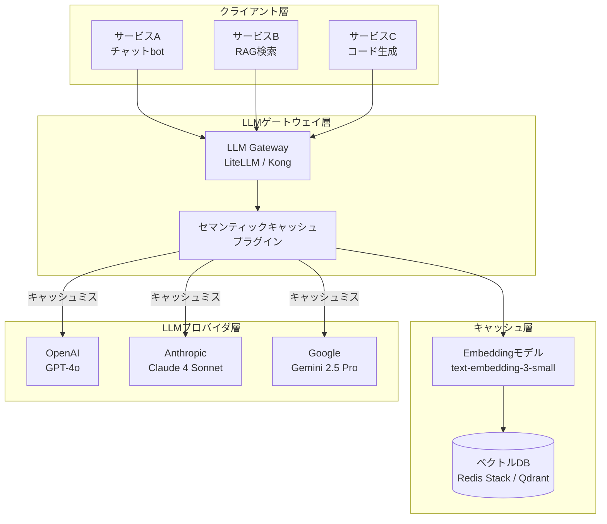
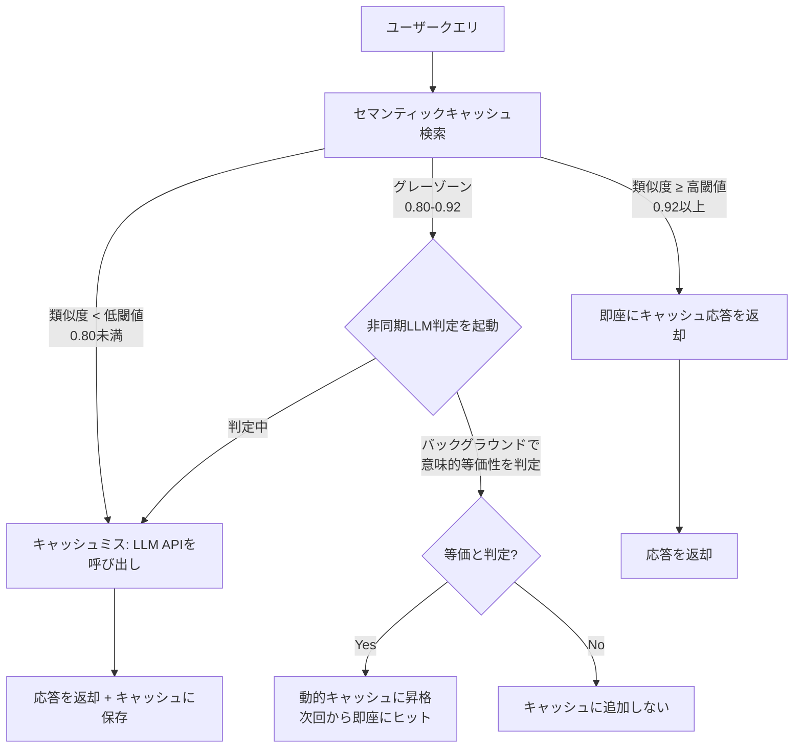

# LLMゲートウェイ×セマンティックキャッシュで本番APIコスト68%削減

## この記事でわかること

- LLMゲートウェイにセマンティックキャッシュを統合する設計パターンと、SDK単体実装との違い
- LiteLLM Proxyを使ったRedis/Qdrantセマンティックキャッシュの具体的な構築手順
- カテゴリ別閾値チューニング（コード系・会話系・検索系クエリ）でヒット率を20%以上改善する方法
- 非同期検証キャッシュ（Krites方式）でレイテンシ影響ゼロのままキャッシュカバレッジを3.9倍に拡大する仕組み
- キャッシュヒット率・精度・コスト削減量を可視化する本番モニタリングの実装

## 対象読者

- **想定読者**: LLMアプリケーションを本番運用中の中級〜上級エンジニア
- **必要な前提知識**:
  - Python 3.11+ の基礎文法
  - OpenAI API / Anthropic Claude API の利用経験
  - Redis の基本概念（GET/SET、ベクトル検索の概要）
  - セマンティックキャッシュの基本概念（ベクトル埋め込みによる類似度検索）

> **関連記事**: セマンティックキャッシュの基礎概念とRedisVL/LangChainでの実装入門は、[セマンティックキャッシュ実装ガイド](https://zenn.dev/0h_n0/articles/531d06b7a17e9d)を参照してください。本記事はゲートウェイ統合型の本番アーキテクチャに特化した発展記事です。

## 結論・成果

LLMゲートウェイにセマンティックキャッシュを統合することで、**アプリケーションコードを変更せずにAPIコストを最大68.8%削減**できます。TrueFoundryの報告によると、ゲートウェイレベルでのセマンティックキャッシュは個別SDK実装と比較して**運用オーバーヘッドが約60%低減**し、複数サービス間でのキャッシュ共有によりヒット率が向上します。

さらに、カテゴリ別閾値チューニングを適用すると、均一閾値と比較して**全ワークロードでのキャッシュカバレッジが拡大**し、カテゴリ別最適化によりミスコストが30msから2msに低減できることがBasu & Yangの研究で示されています。

ただし、セマンティックキャッシュはEmbedding計算のオーバーヘッド（約10ms p95）が発生するため、**レイテンシが厳しい用途（リアルタイムチャットの初回応答など）ではキャッシュミス時のペナルティを考慮した設計**が必要です。

## LLMゲートウェイ統合型キャッシュの設計パターンを理解する

セマンティックキャッシュの実装には大きく2つのアプローチがあります。**SDK統合型**（アプリケーションコードにキャッシュロジックを埋め込む方式）と、**ゲートウェイ統合型**（LLMゲートウェイのプラグインとしてキャッシュを一元管理する方式）です。

2026年現在、本番環境では後者のゲートウェイ統合型が主流になりつつあります。その理由を見ていきましょう。

### SDK統合型とゲートウェイ統合型の比較

| 観点 | SDK統合型 | ゲートウェイ統合型 |
|------|----------|------------------|
| **導入方法** | アプリごとにキャッシュライブラリを追加 | ゲートウェイの設定変更のみ |
| **コード変更** | 各サービスに実装が必要 | アプリケーションコード変更なし |
| **キャッシュ共有** | サービス間で共有困難 | 全サービスで自動共有 |
| **ポリシー管理** | 分散管理（サービスごと） | 一元管理（ゲートウェイで統一） |
| **監視・可観測性** | 個別にメトリクス収集が必要 | ゲートウェイの統合ダッシュボード |
| **柔軟性** | 高い（独自ロジック可能） | プラグインの範囲に限定 |
| **レイテンシ** | 直接接続（低い） | ゲートウェイ経由（+数ms） |

**なぜゲートウェイ統合型を選ぶか:**

- マイクロサービス構成で**複数サービスがLLM APIを呼ぶ場合**、ゲートウェイでキャッシュ共有によりヒット率が向上する
- 閾値・TTL・対象モデルなどの**キャッシュポリシーを一箇所で変更**でき、運用コストが下がる
- アプリケーション開発者がキャッシュを意識する必要がなく、**関心の分離**が実現する

> **注意点**: **ストリーミングレスポンスのキャッシュ**や**Function Callingの結果キャッシュ**はゲートウェイが対応していない場合があります。これらが必要ならSDK統合型との併用を検討してください。

### ゲートウェイ統合型のアーキテクチャ全体像

本番環境でのセマンティックキャッシュ統合アーキテクチャを概観します。



ポイントは、各サービスからのリクエストがすべて**ゲートウェイを通過し、セマンティックキャッシュプラグインで透過的にキャッシュ判定**される点です。キャッシュヒット時はLLMプロバイダへのリクエストが発生せず、コストもレイテンシもゼロになります。

## LiteLLM Proxyでセマンティックキャッシュを構築する

実際にLiteLLM Proxyを使ってセマンティックキャッシュを構築してみましょう。LiteLLMは100以上のLLMプロバイダに対応するOSSゲートウェイで、Redis/Qdrantのセマンティックキャッシュをネイティブにサポートしています。

### 環境構築

まず必要な環境を準備します。

```bash
# LiteLLM Proxyとセマンティックキャッシュ依存のインストール
pip install 'litellm[proxy]' redisvl==0.4.1

# Redis Stack（ベクトル検索モジュール内蔵）の起動
docker run -d --name redis-semantic \
  -p 6379:6379 \
  redis/redis-stack:7.4.0-v3
```

### LiteLLM Proxy設定ファイル

LiteLLM Proxyの設定ファイル（`litellm_config.yaml`）でセマンティックキャッシュを有効化します。

```yaml
# litellm_config.yaml
model_list:
  - model_name: gpt-4o
    litellm_params:
      model: openai/gpt-4o
      api_key: os.environ/OPENAI_API_KEY

  - model_name: claude-sonnet
    litellm_params:
      model: anthropic/claude-sonnet-4-20250514
      api_key: os.environ/ANTHROPIC_API_KEY

litellm_settings:
  # セマンティックキャッシュの有効化
  cache: true
  cache_params:
    type: redis-semantic
    host: localhost
    port: 6379
    similarity_threshold: 0.85  # 類似度閾値（後述のチューニングで調整）
    ttl: 3600                   # キャッシュ有効期間（秒）
    redis_semantic_cache_embedding_model: text-embedding-3-small
```

```bash
# LiteLLM Proxyの起動
litellm --config litellm_config.yaml --port 4000
```

### アプリケーションからの利用

ゲートウェイ統合型の利点は、**既存のOpenAI SDK互換コードをそのまま使える**点です。エンドポイントをLiteLLM Proxyに向けるだけでセマンティックキャッシュが透過的に適用されます。

```python
# app.py - アプリケーション側のコード
# キャッシュロジックは一切書かない
from openai import OpenAI

client = OpenAI(
    base_url="http://localhost:4000",  # LiteLLM Proxyを指定
    api_key="sk-any-key",             # Proxyが各プロバイダのキーを管理
)

def ask_question(question: str) -> str:
    """ユーザーの質問にLLMで回答する。
    セマンティックキャッシュはゲートウェイ側で透過的に処理される。
    """
    response = client.chat.completions.create(
        model="gpt-4o",
        messages=[{"role": "user", "content": question}],
    )
    return response.choices[0].message.content

# 以下の2つの質問は意味が類似 → 2回目はキャッシュヒット
answer1 = ask_question("Pythonでリストをソートする方法は？")
answer2 = ask_question("Pythonのリストの並べ替え方を教えて")
# answer2はキャッシュから返却（LLM APIコール不要）
```

レスポンスヘッダの `x-litellm-semantic-similarity` でキャッシュヒットの有無と類似度スコアを確認できます。

### Qdrantバックエンドへの切り替え

Redis Stack以外にQdrantも利用できます。バイナリ量子化による**メモリ使用量約75%削減**が必要な大規模キャッシュ向きです。

```yaml
# litellm_config.yaml（Qdrant版）
litellm_settings:
  cache: true
  cache_params:
    type: qdrant-semantic
    qdrant_api_base: http://localhost:6333
    qdrant_collection_name: llm_semantic_cache
    similarity_threshold: 0.85
    qdrant_quantization_config: binary  # バイナリ量子化でメモリ75%削減
    qdrant_semantic_cache_embedding_model: text-embedding-3-small
    qdrant_semantic_cache_vector_size: 1536  # モデル次元数と一致必須
```

> **制約事項**: `qdrant_semantic_cache_vector_size` はEmbeddingモデルの次元数と一致させる必要があります（`text-embedding-3-small`: 1536次元、`text-embedding-3-large`: 3072次元）。不一致の場合、サイレントに類似度計算が不正確になります。

## カテゴリ別閾値チューニングでヒット率を改善する

セマンティックキャッシュで最も難しいのは**類似度閾値のチューニング**です。均一の閾値では、クエリの種類によってヒット率が大きく偏ります。Basu & Yangの研究（Category-Aware Semantic Caching, 2025）によると、コード系クエリは埋め込み空間で密集する一方、会話系クエリはスパースに分布するため、**均一閾値では高反復カテゴリが40-60%、低反復カテゴリが5-15%のヒット率**にとどまります。

### カテゴリ別ポリシーの設計

クエリをカテゴリに分類し、それぞれに最適な閾値・TTL・クォータを設定するアプローチを実装してみましょう。

```python
# category_cache_policy.py
from dataclasses import dataclass
from enum import Enum


class QueryCategory(Enum):
    CODE = "code"           # コード生成・説明
    CONVERSATION = "conv"   # 一般会話・サポート
    SEARCH = "search"       # 情報検索・RAG
    ANALYSIS = "analysis"   # データ分析・要約


@dataclass(frozen=True)
class CachePolicy:
    """カテゴリ別のキャッシュポリシー定義。"""
    similarity_threshold: float  # 類似度閾値（0.0-1.0）
    ttl_seconds: int             # キャッシュ有効期間
    max_entries: int             # カテゴリ別の最大エントリ数


# カテゴリ別ポリシー定義
# 閾値はBasu & Yang (2025) の知見をベースに調整
CATEGORY_POLICIES: dict[QueryCategory, CachePolicy] = {
    # コード系: 埋め込み空間で密集 → 低い閾値でもヒット精度が高い
    QueryCategory.CODE: CachePolicy(
        similarity_threshold=0.82,
        ttl_seconds=86400 * 7,  # コードパターンは長期安定
        max_entries=50000,
    ),
    # 会話系: スパース分布 → 高い閾値で偽陽性を防ぐ
    QueryCategory.CONVERSATION: CachePolicy(
        similarity_threshold=0.92,
        ttl_seconds=3600,       # 会話コンテキストは短命
        max_entries=20000,
    ),
    # 検索系: 中程度のクラスタリング
    QueryCategory.SEARCH: CachePolicy(
        similarity_threshold=0.88,
        ttl_seconds=86400,      # 検索結果は1日で更新
        max_entries=30000,
    ),
    # 分析系: 入力データに依存 → 高い閾値
    QueryCategory.ANALYSIS: CachePolicy(
        similarity_threshold=0.93,
        ttl_seconds=7200,       # 分析結果は比較的短命
        max_entries=10000,
    ),
}
```

### カテゴリ分類器の実装

クエリを自動的にカテゴリに分類する軽量な分類器を実装します。ここではルールベースの分類を使い、LLM呼び出しを避けます。

```python
# category_classifier.py
import re
from category_cache_policy import QueryCategory

# カテゴリ判定用の正規表現パターン
_CODE_PATTERNS = re.compile(
    r"(コード|実装|プログラム|関数|クラス|API|SDK|ライブラリ|"
    r"code|implement|function|class|import|def |return )",
    re.IGNORECASE,
)
_ANALYSIS_PATTERNS = re.compile(
    r"(分析|要約|集計|比較|レポート|統計|"
    r"analy|summar|aggregat|compar|report|statist)",
    re.IGNORECASE,
)
_SEARCH_PATTERNS = re.compile(
    r"(とは|について|方法|手順|仕組み|違い|"
    r"what is|how to|explain|difference|guide)",
    re.IGNORECASE,
)


def classify_query(query: str) -> QueryCategory:
    """クエリテキストからカテゴリを判定する。
    ルールベースの軽量分類（LLM呼び出しなし）。
    """
    if _CODE_PATTERNS.search(query):
        return QueryCategory.CODE
    if _ANALYSIS_PATTERNS.search(query):
        return QueryCategory.ANALYSIS
    if _SEARCH_PATTERNS.search(query):
        return QueryCategory.SEARCH
    return QueryCategory.CONVERSATION  # デフォルト
```

### カテゴリ別キャッシュの統合実装

分類器とポリシーを統合したキャッシュマネージャを実装します。

```python
# semantic_cache_manager.py
import hashlib
import json
import numpy as np
from openai import OpenAI
from redis import Redis
from redis.commands.search.field import VectorField, TextField, NumericField
from redis.commands.search.indexDefinition import IndexDefinition, IndexType
from redis.commands.search.query import Query

from category_cache_policy import CATEGORY_POLICIES, QueryCategory
from category_classifier import classify_query

EMBEDDING_MODEL = "text-embedding-3-small"
VECTOR_DIM = 1536
INDEX_NAME = "idx:semantic_cache"


class CategoryAwareSemanticCache:
    """カテゴリ別閾値を持つセマンティックキャッシュ。"""

    def __init__(self, redis_url: str = "redis://localhost:6379") -> None:
        self.redis = Redis.from_url(redis_url, decode_responses=False)
        self.openai = OpenAI()
        self._ensure_index()

    def _ensure_index(self) -> None:
        """Redis Stackのベクトルインデックスを作成する。"""
        try:
            self.redis.ft(INDEX_NAME).info()
        except Exception:
            schema = (
                TextField("$.query", as_name="query"),
                TextField("$.response", as_name="response"),
                TextField("$.category", as_name="category"),
                NumericField("$.ttl_at", as_name="ttl_at"),
                VectorField(
                    "$.embedding",
                    "HNSW",
                    {
                        "TYPE": "FLOAT32",
                        "DIM": VECTOR_DIM,
                        "DISTANCE_METRIC": "COSINE",
                    },
                    as_name="embedding",
                ),
            )
            self.redis.ft(INDEX_NAME).create_index(
                schema,
                definition=IndexDefinition(
                    prefix=["cache:"], index_type=IndexType.JSON
                ),
            )

    def _get_embedding(self, text: str) -> list[float]:
        """テキストのベクトル埋め込みを取得する。"""
        resp = self.openai.embeddings.create(
            model=EMBEDDING_MODEL, input=text
        )
        return resp.data[0].embedding

    def lookup(self, query: str) -> str | None:
        """セマンティックキャッシュを検索する。
        カテゴリ別の閾値で判定し、ヒット時はキャッシュ応答を返す。
        """
        category = classify_query(query)
        policy = CATEGORY_POLICIES[category]
        query_embedding = self._get_embedding(query)

        # ベクトル類似度検索（コサイン距離）
        q = (
            Query(f"(@category:{{{category.value}}})=>[KNN 1 @embedding $vec AS score]")
            .sort_by("score")
            .return_fields("query", "response", "score")
            .dialect(2)
        )
        params = {
            "vec": np.array(query_embedding, dtype=np.float32).tobytes()
        }
        results = self.redis.ft(INDEX_NAME).search(q, query_params=params)

        if results.total == 0:
            return None

        hit = results.docs[0]
        similarity = 1.0 - float(hit.score)  # コサイン距離→類似度

        if similarity >= policy.similarity_threshold:
            return hit.response.decode() if isinstance(hit.response, bytes) else hit.response

        return None

    def store(self, query: str, response: str) -> None:
        """クエリと応答をキャッシュに保存する。"""
        import time

        category = classify_query(query)
        policy = CATEGORY_POLICIES[category]
        embedding = self._get_embedding(query)
        key = f"cache:{hashlib.sha256(query.encode()).hexdigest()[:16]}"

        self.redis.json().set(
            key,
            "$",
            {
                "query": query,
                "response": response,
                "category": category.value,
                "embedding": embedding,
                "ttl_at": int(time.time()) + policy.ttl_seconds,
            },
        )
        self.redis.expire(key, policy.ttl_seconds)
```

**なぜルールベース分類を選んだか:**

- LLMで分類するとキャッシュルックアップのたびにAPI呼び出しが発生し、コスト削減の意味が薄れる
- ルールベースなら**分類レイテンシが1ms未満**で、キャッシュルックアップのオーバーヘッドに影響しない
- 分類精度は80-90%程度だが、閾値チューニングとの組み合わせで実用上十分な性能が得られる

**ハマりポイント:**

> カテゴリ分類のルールパターンが不十分だと、会話系クエリがデフォルトカテゴリに集中します。本番投入前に**実際のクエリログからカテゴリ分布を確認**し、パターンを調整してください。理想的な分布は各カテゴリ15-40%です。

### 閾値チューニングの実践

閾値の決定は、**適合率（Precision）と再現率（Recall）のトレードオフ**です。以下のアプローチで段階的にチューニングします。

| ステップ | 方法 | 目的 |
|---------|------|------|
| 1. 初期値設定 | 全カテゴリ0.90で開始 | ベースライン確立 |
| 2. 本番ログ収集 | 1-2週間のクエリログを蓄積 | カテゴリ別分布の把握 |
| 3. オフライン評価 | ログからペアを抽出し手動ラベリング | 偽陽性・偽陰性率の測定 |
| 4. カテゴリ別調整 | 偽陽性が多い→閾値上げ、少ない→下げ | 最適バランス |
| 5. A/Bテスト | 新閾値を一部トラフィックに適用 | 本番影響の検証 |

TrueFoundryの報告によると、高精度が求められるユースケースでは**閾値0.90-0.95**、コスト削減を優先するユースケースでは**閾値0.85-0.90**が推奨されています。

## 非同期検証キャッシュでカバレッジを拡大する

通常のセマンティックキャッシュでは、閾値を超えたクエリのみがキャッシュヒットします。閾値を下げるとヒット率は上がりますが偽陽性（意味が異なるのにキャッシュヒットしてしまう）も増加します。

Krites方式（Asynchronous Verified Semantic Caching, 2026）は、この問題を**非同期LLM判定**で解決します。

### Krites方式の仕組み



Krites方式のポイントは3つあります。

1. **サービングパスへの影響ゼロ**: グレーゾーンのクエリもLLM APIを呼んで応答を返す。非同期判定はバックグラウンドで実行
2. **段階的カバレッジ拡大**: 判定で等価と確認されたペアは動的キャッシュに昇格し、次回から即座にヒット
3. **論文の報告**: キュレート済みの静的応答の提供率が**最大3.9倍に拡大**

### 非同期検証の実装例

グレーゾーン判定をバックグラウンドタスクで実行する実装例です。

```python
# async_verified_cache.py
import asyncio
from openai import AsyncOpenAI

JUDGE_PROMPT = """以下の2つの質問が意味的に等価かどうかを判定してください。
等価とは、同じ情報で正しく回答できることを意味します。

質問A: {query_a}
質問B: {query_b}

回答: "equivalent" または "not_equivalent" のみを返してください。"""


async def verify_semantic_equivalence(
    client: AsyncOpenAI,
    query_new: str,
    query_cached: str,
    cached_response: str,
    cache_manager: "CategoryAwareSemanticCache",
) -> None:
    """非同期でセマンティック等価性を判定し、等価なら動的キャッシュに昇格する。

    サービングパスとは独立して実行されるため、
    ユーザーへの応答レイテンシに影響しない。
    """
    response = await client.chat.completions.create(
        model="gpt-4o-mini",  # 判定用に軽量モデルを使用
        messages=[
            {
                "role": "user",
                "content": JUDGE_PROMPT.format(
                    query_a=query_new, query_b=query_cached
                ),
            }
        ],
        max_tokens=20,
        temperature=0.0,
    )

    verdict = response.choices[0].message.content.strip().lower()
    if verdict == "equivalent":
        # 動的キャッシュに昇格: 次回から即座にヒット
        cache_manager.store(query_new, cached_response)
```

**トレードオフ:**

- 非同期判定にはLLM API呼び出しコストが発生する（GPT-4o-miniで約$0.0001/判定）
- グレーゾーンのクエリ割合が全体の10-20%程度であれば、判定コストはキャッシュ削減効果を下回る
- 判定の正確性は使用するモデルに依存する。GPT-4o-miniでの判定精度は著者らの報告で約95%とされている

> **制約事項**: この方式は静的キャッシュ（ログから事前構築したキャッシュ）の拡張に適しています。動的キャッシュのみの構成では、そもそもキュレート済み応答が存在しないため効果が限定的です。**本番ログから応答品質の高いQ&Aペアを定期的に静的キャッシュに取り込む運用**と組み合わせると効果を発揮します。

## 本番モニタリングとキャッシュ効果の可視化を実装する

セマンティックキャッシュは導入して終わりではなく、**ヒット率・精度・コスト削減効果を継続的に計測**する必要があります。

### 監視すべき4つのメトリクス

devkaniskのブログ記事（Semantic Caching for AI Agents, 2026）によると、セマンティックキャッシュの効果は以下の4次元で評価するのが標準的なアプローチです。

| メトリクス | 定義 | 目標値 | 計算方法 |
|-----------|------|--------|----------|
| **ヒット率** | キャッシュから応答を返せた割合 | 25-45% | ヒット数 / 総リクエスト数 |
| **精度（Precision）** | キャッシュヒットのうち正しい応答の割合 | 95%以上 | 正しいヒット / 全ヒット |
| **コスト削減率** | キャッシュによるAPI費用削減割合 | 40-70% | 節約トークン × 単価 / 総コスト |
| **レイテンシ影響** | キャッシュ追加によるp95レイテンシ変化 | +10ms以内 | キャッシュルックアップ時間 |

### Prometheus + Grafanaによるダッシュボード実装

LiteLLM ProxyのメトリクスをPrometheusで収集し、Grafanaで可視化する構成を実装します。

```python
# cache_metrics.py
from prometheus_client import Counter, Histogram, Gauge

# キャッシュヒット/ミスカウンター（カテゴリ別）
cache_hits = Counter(
    "semantic_cache_hits_total",
    "Total cache hits",
    ["category", "model"],
)
cache_misses = Counter(
    "semantic_cache_misses_total",
    "Total cache misses",
    ["category", "model"],
)

# キャッシュルックアップレイテンシ
cache_lookup_duration = Histogram(
    "semantic_cache_lookup_duration_seconds",
    "Cache lookup latency",
    ["category"],
    buckets=[0.001, 0.005, 0.01, 0.025, 0.05, 0.1],
)

# 類似度スコア分布
similarity_score = Histogram(
    "semantic_cache_similarity_score",
    "Similarity score distribution",
    ["category", "hit_or_miss"],
    buckets=[0.5, 0.6, 0.7, 0.8, 0.85, 0.9, 0.95, 1.0],
)

# コスト削減量（USD）
cost_saved = Counter(
    "semantic_cache_cost_saved_usd",
    "Estimated cost saved by cache hits",
    ["model"],
)

# 現在のキャッシュエントリ数
cache_entries = Gauge(
    "semantic_cache_entries",
    "Current number of cache entries",
    ["category"],
)
```

### アラートとコスト効果の可視化

キャッシュの異常検知には、以下の2つのPromQLアラートが有効です。

```yaml
# prometheus_alerts.yaml - 主要アラート2つ
groups:
  - name: semantic_cache_alerts
    rules:
      - alert: CacheHitRateDrop
        expr: |
          rate(semantic_cache_hits_total[5m])
          / (rate(semantic_cache_hits_total[5m]) + rate(semantic_cache_misses_total[5m]))
          < 0.10
        for: 10m
        annotations:
          summary: "ヒット率が10%未満に低下（Embeddingモデル変更やデータ破損の兆候）"

      - alert: CacheLookupLatencyHigh
        expr: histogram_quantile(0.95, rate(semantic_cache_lookup_duration_seconds_bucket[5m])) > 0.05
        for: 5m
        annotations:
          summary: "ルックアップp95が50msを超過（通常10ms以内）"
```

コスト効果の算出は、以下の式で簡易計算できます。

$$\text{削減率} = \frac{\text{ヒット数} \times (\text{入力単価} + \text{出力単価}) \times \text{平均トークン数}}{\text{総コスト}}$$

例えば月間10万リクエスト、ヒット率35%、GPT-4o（入力$5/1Mトークン、出力$15/1Mトークン）の場合、**Embedding計算コストとRedis運用費を差し引いても月額$100以上の削減**が見込めます。出力トークンのコスト（入力の3倍の単価）もキャッシュヒット時に節約できるため、入力トークンのみの計算より実際の削減率は高くなります。

**ハマりポイント:**

> ヒット率が想定より低い場合、まず**類似度スコアの分布**（`similarity_score` Histogram）を確認してください。スコアが閾値付近に集中している場合は閾値の微調整で大幅に改善できます。スコアが全体的に低い場合は、Embeddingモデルの選択やプロンプトの正規化（システムプロンプト除外など）を見直す必要があります。

## よくある問題と解決方法

| 問題 | 原因 | 解決方法 |
|------|------|----------|
| ヒット率が5%未満 | 閾値が高すぎる/クエリが多様 | 類似度スコア分布を確認し閾値を5%刻みで下げる |
| 偽陽性が頻発 | 閾値が低すぎる/分類が不正確 | カテゴリ別に閾値を引き上げ。偽陽性ログで分類改善 |
| ルックアップが遅い（50ms超） | メモリ不足/インデックス未最適化 | `FT.INFO`で確認。HNSW `EF_RUNTIME`を調整 |
| Embedding APIレート制限 | 大量リクエスト集中 | ローカルモデル（`all-MiniLM-L6-v2`等）に切替 |
| キャッシュ容量肥大化 | TTL長すぎ/不要エントリ蓄積 | カテゴリ別TTL見直し。LRU eviction設定 |
| マルチテナント混在 | テナント分離なし | キーにテナントIDプレフィックス追加 |

## まとめと次のステップ

**まとめ:**

- LLMゲートウェイ（LiteLLM, Kong等）にセマンティックキャッシュを統合することで、**アプリケーションコード変更なしでAPIコストを削減**できる
- カテゴリ別閾値チューニング（コード系0.82、会話系0.92など）により、**均一閾値では捉えられなかったキャッシュ機会を回収**できる
- 非同期検証キャッシュ（Krites方式）で**レイテンシ影響ゼロのままカバレッジを最大3.9倍に拡大**できる
- 本番運用では**ヒット率・精度・コスト削減率・レイテンシの4次元モニタリング**が必須

**次にやるべきこと:**

- まずLiteLLM Proxyを導入し、均一閾値0.90でセマンティックキャッシュの効果をベースライン計測する
- 1-2週間のクエリログからカテゴリ分布を分析し、カテゴリ別閾値チューニングに進む
- 静的キャッシュ（高品質なQ&Aペアのキュレーション）を構築し、非同期検証によるカバレッジ拡大を検討する

## 参考

- [Asynchronous Verified Semantic Caching for Tiered LLM Architectures (arxiv, 2026)](https://arxiv.org/abs/2602.13165v1)
- [Category-Aware Semantic Caching for Heterogeneous LLM Workloads (arxiv, 2025)](https://arxiv.org/abs/2510.26835)
- [Kong AI Semantic Cache Plugin ドキュメント](https://developer.konghq.com/plugins/ai-semantic-cache/)
- [LiteLLM Caching ドキュメント](https://docs.litellm.ai/docs/caching/all_caches)
- [Semantic Caching for AI Agents (devkanisk, 2026)](https://devkanisk.com/blog/2026/semantic-caching-for-ai-agents/)
- [Semantic Caching for Large Language Models (TrueFoundry)](https://www.truefoundry.com/blog/semantic-caching)
- [Azure Cosmos DB セマンティックキャッシュ (Microsoft Learn)](https://learn.microsoft.com/ja-jp/azure/cosmos-db/gen-ai/semantic-cache)
- [セマンティックキャッシュ実装ガイド（関連記事）](https://zenn.dev/0h_n0/articles/531d06b7a17e9d)

---

:::message
この記事はAI（Claude Code）により自動生成されました。内容の正確性については複数の情報源で検証していますが、実際の利用時は公式ドキュメントもご確認ください。
:::
