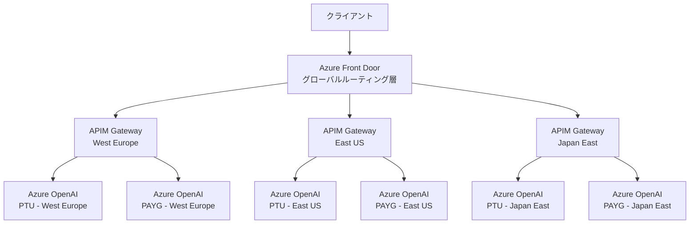
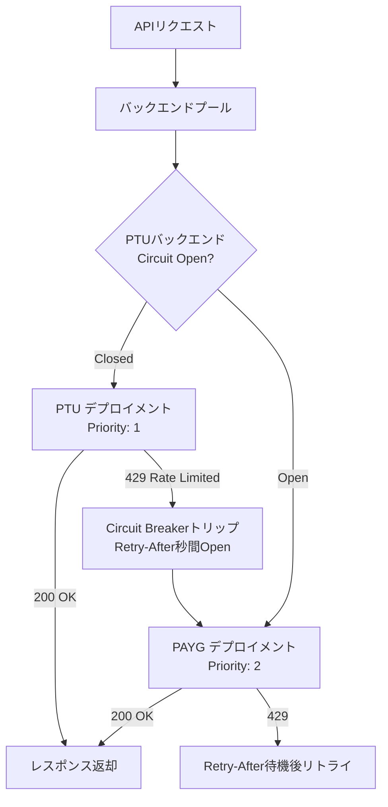

# Azure OpenAIマルチリージョン負荷分散：Front Door×APIM×PTUで高可用性を設計する

## この記事でわかること

- Azure Front DoorとAPI Managementを組み合わせた**グローバル負荷分散アーキテクチャの設計パターン**
- PTU（Provisioned Throughput Units）からPay-as-you-goへの**スピルオーバー戦略**による可用性とコストの両立
- Circuit BreakerとRetry-Afterヘッダーを活用した**429エラー時のインテリジェントなトラフィック制御**
- Bicep（IaC）による**マルチリージョン構成のデプロイ自動化**
- トークンレート制限とセマンティックキャッシュによる**TPMクォータの最適配分**

## 対象読者

- **想定読者**: 中級〜上級のAzureインフラエンジニア・クラウドアーキテクト
- **必要な前提知識**:
  - Azure OpenAI Serviceの基本的なデプロイ・利用経験
  - Azure API Management（APIM）のポリシー設定の基礎
  - Azure Front Doorの概念理解（Origin Group、ルーティングルール）
  - IaC（Bicep / ARM Template）の基本文法

## 結論・成果

マルチリージョンのAzure OpenAI負荷分散設計では、**Azure Front Door（グローバルルーティング層）+ API Management Premium（リージョナルゲートウェイ層）+ PTUスピルオーバー（バックエンド層）の3層アーキテクチャ**が推奨されます。Microsoft公式のリファレンスアーキテクチャによると、この構成によりマルチリージョンで**99.99%の可用性**が達成可能と報告されています。また、PTUをベースラインに据えてPAYGへのスピルオーバーを設計することで、**固定費の過剰プロビジョニングを防ぎつつ、トラフィックスパイク時の応答性を維持**できます。

## Azure OpenAI負荷分散の全体像を理解する

Azure OpenAIの負荷分散は、トラフィック規模と要件に応じて4段階のトポロジで考えることができます。Microsoft公式のAzure Architecture Centerでは、以下の成熟度モデルが定義されています。

| トポロジ | 構成 | ユースケース | 可用性目標 |
|---------|------|-------------|-----------|
| 単一インスタンス | 1リージョン・1デプロイメント | PoC・開発環境 | 99.9% |
| 単一リージョン・複数デプロイ | 1リージョン・複数モデルバージョン | ステージング | 99.9% |
| 複数リージョン | 複数リージョン・同一モデル | 本番（国内） | 99.95% |
| グローバル・マルチリージョン | AFD+APIM+複数リージョン | 本番（グローバル） | 99.99% |

本記事では、最も高い可用性を実現する**グローバル・マルチリージョン構成**に焦点を当てて解説します。

### 3層アーキテクチャの設計思想

グローバル負荷分散の3層は、それぞれ明確な責務を持ちます。



**各層の役割:**

- **Layer 1 - Azure Front Door（グローバルルーティング）**: Anycastによるエッジルーティング、DDoS保護、WAF、TLS終端。リージョン障害時の自動フェイルオーバーを担う
- **Layer 2 - API Management Premium（リージョナルゲートウェイ）**: 429応答のインテリジェントハンドリング、Circuit Breaker、トークンレート制限、セマンティックキャッシュ。各リージョンに配置
- **Layer 3 - Azure OpenAIバックエンド**: PTU（固定スループット）とPAYG（従量課金）のスピルオーバー構成。リージョン内の負荷分散

**なぜこの3層が必要なのか:**

Front Doorだけでは不十分な理由があります。Front Doorは**HTTP 429レスポンスを理解しない**ため、レート制限を受けているバックエンドと実際のサービス障害を区別できません。そのため、APIMのCircuit Breaker・バックエンドプール機能が429対応のインテリジェントなルーティングを補完する必要があります。

> **注意**: Front Doorのヘルスプローブは汎用的なHTTPステータスコードに基づくため、Azure OpenAI特有の429（Rate Limit Exceeded）と503（Service Unavailable）を同じ「異常」として扱います。429は一時的なクォータ超過であり、バックエンドの障害ではありません。この違いを正しくハンドリングするにはAPIMの介在が不可欠です。

## Azure Front Doorでグローバルルーティングを構成する

Azure Front Doorは、グローバルなエントリポイントとして機能し、地理的に分散したAPIMゲートウェイへのトラフィック分散を担います。ここでは、APIM Premiumのリージョナルゲートウェイと連携する構成を見ていきましょう。

### Origin GroupとPriority/Weightの設計

Front DoorのOrigin Groupに各リージョンのAPIMリージョナルゲートウェイを登録し、Priority（優先度）とWeight（重み）でトラフィック配分を制御します。

```bicep
// front-door.bicep
// Azure Front Door Premium + APIM Origin Group構成

resource frontDoorProfile 'Microsoft.Cdn/profiles@2024-09-01' = {
  name: 'fd-aoai-global'
  location: 'global'
  sku: {
    name: 'Premium_AzureFrontDoor'
  }
}

resource originGroup 'Microsoft.Cdn/profiles/originGroups@2024-09-01' = {
  parent: frontDoorProfile
  name: 'aoai-apim-backends'
  properties: {
    loadBalancingSettings: {
      sampleSize: 4
      successfulSamplesRequired: 3
      additionalLatencyInMilliseconds: 50 // ← レイテンシ感度の設定
    }
    healthProbeSettings: {
      probePath: '/status-0123456789abcdef'
      probeRequestType: 'HEAD'
      probeProtocol: 'Https'
      probeIntervalInSeconds: 30
    }
  }
}

// West Europeリージョン（最優先）
resource originWestEurope 'Microsoft.Cdn/profiles/originGroups/origins@2024-09-01' = {
  parent: originGroup
  name: 'apim-westeurope'
  properties: {
    hostName: 'myaoai-apim-westeurope-01.regional.azure-api.net'
    httpPort: 80
    httpsPort: 443
    originHostHeader: 'myaoai-apim-westeurope-01.regional.azure-api.net'
    priority: 1    // 優先度1（最高）
    weight: 1000   // 重み1000
    enabledState: 'Enabled'
    enforceCertificateNameCheck: true
  }
}

// East USリージョン（同優先度・低重み）
resource originEastUS 'Microsoft.Cdn/profiles/originGroups/origins@2024-09-01' = {
  parent: originGroup
  name: 'apim-eastus'
  properties: {
    hostName: 'myaoai-apim-eastus-01.regional.azure-api.net'
    httpPort: 80
    httpsPort: 443
    originHostHeader: 'myaoai-apim-eastus-01.regional.azure-api.net'
    priority: 1    // 同じ優先度1
    weight: 500    // West Europeの半分の重み
    enabledState: 'Enabled'
    enforceCertificateNameCheck: true
  }
}

// Japan Eastリージョン（DR用・優先度2）
resource originJapanEast 'Microsoft.Cdn/profiles/originGroups/origins@2024-09-01' = {
  parent: originGroup
  name: 'apim-japaneast'
  properties: {
    hostName: 'myaoai-apim-japaneast-01.regional.azure-api.net'
    httpPort: 80
    httpsPort: 443
    originHostHeader: 'myaoai-apim-japaneast-01.regional.azure-api.net'
    priority: 2    // 優先度2（フェイルオーバー先）
    weight: 1000
    enabledState: 'Enabled'
    enforceCertificateNameCheck: true
  }
}
```

**Front Doorのルーティングアルゴリズム:**

Front Doorは以下の順序でOriginを評価します。

1. **ヘルスチェック**: ヘルスプローブで異常なOriginを除外
2. **Priority評価**: 利用可能なOriginの中で最も低いPriority値のグループを選択
3. **レイテンシ考慮**: `additionalLatencyInMilliseconds`の範囲内で最速のOriginを候補化
4. **Weight配分**: 候補のOrigin間でWeight比に基づいてラウンドロビン

上記の例では、通常時はWest EuropeとEast USに2:1の比率でトラフィックが分散されます。両方が障害になった場合のみJapan Eastにフェイルオーバーします。

### セキュリティ：Front Doorバイパスの防止

Front Doorを配置する際に見落としがちなのが、**APIMへの直接アクセスを防ぐ**設定です。Front Doorを経由しないリクエストを許可すると、WAF・DDoS保護がバイパスされるリスクがあります。

```xml
<!-- APIM inbound policy: Front Doorからのリクエストのみ許可 -->
<inbound>
    <check-header name="X-Azure-FDID"
                  failed-check-httpcode="403"
                  failed-check-error-message="Access denied"
                  ignore-case="true">
        <value>xxxxxxxx-xxxx-xxxx-xxxx-xxxxxxxxxxxx</value>
    </check-header>
</inbound>
```

`X-Azure-FDID`はFront Doorプロファイル固有のID（GUID）です。APIMのinboundポリシーでこのヘッダーを検証することで、Front Door経由以外のリクエストを403で拒否します。

**よくある間違い**: Front Doorの`X-Forwarded-For`ヘッダーのみで検証するケースがありますが、このヘッダーはクライアント側で偽装可能です。必ず`X-Azure-FDID`を使用してください。

## API ManagementのAI Gatewayでインテリジェントなルーティングを実装する

APIMのAI Gateway機能は、Azure OpenAI特有のワークロードに最適化された負荷分散・回復機能を提供します。2026年1月時点で、**バックエンドプール、Circuit Breaker、トークンレート制限、セマンティックキャッシュ**がGA（一般提供）されています。

### バックエンドプールとPriority-based Load Balancing

APIMのバックエンドプールでは、round-robin、weighted、priority-based、session-awareの4つのロードバランシング方式が利用できます。PTUスピルオーバーには**priority-based**が適しています。

```bicep
// apim-backends.bicep
// APIM バックエンドプール + PTUスピルオーバー構成

resource apimService 'Microsoft.ApiManagement/service@2024-06-01-preview' = {
  name: 'myaoai-apim'
  location: 'westeurope'
  sku: {
    name: 'Premium'
    capacity: 1
  }
  properties: {
    publisherEmail: 'admin@example.com'
    publisherName: 'AI Platform Team'
  }
}

// PTUバックエンド（優先度高）
resource backendPTU 'Microsoft.ApiManagement/service/backends@2024-06-01-preview' = {
  parent: apimService
  name: 'aoai-westeurope-ptu'
  properties: {
    url: 'https://aoai-we-ptu.openai.azure.com/openai'
    protocol: 'http'
    circuitBreaker: {
      rules: [
        {
          failureCondition: {
            count: 1
            errorReasons: ['Timeout', 'Server']
            interval: 'PT10S'    // 10秒間で
            statusCodeRanges: [
              { min: 429, max: 429 }  // 429が1回でトリップ
              { min: 500, max: 599 }
            ]
          }
          name: 'ptuCircuitBreaker'
          tripDuration: 'PT0S'  // Retry-Afterヘッダーに従う（動的trip）
          acceptRetryAfter: true // ← ここが重要
        }
      ]
    }
  }
}

// PAYGバックエンド（スピルオーバー先）
resource backendPAYG 'Microsoft.ApiManagement/service/backends@2024-06-01-preview' = {
  parent: apimService
  name: 'aoai-westeurope-payg'
  properties: {
    url: 'https://aoai-we-payg.openai.azure.com/openai'
    protocol: 'http'
    circuitBreaker: {
      rules: [
        {
          failureCondition: {
            count: 3
            errorReasons: ['Timeout', 'Server']
            interval: 'PT10S'
            statusCodeRanges: [
              { min: 429, max: 429 }
              { min: 500, max: 599 }
            ]
          }
          name: 'paygCircuitBreaker'
          tripDuration: 'PT0S'
          acceptRetryAfter: true
        }
      ]
    }
  }
}

// バックエンドプール（PTU → PAYG スピルオーバー）
resource backendPool 'Microsoft.ApiManagement/service/backends@2024-06-01-preview' = {
  parent: apimService
  name: 'aoai-pool-westeurope'
  properties: {
    type: 'Pool'
    pool: {
      services: [
        {
          id: backendPTU.id
          priority: 1   // PTUが最優先
          weight: 1
        }
        {
          id: backendPAYG.id
          priority: 2   // PAYGはスピルオーバー先
          weight: 1
        }
      ]
    }
  }
}
```

**PTUスピルオーバーの動作フロー:**



**なぜPTU → PAYGの順序なのか:**

- PTUは**月額固定費**で確保した容量です。使わなくても費用が発生するため、最優先で利用しないとコストが無駄になります
- PAYGは**従量課金**のため、PTUのキャパシティを超えたスパイクトラフィックの吸収に適しています
- Microsoft公式のベストプラクティスガイダンスでは、ベースラインのワークロードにPTU、超過分にPAYGを割り当てる構成が推奨されています

### Circuit BreakerとRetry-Afterの連携

Circuit Breakerの設定で特に重要なのは`acceptRetryAfter: true`です。この設定により、Azure OpenAIが429レスポンスで返す`Retry-After`ヘッダーの値を動的にtrip durationとして適用します。

```xml
<!-- APIM ポリシー: バックエンドプールへのルーティング -->
<inbound>
    <base />
    <!-- Front Door検証 -->
    <check-header name="X-Azure-FDID"
                  failed-check-httpcode="403"
                  failed-check-error-message="Access denied"
                  ignore-case="true">
        <value>{{front-door-id}}</value>
    </check-header>
    <!-- バックエンドプールにルーティング -->
    <set-backend-service backend-id="aoai-pool-westeurope" />
</inbound>
```

固定の`tripDuration`を設定した場合との違いを見てみましょう。

| 項目 | 固定trip duration | 動的trip duration（Retry-After） |
|------|------------------|-------------------------------|
| 設定方法 | `tripDuration: 'PT30S'` | `tripDuration: 'PT0S'` + `acceptRetryAfter: true` |
| 回復タイミング | 固定30秒後 | Azure OpenAIが指示したタイミング |
| PTU利用率 | 回復が遅れ、PAYGに流れる時間が長い | PTUが利用可能になり次第即復帰 |
| コスト影響 | PAYG利用時間が増加 | PAYG利用時間を最小化 |

**ハマりポイント**: `tripDuration`を`PT0S`に設定しても`acceptRetryAfter`を`true`にしないと、Circuit Breakerが即座に閉じてしまい、429が連発されます。両方の設定が必要です。

### トークンレート制限で消費者別にTPMを管理する

複数のアプリケーションやチームがAzure OpenAIのTPM（Tokens Per Minute）クォータを共有する場合、特定のアプリが全クォータを消費して他のアプリがブロックされる問題が発生します。APIMの`llm-token-limit`ポリシーで消費者別の制限を設定できます。

```xml
<!-- APIM ポリシー: 消費者別トークンレート制限 -->
<inbound>
    <base />
    <!-- サブスクリプション単位でTPM制限 -->
    <llm-token-limit
        counter-key="@(context.Subscription.Id)"
        tokens-per-minute="10000"
        estimate-prompt-tokens="true"
        remaining-tokens-variable-name="remainingTokens">
    </llm-token-limit>
</inbound>
<outbound>
    <base />
    <!-- トークン消費メトリクスの送出 -->
    <llm-emit-token-metric namespace="aoai-token-metrics">
        <dimension name="Subscription" value="@(context.Subscription.Id)" />
        <dimension name="API" value="@(context.Api.Id)" />
        <dimension name="Region" value="@(context.Deployment.Region)" />
    </llm-emit-token-metric>
</outbound>
```

`estimate-prompt-tokens="true"`を設定すると、**プロンプトトークン数をAPIM側で事前推定**し、制限を超過するリクエストをバックエンドに送らずに拒否します。これによりAzure OpenAI側の不要な429エラーを削減できます。

> **制約条件**: トークン推定はtiktokenベースの近似値です。画像入力を含むマルチモーダルリクエストや、関数呼び出し（Function Calling）を含むリクエストでは推定精度が低下することがあります。精度が重要な場合は`estimate-prompt-tokens="false"`にして事後カウントのみに切り替えてください。

## コスト最適化とセマンティックキャッシュを設計する

グローバル・マルチリージョン構成ではインフラコストが増加するため、コスト最適化が重要なテーマになります。ここでは、PTU/PAYGの配分設計とセマンティックキャッシュによるトークン消費削減を見ていきましょう。

### PTU/PAYG配分の設計指針

PTUとPAYGの配分は、トラフィックパターンの分析から決定します。

```python
# ptu_sizing.py
# PTU/PAYG配分の試算スクリプト

from dataclasses import dataclass


@dataclass
class TrafficProfile:
    """トラフィックプロファイル"""
    avg_tpm: int          # 平均TPM
    peak_tpm: int         # ピーク時TPM
    p95_tpm: int          # 95パーセンタイルTPM
    peak_duration_hours: float  # ピーク持続時間（時間/日）


@dataclass
class CostEstimate:
    """コスト試算結果"""
    ptu_monthly: float     # PTU月額（USD）
    payg_monthly: float    # PAYG月額（USD）
    total_monthly: float   # 合計月額（USD）
    ptu_units: int         # PTUユニット数
    spillover_ratio: float # PAYGスピルオーバー比率（%）


def estimate_cost(
    profile: TrafficProfile,
    ptu_price_per_unit: float = 2.0,  # PTU単価（USD/時間）
    payg_price_per_1k_tokens: float = 0.005,  # PAYG単価
    ptu_tpm_per_unit: int = 1000,  # 1PTUあたりのTPM
) -> CostEstimate:
    """
    PTU/PAYG配分のコスト試算を行う。

    PTUはp95のTPMをカバーするように設計し、
    ピーク時の超過分をPAYGで吸収する戦略。
    """
    # PTUユニット数: p95 TPMをカバー
    ptu_units = profile.p95_tpm // ptu_tpm_per_unit
    ptu_capacity_tpm = ptu_units * ptu_tpm_per_unit

    # PTU月額コスト（24時間365日稼働）
    ptu_monthly = ptu_units * ptu_price_per_unit * 24 * 30

    # PAYGスピルオーバー: ピーク時にPTU容量を超過した分
    spillover_tpm = max(0, profile.peak_tpm - ptu_capacity_tpm)
    spillover_tokens_per_day = (
        spillover_tpm * 60 * profile.peak_duration_hours
    )
    payg_monthly = (
        spillover_tokens_per_day * 30 * payg_price_per_1k_tokens / 1000
    )

    spillover_ratio = (
        (spillover_tpm / profile.peak_tpm * 100)
        if profile.peak_tpm > 0 else 0
    )

    return CostEstimate(
        ptu_monthly=ptu_monthly,
        payg_monthly=payg_monthly,
        total_monthly=ptu_monthly + payg_monthly,
        ptu_units=ptu_units,
        spillover_ratio=spillover_ratio,
    )


# 使用例
if __name__ == "__main__":
    profile = TrafficProfile(
        avg_tpm=30000,
        peak_tpm=80000,
        p95_tpm=50000,
        peak_duration_hours=4.0,
    )
    result = estimate_cost(profile)
    print(f"PTUユニット数: {result.ptu_units}")
    print(f"PTU月額: ${result.ptu_monthly:,.0f}")
    print(f"PAYG月額: ${result.payg_monthly:,.0f}")
    print(f"合計月額: ${result.total_monthly:,.0f}")
    print(f"スピルオーバー比率: {result.spillover_ratio:.1f}%")
```

**配分の考え方:**

- **PTU**: p95（95パーセンタイル）のTPMをカバーするサイズに設計。日常的な負荷の大部分をPTUで処理
- **PAYG**: 残りの5%のスパイクトラフィックを吸収。月額コストを抑制
- **トレードオフ**: PTUを大きくすればPAYGコストは減りますが、閑散時にリソースが余ります。逆にPTUを小さくすればPAYG利用が増え、予測困難なコスト変動が発生します

### セマンティックキャッシュでトークン消費を削減する

APIMのセマンティックキャッシュ機能は、**意味的に類似したプロンプト**のレスポンスを再利用し、バックエンドへのリクエストを削減します。Azure Managed RedisとEmbeddings APIを組み合わせて実現します。

```xml
<!-- APIM ポリシー: セマンティックキャッシュ -->
<inbound>
    <base />
    <!-- キャッシュルックアップ -->
    <llm-semantic-cache-lookup
        score-threshold="0.9"
        embeddings-backend-id="aoai-embedding"
        embeddings-backend-auth="system-assigned">
        <vary-by>@(context.Subscription.Id)</vary-by>
    </llm-semantic-cache-lookup>
</inbound>
<outbound>
    <base />
    <!-- キャッシュストア -->
    <llm-semantic-cache-store duration="3600" />
</outbound>
```

**`score-threshold`の設定指針:**

| 閾値 | 用途 | ヒット率 | 精度リスク |
|-----|------|---------|----------|
| 0.95以上 | FAQ回答、定型処理 | 低 | 低（安全） |
| 0.90 | 一般的なチャットボット | 中 | 中 |
| 0.85以下 | コスト最優先 | 高 | 高（意図と異なる回答のリスク） |

> **制約条件**: セマンティックキャッシュはstreamingレスポンスには対応していません（2026年3月時点）。ストリーミングを使用するチャットアプリケーションでは、キャッシュヒット時のみ非ストリーミングでレスポンスが返されるため、クライアント側で両方のレスポンス形式を処理する実装が必要です。

## よくある問題と解決方法

マルチリージョン負荷分散の導入時に遭遇しやすい問題と、その解決策をまとめます。

| 問題 | 原因 | 解決方法 |
|------|------|----------|
| 全リージョンで429が頻発 | PTU容量不足、PAYG TPMクォータ上限 | PTUユニットの追加、またはAzureサポートへのクォータ引き上げ申請 |
| Front Doorのフェイルオーバーが遅い | ヘルスプローブ間隔が長い | `probeIntervalInSeconds`を10-15秒に短縮 |
| APIMをバイパスしたリクエスト | `X-Azure-FDID`検証未設定 | inboundポリシーで`check-header`を追加 |
| PTU回復後もPAYGにルーティングされ続ける | Circuit Breakerの`acceptRetryAfter`が未設定 | `acceptRetryAfter: true`と`tripDuration: 'PT0S'`を両方設定 |
| セマンティックキャッシュのヒット率が低い | `score-threshold`が高すぎる | 閾値を0.90→0.85に下げ、レスポンス品質を監視しつつ調整 |
| マルチリージョン間でセッション一貫性が失われる | Front Doorがリクエストごとに異なるOriginにルーティング | APIMのバックエンドプールで`session-affinity`を有効化 |

## まとめと次のステップ

**まとめ:**

- Azure OpenAIのグローバル負荷分散は**Front Door（L1）+ APIM Premium（L2）+ PTU/PAYGバックエンド（L3）の3層設計**が推奨される
- Front Doorは429レスポンスを理解しないため、**APIMのCircuit BreakerとRetry-After対応が必須**
- PTU → PAYGの**スピルオーバー構成**により、固定費の最適化とトラフィックスパイクの吸収を両立できる
- `X-Azure-FDID`ヘッダー検証で**Front Doorバイパスを防止**し、セキュリティを担保する
- セマンティックキャッシュとトークンレート制限で**TPMクォータの効率的な配分**を実現する

**次にやるべきこと:**

- Azure OpenAIの現在のトラフィックパターンを分析し、PTU/PAYG配分を決定する
- まず単一リージョンでAPIMバックエンドプール（PTU + PAYGスピルオーバー）を構築して動作検証する
- 検証後、APIM Premiumのマルチリージョンデプロイとの統合を行い、段階的にFront Doorを追加する

**関連記事:**
- [Azure OpenAI負荷分散のアプリ実装：Python SDK×LiteLLM×OpenTelemetryで429対策](https://zenn.dev/0h_n0/articles/62b9e7b77762c8)（アプリケーション層の負荷分散）
- [Azure OpenAI負荷分散設計：API ManagementとPTUスピルオーバーで可用性99.9%を実現する](https://zenn.dev/0h_n0/articles/838465e8c756eb)（インフラ層の負荷分散設計）

## 参考

- [Use a gateway in front of multiple Azure OpenAI deployments or instances - Azure Architecture Center](https://learn.microsoft.com/en-us/azure/architecture/ai-ml/guide/azure-openai-gateway-multi-backend)
- [AI gateway in Azure API Management](https://learn.microsoft.com/en-us/azure/api-management/genai-gateway-capabilities)
- [Using Azure API Management with Azure Front Door for Global, Multi-Region Architectures](https://techcommunity.microsoft.com/blog/azuredevcommunityblog/using-azure-api-management-with-azure-front-door-for-global-multi%E2%80%91region-archite/4492384)
- [Using Azure API Management Circuit Breaker and Load balancing with Azure OpenAI Service](https://techcommunity.microsoft.com/blog/fasttrackforazureblog/using-azure-api-management-circuit-breaker-and-load-balancing-with-azure-openai-/4041003)
- [Best Practice Guidance for PTU](https://techcommunity.microsoft.com/blog/azure-ai-foundry-blog/best-practice-guidance-for-ptu/4152133)
- [Building Resilient AI Services: Implementing Multi-Region Failover for Azure OpenAI at Enterprise Scale](https://medium.com/@catchdeneesh/building-resilient-ai-services-implementing-multi-region-failover-for-azure-openai-at-enterprise-7a96dc9689f2)
- [Azure OpenAI Service Load Balancing with Azure API Management - Code Samples](https://learn.microsoft.com/en-us/samples/azure-samples/azure-openai-apim-load-balancing/azure-openai-service-load-balancing-with-azure-api-management/)

---

:::message
この記事はAI（Claude Code）により自動生成されました。内容の正確性については複数の情報源で検証していますが、実際の利用時は公式ドキュメントもご確認ください。
:::
