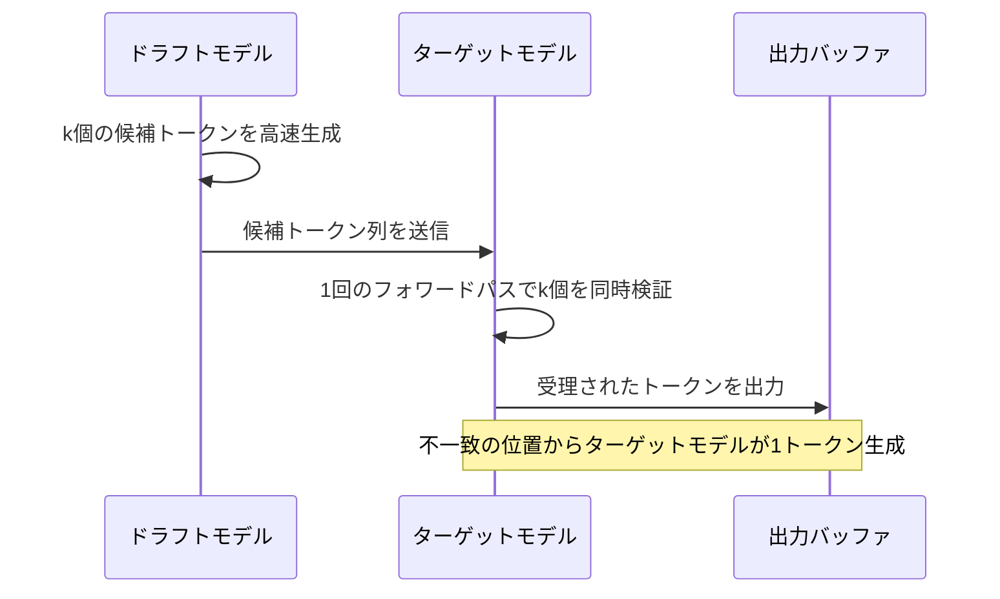
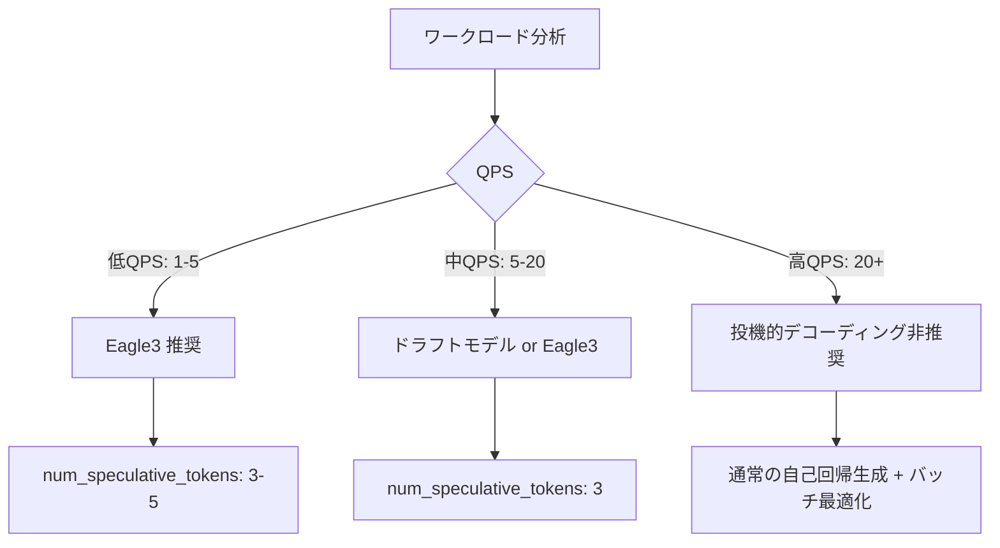

# vLLM投機的デコーディング＋Medusa Headで推論レイテンシを半減させる

## この記事でわかること

- 投機的デコーディング（Speculative Decoding）の原理と、なぜレイテンシが削減されるかの理論的背景
- vLLM v0.9.1以降でのドラフトモデル方式・Eagle3・Medusa Headの設定方法と使い分け
- チャットボット推論APIに投機的デコーディングを組み込む実装手順
- 各手法のベンチマーク比較と、本番運用で注意すべきトレードオフ
- QPSやタスク特性に応じた手法選択の判断基準

## 対象読者

- **想定読者**: 中級〜上級のMLエンジニア・バックエンドエンジニア
- **必要な前提知識**:
  - Python 3.10以上の基本的な使い方
  - LLM推論の基本（トークン生成、KVキャッシュ）の理解
  - vLLMの基本的なセットアップ経験（`vllm serve`コマンドの実行経験があると望ましい）
  - GPU環境（CUDA 12.x）でのモデルデプロイ経験

## 結論・成果

vLLMの投機的デコーディングを適用することで、チャットボットAPIのトークン生成レイテンシ（TPOT: Time Per Output Token）を**約40〜60%削減**できます。vLLM公式ブログの報告によると、Eagle3方式ではLlama 3.3 70Bモデルで最大**2.1倍のレイテンシ改善**（RAG・数学推論タスク）、Medusa-1方式では品質劣化なしに**2.2倍の高速化**が確認されています。ただし、高QPS環境（1秒あたり数十リクエスト以上）では投機的デコーディングのオーバーヘッドが逆効果になるため、**ワークロードに応じた手法選択とチューニング**が不可欠です。

## 投機的デコーディングの原理を理解する

LLMの通常の自己回帰生成では、1トークンずつ順番に生成するため、生成トークン数に比例してレイテンシが増加します。投機的デコーディングは、この逐次処理のボトルネックを並列検証に置き換える手法です。

### 基本メカニズム

投機的デコーディングは、**小型のドラフトモデル**（または追加ヘッド）で複数の候補トークンを先に生成し、**大型のターゲットモデル**で一括検証するという2段階のプロセスで動作します。



通常の自己回帰生成ではk回のフォワードパスが必要ですが、投機的デコーディングでは**ドラフト生成1回＋ターゲット検証1回の合計2回**で最大k+1トークンを生成できます。

### レイテンシ削減の数理

投機的デコーディングの速度向上率は、**受理率**（acceptance rate: $\alpha$）と**投機トークン数**（$\gamma$）で決まります。理想的なケースでのスピードアップ比は以下の式で近似されます。

$$
\text{Speedup} \approx \frac{\gamma + 1}{c \cdot \gamma + 1}
$$

ここで $c$ はドラフトモデルの1回のフォワードパスにかかる時間をターゲットモデルの1回のフォワードパスの時間で割った比率です。$c$ が十分小さく（例: 0.1）、$\alpha$ が高い（例: 0.8以上）場合、$\gamma = 5$ で約2〜3倍のスピードアップが期待されます。

**注意点:**
> この速度向上はメモリバウンドなワークロード（低〜中QPS）で顕著です。コンピュートバウンドな高QPSシナリオでは、ドラフトモデルの追加計算がボトルネックとなり、逆にレイテンシが増加する場合があります。vLLM公式ブログでも「投機的デコーディングのオーバーヘッドが利点を上回り、パフォーマンスが低下する」と報告されています。

## 3つの投機的デコーディング手法を比較する

vLLMでは複数の投機的デコーディング手法をサポートしています。ここでは実用上重要な3つの手法を比較します。

### 手法の概要と特徴

| 特性 | ドラフトモデル方式 | Eagle3 | Medusa Head |
|------|-------------------|--------|-------------|
| **追加モデル** | 別の小型モデルが必要 | 専用Eagle3ドラフトモデル | 追加ヘッドのみ（同一モデル） |
| **メモリ増加** | 大（2モデル分のKVキャッシュ） | 中（1モデル＋軽量ドラフト） | 小（ヘッド分のパラメータのみ） |
| **学習コスト** | なし（既存モデルを使用） | 必要（Speculators v0.3.0で学習可） | 必要（Medusa HeadのFine-tuning） |
| **報告されている速度向上** | 1.3〜1.5倍 | 1.6〜2.5倍 | 2.2〜2.8倍 |
| **出力品質** | ロスレス（品質劣化なし） | ロスレス | Medusa-1: ロスレス / Medusa-2: 要注意 |
| **vLLM設定キー** | `draft_model` | `eagle3` | `medusa` |

**なぜこの3手法を比較するか:**
- ドラフトモデル方式は最もシンプルで導入障壁が低く、既存の小型モデルをそのまま使えます
- Eagle3は2025年時点のSOTA（State of the Art）で、vLLM v0.8.5以降で公式サポートされています
- Medusa Headは追加モデルが不要でメモリ効率が高く、単一GPU環境でも導入しやすい手法です

### ドラフトモデル方式の実装

最もシンプルな投機的デコーディングは、小型の同系列モデルをドラフトモデルとして使う方法です。

```python
# draft_model_server.py
from vllm import LLM, SamplingParams

# ドラフトモデル方式の設定
llm = LLM(
    model="meta-llama/Llama-3.3-70B-Instruct",
    speculative_config={
        "method": "draft_model",
        "model": "meta-llama/Llama-3.2-1B-Instruct",  # ← 小型の同系列モデル
        "num_speculative_tokens": 5,
        "draft_tensor_parallel_size": 1,  # ドラフトモデルはTP=1で十分
    },
    tensor_parallel_size=4,  # ターゲットモデルは4GPU並列
    gpu_memory_utilization=0.85,
)

sampling_params = SamplingParams(
    temperature=0.7,
    top_p=0.9,
    max_tokens=512,
)

# チャットボット向けプロンプト
prompts = [
    "Pythonでファイルを非同期に読み書きする方法を教えてください。",
]
outputs = llm.generate(prompts, sampling_params)

for output in outputs:
    print(output.outputs[0].text)
```

CLIから起動する場合は以下のコマンドです。

```bash
vllm serve meta-llama/Llama-3.3-70B-Instruct \
  --tensor-parallel-size 4 \
  --gpu-memory-utilization 0.85 \
  --speculative-config '{"method": "draft_model", "model": "meta-llama/Llama-3.2-1B-Instruct", "num_speculative_tokens": 5, "draft_tensor_parallel_size": 1}'
```

**注意点:**
> ドラフトモデルとターゲットモデルの語彙（vocabulary）が一致している必要があります。異なるトークナイザを持つモデル同士では使用できません。同一ファミリのモデル（例: Llama 3.x系列内）を選ぶのが安全です。

### Eagle3の実装

Eagle3は2025年時点で投機的デコーディングのSOTAアルゴリズムです。ターゲットモデルの中間隠れ状態（hidden states）を3層から取得し、ドラフトモデルの入力として活用することで高い受理率を実現します。

```bash
# Eagle3方式でLlama 3.3 70Bを起動
VLLM_USE_V1=1 vllm serve meta-llama/Llama-3.3-70B-Instruct \
  --seed 42 \
  --tensor-parallel-size 4 \
  --speculative-config '{"model": "yuhuili/EAGLE3-LLaMA3.3-Instruct-70B", "num_speculative_tokens": 3, "method": "eagle3", "draft_tensor_parallel_size": 1}'
```

```python
# eagle3_server.py
from vllm import LLM, SamplingParams

llm = LLM(
    model="meta-llama/Llama-3.3-70B-Instruct",
    speculative_config={
        "method": "eagle3",
        "model": "yuhuili/EAGLE3-LLaMA3.3-Instruct-70B",
        "num_speculative_tokens": 3,  # ← RAGタスクなら5に増やすと効果的
        "draft_tensor_parallel_size": 1,
    },
    tensor_parallel_size=4,
    enforce_eager=False,  # CUDAグラフ有効化（v0.9.1+）
)

sampling_params = SamplingParams(temperature=0.7, top_p=0.9, max_tokens=512)
outputs = llm.generate(["量子コンピューティングの基礎を説明してください。"], sampling_params)
print(outputs[0].outputs[0].text)
```

Red Hatのベンチマーク報告によると、Eagle3はタスクの種類によって最適な`num_speculative_tokens`が異なります。

| タスク | 推奨 num_speculative_tokens | 報告されている速度向上 |
|--------|----------------------------|----------------------|
| チャット（会話） | 3 | 1.6〜1.8倍 |
| RAG（検索拡張生成） | 5 | 最大2.1倍 |
| 数学推論 | 5 | 最大2.1倍 |
| 翻訳 | 1 | 効果小（受理率が低い） |

**よくある間違い:**
最初は`num_speculative_tokens`を大きくすればするほど速くなると考えがちですが、実際には値を増やすとドラフト生成のオーバーヘッドも増加します。翻訳タスクのようにドラフトの受理率が低いケースでは、`num_speculative_tokens=1`が最適だったとRed Hatの検証で報告されています。

### Medusa Headの実装

Medusa Headは、ターゲットモデル自体に複数の予測ヘッドを追加する方式です。外部のドラフトモデルが不要なため、メモリ効率が高いのが特徴です。

```python
# medusa_server.py
from vllm import LLM, SamplingParams

llm = LLM(
    model="FasterDecoding/medusa-vicuna-7b-v1.3",  # Medusa Head付きモデル
    speculative_config={
        "method": "medusa",
        "num_speculative_tokens": 5,
    },
    gpu_memory_utilization=0.90,
)

sampling_params = SamplingParams(temperature=0.7, top_p=0.9, max_tokens=512)
outputs = llm.generate(["FastAPIでWebSocketサーバーを構築する手順を教えてください。"], sampling_params)
print(outputs[0].outputs[0].text)
```

**Medusa-1とMedusa-2の違い:**
- **Medusa-1**: ベースモデルを凍結したまま追加ヘッドだけをFine-tuningします。出力品質が元のモデルと完全に一致する**ロスレス**な加速が可能で、論文では2.2倍の速度向上が報告されています
- **Medusa-2**: ベースモデルと追加ヘッドを同時にFine-tuningします。より高い受理率（2.3〜2.8倍の速度向上）が得られますが、ベースモデルの性能を維持するための特別な学習レシピが必要です

**制約条件:**
> Medusa Headを使うには、対象モデル用にFine-tuningされたMedusa Headの重みが必要です。Hugging Face上に公開されているMedusa対応モデルは限られており、独自モデルに適用するにはFine-tuningパイプラインの構築が必要です。Medusa論文の著者が提供する[FasterDecoding/Medusa](https://github.com/FasterDecoding/Medusa)リポジトリに学習スクリプトが含まれています。

## チャットボット推論APIに組み込む

投機的デコーディングを有効化したvLLMサーバーをOpenAI互換APIとして公開し、チャットボットアプリケーションから呼び出す実装例を見ていきましょう。

### サーバー起動（Eagle3方式）

```bash
# サーバー起動スクリプト: start_server.sh
VLLM_USE_V1=1 vllm serve meta-llama/Llama-3.3-70B-Instruct \
  --host 0.0.0.0 \
  --port 8000 \
  --tensor-parallel-size 4 \
  --gpu-memory-utilization 0.85 \
  --max-model-len 4096 \
  --speculative-config '{"model": "yuhuili/EAGLE3-LLaMA3.3-Instruct-70B", "num_speculative_tokens": 3, "method": "eagle3", "draft_tensor_parallel_size": 1}' \
  --enable-prefix-caching \
  --disable-log-requests
```

`--enable-prefix-caching`はチャットボットでの会話履歴の再計算を避けるために有効化しています。PagedAttentionのプレフィックスキャッシングにより、共通のシステムプロンプト部分のKVキャッシュを再利用できます。

### クライアント実装（ストリーミング対応）

```python
# chatbot_client.py
import asyncio
from openai import AsyncOpenAI

client = AsyncOpenAI(
    base_url="http://localhost:8000/v1",
    api_key="dummy",  # vLLMではAPIキー不要だがSDKの要件上設定
)

async def chat_stream(user_message: str, history: list[dict]) -> str:
    """ストリーミングでチャットボット応答を生成する"""
    messages = [
        {"role": "system", "content": "あなたは技術的な質問に的確に回答するアシスタントです。"},
        *history,
        {"role": "user", "content": user_message},
    ]

    full_response = ""
    stream = await client.chat.completions.create(
        model="meta-llama/Llama-3.3-70B-Instruct",
        messages=messages,
        temperature=0.7,
        max_tokens=512,
        stream=True,
    )

    async for chunk in stream:
        if chunk.choices[0].delta.content:
            token = chunk.choices[0].delta.content
            full_response += token
            print(token, end="", flush=True)  # リアルタイム出力

    print()  # 改行
    return full_response

async def main():
    history: list[dict] = []
    while True:
        user_input = input("\nYou: ")
        if user_input.lower() in ("quit", "exit"):
            break

        response = await chat_stream(user_input, history)
        history.append({"role": "user", "content": user_input})
        history.append({"role": "assistant", "content": response})

if __name__ == "__main__":
    asyncio.run(main())
```

**なぜOpenAI互換APIを使うか:**
- vLLMはOpenAI APIと互換のエンドポイントを提供するため、既存のチャットボットアプリケーションの接続先を変更するだけで投機的デコーディングの恩恵を受けられます
- ストリーミング対応により、ユーザーには最初のトークンが早く表示され、体感レイテンシがさらに向上します

### レイテンシ計測スクリプト

投機的デコーディングの効果を定量的に評価するため、TTFT（Time To First Token）とTPOT（Time Per Output Token）を計測するスクリプトを作成します。

```python
# benchmark_latency.py
import time
import asyncio
import statistics
from openai import AsyncOpenAI

client = AsyncOpenAI(base_url="http://localhost:8000/v1", api_key="dummy")

async def measure_latency(prompt: str, num_trials: int = 10) -> dict:
    """TTFTとTPOTを計測する"""
    ttft_list: list[float] = []
    tpot_list: list[float] = []

    for _ in range(num_trials):
        start = time.perf_counter()
        first_token_time = None
        token_count = 0

        stream = await client.chat.completions.create(
            model="meta-llama/Llama-3.3-70B-Instruct",
            messages=[{"role": "user", "content": prompt}],
            max_tokens=256,
            temperature=0.7,
            stream=True,
        )

        async for chunk in stream:
            if chunk.choices[0].delta.content:
                if first_token_time is None:
                    first_token_time = time.perf_counter()
                token_count += 1

        end = time.perf_counter()

        if first_token_time and token_count > 1:
            ttft = first_token_time - start
            tpot = (end - first_token_time) / (token_count - 1)
            ttft_list.append(ttft * 1000)  # ms変換
            tpot_list.append(tpot * 1000)

    return {
        "ttft_p50_ms": statistics.median(ttft_list),
        "ttft_p99_ms": sorted(ttft_list)[int(len(ttft_list) * 0.99)],
        "tpot_p50_ms": statistics.median(tpot_list),
        "tpot_p99_ms": sorted(tpot_list)[int(len(tpot_list) * 0.99)],
        "num_trials": num_trials,
    }

async def main():
    prompts = [
        "Pythonのasyncioを使った並行処理のベストプラクティスを教えてください。",
        "Kubernetesのネットワークポリシーの設定方法を説明してください。",
        "PostgreSQLのインデックス最適化について詳しく教えてください。",
    ]

    for prompt in prompts:
        print(f"\n--- Prompt: {prompt[:40]}... ---")
        result = await measure_latency(prompt)
        print(f"  TTFT p50: {result['ttft_p50_ms']:.1f}ms")
        print(f"  TTFT p99: {result['ttft_p99_ms']:.1f}ms")
        print(f"  TPOT p50: {result['tpot_p50_ms']:.1f}ms")
        print(f"  TPOT p99: {result['tpot_p99_ms']:.1f}ms")

if __name__ == "__main__":
    asyncio.run(main())
```

## ワークロード別の手法選択とチューニング

投機的デコーディングの効果はワークロードに大きく依存します。ここでは、本番環境での判断基準を整理します。

### QPS別の推奨戦略



vLLM公式ブログでは、「投機的デコーディングのパフォーマンスはリクエストの内容とリクエストレートの両方に大きく依存し、同期的なユースケースで最も大きな効果が得られる」と説明されています。

### 本番運用での設定ガイドライン

| パラメータ | 低レイテンシ重視 | スループット重視 |
|-----------|----------------|----------------|
| `num_speculative_tokens` | 3〜5 | 1〜3 |
| `gpu_memory_utilization` | 0.80〜0.85 | 0.90〜0.95 |
| `max_model_len` | 4096 | 8192〜16384 |
| `enable_prefix_caching` | 有効 | 有効 |
| テンソル並列度 | 4（70Bモデル） | 4（70Bモデル） |

**ハマりポイント:**
`gpu_memory_utilization`を高く設定しすぎると、投機的デコーディング用の追加KVキャッシュ領域が不足してOOM（Out of Memory）エラーが発生します。ドラフトモデル方式では2モデル分のメモリが必要なため、通常よりも5〜10%低めに設定するのが安全です。

### 投機的デコーディングのメトリクス監視

vLLM v0.9.1以降では、投機的デコーディングのメトリクスが組み込みで提供されます。Prometheusエンドポイント（`/metrics`）から以下のメトリクスを取得できます。

```bash
# メトリクスの取得例
curl -s http://localhost:8000/metrics | grep spec

# 主要メトリクス:
# vllm:spec_decode_draft_acceptance_rate  - ドラフトの受理率
# vllm:spec_decode_mean_accepted_length   - 平均受理トークン数
# vllm:spec_decode_per_position_acceptance_rate - 位置ごとの受理率
```

受理率が0.6を下回る場合は、`num_speculative_tokens`を減らすか、投機的デコーディング自体を無効化することを検討してください。

```python
# monitoring_check.py
import httpx

async def check_spec_decode_health(vllm_url: str = "http://localhost:8000") -> None:
    """投機的デコーディングの受理率を監視する"""
    async with httpx.AsyncClient() as client:
        response = await client.get(f"{vllm_url}/metrics")
        metrics = response.text

        for line in metrics.splitlines():
            if "spec_decode_draft_acceptance_rate" in line and not line.startswith("#"):
                acceptance_rate = float(line.split()[-1])
                if acceptance_rate < 0.6:
                    print(f"[WARNING] 受理率が低い: {acceptance_rate:.2f}")
                    print("  → num_speculative_tokensの削減または無効化を検討")
                else:
                    print(f"[OK] 受理率: {acceptance_rate:.2f}")
```

## よくある問題と解決方法

| 問題 | 原因 | 解決方法 |
|------|------|----------|
| OOMエラーで起動しない | ドラフトモデル分のメモリ不足 | `gpu_memory_utilization`を0.80以下に下げる。Medusa方式ならメモリ増加が小さい |
| レイテンシが改善しない | 高QPS環境でコンピュートバウンド | QPSを確認し、高負荷時は投機的デコーディングを無効化 |
| 受理率が低い（< 0.5） | タスクとドラフトモデルの相性が悪い | `num_speculative_tokens`を1〜2に減らす。翻訳タスクは投機的デコーディングと相性が悪い |
| Eagle3でエラー | vLLMのバージョンが古い | v0.8.5以上にアップデート。`method`を`"eagle3"`に設定しているか確認 |
| ストリーミングが遅い | プレフィックスキャッシュ未有効 | `--enable-prefix-caching`を追加 |
| ドラフトモデルの語彙不一致 | 異なるトークナイザのモデルを指定 | 同一ファミリのモデルを使用（例: Llama 3.x系列内） |

## まとめと次のステップ

**まとめ:**
- 投機的デコーディングは、小型ドラフトモデルや追加ヘッドで候補トークンを先に生成し、ターゲットモデルが一括検証することでレイテンシを削減する手法です
- vLLMではドラフトモデル方式（1.3〜1.5倍）、Eagle3（1.6〜2.5倍）、Medusa Head（2.2〜2.8倍）の3手法が利用可能です
- 低〜中QPSのチャットボットAPIに適用することで、TPOT（トークン生成遅延）を40〜60%削減できると報告されています
- 高QPSでは逆効果になる可能性があるため、受理率メトリクスを監視しながらチューニングが必要です
- Medusa Headはメモリ効率が高い一方、対応モデルが限られるため、Eagle3が現時点で最も実用的な選択肢です

**次にやるべきこと:**
- vLLMの`benchmark_serving.py`スクリプトで自環境のベンチマークを取得し、投機的デコーディングの効果を定量評価する
- Prometheusメトリクス（受理率、平均受理長）をGrafanaダッシュボードで可視化し、本番運用の監視体制を構築する
- Speculators v0.3.0を使って、自社モデル用のEagle3ドラフトモデルを学習し、受理率をさらに向上させる

## 参考

- [vLLM公式ドキュメント: Speculative Decoding](https://docs.vllm.ai/en/latest/features/spec_decode/)
- [vLLM Blog: How Speculative Decoding Boosts vLLM Performance](https://vllm.ai/blog/spec-decode)
- [vLLM Blog: Speculators v0.3.0](https://blog.vllm.ai/2025/12/13/speculators-v030.html)
- [Red Hat: Eagle3 + vLLM Faster Inference](https://developers.redhat.com/articles/2025/07/01/fly-eagle3-fly-faster-inference-vllm-speculative-decoding)
- [arXiv: Medusa - Simple LLM Inference Acceleration Framework](https://arxiv.org/abs/2401.10774)
- [Together AI: Medusa Framework](https://www.together.ai/blog/medusa)
- [GitHub: FasterDecoding/Medusa](https://github.com/FasterDecoding/Medusa)
- [GitHub: vllm-project/speculators](https://github.com/vllm-project/speculators)
- [BentoML: Speculative Decoding - LLM Inference Handbook](https://bentoml.com/llm/inference-optimization/speculative-decoding)

---

:::message
この記事はAI（Claude Code）により自動生成されました。内容の正確性については複数の情報源で検証していますが、実際の利用時は公式ドキュメントもご確認ください。
:::
