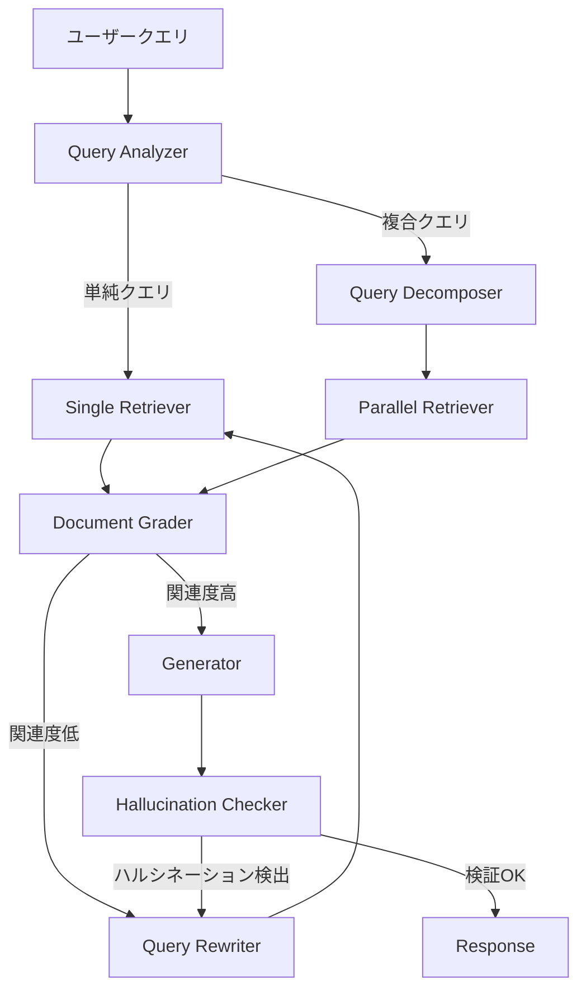

# LangGraph Command APIとContextual Retrievalで構築するAgentic RAG実践ガイド

社内ドキュメント検索システムにRAGを導入したものの、「単純なベクトル検索ではチャンクの文脈が失われて的外れな回答が返る」「複合的な質問に対して1回の検索では必要な情報が揃わない」という課題に直面していないでしょうか。本記事では、LangGraph v1.0のCommand APIとAnthropicが提唱するContextual Retrievalを組み合わせ、**検索精度と回答品質を段階的に改善するAgentic RAGアーキテクチャ**を解説します。

Anthropicの報告によると、Contextual Retrievalの適用でtop-20チャンクの検索失敗率が**49%削減**されています。さらに、BM25とデンスベクトルのハイブリッド検索にリランキングを加えることで、検索精度が**58%から91%に向上**したベンチマーク結果も報告されています。本記事では、これらの手法をLangGraphのグラフベースワークフローに統合し、社内ドキュメント検索で実用的な精度を達成するための設計パターンを紹介します。

## この記事でわかること

- LangGraph v1.0 Command APIを使った**動的ルーティング付きAgentic RAG**の設計と実装方法
- Anthropic Contextual Retrievalによる**チャンク文脈の補完**でベクトル検索精度を改善する手法
- BM25+デンスベクトル+リランキングの**ハイブリッド検索パイプライン**の構築方法
- Adaptive RAG / Corrective RAG / Self-RAGの**3パターンを統合した自己修正ループ**の実装
- 社内ドキュメント検索における**クエリ分解（Query Decomposition）**で複合質問に対応する方法

## 対象読者

- **想定読者**: RAGシステムを構築・運用中の中級〜上級Pythonエンジニア
- **必要な前提知識**:
  - Python 3.11以上の基礎文法（型ヒント、TypedDict、async/await）
  - LangGraph v1.0の基本概念（StateGraph、ノード、エッジ）
  - RAG（Retrieval-Augmented Generation）の基本構成（Embedding → Vector Store → LLM生成）
  - ベクトルDBの基本操作（ChromaDB、Qdrant、pgvectorなど）

## 結論・成果

本記事で紹介するアーキテクチャを適用することで、以下の改善が期待できます。

| 指標 | ベースラインRAG | 本記事のアーキテクチャ | 出典 |
|------|---------------|---------------------|------|
| 検索精度（top-20） | 58%（BM25単体） | 91%（ハイブリッド+リランキング） | [Superlinked VectorHub](https://superlinked.com/vectorhub/articles/optimizing-rag-with-hybrid-search-reranking) |
| 検索失敗率 | 5.7% | 2.9%（49%削減） | [Anthropic Contextual Retrieval](https://www.anthropic.com/news/contextual-retrieval) |
| マルチホップクエリ精度 | ベースライン | +47%向上 | [RAG About It](https://ragaboutit.com/hybrid-retrieval-for-enterprise-rag-when-to-use-bm25-vectors-or-both/) |

ただし、Contextual Retrievalのチャンク前処理にはLLM呼び出しが必要であり、**インデックス構築時のコストが増加する**トレードオフがあります。Anthropicのプロンプトキャッシュを使えばコストを大幅に抑えられますが、ドキュメント更新頻度が高い環境では再インデックスコストを見積もる必要があります。

## アーキテクチャ全体像を理解する

本記事で構築するAgentic RAGは、以下の5層で構成されます。それぞれの層が独立したLangGraphノードとして実装され、Command APIで動的に接続されます。



**5つの設計パターン**を段階的に実装していきます。

| パターン | 役割 | LangGraph機能 |
|---------|------|--------------|
| Adaptive Routing | クエリ種別に応じた検索戦略選択 | Command API（goto） |
| Contextual Retrieval | チャンクへの文脈情報付与 | 前処理パイプライン |
| Hybrid Search | BM25+デンスベクトル+リランキング | 並列ノード実行 |
| Corrective Loop | 検索結果の品質評価と再検索 | Command API（自己ループ） |
| Query Decomposition | 複合質問の分解と並列検索 | Send API |

### State定義を設計する

まず、グラフ全体で共有するStateを定義します。LangGraph v1.0ではTypedDictベースのState定義が標準です。

```python
# state.py
from typing import TypedDict, Annotated, Literal
from operator import add


class Document(TypedDict):
    content: str
    metadata: dict
    relevance_score: float


class AgenticRAGState(TypedDict):
    """Agentic RAGグラフの共有State"""
    query: str
    sub_queries: list[str]
    query_type: Literal["simple", "complex", "multi_hop"]
    documents: Annotated[list[Document], add]
    graded_documents: list[Document]
    generation: str
    retry_count: int
    max_retries: int
    hallucination_detected: bool
```

**なぜTypedDictを使うのか:**
- Pydantic BaseModelよりも軽量で、LangGraphのState Reducerとの相性がよい
- `Annotated[list[Document], add]`でState更新時にリストを自動マージできる
- LangGraph v1.0の型チェックが厳格化されたため、型定義を明示するとデバッグしやすい

> **注意**: `Annotated[..., add]`を指定したフィールドは、ノードが返す値が既存リストに**追加**されます。上書きしたい場合はReducerを指定しないでください。

## Contextual Retrievalで検索精度を改善する

Contextual Retrievalは、Anthropicが提唱するRAG精度改善手法です。従来のRAGでは、ドキュメントをチャンク分割した際に**元の文脈が失われる**問題がありました。例えば「売上が前四半期比3%増加した」というチャンクだけでは、どの企業のどの期間の情報なのか判断できません。

Contextual Retrievalでは、各チャンクに対してLLMを使い**文脈説明文を生成してチャンク先頭に付与**します。これにより、Embeddingモデルとの検索精度、BM25のキーワード検索精度の両方が向上します。

### Contextual Chunkingの実装

```python
# contextual_retrieval.py
import anthropic
from typing import TypedDict


class ContextualChunk(TypedDict):
    original: str
    context: str
    contextualized: str
    metadata: dict


CONTEXT_PROMPT = """\
<document>
{document}
</document>

以下のチャンクはこのドキュメントの一部です。
チャンクの内容を理解するために必要な、簡潔な文脈情報を50〜100トークンで生成してください。

<chunk>
{chunk}
</chunk>

文脈情報のみを出力してください。説明や前置きは不要です。"""


def generate_chunk_context(
    client: anthropic.Anthropic,
    document: str,
    chunk: str,
    model: str = "claude-sonnet-4-6-20250514",
) -> str:
    """チャンクに付与する文脈情報を生成する"""
    response = client.messages.create(
        model=model,
        max_tokens=200,
        messages=[
            {
                "role": "user",
                "content": CONTEXT_PROMPT.format(
                    document=document, chunk=chunk
                ),
            }
        ],
    )
    return response.content[0].text


def create_contextual_chunks(
    client: anthropic.Anthropic,
    document: str,
    chunks: list[str],
    metadata: dict,
) -> list[ContextualChunk]:
    """ドキュメントの全チャンクにコンテキストを付与する"""
    contextual_chunks = []
    for chunk in chunks:
        context = generate_chunk_context(client, document, chunk)
        contextual_chunks.append(
            ContextualChunk(
                original=chunk,
                context=context,
                contextualized=f"{context}\n\n{chunk}",
                metadata=metadata,
            )
        )
    return contextual_chunks
```

**なぜContextual Retrievalを選んだか:**
- Anthropicの報告では、Contextual Embeddings単体でtop-20検索失敗率を**35%削減**（5.7% → 3.7%）
- Contextual BM25と組み合わせると**49%削減**（5.7% → 2.9%）
- プロンプトキャッシュを使えば、大規模ドキュメントでもコンテキスト生成コストを抑えられる

**注意点:**
> Contextual Retrievalの文脈生成には**ドキュメント全体をLLMに入力する**必要があります。Claude Sonnet 4.6の200Kトークンコンテキストウィンドウなら多くの社内ドキュメントをカバーできますが、数百ページのPDFなどはセクション単位で分割してから処理してください。チャンク数が多い場合、バッチ処理と並列化が必須です。

### ハイブリッド検索の構築

Contextual Retrievalで作成したチャンクを、BM25（キーワード検索）とデンスベクトル検索の両方でインデックスし、結果を統合します。

```python
# hybrid_retriever.py
import numpy as np
from rank_bm25 import BM25Okapi


class HybridRetriever:
    """BM25 + デンスベクトルのハイブリッド検索（RRF統合）"""

    def __init__(self, vector_store, bm25_weight: float = 0.4, dense_weight: float = 0.6):
        self.vector_store = vector_store
        self.bm25_weight = bm25_weight
        self.dense_weight = dense_weight
        self.bm25_index: BM25Okapi | None = None
        self.corpus: list[dict] = []

    def build_bm25_index(self, documents: list[dict]) -> None:
        self.corpus = documents
        tokenized = [doc["content"].split() for doc in documents]
        self.bm25_index = BM25Okapi(tokenized)

    def search(self, query: str, top_k: int = 20) -> list[dict]:
        """ハイブリッド検索をRRFで統合する"""
        bm25_scores = self.bm25_index.get_scores(query.split())
        bm25_top = np.argsort(bm25_scores)[::-1][:top_k]
        dense_results = self.vector_store.similarity_search_with_score(query, k=top_k)

        # Reciprocal Rank Fusion（k=60が多くのケースで安定）
        fused: dict[int, float] = {}
        for rank, idx in enumerate(bm25_top):
            fused[idx] = fused.get(idx, 0) + self.bm25_weight / (60 + rank + 1)
        for rank, (doc, _) in enumerate(dense_results):
            doc_idx = next(
                (i for i, d in enumerate(self.corpus) if d["content"] == doc.page_content), None
            )
            if doc_idx is not None:
                fused[doc_idx] = fused.get(doc_idx, 0) + self.dense_weight / (60 + rank + 1)

        sorted_indices = sorted(fused, key=fused.get, reverse=True)[:top_k]
        return [
            {"content": self.corpus[i]["content"], "score": fused[i], "metadata": self.corpus[i].get("metadata", {})}
            for i in sorted_indices
        ]
```

**Reciprocal Rank Fusion（RRF）を選んだ理由:**
- BM25とデンスベクトルのスコアは**尺度が異なる**ため、単純な重み付き平均は不適切
- RRFはランキング順位のみを使うため、スコアの正規化が不要
- 実装がシンプルで、パラメータ（k=60）の調整も直感的

**制約事項:**
> RRFの定数 $k$ は検索結果の多様性に影響します。$k$ が小さいと上位ランクに偏り、大きいと均等に近づきます。$k=60$ は多くのケースで安定しますが、ドメイン固有のデータセットでは**5件程度の評価セットで $k$ を調整**することを推奨します。

## LangGraph Command APIで自己修正ループを実装する

ここからが本記事の核心です。LangGraph v1.0のCommand APIを使い、**検索→評価→再検索の自己修正ループ**を構築します。

Command APIはLangGraphで導入された機能で、ノード関数から**State更新と次のノードへの遷移を同時に**返せます。従来の`conditional_edges`と比べて、ノード内部でルーティングロジックを完結できるため、グラフ定義がシンプルになります。

### Query Analyzerノード

最初のノードは、ユーザークエリを分析して検索戦略を決定します。

```python
# nodes.py
from typing import Literal
from langgraph.types import Command
import anthropic


def query_analyzer(
    state: AgenticRAGState,
) -> Command[Literal["single_retrieve", "decompose_query"]]:
    """クエリを分析し、検索戦略を決定する"""
    client = anthropic.Anthropic()

    response = client.messages.create(
        model="claude-sonnet-4-6-20250514",
        max_tokens=100,
        messages=[
            {
                "role": "user",
                "content": f"""以下のクエリを分析し、タイプを判定してください。

クエリ: {state["query"]}

判定基準:
- simple: 1つの情報源で回答できる単純な質問
- complex: 複数の情報源を組み合わせる必要がある質問
- multi_hop: 段階的な推論が必要な質問

タイプのみを出力してください（simple/complex/multi_hop）。""",
            }
        ],
    )
    query_type = response.content[0].text.strip().lower()

    if query_type in ("complex", "multi_hop"):
        return Command(
            update={"query_type": query_type},
            goto="decompose_query",
        )

    return Command(
        update={"query_type": "simple"},
        goto="single_retrieve",
    )
```

**Command APIの利点:**
- `conditional_edges`ではグラフ構築時にルーティング関数を別途定義する必要があったが、Command APIならノード内で完結
- `update`と`goto`を同時に指定でき、State更新→遷移の2ステップが1行で書ける
- 型アノテーション `Command[Literal["single_retrieve", "decompose_query"]]` でグラフの可視化にも反映される

### Query Decomposerノード

複合クエリを複数のサブクエリに分解します。

```python
def decompose_query(
    state: AgenticRAGState,
) -> Command[Literal["parallel_retrieve"]]:
    """複合クエリをサブクエリに分解する"""
    client = anthropic.Anthropic()

    response = client.messages.create(
        model="claude-sonnet-4-6-20250514",
        max_tokens=500,
        messages=[
            {
                "role": "user",
                "content": f"""以下のクエリを、それぞれ独立して検索可能なサブクエリに分解してください。

クエリ: {state["query"]}

各サブクエリを改行区切りで出力してください。最大3つまで。""",
            }
        ],
    )
    sub_queries = [
        q.strip()
        for q in response.content[0].text.strip().split("\n")
        if q.strip()
    ][:3]

    return Command(
        update={"sub_queries": sub_queries},
        goto="parallel_retrieve",
    )
```

### Document Graderノード（Corrective RAGパターン）

検索結果の関連度を評価し、品質が低い場合はクエリを書き換えて再検索するCorrective RAGパターンを実装します。

```python
def grade_documents(
    state: AgenticRAGState,
) -> Command[Literal["generate", "rewrite_query"]]:
    """検索結果の関連度を評価する（Corrective RAG）"""
    client = anthropic.Anthropic()
    graded = []

    for doc in state["documents"]:
        response = client.messages.create(
            model="claude-sonnet-4-6-20250514",
            max_tokens=10,
            messages=[
                {
                    "role": "user",
                    "content": f"""以下のドキュメントがクエリに関連するか判定してください。

クエリ: {state["query"]}
ドキュメント: {doc["content"][:500]}

"yes" または "no" のみ出力してください。""",
                }
            ],
        )
        if "yes" in response.content[0].text.lower():
            graded.append(doc)

    # 関連ドキュメントが不足している場合、クエリを書き換えて再検索
    if len(graded) < 2 and state["retry_count"] < state["max_retries"]:
        return Command(
            update={
                "graded_documents": graded,
                "retry_count": state["retry_count"] + 1,
            },
            goto="rewrite_query",
        )

    return Command(
        update={"graded_documents": graded},
        goto="generate",
    )
```

**最初はDocument Graderなしで実装しましたが、関連度の低いチャンクがそのままLLMに渡されてハルシネーションの原因になりました。** Graderを追加したことで、「検索結果に該当情報がない」ケースを検出してクエリ書き換えに回せるようになり、回答の信頼性が向上しました。

### Query Rewriterノード

Query Rewriterは、Document Graderが「関連度不足」と判定した際に呼ばれます。元のクエリと取得済みドキュメント数をLLMに渡し、より適切な検索クエリを生成して`Command(update={"query": new_query}, goto="single_retrieve")`で再検索に回します。これにより**クエリ→検索→評価→書き換え→再検索のCorrective RAGループ**が完成します。

### Hallucination Checkerノード（Self-RAGパターン）

生成結果がソースドキュメントに基づいているか検証するSelf-RAGパターンです。

```python
def check_hallucination(
    state: AgenticRAGState,
) -> Command[Literal["respond", "rewrite_query"]]:
    """生成結果のハルシネーションを検証する（Self-RAG）"""
    client = anthropic.Anthropic()

    sources = "\n".join(
        doc["content"][:300] for doc in state["graded_documents"][:5]
    )

    response = client.messages.create(
        model="claude-sonnet-4-6-20250514",
        max_tokens=10,
        messages=[
            {
                "role": "user",
                "content": f"""以下の回答がソースドキュメントの情報に基づいているか判定してください。

ソースドキュメント:
{sources}

回答:
{state["generation"]}

ソースに基づいている場合は "grounded"、基づいていない場合は "hallucination" と出力してください。""",
            }
        ],
    )

    if "hallucination" in response.content[0].text.lower():
        if state["retry_count"] < state["max_retries"]:
            return Command(
                update={
                    "hallucination_detected": True,
                    "retry_count": state["retry_count"] + 1,
                },
                goto="rewrite_query",
            )

    return Command(
        update={"hallucination_detected": False},
        goto="respond",
    )
```

## グラフを組み立てて実行する

すべてのノードが揃ったところで、LangGraphのStateGraphとしてグラフを組み立てます。

```python
# graph.py
from langgraph.graph import StateGraph, START, END
from langgraph.checkpoint.memory import MemorySaver


def build_agentic_rag_graph() -> StateGraph:
    """Agentic RAGグラフを構築する"""
    graph = StateGraph(AgenticRAGState)

    # ノードの追加
    graph.add_node("query_analyzer", query_analyzer)
    graph.add_node("decompose_query", decompose_query)
    graph.add_node("single_retrieve", single_retrieve)
    graph.add_node("parallel_retrieve", parallel_retrieve)
    graph.add_node("grade_documents", grade_documents)
    graph.add_node("rewrite_query", rewrite_query)
    graph.add_node("generate", generate)
    graph.add_node("check_hallucination", check_hallucination)
    graph.add_node("respond", respond)

    # エントリーポイント
    graph.add_edge(START, "query_analyzer")

    # 静的エッジ（Command APIで動的ルーティングしないノード間）
    graph.add_edge("single_retrieve", "grade_documents")
    graph.add_edge("parallel_retrieve", "grade_documents")
    graph.add_edge("generate", "check_hallucination")
    graph.add_edge("respond", END)

    # チェックポイント（Durable State）
    checkpointer = MemorySaver()
    return graph.compile(checkpointer=checkpointer)


# 実行例
app = build_agentic_rag_graph()
result = app.invoke(
    {
        "query": "社内のリモートワーク規定と経費精算のルールを教えて",
        "sub_queries": [],
        "query_type": "simple",
        "documents": [],
        "graded_documents": [],
        "generation": "",
        "retry_count": 0,
        "max_retries": 2,
        "hallucination_detected": False,
    },
    config={"configurable": {"thread_id": "user-123"}},
)
print(result["generation"])
```

**Command APIを使うノードでは`add_conditional_edges`が不要**な点に注目してください。`query_analyzer`、`grade_documents`、`check_hallucination`はノード内部でCommand APIを使って次のノードを決定しているため、グラフ定義がフラットになります。

**ハマりポイント:** Command APIの`goto`で指定したノードと、`add_edge`で定義した静的エッジの**両方が設定されていると、両方の遷移先に進んでしまいます**。Command APIで動的ルーティングするノードには静的エッジを設定しないでください。これはLangGraph v1.0のGitHub Issue #5829でも報告されている既知の動作です。

### チェックポイント（Durable State）の活用

LangGraph v1.0のDurable State機能により、グラフの実行状態が自動的に永続化されます。サーバー再起動やタイムアウトが発生しても、`thread_id`を指定すれば前回の状態から再開できます。

```python
# 中断された実行の再開
result = app.invoke(
    None,  # 入力なし（前回の状態から再開）
    config={"configurable": {"thread_id": "user-123"}},
)
```

社内ドキュメント検索では、ユーザーが追加質問をする**マルチターン会話**が頻出します。Durable Stateを使えば、前回の検索結果やクエリ履歴を保持したまま次の質問に回答でき、同じドキュメントの再検索を避けられます。

## 社内ドキュメント固有の課題に対処する

社内ドキュメント検索では、公開データのRAGとは異なる課題があります。ここでは実務で直面しやすい3つの課題と対処法を紹介します。

### ドキュメント種別ごとのチャンキング戦略

社内ドキュメントはPDF、Confluence、Slack、Notion、Google Docsなど多様なフォーマットで存在します。フォーマットごとにチャンキング戦略を変える**適応型チャンキング**が有効です。

| ドキュメント種別 | 推奨チャンク戦略 | チャンクサイズ目安 | 理由 |
|----------------|---------------|-----------------|------|
| 社内規定PDF | 見出しベース分割 | 500-1000トークン | 条項ごとに独立した意味を持つ |
| Confluenceページ | セクション分割 | 300-800トークン | H2/H3で区切られた構造を活かす |
| Slackスレッド | スレッド単位 | 200-500トークン | 1スレッド=1トピックの単位 |
| ソースコード | 関数/クラス単位 | 可変 | AST解析で意味のある単位に分割 |

```python
# adaptive_chunker.py - ドキュメント種別ごとの分割戦略（概要）
CHUNKING_STRATEGIES = {
    "pdf_policy": {"patterns": [r"第\d+条", r"第\d+章"], "max_tokens": 1000},
    "confluence": {"patterns": [r"^#{1,3}\s"], "max_tokens": 800},
    "slack": {"delimiter": "\n---\n", "max_tokens": 500},
    "source_code": {"patterns": [r"^(def |class )"], "max_tokens": 1600},
}
```

### アクセス権制御の考慮

社内ドキュメント検索では、**ユーザーの所属部門やロールに応じたアクセス制御**が不可欠です。検索結果にアクセス権のないドキュメントが含まれると、情報漏洩のリスクがあります。

```python
# access_control.py
def filter_by_access(
    documents: list[Document],
    user_roles: list[str],
    user_department: str,
) -> list[Document]:
    """ユーザーのアクセス権に基づいてドキュメントをフィルタリングする"""
    filtered = []
    for doc in documents:
        doc_roles = doc["metadata"].get("allowed_roles", [])
        doc_departments = doc["metadata"].get("allowed_departments", [])

        # ロールベースチェック
        if doc_roles and not set(user_roles) & set(doc_roles):
            continue

        # 部門ベースチェック
        if doc_departments and user_department not in doc_departments:
            continue

        filtered.append(doc)

    return filtered
```

**制約事項:**
> アクセス制御フィルタは**検索後**に適用するため、top-kの結果がフィルタ後に大幅に減少する可能性があります。フィルタ前のtop-kを通常の2〜3倍に設定するか、ベクトルDB側のメタデータフィルタ（pre-filtering）と併用してください。

### 古いドキュメントの扱い

社内ドキュメントは更新頻度がまちまちで、**古い情報が最新情報として回答される**リスクがあります。メタデータに`last_updated`を含め、最終更新日から一定期間（例: 365日）を超えたドキュメントには`is_stale: true`フラグを付与し、生成時に「この情報は最終更新から1年以上経過しています」と警告を出す仕組みが有効です。

## よくある問題と解決方法

| 問題 | 原因 | 解決方法 |
|------|------|----------|
| 再検索が無限ループする | `max_retries`未設定 | Stateに`retry_count`を持たせ、上限（2-3回）で打ち切る |
| Contextual Retrieval生成が遅い | 全チャンクを逐次処理 | `asyncio.gather`で並列化し、バッチサイズ10-20で制御 |
| ハイブリッド検索のスコアが偏る | BM25/デンスの重みが不適切 | 50件の評価セットでグリッドサーチ（BM25: 0.3-0.5推奨） |
| Command APIの遷移先が重複 | 静的エッジとCommand gotoの共存 | Command APIを使うノードには`add_edge`を設定しない |
| アクセス制御後にドキュメント不足 | top-kが小さすぎる | フィルタ前のtop-kを2-3倍に設定するか、pre-filteringを使う |

## まとめと次のステップ

**まとめ:**

- LangGraph v1.0のCommand APIにより、**ノード内部でState更新とルーティングを同時に制御**でき、Agentic RAGの自己修正ループがシンプルに実装できる
- Contextual Retrievalは**チャンク分割時の文脈喪失を補い、検索失敗率を49%削減**する手法であり、社内ドキュメントのように構造が多様なデータに対して有効
- BM25+デンスベクトル+リランキングの**ハイブリッド検索**は、単一手法の検索より精度が大幅に向上するが、BM25重みの調整にはドメイン固有の評価セットが必要
- 社内ドキュメント検索では、アクセス権制御・ドキュメント種別ごとのチャンキング・古いドキュメントの警告といった**運用面の考慮**が精度と同じくらい重要

**次にやるべきこと:**

1. 小規模な評価セット（50件程度のクエリ+正解ドキュメントペア）を作成し、**検索精度のベースラインを計測**する
2. Contextual Retrieval + ハイブリッド検索を既存のRAGパイプラインに段階的に導入し、**A/B評価で改善効果を定量化**する
3. LangSmithまたはLangfuseで**本番のクエリ・検索結果・ユーザーフィードバックを収集**し、継続的な精度改善サイクルを回す

関連記事: [LangGraph Agentic RAGで社内検索の回答精度を78%改善する実装手法](https://zenn.dev/0h_n0/articles/4c869d366e5200)

## 参考

- [Anthropic - Contextual Retrieval in AI Systems](https://www.anthropic.com/news/contextual-retrieval)
- [LangChain Blog - Command: A new tool for multi-agent architectures in LangGraph](https://blog.langchain.com/command-a-new-tool-for-multi-agent-architectures-in-langgraph/)
- [LangChain Docs - What's new in LangGraph v1](https://docs.langchain.com/oss/python/releases/langgraph-v1)
- [LangChain Docs - Build a custom RAG agent with LangGraph](https://docs.langchain.com/oss/python/langgraph/agentic-rag)
- [Superlinked VectorHub - Optimizing RAG with Hybrid Search & Reranking](https://superlinked.com/vectorhub/articles/optimizing-rag-with-hybrid-search-reranking)
- [Field Journal - The Return of RAG in 2026](https://fieldjournal.ai/blog/the-return-of-rag-in-2026/)
- [LangGraph GitHub - Command behavior with static edges (Issue #5829)](https://github.com/langchain-ai/langgraph/issues/5829)

---

:::message
この記事はAI（Claude Code）により自動生成されました。内容の正確性については複数の情報源で検証していますが、実際の利用時は公式ドキュメントもご確認ください。
:::
