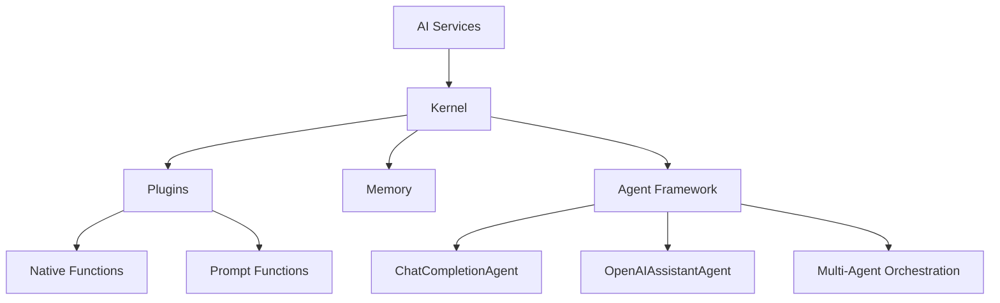
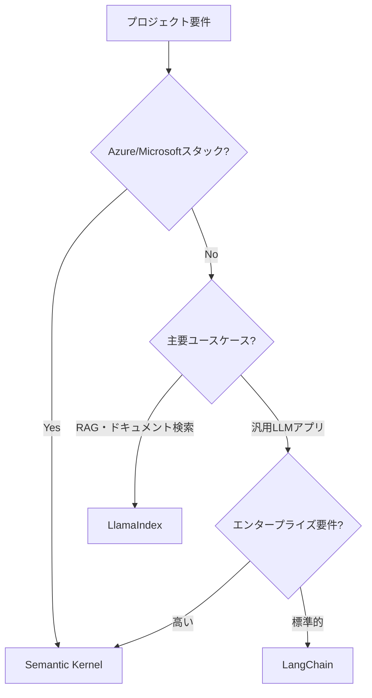

## この記事でわかること

- Semantic Kernel v1.40.0（2026年3月リリース）のアーキテクチャと主要コンポーネント
- PythonでKernel・Plugin・Agent Frameworkを組み合わせたAIエージェントの実装方法
- LangChainやLlamaIndexとの具体的な使い分け基準
- マルチエージェントオーケストレーションの設計パターンと実装例
- 本番運用で必要なテレメトリ・エラーハンドリング・セキュリティ設定

## 対象読者

- **想定読者**: 中級者のPython開発者で、AIエージェント開発に取り組む方
- **必要な前提知識**:
  - Python 3.10以上の非同期処理（async/await）の基本
  - OpenAI APIまたはAzure OpenAI Serviceの利用経験
  - LLM（大規模言語モデル）の基本概念の理解

## 結論・成果

Semantic Kernel v1.40.0を使うことで、**プラグインの追加だけでAIエージェントに外部ツール呼び出し機能を実装**できます。公式ドキュメントのクイックスタートに基づくと、初期セットアップからプラグイン統合済みのチャットエージェント構築まで**約30分**で完了します。さらにAgent Frameworkを活用したマルチエージェント構成では、タスク分担による処理の並列化が可能です。

一方で、Semantic KernelはMicrosoft/Azureエコシステムとの統合に特化しており、LangChainほどコミュニティプラグインが豊富ではない点には注意が必要です。用途によって適切なフレームワークを選択することが重要です。

## Semantic Kernelのアーキテクチャを理解する

Semantic Kernelは、MicrosoftがオープンソースとしてMITライセンスで公開しているAIオーケストレーションSDKです。2026年3月時点でGitHub Starsは27,000を超え、C#・Python・Javaの3言語をサポートしています。

### コアコンポーネントの全体像

Semantic Kernelの設計は、4つの主要レイヤーで構成されています。



| コンポーネント | 役割 | 特徴 |
|---|---|---|
| **Kernel** | 中央オーケストレータ | AIサービス・プラグイン・メモリの統合管理 |
| **Plugins** | 機能拡張 | `@kernel_function`デコレータで定義 |
| **AI Services** | LLM接続 | OpenAI、Azure OpenAI、Anthropic等に対応 |
| **Agent Framework** | エージェント構築 | マルチエージェントオーケストレーション対応 |

**なぜこのアーキテクチャか:** Semantic Kernelの設計思想は「既存コードをAIから呼び出し可能にする」ことです。LangChainがチェーンの構築に焦点を当てているのに対し、Semantic Kernelはプラグインを通じて既存のビジネスロジックをAIエージェントに統合する点で異なります。

### セットアップを実行する

まずはSemantic Kernel Python SDKをインストールしましょう。

```bash
# 基本インストール
pip install semantic-kernel

# 全統合パッケージを含むインストール
pip install semantic-kernel[all]

# 特定のコネクタのみインストール（推奨）
pip install semantic-kernel[azure]
```

**注意点:** `semantic-kernel[all]`はすべてのコネクタ依存関係をインストールするため、**パッケージサイズが大きく**なります。本番環境では必要なコネクタのみを指定することを推奨します。

動作確認用の最小構成を見ていきます。

```python
# setup_kernel.py
import asyncio
from semantic_kernel import Kernel
from semantic_kernel.connectors.ai.open_ai import OpenAIChatCompletion
from semantic_kernel.contents.chat_history import ChatHistory

async def main():
    # Kernelの初期化
    kernel = Kernel()

    # AIサービスの追加（OpenAI）
    chat_service = OpenAIChatCompletion(
        ai_model_id="gpt-4o",
        api_key="your-api-key",  # 環境変数から取得推奨
    )
    kernel.add_service(chat_service)

    # チャット履歴の作成
    history = ChatHistory()
    history.add_user_message("Pythonのasync/awaitの仕組みを簡潔に説明してください")

    # レスポンス取得
    result = await chat_service.get_chat_message_content(
        chat_history=history,
        kernel=kernel,
    )
    print(f"Assistant > {result}")

if __name__ == "__main__":
    asyncio.run(main())
```

このコードは、Kernelの初期化からAIサービスの追加、チャット実行までの最小構成です。環境変数での認証情報管理については後述のセキュリティセクションで説明します。

## プラグインでAIエージェントに機能を追加する

Semantic Kernelの中核機能であるプラグインシステムを使って、AIエージェントに外部ツール呼び出し機能を実装していきましょう。

### ネイティブプラグインを作成する

`@kernel_function`デコレータを使って、Pythonの関数をAIが呼び出せる形式に変換します。

```python
# plugins/weather_plugin.py
from typing import Annotated
from semantic_kernel.functions import kernel_function


class WeatherPlugin:
    """天気情報を取得するプラグイン"""

    @kernel_function(
        name="get_weather",
        description="指定した都市の現在の天気を取得する",
    )
    def get_weather(
        self,
        city: Annotated[str, "天気を調べたい都市名（例: 東京、大阪）"],
    ) -> str:
        """指定した都市の天気情報を返す"""
        # 実際のアプリではWeather APIを呼び出す
        weather_data = {
            "東京": {"temp": 15, "condition": "晴れ", "humidity": 45},
            "大阪": {"temp": 17, "condition": "曇り", "humidity": 55},
            "札幌": {"temp": 5, "condition": "雪", "humidity": 70},
        }
        data = weather_data.get(city)
        if data is None:
            return f"{city}の天気情報は見つかりませんでした"
        return f"{city}: {data['condition']}、気温{data['temp']}°C、湿度{data['humidity']}%"

    @kernel_function(
        name="get_forecast",
        description="指定した都市の3日間の天気予報を取得する",
    )
    def get_forecast(
        self,
        city: Annotated[str, "天気予報を調べたい都市名"],
        days: Annotated[int, "予報日数（1-3）"] = 3,
    ) -> str:
        """指定した都市の天気予報を返す"""
        return f"{city}の{days}日間の予報: 晴れ→曇り→雨（サンプルデータ）"
```

**なぜ`@kernel_function`デコレータか:** このデコレータにより、関数のシグネチャ（引数名、型、description）がLLMに伝わり、モデルが適切なタイミングで関数呼び出しを判断できます。`Annotated`型ヒントでパラメータの説明を付加することで、LLMの呼び出し精度が向上します。

### プラグインをKernelに統合する

作成したプラグインをKernelに登録し、**自動関数呼び出し（Auto Function Calling）** を有効にします。

```python
# agent_with_plugin.py
import asyncio
from semantic_kernel import Kernel
from semantic_kernel.connectors.ai.open_ai import OpenAIChatCompletion
from semantic_kernel.connectors.ai.function_choice_behavior import FunctionChoiceBehavior
from semantic_kernel.connectors.ai.open_ai.prompt_execution_settings.open_ai_prompt_execution_settings import (
    OpenAIChatPromptExecutionSettings,
)
from semantic_kernel.contents.chat_history import ChatHistory

from plugins.weather_plugin import WeatherPlugin


async def main():
    # Kernel初期化
    kernel = Kernel()
    kernel.add_service(OpenAIChatCompletion(
        ai_model_id="gpt-4o",
        api_key="your-api-key",
    ))

    # プラグイン登録
    kernel.add_plugin(WeatherPlugin(), plugin_name="Weather")

    # 自動関数呼び出しを有効化
    settings = OpenAIChatPromptExecutionSettings()
    settings.function_choice_behavior = FunctionChoiceBehavior.Auto()

    # チャットループ
    history = ChatHistory()
    history.add_system_message(
        "あなたは天気情報アシスタントです。ユーザーの質問に日本語で回答してください。"
    )

    chat_service = kernel.get_service(type=OpenAIChatCompletion)

    while True:
        user_input = input("User > ")
        if user_input.lower() == "exit":
            break

        history.add_user_message(user_input)

        result = await chat_service.get_chat_message_content(
            chat_history=history,
            settings=settings,
            kernel=kernel,
        )

        print(f"Assistant > {result}")
        history.add_message(result)


if __name__ == "__main__":
    asyncio.run(main())
```

実行すると、以下のようなやり取りが可能になります。

| ロール | メッセージ |
|---|---|
| User | 東京の天気を教えて |
| Assistant（関数呼び出し） | `Weather.get_weather(city="東京")` |
| Tool結果 | 東京: 晴れ、気温15°C、湿度45% |
| Assistant | 東京の現在の天気は晴れで、気温は15°C、湿度は45%です。 |

`FunctionChoiceBehavior.Auto()`を設定すると、LLMがユーザーの質問内容に基づいて**自動的にプラグインの関数を選択・実行**します。開発者が明示的に関数を呼び出すコードを書く必要はありません。

> **注意**: `FunctionChoiceBehavior.Auto()`は便利ですが、意図しない関数呼び出しが発生する可能性があります。本番環境では`FunctionChoiceBehavior.Auto(filters={"included_plugins": ["Weather"]})`のようにフィルタを設定し、呼び出し可能なプラグインを制限することを推奨します。

### プロンプト関数を活用する

ネイティブ関数に加えて、プロンプトテンプレートも関数として登録できます。

```python
from semantic_kernel.functions import KernelFunctionFromPrompt

# プロンプト関数の作成
summarize_function = KernelFunctionFromPrompt(
    function_name="summarize",
    prompt="""以下のテキストを3行以内で要約してください。

テキスト: {{$input}}

要約:""",
    description="テキストを3行以内に要約する",
)

# Kernelに追加
kernel.add_function(
    plugin_name="TextUtils",
    function=summarize_function,
)
```

プロンプト関数は、LLMへの定型的な指示をカプセル化するのに便利です。ネイティブ関数（Pythonコード）とプロンプト関数（テンプレート）を組み合わせることで、柔軟なエージェント設計が可能になります。

## Agent Frameworkでエージェントを構築する

Semantic Kernel v1.40.0では、Agent FrameworkがRelease Candidate（RC）に到達しました。ここでは、`ChatCompletionAgent`を使った実装を見ていきましょう。

### ChatCompletionAgentの基本

`ChatCompletionAgent`は、チャット完了APIを使ったエージェントの基本実装です。

```python
# basic_agent.py
import asyncio
from semantic_kernel.agents import ChatCompletionAgent
from semantic_kernel.connectors.ai.open_ai import OpenAIChatCompletion
from semantic_kernel.contents.chat_history import ChatHistory

from plugins.weather_plugin import WeatherPlugin


async def main():
    # エージェントの作成（Method 1: コンストラクタでプラグイン指定）
    agent = ChatCompletionAgent(
        service=OpenAIChatCompletion(
            ai_model_id="gpt-4o",
            api_key="your-api-key",
        ),
        name="WeatherAssistant",
        instructions=(
            "あなたは天気情報の専門アシスタントです。"
            "ユーザーの質問に正確に日本語で回答してください。"
            "天気情報が必要な場合はWeatherプラグインを活用してください。"
        ),
        plugins=[WeatherPlugin()],
    )

    # チャット履歴
    history = ChatHistory()

    # エージェントとの対話
    user_input = "今日の東京の天気はどうですか？"
    history.add_user_message(user_input)

    async for message in agent.invoke(history):
        print(f"{message.name} > {message.content}")
        history.add_message(message)


if __name__ == "__main__":
    asyncio.run(main())
```

**なぜ`ChatCompletionAgent`か:** Kernel + プラグインの手動構成と比較して、`ChatCompletionAgent`はエージェントの名前・指示・プラグインを一箇所にまとめて管理できます。特にマルチエージェント構成では、各エージェントの責務を明確に分離できる点が重要です。

### マルチエージェントオーケストレーションを実装する

複数のエージェントを協調させるパターンを実装してみましょう。ここでは、「リサーチエージェント」と「ライティングエージェント」の2つを連携させる例を示します。

```python
# multi_agent.py
import asyncio
from semantic_kernel.agents import ChatCompletionAgent
from semantic_kernel.connectors.ai.open_ai import OpenAIChatCompletion
from semantic_kernel.contents.chat_history import ChatHistory
from semantic_kernel.functions import kernel_function


class ResearchPlugin:
    """リサーチ用のプラグイン"""

    @kernel_function(
        name="search_topic",
        description="指定したトピックについての要約情報を取得する",
    )
    def search_topic(self, topic: str) -> str:
        """トピックに関する要約を返す（実際はWeb APIを使用）"""
        return (
            f"【{topic}の調査結果】"
            f"主要な動向: AI エージェントの本格普及、"
            f"マルチモーダル対応の拡大、"
            f"エンタープライズ向け安全性の強化（サンプルデータ）"
        )


class FormatterPlugin:
    """フォーマット整形用のプラグイン"""

    @kernel_function(
        name="format_report",
        description="テキストを構造化されたレポート形式に整形する",
    )
    def format_report(self, content: str) -> str:
        """レポート形式に整形する"""
        sections = content.split("、")
        formatted = "## 調査レポート\n\n"
        for i, section in enumerate(sections, 1):
            formatted += f"{i}. {section.strip()}\n"
        return formatted


async def main():
    # 共通のAIサービス
    service = OpenAIChatCompletion(
        ai_model_id="gpt-4o",
        api_key="your-api-key",
    )

    # リサーチエージェント
    researcher = ChatCompletionAgent(
        service=service,
        name="Researcher",
        instructions=(
            "あなたはリサーチ専門のエージェントです。"
            "与えられたトピックについて調査し、要点をまとめてください。"
        ),
        plugins=[ResearchPlugin()],
    )

    # ライティングエージェント
    writer = ChatCompletionAgent(
        service=service,
        name="Writer",
        instructions=(
            "あなたはテクニカルライターです。"
            "リサーチ結果を読みやすいレポートに整形してください。"
        ),
        plugins=[FormatterPlugin()],
    )

    # Step 1: リサーチエージェントに調査を依頼
    research_history = ChatHistory()
    research_history.add_user_message(
        "2026年のAIエージェント技術トレンドについて調査してください"
    )

    research_result = ""
    async for message in researcher.invoke(research_history):
        research_result = message.content
        print(f"[Researcher] {message.content}")

    # Step 2: ライティングエージェントにレポート整形を依頼
    writing_history = ChatHistory()
    writing_history.add_user_message(
        f"以下のリサーチ結果をレポートに整形してください:\n\n{research_result}"
    )

    async for message in writer.invoke(writing_history):
        print(f"[Writer] {message.content}")


if __name__ == "__main__":
    asyncio.run(main())
```

この例では手動でエージェント間のメッセージをリレーしていますが、Semantic Kernelのオーケストレーションフレームワーク（`Microsoft.SemanticKernel.Agents.Orchestration`パッケージ）を使えば、エージェント間の通信を自動化できます。

> **注意**: マルチエージェント構成は処理が複雑になるため、最初はシングルエージェント + プラグインの構成で十分な場合がほとんどです。マルチエージェントが必要になるのは、「異なる専門性を持つエージェントが独立して判断を下す必要がある」場合に限定してください。

## エンタープライズ向け設定を実装する

Semantic Kernelが他のフレームワークと差別化されるのが、エンタープライズ向け機能です。テレメトリ、エラーハンドリング、セキュリティ設定を実装していきましょう。

### テレメトリとログを設定する

Semantic Kernelは構造化ログとOpenTelemetryトレーシングをサポートしています。

```python
# enterprise_setup.py
import logging
from semantic_kernel import Kernel
from semantic_kernel.utils.logging import setup_logging

# Semantic Kernelのログ設定
setup_logging()

# カスタムロガーの設定
logger = logging.getLogger("semantic_kernel")
logger.setLevel(logging.DEBUG)

# 構造化ログハンドラ（JSON形式）
handler = logging.StreamHandler()
formatter = logging.Formatter(
    '{"event":"%(name)s","level":"%(levelname)s",'
    '"ts":"%(asctime)s","message":"%(message)s"}'
)
handler.setFormatter(formatter)
logger.addHandler(handler)
```

### フィルタでリクエスト・レスポンスを制御する

Semantic Kernelのフィルタ機能を使うと、プロンプト送信前やレスポンス受信後にカスタム処理を挿入できます。

```python
# filters.py
from semantic_kernel.filters.prompts.prompt_render_context import PromptRenderContext
from semantic_kernel.filters.functions.function_invocation_context import FunctionInvocationContext


async def prompt_filter(context: PromptRenderContext, next_handler):
    """プロンプト送信前のフィルタ"""
    # PII（個人情報）の検出と除去
    rendered_prompt = context.rendered_prompt
    if rendered_prompt and "電話番号" in rendered_prompt:
        logging.warning("プロンプトにPIIが含まれている可能性があります")
    await next_handler(context)


async def function_filter(context: FunctionInvocationContext, next_handler):
    """関数実行前後のフィルタ"""
    function_name = context.function.name
    logging.info(f"関数呼び出し開始: {function_name}")

    await next_handler(context)

    logging.info(f"関数呼び出し完了: {function_name}")


# Kernelにフィルタを登録
kernel = Kernel()
kernel.add_filter("prompt_rendering", prompt_filter)
kernel.add_filter("function_invocation", function_filter)
```

**なぜフィルタが重要か:** 本番環境では、LLMへのプロンプトに個人情報が含まれていないか、関数呼び出しが想定どおりに動作しているかを監視する必要があります。フィルタを使うことで、ビジネスロジックを変更せずに横断的な関心事（セキュリティ、ログ、メトリクス）を追加できます。

### 環境変数によるセキュアな設定

APIキーをコードに直接記載するのは避けましょう。

```python
# config.py
import os
from semantic_kernel import Kernel
from semantic_kernel.connectors.ai.open_ai import AzureChatCompletion


def create_kernel() -> Kernel:
    """環境変数からセキュアにKernelを構築する"""
    kernel = Kernel()

    # Azure OpenAI Service（推奨）
    kernel.add_service(AzureChatCompletion(
        deployment_name=os.environ["AZURE_OPENAI_DEPLOYMENT"],
        api_key=os.environ["AZURE_OPENAI_API_KEY"],
        endpoint=os.environ["AZURE_OPENAI_ENDPOINT"],
    ))

    return kernel
```

```bash
# .env ファイル（.gitignoreに追加すること）
AZURE_OPENAI_DEPLOYMENT=gpt-4o
AZURE_OPENAI_API_KEY=your-api-key-here
AZURE_OPENAI_ENDPOINT=https://your-resource.openai.azure.com/
```

> **ハマりポイント**: Azure OpenAIを使う場合、`endpoint`にはAPIバージョンを含めないでください。SDK内部で自動的にAPIバージョンが付与されます。`https://your-resource.openai.azure.com/`のみを指定します。

## LangChain・LlamaIndexとの使い分けを判断する

フレームワーク選択は、プロジェクトの要件によって大きく変わります。以下の比較表を参考に判断してください。

### フレームワーク比較

| 観点 | Semantic Kernel | LangChain | LlamaIndex |
|---|---|---|---|
| **GitHub Stars（2026年3月）** | 27,000+ | 90,000+ | 30,000+ |
| **主要言語** | C# / Python / Java | Python / JS | Python / TS |
| **得意領域** | エンタープライズ統合 | 汎用LLMアプリ | RAG・ドキュメント検索 |
| **エコシステム** | Microsoft / Azure | コミュニティ主導 | データ連携に特化 |
| **型安全性** | Pydantic v2ベース | 部分的 | 部分的 |
| **Agent Framework** | RC（安定） | LangGraph | エージェント機能あり |
| **MCP対応** | ネイティブサポート | コミュニティ実装 | 一部対応 |
| **テレメトリ** | OpenTelemetry統合 | コールバック方式 | コールバック方式 |

### 選定ガイドライン

実際のプロジェクトでは、以下のフローで判断できます。



**よくある間違い**: 「LangChainが最もスターが多いから最適」と考えがちですが、エンタープライズ環境ではテレメトリ・フィルタ・ガバナンス機能がより重要です。Microsoft/Azureスタックを使用する組織であれば、Semantic Kernelのネイティブ統合による**運用コスト削減**が大きなメリットになります。

**制約条件**: Semantic Kernelはコミュニティプラグインの数がLangChainより少ないため、特殊な外部サービス連携が必要な場合はLangChainの方が対応しやすい場合があります。

## よくある問題と解決方法

| 問題 | 原因 | 解決方法 |
|---|---|---|
| `ImportError: cannot import name 'Kernel'` | semantic-kernelのバージョンが古い | `pip install --upgrade semantic-kernel`で1.40.0以上に更新 |
| 関数呼び出しが実行されない | `FunctionChoiceBehavior`未設定 | `settings.function_choice_behavior = FunctionChoiceBehavior.Auto()`を追加 |
| Azure OpenAI接続エラー | endpointにAPIバージョンが含まれている | endpoint URLからAPIバージョンパラメータを削除 |
| プラグインがエージェントに認識されない | プラグインのdescriptionが未記載 | `@kernel_function`のdescription引数を必ず指定 |
| 非同期実行でエラー | `asyncio.run()`がネストしている | Jupyter Notebookでは`await main()`を直接使用、またはnest_asyncioを導入 |
| MCP接続タイムアウト | MCPサーバーへのネットワーク到達不能 | ファイアウォール設定の確認とtimeout値の調整 |

## まとめと次のステップ

**まとめ:**

- Semantic Kernel v1.40.0は、Microsoft公式のAIオーケストレーションSDKとしてproduction-stableな品質に到達している
- `@kernel_function`デコレータによるプラグインシステムで、既存のPythonコードをAIエージェントから呼び出し可能にできる
- Agent Framework（RC）により、`ChatCompletionAgent`を使ったエージェント構築が標準化されている
- エンタープライズ向け機能（テレメトリ、フィルタ、セキュリティ）がフレームワークレベルで組み込まれている
- LangChain/LlamaIndexとの使い分けは、Azure統合要件とエンタープライズガバナンスの必要性で判断する

**次にやるべきこと:**

1. [公式クイックスタート](https://learn.microsoft.com/en-us/semantic-kernel/get-started/quick-start-guide)でハンズオンを完了する
2. 自社の既存ビジネスロジックをプラグイン化して、AIエージェントから呼び出せるようにする
3. Agent Frameworkのマルチエージェントオーケストレーション（[公式ドキュメント](https://learn.microsoft.com/en-us/semantic-kernel/frameworks/agent/agent-orchestration/)）を試す

## 参考

- [Semantic Kernel 公式ドキュメント（Microsoft Learn）](https://learn.microsoft.com/en-us/semantic-kernel/)
- [Semantic Kernel GitHub リポジトリ](https://github.com/microsoft/semantic-kernel)
- [semantic-kernel PyPI パッケージ（v1.40.0）](https://pypi.org/project/semantic-kernel/)
- [Agent Framework ドキュメント](https://learn.microsoft.com/en-us/semantic-kernel/frameworks/agent/)
- [The Future of Semantic Kernel（Microsoft Foundry Blog）](https://devblogs.microsoft.com/foundry/semantic-kernel-commitment-ai-innovation/)
- [Semantic Kernel in C#: Complete AI Orchestration Guide（2026年2月）](https://www.devleader.ca/2026/02/25/semantic-kernel-in-c-complete-ai-orchestration-guide)

:::message
この記事はAI（Claude Code）により自動生成されました。内容の正確性については複数の情報源で検証していますが、実際の利用時は公式ドキュメントもご確認ください。
:::
