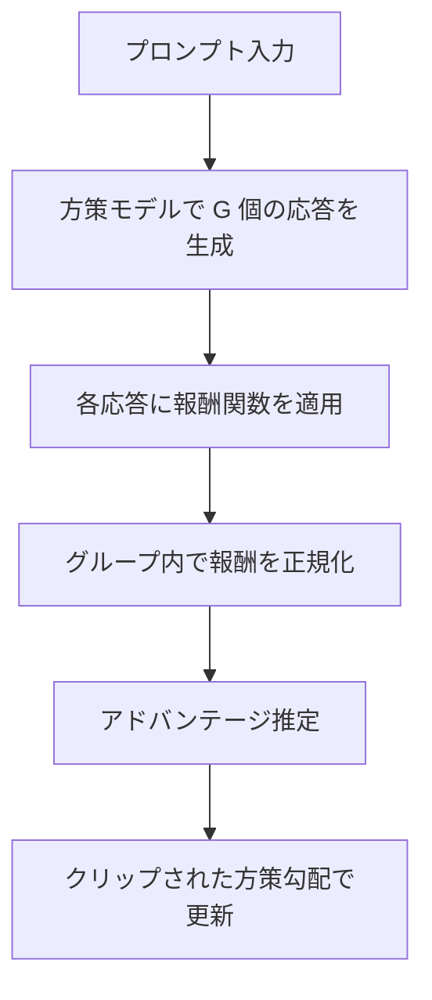
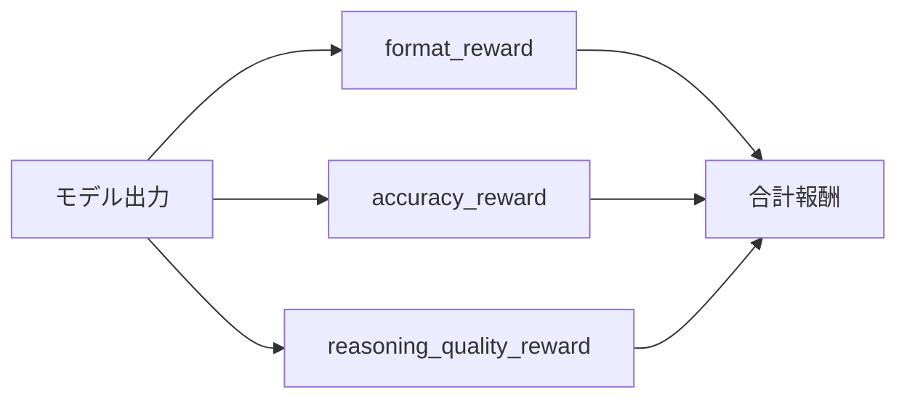

# GRPOとvLLMで構築するドメイン特化小規模推論モデルの強化学習パイプライン

## この記事でわかること

- **GRPO（Group Relative Policy Optimization）** の仕組みとPPOに対する設計上の利点
- **TRL + vLLM** を用いたGRPOトレーニングパイプラインの構築手順
- 医療QA（MedQA）を例にした**ドメイン特化報酬関数**の設計方法
- **0.5B〜3Bパラメータの小規模モデル**でもSFT+GRPOで精度を大幅に向上させる方法
- GRPOトレーニングにおける**典型的な失敗パターン**とその回避策

## 対象読者

- **想定読者**: 中級〜上級のMLエンジニア・LLMファインチューニング実践者
- **必要な前提知識**:
  - Python 3.10+ の基本的な使い方
  - PyTorch / Transformersライブラリの基本操作
  - 強化学習（報酬関数、方策勾配法）の概念的理解
  - SFT（Supervised Fine-Tuning）の実施経験

## 結論・成果

GRPOとvLLMを組み合わせたパイプラインにより、**3Bパラメータモデルの医療QA精度をベースラインの約23%から64%へ向上**させることが報告されています（SFT+GRPOの2段階パイプライン、Chung, 2025）。さらに、MedVLM-R1の研究では**2Bパラメータモデルがわずか600サンプルの学習で、100万サンプル以上で学習した大規模モデルを上回る精度78.22%**を達成しました（Pan et al., 2025）。PPOと比較して**criticモデルが不要**なためVRAM消費を約半分に抑えられ、vLLM統合により推論生成のスループットが向上するため、**単一ノード（4×A100 80GB）でも7Bモデルの学習が実用的な時間で完了**します。

ただし、これらの数値は各研究固有のデータセット・評価条件で報告されたものであり、ドメインやデータ品質によって結果は異なります。

## GRPOの仕組みを理解する

GRPOは2024年にDeepSeekMathの論文（Shao et al., 2024）で提案された強化学習アルゴリズムで、DeepSeek-R1の学習にも採用されています。PPO（Proximal Policy Optimization）の課題であった**criticモデルの計算コスト**を解消するために設計されました。

### PPOとGRPOの構造的な違い

PPOでは方策モデル（policy）と同等サイズのcriticモデルを別途学習する必要がありますが、GRPOでは**グループ内の報酬の相対比較**でアドバンテージを推定します。



具体的には、各プロンプトに対して $G$ 個の応答 $o_1, o_2, \ldots, o_G$ を生成し、それぞれの報酬 $r_i$ から次の式でアドバンテージを計算します。

$$
\hat{A}_{i,t} = \frac{r_i - \text{mean}(\mathbf{r})}{\text{std}(\mathbf{r})}
$$

この「グループ内の相対評価」がGRPOの名前の由来です。criticモデルを使わず、同じプロンプトに対する複数応答の報酬を比較するだけで優劣を判定できます。

### PPOとのリソース比較

| 項目 | PPO | GRPO |
|------|-----|------|
| 必要モデル数 | 方策 + critic + 報酬モデル + 参照モデル | 方策 + 報酬関数 + 参照モデル |
| VRAMオーバーヘッド | criticモデル分（方策と同サイズ） | なし |
| 報酬の基準 | 学習されたvalue function | グループ内の統計量（平均・標準偏差） |
| 実装の複雑さ | GAE計算、critic更新が必要 | シンプル（報酬の正規化のみ） |

**注意点:** GRPOでは各プロンプトに対して $G$ 個の応答を生成するため、生成ステップの計算コストは増加します。$G=8$ が一般的な設定ですが、VRAMとのトレードオフで調整が必要です。

## vLLMを活用したGRPOパイプラインを構築する

GRPOのボトルネックは**推論生成ステップ**です。各学習ステップでプロンプトごとに $G$ 個の応答を生成する必要があるため、通常のTransformers推論では時間がかかります。ここでvLLMの**PagedAttention**による高速推論が効果を発揮します。

### 環境構築

```bash
# Python 3.10+, CUDA 12.1+ を前提（2026年3月時点）
pip install "trl[vllm]>=0.29.0"
pip install "vllm==0.12.0"  # TRL 0.29.0が対応するvLLM最新バージョン
pip install "transformers>=4.56.2"
pip install datasets accelerate
```

> **注意**: TRLは現在vLLM `0.10.2`〜`0.14.1` のみをサポートしています（2026年3月時点）。最新のvLLM（0.17.0）はTRLとの互換性が未確認のため、上記のバージョン範囲で指定してください。最新の対応状況は[TRL vLLMインテグレーションドキュメント](https://huggingface.co/docs/trl/main/en/vllm_integration)を確認してください。

### vLLM統合の2つのモード

TRLは2つのvLLM統合モードを提供しています。

**Serverモード**: vLLMを別プロセスで起動し、HTTP経由で通信します。推論専用GPUを確保できる場合に有効です。

```bash
# ターミナル1: vLLMサーバー起動
trl vllm-serve --model Qwen/Qwen2.5-3B-Instruct

# ターミナル2: トレーニング実行
accelerate launch train_grpo.py
```

**Colocateモード**: vLLMをトレーナープロセス内で起動し、GPUメモリを共有します。GPU数が限られる場合に適しています。

```python
from trl import GRPOConfig

training_args = GRPOConfig(
    output_dir="./grpo_medical_qa",
    learning_rate=5e-6,
    per_device_train_batch_size=4,
    num_train_epochs=3,
    gradient_accumulation_steps=4,
    num_generations=8,          # プロンプトあたりの生成数
    max_completion_length=512,
    temperature=0.7,
    # vLLM設定
    use_vllm=True,
    vllm_mode="colocate",       # GPUメモリ共有モード
    vllm_gpu_memory_utilization=0.7,
    # 学習安定化
    max_grad_norm=0.5,
    warmup_ratio=0.1,
    logging_steps=10,
    save_steps=100,
    bf16=True,
)
```

**なぜcolocateモードを選ぶか:**
- GPU数が4枚以下の場合、serverモードでは推論用に1枚以上を占有されるため学習用GPUが不足する
- colocateモードでは`vllm_gpu_memory_utilization`で推論に割り当てるメモリ割合を制御できる
- ただし、メモリ競合が発生する可能性があるため、`vllm_gpu_memory_utilization`を0.7以下に設定するのが安全

> **注意**: colocateモードではメモリ競合によりOOMが発生しやすくなります。`per_device_train_batch_size`を小さくし、`gradient_accumulation_steps`で補う構成を推奨します。

### データセットの準備

医療QAデータセットは**プロンプト列**を含む形式で用意します。TRLのGRPOTrainerは`prompt`列を自動認識します。

```python
from datasets import Dataset, load_dataset

def prepare_medical_qa_dataset(data_path: str) -> Dataset:
    """医療QAデータセットをGRPOTrainer用に変換する"""
    raw_data = load_dataset("json", data_files=data_path, split="train")

    def format_prompt(example: dict) -> dict:
        """プロンプトをチャットテンプレート形式に変換"""
        system_msg = (
            "あなたは医療の専門家です。"
            "質問に対して、まず<think>タグ内で推論を行い、"
            "その後<answer>タグ内で最終回答を述べてください。"
        )
        user_msg = example["question"]
        prompt = [
            {"role": "system", "content": system_msg},
            {"role": "user", "content": user_msg},
        ]
        return {"prompt": prompt, "ground_truth": example["answer"]}

    return raw_data.map(format_prompt, remove_columns=raw_data.column_names)
```

## ドメイン特化報酬関数を設計する

GRPOの性能は**報酬関数の設計**に大きく依存します。医療QAでは正答判定だけでなく、推論過程の構造化と説明の質も重要です。3つの報酬関数を組み合わせるマルチ報酬アプローチが有効であることが報告されています。

### 報酬関数の全体像



### 1. フォーマット報酬関数

出力が指定した構造（`<think>...</think><answer>...</answer>`）に従っているかを検証します。

```python
import re

def format_reward(completions: list[str], **kwargs) -> list[float]:
    """出力フォーマットの準拠度を報酬として返す"""
    rewards = []
    # <think>...</think> と <answer>...</answer> の存在を検証
    pattern = re.compile(
        r"<think>[\s\S]+?</think>\s*<answer>[\s\S]+?</answer>",
        re.DOTALL,
    )
    for completion in completions:
        if pattern.search(completion):
            rewards.append(1.0)
        else:
            # 部分一致にも小さな報酬を与え、学習の初期段階を安定させる
            if "<think>" in completion and "<answer>" in completion:
                rewards.append(0.3)
            else:
                rewards.append(0.0)
    return rewards
```

### 2. 正解一致報酬関数

医療QAでは選択肢型（A/B/C/D）と自由記述型で異なる評価戦略が必要です。

```python
def accuracy_reward(
    completions: list[str],
    ground_truth: list[str],
    **kwargs,
) -> list[float]:
    """正解との一致度を報酬として返す"""
    rewards = []
    for completion, truth in zip(completions, ground_truth):
        # <answer>タグから回答部分を抽出
        answer_match = re.search(
            r"<answer>([\s\S]+?)</answer>", completion
        )
        if answer_match is None:
            rewards.append(0.0)
            continue

        extracted = answer_match.group(1).strip()
        truth_normalized = truth.strip()

        # 完全一致（選択肢型）
        if extracted.upper() == truth_normalized.upper():
            rewards.append(3.0)
        # 部分一致（自由記述型: 正解キーワードの包含率）
        elif truth_normalized.lower() in extracted.lower():
            rewards.append(1.5)
        else:
            rewards.append(-1.0)  # 誤答にはペナルティ
    return rewards
```

### 3. 推論品質報酬関数

`<think>`タグ内の推論が十分な深さを持っているかを評価します。

```python
def reasoning_quality_reward(
    completions: list[str], **kwargs
) -> list[float]:
    """推論部分の品質を評価する報酬関数"""
    rewards = []
    for completion in completions:
        think_match = re.search(
            r"<think>([\s\S]+?)</think>", completion
        )
        if think_match is None:
            rewards.append(0.0)
            continue

        reasoning = think_match.group(1).strip()
        score = 0.0

        # 推論の長さ（短すぎず長すぎない: 50〜500トークン相当）
        char_count = len(reasoning)
        if 100 <= char_count <= 1000:
            score += 0.5
        elif char_count > 1000:
            score += 0.3  # 冗長な推論には低めの報酬

        # ステップバイステップの構造があるか
        step_indicators = ["まず", "次に", "したがって", "一方", "結論"]
        step_count = sum(
            1 for indicator in step_indicators
            if indicator in reasoning
        )
        score += min(step_count * 0.2, 0.5)

        rewards.append(score)
    return rewards
```

**なぜ3つの報酬を分離するか:**
- 単一の報酬関数だと「正解だがフォーマットが崩れた応答」と「フォーマットは正しいが不正解の応答」を区別できない
- 報酬のスケールが異なる関数を組み合わせることで、学習の安定性が向上する
- TRLのGRPOTrainerは複数報酬関数のリストを受け取り、各報酬の合計を最終報酬とする

> **ハマりポイント:** 報酬関数のスケールが極端に異なると、一方の報酬が支配的になります。accuracy_rewardの最大値が3.0に対してformat_rewardが1.0なので、正解一致を重視する設計になっています。逆にフォーマットを優先したい場合はスケールを調整してください。

## 医療QAでのトレーニングを実行する

### トレーニングスクリプト全体

```python
# train_medical_grpo.py
from datasets import load_dataset
from transformers import AutoModelForCausalLM, AutoTokenizer
from trl import GRPOConfig, GRPOTrainer

def main():
    model_name = "Qwen/Qwen2.5-3B-Instruct"

    # GRPOConfig設定
    training_args = GRPOConfig(
        output_dir="./grpo_medical_qa",
        learning_rate=5e-6,
        per_device_train_batch_size=2,
        num_train_epochs=3,
        gradient_accumulation_steps=8,
        num_generations=8,
        max_completion_length=512,
        max_prompt_length=256,
        temperature=0.7,
        use_vllm=True,
        vllm_mode="colocate",
        vllm_gpu_memory_utilization=0.7,
        max_grad_norm=0.5,
        warmup_ratio=0.1,
        logging_steps=10,
        save_steps=100,
        bf16=True,
        scale_rewards=False,  # 難易度バイアスを回避
        report_to="wandb",
    )

    # データセット準備
    dataset = load_dataset(
        "json",
        data_files="medical_qa_train.jsonl",
        split="train",
    )
    dataset = dataset.map(format_prompt)

    # トレーナー初期化
    trainer = GRPOTrainer(
        model=model_name,
        args=training_args,
        train_dataset=dataset,
        reward_funcs=[
            format_reward,
            accuracy_reward,
            reasoning_quality_reward,
        ],
    )

    # トレーニング実行
    trainer.train()
    trainer.save_model("./grpo_medical_qa_final")


if __name__ == "__main__":
    main()
```

### 実行コマンド

```bash
# 4 GPU環境での実行
accelerate launch --num_processes 4 train_medical_grpo.py

# 単一GPU（Unsloth利用時）
python train_medical_grpo.py
```

### 学習曲線のモニタリング

GRPOトレーニングでは以下のメトリクスを監視します。

| メトリクス | 期待される推移 | 異常の兆候 |
|-----------|-------------|----------|
| `reward/accuracy_reward/mean` | 段階的に上昇 | 急激な低下・振動 |
| `reward/format_reward/mean` | 早期に1.0近くに収束 | 低いまま停滞 |
| `completions/mean_length` | 安定した範囲で推移 | 単調増加（冗長化） |
| `frac_reward_zero_std` | 低く維持 | 1.0に近い（多様性喪失） |

**`frac_reward_zero_std`が高い場合の対処:** すべての生成が同じ報酬を受け取っている状態（全正解または全不正解）です。`temperature`を上げるか、`num_generations`を増やして応答の多様性を確保してください。

## SFT+GRPOの2段階パイプラインで精度を引き上げる

GRPOを単体で適用するよりも、**SFT（Supervised Fine-Tuning）→ GRPO**の2段階パイプラインの方が安定した性能向上が得られることが複数の研究で示されています。

### なぜ2段階が必要か

DeepSeek-R1-Zeroの研究では、SFTなしのRL-onlyトレーニングでも推論能力が獲得されることが示されましたが、以下の課題が指摘されています。

- **出力フォーマットの不安定さ**: 学習初期に出力が壊れやすい
- **収束の遅さ**: SFTで事前に良質な応答パターンを学習させた方が効率的
- **ドメイン知識の不足**: 小規模モデルでは事前学習の知識が限られるため、SFTでドメイン固有の語彙・概念を補強する必要がある

### SFTフェーズの設定

```python
from trl import SFTConfig, SFTTrainer

sft_config = SFTConfig(
    output_dir="./sft_medical_qa",
    learning_rate=2e-5,
    per_device_train_batch_size=4,
    num_train_epochs=3,
    max_length=768,
    bf16=True,
    logging_steps=10,
)

# SFTデータは (question, reasoning, answer) のペア
sft_trainer = SFTTrainer(
    model="Qwen/Qwen2.5-3B-Instruct",
    args=sft_config,
    train_dataset=sft_dataset,
)
sft_trainer.train()
sft_trainer.save_model("./sft_medical_qa_model")
```

### GRPOフェーズでSFTモデルを使用

```python
# SFTで学習済みのモデルをGRPOの初期方策として使用
trainer = GRPOTrainer(
    model="./sft_medical_qa_model",  # SFTモデルのパス
    args=training_args,
    train_dataset=grpo_dataset,
    reward_funcs=[format_reward, accuracy_reward, reasoning_quality_reward],
)
trainer.train()
```

### 精度推移の実例

Matthew Chungのチュートリアル記事で報告されている精度推移を以下に示します（Qwen2.5ベース、医療QAタスク）。

| ステージ | 手法 | 精度（報告値） | 出典 |
|---------|------|-------------|------|
| ベースライン | Qwen2.5-3B-Instruct | 約23% | [Chung (2025)](https://matthewchung74.medium.com/title-training-a-qwen-2-5-model-for-medical-reasoning-with-grpo-a-tutorial-and-aha-moment-c224f63828dc) |
| SFT後 | + SFT on medical-o1-reasoning | 約52% | [Chung (2025)](https://matthewchung74.medium.com/title-training-a-qwen-2-5-model-for-medical-reasoning-with-grpo-a-tutorial-and-aha-moment-c224f63828dc) |
| SFT+GRPO後 | + GRPO with multi-reward | 約64% | [Chung (2025)](https://matthewchung74.medium.com/title-training-a-qwen-2-5-model-for-medical-reasoning-with-grpo-a-tutorial-and-aha-moment-c224f63828dc) |

これらの数値は著者の実験環境・データセットに依存する値であり、再現には同一条件の構築が必要です。なお、出典はブログ記事であり査読済み論文ではない点に留意してください。

> **制約事項**: SFTデータの品質がGRPOの性能上限を規定します。SFTデータに誤った推論パターンが含まれていると、GRPOで修正することは困難です。SFTデータのキュレーション（専門家レビュー）がパイプライン全体の品質を左右します。

## よくある問題と解決方法

GRPOトレーニングで遭遇しやすい問題と対処法をまとめます。

| 問題 | 原因 | 解決方法 |
|------|------|----------|
| OOM（Out of Memory） | `num_generations`が大きすぎる | `num_generations`を4に下げ、`vllm_gpu_memory_utilization`を0.6に下げる |
| 報酬が全く上昇しない | 報酬関数が厳しすぎる | 部分一致や段階的な報酬を導入する |
| 出力が繰り返しになる | temperatureが低すぎる | `temperature`を0.8-1.0に上げる |
| 学習初期に報酬が急降下 | 学習率が高すぎる | `learning_rate`を1e-6に下げ、`warmup_ratio`を0.15に上げる |
| フォーマットが崩れる | format_rewardの重みが低い | SFTフェーズでフォーマットを事前学習させる |
| vLLMサーバーがクラッシュ | GPUメモリ不足 | serverモードで推論専用GPUを確保する |

### Unslothによるメモリ最適化

GPU資源が限られる場合、**Unsloth**を使うことでメモリ使用量を大幅に削減できます。Unslothの公式ドキュメントによると、Llama 3.1 8Bモデル・20Kコンテキスト・8生成の構成で、標準実装（Flash Attention 2使用）の510.8GB VRAMに対し**54.3GB VRAM**（約90%削減）で動作すると報告されています。

```python
from unsloth import FastLanguageModel

model, tokenizer = FastLanguageModel.from_pretrained(
    model_name="Qwen/Qwen2.5-3B-Instruct",
    max_seq_length=1024,
    load_in_4bit=True,  # 4ビット量子化
)

model = FastLanguageModel.get_peft_model(
    model,
    r=16,
    lora_alpha=16,
    target_modules=[
        "q_proj", "k_proj", "v_proj", "o_proj",
        "gate_proj", "up_proj", "down_proj",
    ],
)
```

**トレードオフ:** 4ビット量子化は推論速度と精度のトレードオフがあります。精度への影響は小規模タスクでは軽微（1-2%低下）ですが、複雑な推論タスクではフル精度との差が広がる場合があります。

## まとめと次のステップ

**まとめ:**
- GRPOはcriticモデルが不要なRL手法であり、PPOより少ないリソースで推論能力の強化学習が可能
- TRL + vLLMの統合により、推論生成のボトルネックを解消し、効率的なオンライン学習が実現できる
- 医療QAでは**format + accuracy + reasoning quality**の3軸報酬関数が有効で、SFT→GRPOの2段階パイプラインで23%→64%の精度向上が報告されている
- Unslothを活用すればメモリ使用量を90%削減でき、単一GPUでの学習も実用的になる
- 報酬関数の設計とハイパーパラメータ調整がGRPOの成否を分けるため、段階的な報酬設計と学習曲線のモニタリングが重要

**次にやるべきこと:**
- 自ドメインのQAデータセット（最低500件）を準備し、SFT + GRPOパイプラインを構築してみる
- [TRL GRPOTrainer公式ドキュメント](https://huggingface.co/docs/trl/main/en/grpo_trainer)で最新のConfigパラメータを確認する
- `scale_rewards`（`False` / `"batch"`）、`loss_type`（`"grpo"` / `"dr_grpo"` / `"sapo"`）などのオプションを実験して精度改善を目指す

## 参考

- [DeepSeekMath: Pushing the Limits of Mathematical Reasoning in Open Language Models (arXiv)](https://arxiv.org/abs/2402.03300)
- [DeepSeek-R1: Incentivizing Reasoning Capability in LLMs via Reinforcement Learning (arXiv)](https://arxiv.org/abs/2501.12948)
- [TRL GRPOTrainer公式ドキュメント (Hugging Face)](https://huggingface.co/docs/trl/main/en/grpo_trainer)
- [TRL vLLMインテグレーションドキュメント (Hugging Face)](https://huggingface.co/docs/trl/main/en/vllm_integration)
- [Efficient Online Training with GRPO and vLLM in TRL (Hugging Face Cookbook)](https://huggingface.co/learn/cookbook/en/grpo_vllm_online_training)
- [MedVLM-R1: Incentivizing Medical Reasoning (arXiv)](https://arxiv.org/abs/2502.19634)
- [Training a Qwen 2.5 Model for Medical Reasoning with GRPO (Matthew Chung, 2025)](https://matthewchung74.medium.com/title-training-a-qwen-2-5-model-for-medical-reasoning-with-grpo-a-tutorial-and-aha-moment-c224f63828dc)
- [Unsloth Reinforcement Learning Guide](https://unsloth.ai/docs/get-started/reinforcement-learning-rl-guide)
- [GRPO: Group Relative Policy Optimization Explained (Cameron R. Wolfe)](https://cameronrwolfe.substack.com/p/grpo)
- [vLLM TRL Integration Documentation](https://docs.vllm.ai/en/latest/training/trl/)

## 関連する深掘り記事

この記事で紹介した技術について、さらに深掘りした記事を書きました：

- [論文解説: DeepSeekMath - GRPOアルゴリズムによる数学推論の限界突破](https://0h-n0.github.io/posts/paper-2402-03300/) - arXiv解説
- [論文解説: DeepSeek-R1 - 強化学習によるLLM推論能力の段階的獲得パイプライン](https://0h-n0.github.io/posts/paper-2501-12948/) - arXiv解説
- [論文解説: DAPO - 大規模GRPO学習の4つの失敗パターンとその解決策](https://0h-n0.github.io/posts/paper-2503-12061/) - arXiv解説
- [NVIDIA NeMo-RL: GRPOによるDeepScaleRレシピの再現と大規模RL学習基盤](https://0h-n0.github.io/posts/techblog-nemo-rl-grpo-deepscaler/) - tech_blog解説
- [EMNLP 2025論文解説: GRPO-LEAD - 難易度考慮型GRPOによる簡潔な数学推論](https://0h-n0.github.io/posts/conf-grpo-lead-emnlp2025/) - conference解説

:::message
これらの記事は修士学生レベルを想定した技術的詳細（数式・実装の深掘り）を含みます。
:::

---

:::message
この記事はAI（Claude Code）により自動生成されました。内容の正確性については複数の情報源で検証していますが、実際の利用時は公式ドキュメントもご確認ください。
:::
