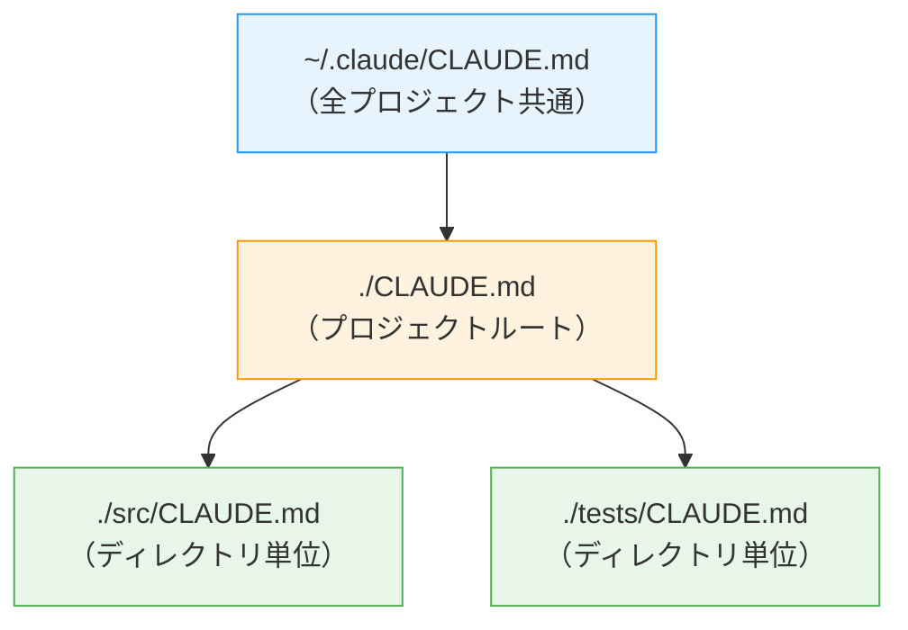

# CLAUDE.md最適化の最前線：開発者が実践する5つのプロンプト設計戦略

## この記事でわかること

- CLAUDE.mdの最適な構造と「書くべきこと・書かないこと」の判断基準
- コンテキストウィンドウを60%節約する具体的なファイル設計テクニック
- 検証ループ・Hooks・Plan Modeを組み合わせた実践ワークフロー
- worktree並列実行で生産性を向上させるセッション管理の方法
- サブエージェント・スキル・プラグインの使い分けと設定例

## 対象読者

- **想定読者**: Claude Codeを日常的に使用する中級〜上級の開発者
- **必要な前提知識**:
  - Claude Code CLI の基本操作（`claude` コマンド、`/` スラッシュコマンド）
  - Git の基本操作（ブランチ、コミット、worktree の概念）
  - ターミナル操作の基礎

## 結論・成果

Claude Code開発者のBoris Chernyが2026年1〜2月に公開したワークフローによると、CLAUDE.mdの最適化とワークフロー設計を組み合わせることで、以下の成果が報告されています。

- **コンテキスト使用量60%削減**: 300行のCLAUDE.mdを60行に圧縮（Arize AIの分析による）
- **コード品質2〜3倍向上**: 検証ループの導入による（Boris Cherny本人の報告）
- **リポジトリ特化の最適化で+10.87%の精度改善**: 汎用ルール（+5.19%）との差（Arize AIの実験結果）

ただし、これらの数値はそれぞれの環境・プロジェクト規模に依存するため、自身のプロジェクトで効果を計測しながら適用することを推奨します。

## CLAUDE.mdの構造を最適化する

Claude Codeは会話開始時にCLAUDE.mdファイルを自動的にコンテキストへ読み込みます。このファイルはすべてのセッションで消費されるため、**記述量がそのままコンテキストコストに直結**します。

### 書くべきこと・書かないことを判断する

Anthropicの公式ドキュメントでは、CLAUDE.mdに含めるべき内容と除外すべき内容が以下のように整理されています。

| 含めるべき内容 | 除外すべき内容 |
|------|------|
| Claudeが推測できないBashコマンド | コードを読めばわかること |
| デフォルトと異なるコードスタイル | 言語の標準規約 |
| テスト実行方法・テストランナー | 詳細なAPIドキュメント（リンクで代替） |
| ブランチ命名・PR規約 | 頻繁に変更される情報 |
| プロジェクト固有のアーキテクチャ決定 | 長い説明やチュートリアル |
| 開発環境の癖（必須の環境変数など） | ファイルごとのコードベース解説 |
| 非自明な動作・よくあるハマりポイント | 「クリーンなコードを書く」などの自明な指示 |

判断基準はシンプルです。各行について**「この行を削除したらClaudeがミスをするか？」**と自問し、答えがNoなら削除します。

### コンテキストコストを意識した設計にする

HumanLayer社の分析によると、フロンティアLLMが確実に従える命令数は**約150〜200個**とされています。Claude Codeのシステムプロンプトがすでに約50個の命令を消費しているため、CLAUDE.mdに割り当てられる実効的な命令数は100〜150個程度です。

```markdown
# CLAUDE.md の良い例（60行以下）

# コードスタイル
- ES Modules（import/export）を使用、CommonJS（require）は禁止
- インポートは可能な限りdestructureする

# ワークフロー
- コード変更後は必ずtypecheckを実行
- テストは全体スイートではなく単体テストを優先（パフォーマンスのため）

# テスト
- `uv run pytest -q` でPythonテスト実行
- `pnpm test` でTypeScriptテスト実行

# Git
- ブランチ名: feature/<issue-number>-<short-description>
- コミットメッセージ: Conventional Commits形式
```

**よくある間違い**: CLAUDE.mdをプロジェクトの全情報を集約した「百科事典」にしてしまうケースがあります。Anthropic内部のチームが使用しているCLAUDE.mdは約2.5kトークン（Boris Chernyの報告による）で、これは概ね60〜80行程度に相当します。300行のCLAUDE.mdは約4,500トークンを消費し、最適化後の1,800トークンと比較して60%のコンテキストを浪費していたとArize AIの分析で報告されています。

### ポインタを活用し、コピーを避ける

CLAUDE.mdにコードスニペットや詳細なドキュメントを直接記述すると、内容が古くなるリスクがあります。代わりに**ファイルパスへの参照（ポインタ）**を使います。

```markdown
# CLAUDE.md でのポインタ活用例

プロジェクト概要は @README.md を参照。
利用可能なnpmコマンドは @package.json を参照。

# 追加ガイドライン
- Gitワークフロー: @docs/git-instructions.md
- API設計規約: @docs/api-conventions.md
```

CLAUDE.mdは `@path/to/file` 構文でファイルをインポートできます。これにより、CLAUDE.md自体は短く保ちつつ、必要な詳細情報への導線を確保できます。

### モジュール化と配置戦略を設計する

CLAUDE.mdは複数の場所に配置でき、スコープに応じて自動的に読み込まれます。



- **ホームディレクトリ（`~/.claude/CLAUDE.md`）**: 全セッション共通の個人設定
- **プロジェクトルート（`./CLAUDE.md`）**: Gitにチェックインしてチーム共有
- **子ディレクトリ**: 該当ディレクトリで作業時に自動読み込み

**制約条件**: 子ディレクトリのCLAUDE.mdはClaudeがそのディレクトリ内のファイルを操作する場合にのみ読み込まれるため、常時必要な情報はルートに配置してください。

さらに、`.claude/rules/` ディレクトリにルールファイルを配置することで、コンテキストに応じたモジュール式の指示分割が可能です。SFEIR Instituteの分析では、この3層構造（CLAUDE.md + rules + MEMORY.md自動メモリ）によりハルシネーションが40%削減されると報告されています。

## 検証ループで品質を担保する

Anthropic公式ドキュメントでは、**検証手段の提供が「最もレバレッジの高い単一の行動」**と位置づけられています。

### 検証ファーストの設計原則を理解する

検証がない場合、Claudeは「もっともらしく見えるがエッジケースを処理しない実装」を生成するリスクがあります。これは公式ドキュメントで**"trust-then-verify gap"（信頼→検証のギャップ）**と呼ばれるパターンです。

| 戦略 | 検証なし（Before） | 検証あり（After） |
|------|------|------|
| **機能実装** | 「メールバリデーション関数を実装して」 | 「validateEmail関数を実装して。テストケース: user@example.comはtrue、invalidはfalse、user@.comはfalse。実装後にテストを実行して」 |
| **UI変更** | 「ダッシュボードを改善して」 | 「（スクリーンショット貼付）このデザインを実装して。結果のスクリーンショットを撮って元と比較し、差分をリストアップして修正して」 |
| **バグ修正** | 「ビルドが失敗してる」 | 「このエラーでビルドが失敗する:（エラー貼付）。修正してビルド成功を確認して。エラーの抑制ではなく根本原因に対処して」 |

### 検証パターンを使い分ける

検証はテストスイートだけではありません。プロジェクトの性質に応じて適切な手段を選択します。

```python
# 検証パターンの分類

# パターン1: テストスイート（バックエンド・ライブラリ）
# → テスト実行後にClaudeが結果を確認
# 例: "テストを書いて実行し、全パスするまで修正して"

# パターン2: Bashコマンド（インフラ・スクリプト）
# → コマンド出力で動作確認
# 例: "curl でAPIエンドポイントを叩いて期待する応答を確認して"

# パターン3: ブラウザテスト（フロントエンド）
# → Claude Chrome拡張機能でUI自動テスト
# 例: "ブラウザでページを開いてスクリーンショットを撮って"

# パターン4: 型チェック（TypeScript）
# → tscの出力で型安全性を確認
# 例: "実装後にtypecheckを実行して型エラーがないことを確認"
```

**トレードオフ**: 検証ループを追加するとセッションあたりのトークン消費量は増加します。しかし、検証なしで生成した実装を手動で修正する工数と比較すると、Boris Chernyの報告では検証ありのほうが最終的なスループットで2〜3倍の改善が確認されています。

### サブエージェントで検証を分離する

実装と検証を同一セッションで行うと、コンテキストが実装コードで埋まり、検証の品質が下がる場合があります。サブエージェントを使って検証を別コンテキストに分離する方法が公式に推奨されています。

```markdown
# .claude/agents/code-reviewer.md

---
name: code-reviewer
description: コードのエッジケースとセキュリティをレビュー
tools: Read, Grep, Glob, Bash
model: opus
---

あなたはシニアセキュリティエンジニアです。以下の観点でコードをレビューしてください:
- インジェクション脆弱性（SQL、XSS、コマンドインジェクション）
- 認証・認可の不備
- コード内のシークレットや認証情報
- 安全でないデータ処理

具体的な行番号と修正案を提示してください。
```

実装後に `"サブエージェントを使ってこのコードのエッジケースをレビューして"` と指示すれば、メインセッションのコンテキストを消費せずにレビューが実行されます。

## Plan Modeとworktree並列実行を組み合わせる

### Plan Mode → 実装の2段階ワークフローを採用する

公式ドキュメントは、タスクの実行を**探索→計画→実装→コミット**の4フェーズに分けることを推奨しています。


```bash
# Phase 1: 探索（Plan Mode）
# Shift+Tab×2 でPlan Modeに入る
# "src/auth を読んでセッションとログインの処理方法を理解して"

# Phase 2: 計画（Plan Mode）
# "Google OAuthを追加したい。変更すべきファイルとセッションフローは？計画を作って"
# Ctrl+G で計画をエディタで直接編集可能

# Phase 3: 実装（Normal Mode）
# "計画に従ってOAuthフローを実装して。コールバックハンドラのテストを書いて
#  テストスイートを実行し、失敗を修正して"

# Phase 4: コミット
# "説明的なメッセージでコミットしてPRを作成して"
```

**注意点**: Plan Modeにはオーバーヘッドがあります。タイポ修正やログ行追加のような小さなタスクでは、計画を省略して直接実行するほうが効率的です。Boris Chernyは「計画が重要なのは、アプローチに不確実性がある場合、変更が複数ファイルにまたがる場合、または変更対象のコードに不慣れな場合」としています。

### worktreeで並列セッションを管理する

Boris Chernyは**3〜5本のworktreeを同時に起動し、それぞれでClaudeセッションを並列実行する**ことを「最大の生産性向上策」と述べています。

```bash
# worktreeの作成と並列セッション起動
git worktree add ../worktrees/feature-auth -b feature/auth
git worktree add ../worktrees/fix-perf -b fix/performance
git worktree add ../worktrees/refactor-db -b refactor/database

# 各worktreeで別々のClaudeセッションを起動
# ターミナルタブ1: cd ../worktrees/feature-auth && claude
# ターミナルタブ2: cd ../worktrees/fix-perf && claude
# ターミナルタブ3: cd ../worktrees/refactor-db && claude
```

**ハマりポイント**: Boris Chernyの報告によると、並列セッションの10〜20%は途中で方針が合わなくなり破棄されます。これは正常な運用であり、失敗したセッションは `/clear` して再スタートするか、worktreeごと削除します。

### Writer/Reviewerパターンで品質を向上させる

並列セッションを活かした品質向上パターンとして、**実装と検証を別セッションに分離**する方法があります。

| セッションA（Writer） | セッションB（Reviewer） |
|------|------|
| 「APIエンドポイントにレート制限を実装して」 | — |
| — | 「`@src/middleware/rateLimiter.ts` のレート制限実装をレビューして。エッジケース、レースコンディション、既存ミドルウェアパターンとの整合性を確認して」 |
| 「レビューフィードバック:（セッションBの出力）。これらの指摘に対応して」 | — |

Claudeは自分が書いたコードに対してバイアスを持つ可能性があるため、新しいコンテキスト（別セッション）からレビューすることで客観性が向上します。

## Hooks・Skills・プラグインで自動化する

### Hooksで「例外なく実行すべき処理」を保証する

CLAUDE.mdの指示は**アドバイザリ**（助言的）であり、Claudeが従わない可能性があります。一方、Hooksは**確定的**に実行されるため、「毎回必ず実行すべき処理」にはHooksを使います。

```json
// .claude/settings.json でのHook設定例

{
  "hooks": {
    "PostToolUse": [
      {
        "matcher": "Write|Edit",
        "hooks": [
          {
            "type": "command",
            "command": "bun run format || true"
          }
        ]
      }
    ]
  }
}
```

Boris Chernyのチームでは、**PostToolUseフックでコード自動フォーマット**を実行しています。これにより、Claudeが生成したコードが自動的にプロジェクトのフォーマット規約に準拠し、CI失敗を防止します。

Hooksには3種類あります。

| フック種別 | 動作 | 使用例 |
|------|------|------|
| **command** | シェルコマンドを実行 | `bun run format`、`eslint --fix` |
| **prompt** | LLMに単一の判断を依頼 | コミットメッセージの品質チェック |
| **agent** | サブエージェントを起動して検証 | セキュリティ脆弱性の自動スキャン |

**制約条件**: commandフックはClaudeの操作をブロックするため、重い処理（テストスイート全体の実行など）は避け、軽量な検証に限定してください。agentフックはデフォルト60秒のタイムアウトで動作します。

### Skillsでドメイン知識を切り出す

CLAUDE.mdにすべての情報を詰め込む代わりに、**ドメイン固有の知識やワークフローはSkillsに分離**します。Skillsは必要な時だけ読み込まれるため、コンテキストを節約できます。

```markdown
# .claude/skills/fix-issue/SKILL.md

---
name: fix-issue
description: GitHubイシューの修正ワークフロー
disable-model-invocation: true
---

GitHubイシュー $ARGUMENTS を分析し修正する。

1. `gh issue view` でイシューの詳細を取得
2. 問題を理解し、関連ファイルを検索
3. 修正を実装
4. テストを書いて実行し、修正を検証
5. lint・型チェックを通過させる
6. 説明的なコミットメッセージを作成
7. pushしてPRを作成
```

`/fix-issue 1234` で呼び出せます。`disable-model-invocation: true` を設定すると、副作用のあるワークフローが手動トリガーのみに制限されます。

Boris Chernyは**「毎日複数回行う操作はスキルまたはスラッシュコマンドに変換せよ」**と述べています。

### プラグインとMCPで外部ツールを統合する

2026年のClaude Codeは、プラグインマーケットプレイスを通じてLSP（Language Server Protocol）、MCPサーバー、スキル、エージェントをインストールできます。

```bash
# プラグインのインストール
# /plugin でマーケットプレイスを参照

# MCP接続の例
claude mcp add notion  # Notionとの統合
claude mcp add figma   # Figmaデザインの参照
claude mcp add slack   # Slackスレッドの検索・投稿
```

Boris Chernyのチームでは以下のツールを統合しています。

- **Slack MCP**: バグ報告スレッドを直接貼り付けて「修正して」と指示
- **BigQuery CLI**: データクエリを自然言語で実行（「SQLは6ヶ月以上書いていない」とBoris Chernyは報告）
- **コードインテリジェンスプラグイン**: 型付き言語のシンボルナビゲーションと編集後の自動エラー検出

**トレードオフ**: MCP接続を増やすとClaude Codeの起動時間とコンテキスト消費が増加します。実際に日常的に使うツールのみ接続し、一時的な利用は手動でCLIツールを直接指示するほうが効率的です。

## コンテキスト管理とセッション運用を最適化する

### アンチパターンを回避する

公式ドキュメントでは、以下の5つの失敗パターンが明示されています。

| アンチパターン | 症状 | 対処法 |
|------|------|------|
| **キッチンシンク・セッション** | 無関係なタスクが混在し、コンテキストが無関係な情報で溢れる | タスク間で `/clear` を実行 |
| **繰り返し修正** | 同じミスを2回以上修正し、失敗アプローチでコンテキストが汚染される | 2回修正して改善しなければ `/clear` して最初から再プロンプト |
| **過剰なCLAUDE.md** | 指示が多すぎてClaudeが重要なルールを無視する | 削除しても問題ないルールは削除、Hooksに変換 |
| **trust-then-verifyギャップ** | もっともらしい実装がエッジケースを処理しない | 検証手段（テスト・スクリプト・スクリーンショット）を常に提供 |
| **無限探索** | スコープなしの調査でClaudeが大量のファイルを読み込む | 調査範囲を限定するか、サブエージェントに委譲 |

### `/clear` と `/compact` を使い分ける

```bash
# /clear: コンテキストを完全リセット
# → 無関係なタスクに切り替える時
# → 2回修正しても改善しない時

# /compact <指示>: 重要情報を保持しつつコンテキストを圧縮
# → 長いセッションで作業を継続したい時
# 例: /compact APIの変更に集中して

# /rewind: 特定のチェックポイントまで巻き戻し
# → 実装が間違った方向に進んだ時
# → Esc×2 でも同じメニューを開ける
```

CLAUDE.mdにコンパクション時の保持ルールを記述することも可能です。

```markdown
# CLAUDE.md に追加

# コンテキストコンパクション時のルール
コンパクション実行時は、変更したファイルの完全なリストと
テストコマンドを必ず保持すること
```

### セッションの命名と再開を活用する

```bash
# セッションに名前を付ける
# /rename oauth-migration

# 前回のセッションを再開
claude --continue       # 最新セッションの継続
claude --resume         # セッション一覧から選択

# ヘッドレスモードでCI/CD統合
claude -p "このプロジェクトの説明を出力して" --output-format json
```

セッションをブランチのように扱い、異なるワークストリームに対して個別のコンテキストを維持できます。

## よくある問題と解決方法

| 問題 | 原因 | 解決方法 |
|------|------|------|
| CLAUDE.mdの指示をClaudeが無視する | ファイルが長すぎて重要なルールが埋もれている | 60行以下に圧縮。重要度の高いルールに `IMPORTANT` を付与 |
| Plan Modeで計画が発散する | スコープが曖昧 | 「変更するファイルは最大3つ」など制約を明示 |
| 並列セッションでGitコンフリクト | 同一ブランチで複数セッションが作業 | worktreeで各セッションを別ブランチに分離 |
| Hooksがタイムアウトする | 重い処理をHookに設定 | Hookは軽量処理のみ。重い検証はサブエージェントで実行 |
| コンテキストが頻繁に圧縮される | 大量のファイル読み込みやコマンド出力 | サブエージェントに調査を委譲し、メインコンテキストを保護 |

## まとめと次のステップ

**まとめ:**

- CLAUDE.mdは **60行以下・アクション可能な指示のみ** に絞り、ポインタ（`@file` 参照）で詳細を補完する
- **検証ループ**（テスト・スクリーンショット・Bash検証）が品質向上の最大レバレッジポイントであり、Anthropic公式も最重要事項として推奨している
- **Plan Mode → 実装**の2段階ワークフローで手戻りを削減し、**worktree並列**で生産性を向上させる
- **Hooks**で確定的な自動化を保証し、**Skills**でドメイン知識をモジュール化する
- アンチパターン（キッチンシンク・セッション、過剰なCLAUDE.md等）を意識的に回避する

**次にやるべきこと:**

1. 自分のプロジェクトのCLAUDE.mdを見直し、各行が「削除するとClaudeがミスをするか」テストで精査する
2. `/hooks` でPostToolUseフック（フォーマッター実行）を設定し、CI失敗を自動防止する
3. 日常的に繰り返す操作を1つ選び、`.claude/skills/` にスキルとして切り出す

**関連記事:**

- [Claude Codeプロンプト管理術：コーディング精度を10%向上させる実践ガイド](https://zenn.dev/0h_n0/articles/21f1740dc0ddd9)
- [Claude Codeスキル作成完全ガイド：Production-Ready実装の7原則](https://zenn.dev/0h_n0/articles/a32342e48355ae)

## 参考

- [Best Practices for Claude Code - Anthropic公式ドキュメント](https://code.claude.com/docs/en/best-practices)
- [How Boris Uses Claude Code - Boris Chernyのワークフロー集約](https://howborisusesclaudecode.com/)
- [Inside the Development Workflow of Claude Code's Creator - InfoQ](https://www.infoq.com/news/2026/01/claude-code-creator-workflow/)
- [CLAUDE.md Best Practices Learned from Optimizing Claude Code with Prompt Learning - Arize AI](https://arize.com/blog/claude-md-best-practices-learned-from-optimizing-claude-code-with-prompt-learning/)
- [Writing a good CLAUDE.md - HumanLayer](https://www.humanlayer.dev/blog/writing-a-good-claude-md)
- [Automate workflows with hooks - Claude Code公式ドキュメント](https://code.claude.com/docs/en/hooks-guide)
- [Using CLAUDE.MD files: Customizing Claude Code for your codebase - Anthropic公式ブログ](https://claude.com/blog/using-claude-md-files)

---

:::message
この記事はAI（Claude Code）により自動生成されました。内容の正確性については複数の情報源で検証していますが、実際の利用時は公式ドキュメントもご確認ください。
:::
