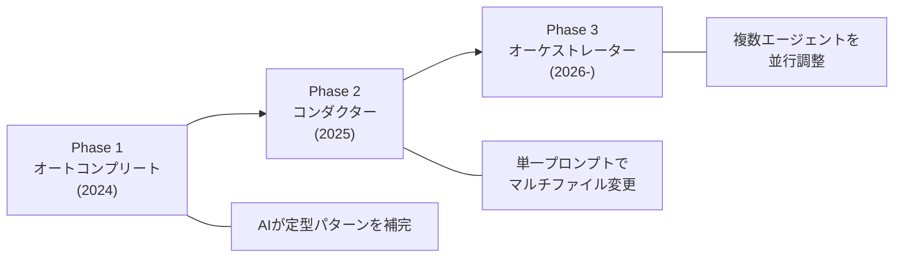
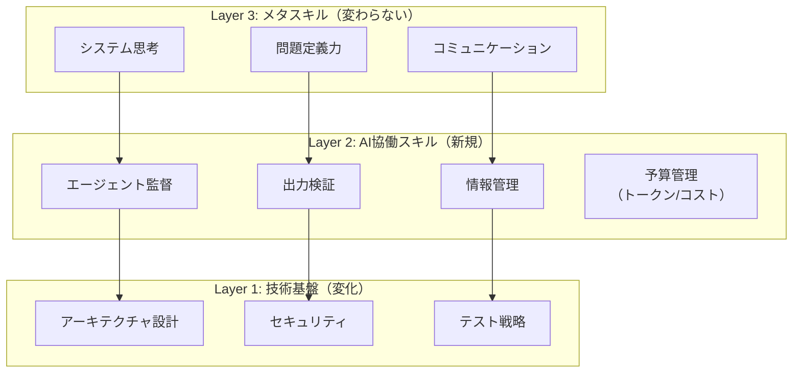

# SWEの未来予測2026-2029——AIエージェント時代にエンジニアが身につけるべきスキルと働き方

## この記事でわかること

- 2026年現在のAIコーディングツール普及状況と、エンジニアの働き方に起きている変化の実態
- SWE（Software Engineer）の役割が「コーダー」から「オーケストレーター」へ変わる3段階の移行プロセス
- 2027-2029年に求められる具体的なスキルセットと、従来スキルとの違い
- AIツール導入の生産性パラドックス（経験者が19%遅くなるケースとその対策）
- エントリーレベルから上級者まで、キャリアステージ別の生き残り戦略

## 対象読者

- **想定読者**: 中級者〜上級者のソフトウェアエンジニア、テックリード、エンジニアリングマネージャー
- **必要な前提知識**:
  - ソフトウェア開発プロセスの基本理解（アジャイル、CI/CDなど）
  - LLM（Large Language Model）やAIコーディングツール（GitHub Copilot、Claude Code等）の存在認知
  - 日常的なプログラミング経験（言語は問わない）

## 結論・成果

2026年現在、開発者の**84%がAIツールを使用または計画中**（Stack Overflow 2025年調査）であり、コードの**46%がAI生成**（GitHub統計）という状況です。Anthropicの2026 Agentic Coding Trends Reportによると、開発サイクルは**30-79%高速化**され、Rakutenは24日かかっていた開発を5日に短縮しています。

一方で、METRの2025年のランダム化比較試験では、**経験豊富なOSS開発者がAIツール使用時に19%遅くなる**という結果も報告されています。Gartnerは2027年までに**80%のエンジニアがアップスキルを必要とする**と予測しており、AIとの協働スキルが今後のキャリアを左右する分岐点にあります。

本記事では、Malleable Softwareの概念（[関連記事: Malleable Softwareとは何か——LLM時代の動的ソフトウェアとその実現要件](https://zenn.dev/0h_n0/articles/c0712fa2cd13b2)）を前提に、エンジニア個人の視点から**今後2-3年で何がどう変わり、何を準備すべきか**を整理します。

## SWEの役割変化を理解する——コーダーからオーケストレーターへ

エンジニアの役割は、2024年から2028年にかけて3段階で変化しつつあります。Nicholas Zakas（Human Who Codes）の分析によると、この変化は「オートコンプリート → コンダクター → オーケストレーター」というフェーズで進行しています。

### 3段階の移行プロセス



**Phase 1: オートコンプリート（2024年）**

GitHub Copilotに代表される「AIが退屈で一般的なパターンを記述する」段階です。開発者は従来の作業フローを維持しつつ、部分的にAI補完を活用します。

**Phase 2: コンダクター（2025年）**

Cursor、Claude Codeなどのツールにより、「単一プロンプトから複雑なマルチファイルソリューションを作成」できるようになった段階です。エンジニアが**指示して検証する**役割に変わり始めます。

**Phase 3: オーケストレーター（2026年〜）**

複数のエージェント間で作業を調整し、後で結果を組み合わせる段階です。クラウドベースのエージェントが自律的に実行し、エンジニアは**設計・監督・統合**に集中します。

Anthropicの2026 Agentic Coding Trends Reportでは、エンジニアが作業の約60%にAIを統合しているものの、タスクの完全委任は0-20%に留まっていると報告されています。つまり、現時点ではPhase 2からPhase 3への移行期にあります。

### 「何をするか」が変わる——タスク委任の実態

Anthropicのレポートによると、AIコーディングツールの用途が急速に広がっています。

| タスク種類 | 6ヶ月前の使用率 | 現在の使用率 | 変化 |
|-----------|:-------------:|:----------:|:----:|
| コード設計・計画 | 1% | 10% | +9pt |
| 新機能実装 | 14% | 37% | +23pt |
| 従来やらなかったタスク | — | 27% | — |

注目すべきは**「従来やらなかったタスク」が27%**を占めている点です。Nice-to-haveだったツール整備や技術的負債の解消が、AIの助けにより実行可能になっています。

**注意点:**

> この変化はすべてのエンジニアに均一に起きているわけではありません。Anthropicのレポートでは、委任タスクの80-100%で積極的な監視を維持していると報告されており、**「丸投げ」ではなく「監督付き委任」**が現状です。

## 生産性パラドックスを正しく把握する

「AIツールで生産性が上がる」という直感的な期待に対し、実測データは複雑な結果を示しています。

### METRの衝撃的な研究結果

2025年7月、AIモデル評価機関METRが実施したランダム化比較試験の結果は、多くの開発者を驚かせました。

- **対象者**: 大規模OSSリポジトリ（平均22,000+スター、100万+行）の経験豊富な開発者16名
- **方法**: 246の実際のIssue（バグ修正、機能追加、リファクタリング）をAI使用/不使用にランダム割り当て
- **結果**: AIツール使用時に**19%遅くなった**
- **知覚のギャップ**: 開発者自身は「24%速くなった」と予測し、使用後も「20%速くなった」と感じていた

```python
# METRの研究結果を数値で整理
metr_study = {
    "participants": 16,
    "issues_evaluated": 246,
    "repo_avg_stars": 22_000,
    "repo_avg_lines": 1_000_000,
    # 実測結果
    "actual_speed_change": -0.19,      # 19%遅くなった
    "predicted_speed_change": +0.24,   # 24%速くなると予測
    "perceived_speed_change": +0.20,   # 20%速くなったと知覚
    # AI出力の品質
    "generation_acceptance_rate": 0.44, # 44%しか受け入れられなかった
}
```

**なぜ遅くなるのか:**

- AI生成コードの受け入れ率が**44%未満**——レビュー・テスト・修正の結果、半数以上を却下
- AI出力の確認に伴う**追加の認知負荷とコンテキストスイッチ**
- 大規模OSSリポジトリの複雑なコンテキストをAIが十分に理解できない

### 生産性が上がるケース vs 下がるケース

一方で、組織レベルでは大幅な生産性向上も報告されています。この矛盾を整理してみましょう。

| 条件 | 生産性への影響 | 出典 |
|------|:------------:|------|
| 大規模OSSの熟練開発者 | -19% | METR 2025年RCT |
| GitHub Copilot利用者のPRサイクル | 75%短縮（9.6日→2.4日） | GitHub統計 |
| Rakutenの開発サイクル | 79%短縮（24日→5日） | Anthropic 2026レポート |
| TELUSの全社展開 | 50万時間の時間節約 | Anthropic 2026レポート |

**なぜこの差が生まれるか:**

1. **タスクの性質**: 定型的な実装タスクではAIの効果が高く、複雑な設計判断が必要なタスクでは効果が限定的
2. **コードベースの成熟度**: 大規模で歴史のあるOSSリポジトリでは、AIがコンテキストを把握しきれない
3. **測定指標の違い**: PR速度とエンドツーエンドのスループットでは結果が異なる
4. **組織の準備度**: AIワークフローが組織に統合されている場合、個人利用より効果が高い

Gartnerの分析でも、「AIの生産性向上効果は、**成熟したエンジニアリングプラクティスを持つ組織のシニア開発者**で最も顕著」と指摘されています。

**ハマりポイント:**

> 「AIツールを導入すれば自動的に生産性が上がる」という前提は危険です。GitHub Copilotの縦断研究（arXiv:2509.20353）では、Copilot導入後もコミットベースの活動量に**統計的に有意な変化は見られなかった**と報告されています。ツール導入と並行して、ワークフロー自体の再設計が必要です。

## 2027-2029年に求められるスキルセットを整理する

Gartnerは2027年までにエンジニアの80%がアップスキルを必要とすると予測しています。では、具体的にどのようなスキルが求められるのでしょうか。

### スキルの3層構造

Nicholas Zakasの分析とGartnerの予測を統合すると、今後求められるスキルは3層に整理できます。



### Layer 1: 技術基盤（重要度が上がるもの）

従来のプログラミング能力に加え、以下のスキルの重要度が上がります。

**アーキテクチャ設計**

AIがコードを大量に生成できるようになった結果、**どう作るか**より**何をどう組み合わせるか**の判断力が重要になります。Anthropicのレポートでは、マルチエージェントアーキテクチャが「オーケストレーターが専門エージェントを並列調整し、結果を統合する」パターンとして定着しつつあると報告されています。

```typescript
// 2026年のエンジニアの思考パターン（イメージ）
// 「このタスクをどう分割し、どのエージェントに割り当てるか」

interface AgentTask {
  name: string;
  agent: "code-gen" | "test-gen" | "review" | "docs";
  context: string[];     // 必要なコンテキスト情報
  constraints: string[]; // 制約条件・ガードレール
  validation: string[];  // 出力の検証基準
}

// エンジニアが設計するのは「タスクの分割と統合の方針」
const deploymentPipeline: AgentTask[] = [
  {
    name: "機能実装",
    agent: "code-gen",
    context: ["既存アーキテクチャ図", "API仕様書", "型定義"],
    constraints: ["既存のコーディング規約に従う", "テストカバレッジ80%以上"],
    validation: ["型チェック通過", "既存テスト全パス"],
  },
  {
    name: "テスト生成",
    agent: "test-gen",
    context: ["実装コード", "テスト方針"],
    constraints: ["エッジケースを含む", "モックは外部APIのみ"],
    validation: ["カバレッジレポート確認", "ミューテーションテスト"],
  },
  {
    name: "コードレビュー",
    agent: "review",
    context: ["実装コード", "テストコード", "セキュリティポリシー"],
    constraints: ["OWASP Top 10準拠", "パフォーマンスベンチマーク"],
    validation: ["セキュリティスキャン通過"],
  },
];
```

**セキュリティ**

Veracodeの2025年報告によると、AI生成コードサンプルの約**45%がセキュリティテストに不合格**です。2025年5月には、Vibe CodingプラットフォームLovableで生成された1,645のWebアプリのうち170件で個人情報が公開アクセス可能でした。AIが生成するコードの品質を検証するスキルは、従来以上に重要になります。

**テスト戦略**

CodeRabbitの2025年12月の分析では、AI共著コードは人間のコードと比較して**ロジックエラーが1.7倍、セキュリティ脆弱性が2.74倍**高い割合で含まれていました。テスト戦略の設計・実行能力は、AI時代においてむしろ価値が高まります。

### Layer 2: AI協働スキル（新たに必要なもの）

Nicholas Zakasは、オーケストレーター時代に必要な9つのスキルを提示しています。ここでは特に重要な4つを取り上げます。

**1. エージェント監督（Agent Supervision）**

複数のAIエージェントにタスクを分割・並列化・統合する「フライトプラン」を策定する能力です。Anthropicのレポートでは、エージェントが「20アクションを自律的に完了」してから人間の入力を求めるようになっており、この自律範囲の設計判断がエンジニアに求められます。

**2. 出力検証（Output Validation）**

AIの出力を効率的かつ確実に検証する能力です。Stack Overflow 2025年調査で開発者の**66%が「ほぼ正しいが完璧でないAI出力」を最大の不満**に挙げており、「良い出力」と「惜しい出力」を素早く見分ける目利き力が必要です。

**3. 情報管理（Information Architecture）**

AIが消費しやすい形でドキュメントやコードを構造化する能力です。Model Context Protocol（MCP）のような標準プロトコルを理解し、エージェントに適切なコンテキストを提供する設計ができるかが問われます。

**4. コスト管理（Budget Management）**

トークン消費量とコスト対効果を把握する能力です。AIエージェントの市場は2025年の$7.84Bから2030年に$52.62Bへ成長が予測されており（CAGR 46.3%）、**「AIに何をさせると費用対効果が高いか」**の判断は実務上の重要スキルになります。

### Layer 3: メタスキル（変わらず重要なもの）

**システム思考**: コンポーネント間の相互関係を理解し、全体最適を設計する能力。AIがコード生成を担う時代こそ、「何を作るべきか」「なぜそう作るか」の判断力が差別化要因になります。Nicholas Zakasの予測では、2030年には人間によるコード直接編集が「ハイリスク」と見なされるようになるとされています。つまり、**コードを書く能力そのもの**ではなく、**正しいものを正しく作る判断力**が主たる価値になります。

**問題定義力**: ユーザーの課題を正確に技術要件に変換する能力。AIへの指示の質は、問題をどれだけ正確に定義できるかに依存します。Anthropicのレポートで「27%のAI支援作業が従来やらなかったタスク」であるという事実は、**何をやるべきかを見つける能力**自体の価値が上がっていることを示しています。

**コミュニケーション**: チームサイズの縮小が予測される中、少人数チームでの合意形成・情報共有がより重要になります。Nicholas Zakasが提唱する「最小実行可能エンジニアチーム（MVET）」の概念では、AIエージェントがチームメンバーの一部を代替することで、人間チームはより少数精鋭になるとされています。ただし「MVETが1人であることはない」とも予測されており、孤立化リスクへの対処と後継者育成計画が必要です。

## キャリアステージ別の戦略を設計する

IMFの2026年報告によると、先進国の求人10件中1件が新スキルを要求しており、AIスキル要求の求人は高賃金を提示しています。一方で、エントリーレベルの採用は大手テック15社で25%減少しています。キャリアステージごとに異なるアプローチが必要です。

### エントリーレベル（0-3年）

**課題**: 従来「ジュニアが担当していた定型タスク」がAIに置き換わりつつあるため、ポジション自体が減少しています。

**戦略**:

1. **AIツールを前提としたポートフォリオ構築**: 「AIなしで作った」ではなく「AIを活用してこの品質・規模のものを短期間で構築した」を示す
2. **ドメイン知識の早期獲得**: AIが代替しにくい「業務理解」「ユーザー理解」を優先的に身につける
3. **テスト・セキュリティ・レビュー能力**: AI生成コードの検証は人間の役割として残るため、この能力を武器にする

```python
# エントリーレベルエンジニアのスキル投資配分（提案）
skill_investment = {
    "ai_tool_proficiency": 0.25,        # AIツール習熟
    "domain_knowledge": 0.25,           # ドメイン知識
    "testing_and_security": 0.20,       # テスト・セキュリティ
    "system_design_fundamentals": 0.15, # システム設計基礎
    "communication": 0.15,              # コミュニケーション
}
# 注: これは一つの提案であり、業界・企業によって適切な配分は異なります
```

### ミドルレベル（3-7年）

**課題**: 実装力だけでは差別化できなくなる一方、マネジメント一辺倒のキャリアも不安定です。CIO誌によると、AI活用の焦点は「プロンプトエンジニアリングからオーケストレーションへ」シフトしており、単一タスクの最適化よりもワークフロー全体の設計が求められるようになっています。

**戦略**:

1. **T字型からΠ字型へ**: 1つの専門分野に加え、AI協働スキルを第2の柱にする。フルスタックの知見を持つエンジニアが「AIの指揮者」として活躍しやすいとの分析もあります
2. **オーケストレーション経験の蓄積**: マルチエージェントワークフローの設計・運用経験は今後3年で急速に価値が上がる。具体的には、GitHub Copilot Coding Agent、Cursor Cloud Agents、Google Antigravityなどのツールを実務で使いこなす経験を積むことが推奨されます
3. **技術的意思決定の文書化**: 「なぜその選択をしたか」を残す習慣は、AI時代の差別化要因。AIは「何をするか」は生成できても、「なぜそうするか」の文脈は人間から与える必要があります

**よくある間違い:**

> ミドルレベルで陥りがちなのは、「AIツールの使い方を覚える = AI時代に対応できている」と考えることです。実際に求められるのは、**ツールの操作**ではなく**ワークフロー設計とAI出力の品質判断**です。

### シニアレベル（7年以上）

**課題**: Gartnerが指摘する「AI生産性向上効果が最も顕著」な層ですが、METRの研究では「経験者ほどAIツールの効果を過大評価する」バイアスも報告されています。

**戦略**:

1. **組織のAI統合を主導**: Zapierの事例（97%のAI導入率、800+のAIエージェント展開）のような組織変革を推進する立場へ。TELUSの事例では57,000+のチームメンバーに展開し50万時間の時間節約を実現しています
2. **品質基準の策定**: AI生成コードの品質ガバナンスフレームワークを設計する。Veracodeの報告（AI生成コードの45%がセキュリティ不合格）を踏まえ、組織のセキュリティポリシーにAI生成コードの検査基準を組み込む
3. **次世代育成**: エントリーレベルの減少に対応し、AI時代の新しい育成モデルを構築する。「コード作成能力だけでは求人資格不足」になりつつある中、ジュニアエンジニアに**戦略的・組織的スキル**を早期に習得させる仕組みが必要です

## 2026-2029年のタイムラインを予測する

リサーチを総合して、今後のタイムラインを予測してみましょう。

| 時期 | 予測される変化 | 根拠 |
|------|--------------|------|
| **2026年** | AIエージェント協働が標準化、エンジニアの60%が日常的にAI統合 | Anthropic 2026レポート |
| **2027年** | エンジニアの80%がアップスキル完了、AI Engineer職が独立職種に | Gartner予測 |
| **2028年** | IDEの大半がエージェント中心に移行、チーム構成の再編が本格化 | Nicholas Zakas分析 |
| **2029年** | マルチエージェントオーケストレーションが主要開発パターンに | Gartner CAGR 46.3%成長予測 |

### 短期（2026-2027年）: 「AIアシスト」から「AI委任」へ

現在はPhase 2（コンダクター）からPhase 3（オーケストレーター）への移行期です。具体的な変化として予想されるのは以下の通りです。

- **AI Agent市場**: $7.84B（2025年）→急速に拡大、企業の25%以上がAI Agentプロジェクトに投資（Gartner予測）
- **プロンプトエンジニアリングの相対的重要度低下**: 単一タスクのプロンプト最適化から、**マルチエージェント間のワークフロー設計**へ重心が移動
- **非技術職のコーディング参入**: Zapierの事例（89%のAI導入率）に見られるように、ドメインエキスパートが直接ソフトウェアを構築する動きが加速

### 中期（2028-2029年）: 「AIネイティブ開発」の定着

Gartnerの3段階予測の「中期」にあたり、**大半のコードがAI生成**となる時代が始まると予測されています。

- **AI-first開発**: エンジニアは「自然言語でのプロンプトエンジニアリングとRAGスキル」が必須に（Gartner）
- **品質保証の自動化**: Rakutenの事例（1,250万行を7時間、99.9%精度）が示すように、大規模コードベースの自動修正・検証が実用レベルに
- **技術的負債の質的変化**: Fast Companyが予測する「2027年までに$1.5Tの技術的負債」は、**AI生成コードの保守性問題**に起因。これを自動的に検出・修正する仕組みの需要が急増

**制約条件:**

> これらの予測は、現在のAI進化速度が維持される前提です。規制強化、計算資源の制約、セキュリティインシデントなどにより、タイムラインは前後する可能性があります。特にStack Overflow 2025年調査で**AIツールへの信頼度が60%まで低下**している点は、普及速度のブレーキ要因として注視が必要です。

### 予測の不確実性に対するヘッジ

IMFの2026年報告は、AIスキルの普及が「高賃金と雇用を促進する一方で、分極化を深化させ、中間層の縮小に寄与する可能性がある」と警告しています。エンジニアにとってこれは、**AIスキルを持つ者と持たない者の間で報酬格差が広がる**ことを意味します。

World Economic Forumは2030年までの4つのシナリオを提示しており、「AIと人材トレンドが雇用市場をどう再形成するか」は単一の予測に収まらないとしています。エンジニア個人ができるのは、**複数のシナリオに対応できるスキルの幅**を持つことです。具体的には、Layer 1（技術基盤）とLayer 3（メタスキル）はどのシナリオでも価値を維持するため、Layer 2（AI協働スキル）に**のみ**投資するのではなく、**3層すべてにバランスよく投資**することが重要です。

## よくある問題と解決方法

| 問題 | 原因 | 解決方法 |
|------|------|----------|
| AIツール導入後も生産性が上がらない | ワークフロー未再設計 | タスク分類を行い、AIに適した作業を特定してから委任 |
| AI生成コードのセキュリティ脆弱性 | AI出力の無検証マージ | SAST/DASTツールをCI/CDに組み込み、自動検査を必須化 |
| 知覚と実測の生産性ギャップ | 認知バイアス（METR研究） | 客観的メトリクス（PR速度、バグ率）で定期的に効果を測定 |
| エントリーレベル職の減少 | 定型タスクのAI代替 | ドメイン知識+AI検証スキルを早期に獲得し差別化 |
| 技術的負債の蓄積 | AI生成コードの保守性低下 | コードレビューの人間チェックポイントを維持し、ドキュメント自動生成を併用 |

## まとめと次のステップ

**まとめ:**

- SWEの役割は**コーダー → コンダクター → オーケストレーター**へ3段階で移行中。2026年はPhase 2からPhase 3への転換期にある
- AIツールの生産性効果は**タスク種類・コードベース規模・組織成熟度に依存**する。METRの研究（経験者-19%）とRakutenの事例（79%短縮）の差は、この文脈依存性を示している
- 2027年までにエンジニアの**80%がアップスキルを必要とする**（Gartner）。新たに求められるスキルは「エージェント監督」「出力検証」「情報管理」「コスト管理」の4領域
- **技術基盤（セキュリティ、テスト、アーキテクチャ設計）の重要度はむしろ上がる**——AI生成コードの品質問題（脆弱性45%、ロジックエラー1.7倍）がこれを裏付けている
- エントリーレベルの求人減少は現実だが、**ドメイン知識 + AI検証スキル**の組み合わせが新たなキャリアパスを開く

**次にやるべきこと:**

- 自分の日常業務を「AI委任可能なタスク」と「人間判断が必要なタスク」に分類し、前者からAI活用を開始する
- Anthropicの[2026 Agentic Coding Trends Report](https://resources.anthropic.com/2026-agentic-coding-trends-report)を読み、自組織への適用を検討する
- METRの[研究論文](https://metr.org/blog/2025-07-10-early-2025-ai-experienced-os-dev-study/)を確認し、「自分のケースでAIがどう効くか」を客観的に評価する習慣を持つ

## 参考

- [2026 Agentic Coding Trends Report - Anthropic](https://resources.anthropic.com/2026-agentic-coding-trends-report)
- [Measuring the Impact of Early-2025 AI on Experienced Open-Source Developer Productivity - METR](https://metr.org/blog/2025-07-10-early-2025-ai-experienced-os-dev-study/)
- [Stack Overflow 2025 Developer Survey - AI](https://survey.stackoverflow.co/2025/ai/)
- [Gartner Says Generative AI will Require 80% of Engineering Workforce to Upskill Through 2027](https://www.gartner.com/en/newsroom/press-releases/2024-10-03-gartner-says-generative-ai-will-require-80-percent-of-engineering-workforce-to-upskill-through-2027)
- [From Coder to Orchestrator: The future of software engineering with AI - Human Who Codes](https://humanwhocodes.com/blog/2026/01/coder-orchestrator-future-software-engineering/)
- [New Skills and AI Are Reshaping the Future of Work - IMF](https://www.imf.org/en/blogs/articles/2026/01/14/new-skills-and-ai-are-reshaping-the-future-of-work)
- [GitHub Copilot Statistics 2026 - Panto](https://www.getpanto.ai/blog/github-copilot-statistics)
- [Developer Productivity With and Without GitHub Copilot: A Longitudinal Mixed-Methods Case Study - arXiv](https://arxiv.org/abs/2509.20353)
- [Malleable Softwareとは何か——LLM時代の動的ソフトウェアとその実現要件（関連記事）](https://zenn.dev/0h_n0/articles/c0712fa2cd13b2)

---

:::message
この記事はAI（Claude Code）により自動生成されました。内容の正確性については複数の情報源で検証していますが、実際の利用時は公式ドキュメントもご確認ください。
:::
