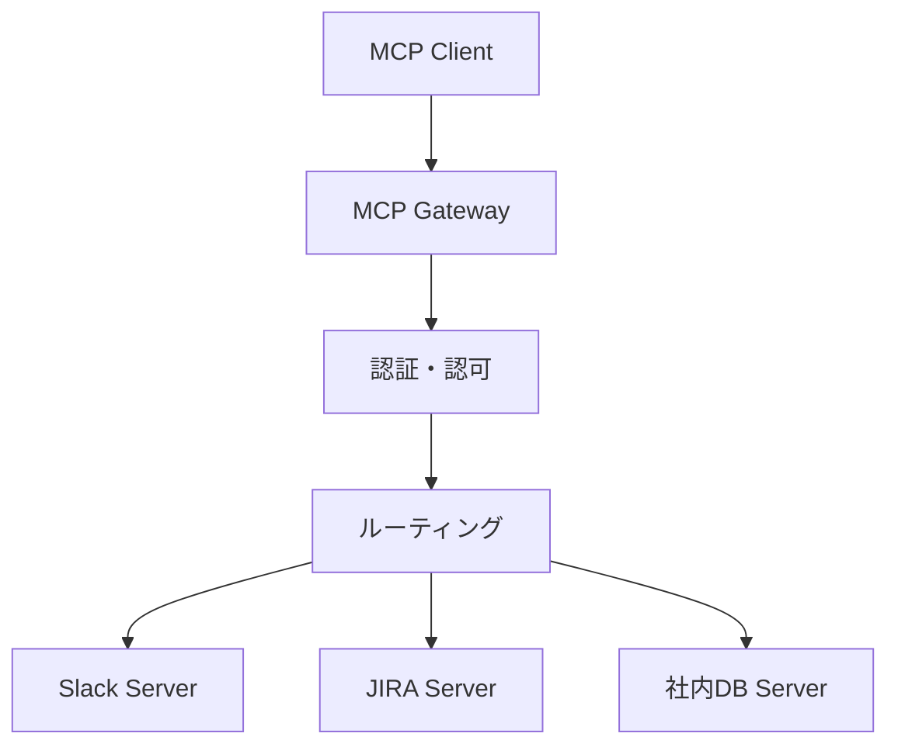

## この記事でわかること

- MCP Gatewayでマルチツール統合（Slack・JIRA・社内DB等）を一元管理する設計
- REST比15-25%のレイテンシ増を3ms以下に抑える接続プーリング・バッチング戦略
- OAuth 2.0 + RBACで最小権限を実現する認証設計

## 対象読者

- **想定読者**: 中級〜上級のバックエンド/MLOpsエンジニア
- **前提知識**: Python 3.11+非同期処理、REST API設計、LLM Tool Use（GPT-4o / Claude 4.5 Sonnet等）の基本理解

## 結論・成果

MCP（Model Context Protocol）の社内ツール統合では、**MCP Gateway**中心のアーキテクチャが2026年のエンタープライズ標準です。MintMCPのブログによると、高速Gateway（Bifrost等）で**オーバーヘッド3ms未満**、MCP導入で**デプロイ時間40-60%短縮**が報告されています。一方でJSON-RPCのオーバーヘッドはREST比15-25%増のため、Gateway選定と最適化が重要です。

> **関連記事**: LangGraphでのMCPレイテンシ最適化は[こちら](https://zenn.dev/0h_n0/articles/2929e45a5bf12b)を参照。本記事ではマルチツール統合アーキテクチャと認証設計に焦点を当てています。

## MCP Gatewayでマルチツール統合を設計する

MCPは2024年11月にAnthropicが公開し、2025年12月にAAIF（Linux Foundation傘下）に移管されたオープンプロトコルです。月間9,700万以上のSDKダウンロードを記録しています。社内の複数ツールをMCPで統合する場合、**MCP Gateway**で一元管理するアーキテクチャが推奨されます。



Microsoftの技術ブログで報告されているベンチマークでは、MCP経由のレイテンシは約1,100ms（REST直接は約850ms）で15-25%増加しますが、LLMトークン消費を50-80%削減できるとされています。

| 比較項目 | REST API個別実装 | MCP統合 |
|----------|-----------------|---------|
| 単一呼び出しレイテンシ | ~850ms | ~1,100ms |
| LLMトークン消費 | 多い | 50-80%削減 |
| ツール追加コスト | 個別実装 | サーバー接続のみ |
| ツールディスカバリ | なし | 自動検出 |

**注意点**: MCPの利点はツール数が多くLLMエージェントが主要利用者の場合に発揮されます。ツール1-2個で非LLMクライアントが主要な場合はREST直接利用が適切です。

#### Gateway基盤の実装例

以下はPythonでのGateway骨格です。認証・ルーティング・キャッシュの3層を持ちます。

```python
# gateway.py
import time
from dataclasses import dataclass, field
from typing import Any
import httpx

@dataclass
class MCPServerConfig:
    name: str
    url: str
    tools: list[str]
    allowed_roles: dict[str, list[str]] = field(default_factory=dict)

class MCPGateway:
    def __init__(self, servers: list[MCPServerConfig]) -> None:
        self._servers = {s.name: s for s in servers}
        self._tool_to_server: dict[str, str] = {}
        self._cache: dict[str, tuple[Any, float]] = {}
        self._client = httpx.AsyncClient(
            limits=httpx.Limits(max_connections=100, max_keepalive_connections=20),
            timeout=httpx.Timeout(10.0, connect=2.0),
            http2=True,  # コネクション多重化
        )
        for s in servers:
            for t in s.tools:
                self._tool_to_server[t] = s.name

    async def call_tool(
        self, tool_name: str, args: dict, user_role: str
    ) -> dict:
        server = self._servers[self._tool_to_server[tool_name]]
        # RBAC チェック
        if roles := server.allowed_roles.get(tool_name):
            if user_role not in roles:
                raise PermissionError(f"{user_role} cannot access {tool_name}")
        # キャッシュ確認
        key = f"{tool_name}:{hash(frozenset(args.items()))}"
        if key in self._cache:
            val, ts = self._cache[key]
            if time.monotonic() - ts < 300:
                return val
        # JSON-RPC転送
        resp = await self._client.post(f"{server.url}/mcp", json={
            "jsonrpc": "2.0", "method": "tools/call",
            "params": {"name": tool_name, "arguments": args},
        })
        result = resp.json().get("result", {})
        self._cache[key] = (result, time.monotonic())
        return result
```

**設計判断**: `httpx.Limits`で接続プールを管理し、`http2=True`でコネクション多重化を有効化しています。最初は`max_connections`を大きくしがちですが、ダウンストリームの過負荷を防ぐため現実的なピーク負荷に合わせるべきです。

### レイテンシを3ms以下に最適化する

MintMCPのブログで報告されている各Gatewayのベンチマーク（2026年）を見てみましょう。

| Gateway | オーバーヘッド | 特徴 |
|---------|-------------|------|
| Bifrost | **<3ms** | 軽量・高速特化 |
| TrueFoundry | 3-4ms | リージョン分散対応 |
| Lunar.dev MCPX | ~4ms | 監査ログ充実 |
| Docker MCP Gateway | 50-200ms | コンテナ分離 |

高速Gatewayと低速Gatewayで**10-100倍のレイテンシ差**があります。1会話で5-20回のツール呼び出しが発生するため、この差は体感に直結します。

#### バッチングで往復を削減する

独立したツール呼び出しを並列実行し、逐次5,500ms（1,100ms×5）を約1,200-1,500msに短縮できます。

```python
import asyncio

async def batch_tool_calls(
    gw: MCPGateway, calls: list[dict], user_role: str, max_concurrency: int = 5
) -> list[dict]:
    sem = asyncio.Semaphore(max_concurrency)
    async def _call(c: dict) -> dict:
        async with sem:
            return await gw.call_tool(c["tool"], c["args"], user_role)
    results = await asyncio.gather(*[_call(c) for c in calls], return_exceptions=True)
    return [r if not isinstance(r, Exception) else {"error": str(r)} for r in results]
```

**トレードオフ**: 並列度を上げすぎるとダウンストリームが過負荷になります。`max_concurrency`で制御してください。

### 本番運用の監視と耐障害設計

AIモデルは1回の会話で数百リクエストを生成し得るため、以下のメトリクス監視が重要です。

| メトリクス | 閾値 | アラート条件 |
|-----------|------|------------|
| ツール呼び出しp95レイテンシ | <500ms | 3分連続超過 |
| キャッシュヒット率 | >60% | 30%以下で調査 |
| 認証失敗率 | <1% | 5%以上で即時通知 |
| 1会話あたり呼び出し数 | <50 | 100超で異常検知 |

**制約条件**: 1会話あたりのツール呼び出し数監視は特に重要です。LLMがツール呼び出しの無限ループに入ると短時間で数千リクエストが発生するため、会話単位のレートリミットで自動停止する仕組みが必要です。

## まとめと次のステップ

- MCPは2026年時点で4社（Anthropic・OpenAI・Google・Microsoft）が支持するツール統合の業界標準
- MCP Gatewayで認証・ルーティング・キャッシュ・監査を一元管理し、高速Gateway選択でオーバーヘッド3ms未満を達成可能
- OAuth 2.0 + RBACで最小権限のツール公開を実現し、プロンプトインジェクションリスクを低減

**次のアクション:**
1. [公式MCPサーバー一覧](https://github.com/modelcontextprotocol/servers)で社内ツール対応状況を確認
2. 小規模（2-3ツール）統合で認証フローとレイテンシを検証
3. サーキットブレーカー・レートリミットを本番投入前にテスト

## 参考

- [Model Context Protocol 公式仕様 (2025-11-25)](https://modelcontextprotocol.io/specification/2025-11-25)
- [Production-Ready MCP Servers Guide (2026)](https://webmcpguide.com/articles/production-ready-mcp-servers-guide)
- [Best MCP Gateways for Tool Calling at Scale 2026](https://www.mintmcp.com/blog/mcp-gateways-tool-calling-scale)
- [API vs MCP Decision Matrix - Microsoft](https://techcommunity.microsoft.com/blog/azurearchitectureblog/decision-matrix-api-vs-mcp-tools-%E2%80%94-the-great-integration-showdown-%F0%9F%A5%8A/4499385)
- [The 2026 MCP Roadmap](http://blog.modelcontextprotocol.io/posts/2026-mcp-roadmap/)
- [Introducing MCP - Anthropic](https://www.anthropic.com/news/model-context-protocol)

---

:::message
この記事はAI（Claude Code）により自動生成されました。内容の正確性については複数の情報源で検証していますが、実際の利用時は公式ドキュメントもご確認ください。
:::
