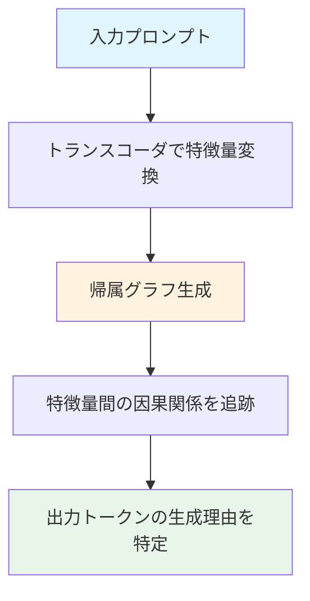
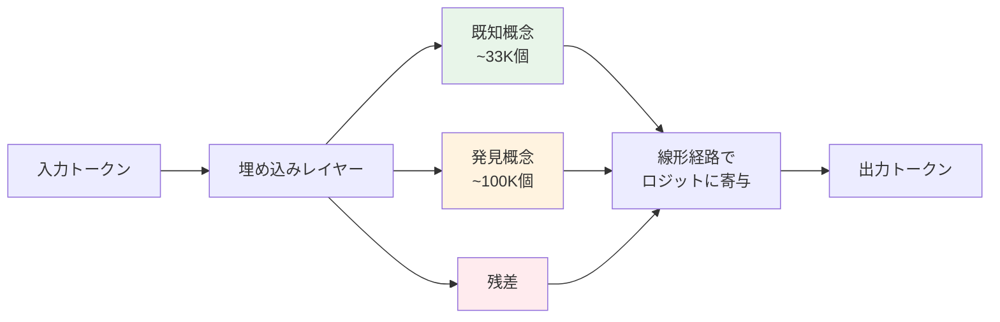
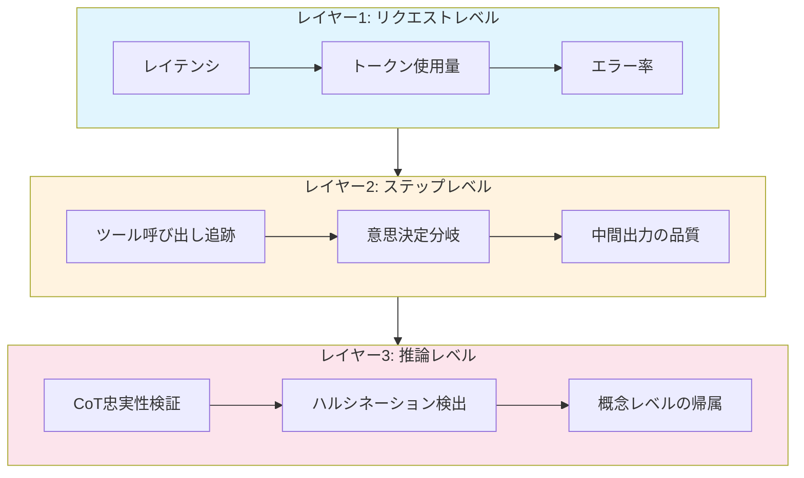

# LLM・AIエージェントの解釈性2026：回路追跡からエージェント観測性まで実践ガイド

## この記事でわかること

- メカニスティック解釈性（Mechanistic Interpretability）の最新手法と、Anthropicの回路追跡・Google DeepMindのGemma Scope 2の具体的な使い方
- Guide LabsのSteerling-8Bに代表される「設計段階からの解釈性」アーキテクチャの仕組みと特徴
- AIエージェントの本番運用における観測性（Observability）の導入パターンと、LangSmith等のツール活用法
- EU AI Actを踏まえた規制対応と、金融・医療分野での解釈性の実務要件
- 現場で使えるTokenSHAP・回路追跡・注意機構可視化の実装例

## 対象読者

- **想定読者**: 中級〜上級のMLエンジニア・LLMアプリケーション開発者
- **必要な前提知識**:
  - Python 3.11+の基礎文法
  - Transformerアーキテクチャの基本理解（Self-Attention、Embedding等）
  - LLM APIの基本的な使い方（OpenAI API、Anthropic API等）

## 結論・成果

LLM・AIエージェントの解釈性は、MIT Technology Reviewが2026年のブレークスルー技術に選出するほど急速に進展しています。Anthropicの回路追跡研究では、Claude 3.5 Haikuの内部で約3,000万個の特徴量が発見され、ハルシネーションの発生メカニズムや計画的推論のプロセスが具体的に解明されています。本番運用の現場では、LangChainの調査によると**エージェント運用企業の89%が何らかの観測性ツールを導入**しており、62%が個別ステップの詳細なトレーシングを実現しています。本記事では、これらの研究動向と実装手法を体系的に整理し、現場の開発者が今日から活用できる実践的な知識を提供します。

## メカニスティック解釈性の最新研究を理解する

メカニスティック解釈性（Mechanistic Interpretability）とは、ニューラルネットワークの内部構造を解析し、**モデルがなぜその出力を生成したか**を計算グラフのレベルで説明する手法です。従来のポストホック説明（SHAP、LIME等）が「入力のどの部分が重要か」を示すのに対し、メカニスティック解釈性は「モデル内部で何が起きているか」に踏み込みます。

### Anthropicの回路追跡（Circuit Tracing）

Anthropicは2025年3月に、Claude 3.5 Haikuの内部計算を可視化する**回路追跡（Circuit Tracing）**の研究成果を発表しました。この手法では、モデル内部のニューロンをより解釈しやすい「特徴量（features）」に変換するトランスコーダを用い、推論時の計算ステップを帰属グラフ（Attribution Graph）として表現します。

回路追跡で明らかになった主要な発見を見てみましょう。

**多段推論の内部メカニズム**: 「ダラスを含む州の州都は？」という質問に対して、モデル内部ではダラス特徴量→テキサス特徴量→オースティン出力特徴量という二段階の推論が確認されました。研究者がカリフォルニアの表現に差し替えると、出力がサクラメントに変わることも実証されています。

**詩作における事前計画**: Claudeが詩を書く際に、行末の候補単語の特徴量が**その行を書き始める前に活性化**することが発見されました。つまり、韻を踏む単語を先に決定してから、その単語に自然につながる文を生成しているということです。

**ハルシネーションの原因特定**: モデルには全アシスタント応答に対してデフォルトで拒否回路が起動し、「既知のエンティティ」特徴量がそれを抑制する仕組みがあります。ハルシネーションは、実際の知識がないにもかかわらず「既知の回答」特徴量が活性化してしまうことで発生すると報告されています。



回路追跡のPythonライブラリはオープンソースで公開されており、任意のオープンウェイトモデルで帰属グラフを生成できます。以下はその基本的な使い方の概念コードです。

```python
# circuit_tracer_example.py
# Anthropicの回路追跡ライブラリの基本的な使用パターン
# 参考: https://www.anthropic.com/research/open-source-circuit-tracing

from circuit_tracer import CircuitTracer
from transformers import AutoModelForCausalLM, AutoTokenizer

def trace_model_reasoning(
    model_name: str,
    prompt: str,
    target_token_index: int = -1,
) -> dict:
    """モデルの推論プロセスを回路追跡で可視化する。

    Args:
        model_name: HuggingFaceモデル名
        prompt: 解析対象のプロンプト
        target_token_index: 追跡対象のトークン位置（デフォルト: 最後のトークン）

    Returns:
        帰属グラフの辞書表現
    """
    tokenizer = AutoTokenizer.from_pretrained(model_name)
    model = AutoModelForCausalLM.from_pretrained(model_name)

    # トランスコーダベースの回路追跡を初期化
    tracer = CircuitTracer(model=model, tokenizer=tokenizer)

    # 帰属グラフを生成
    attribution_graph = tracer.trace(
        prompt=prompt,
        target_token_index=target_token_index,
        # 上位k個の特徴量のみ表示（計算コスト削減）
        top_k_features=50,
    )

    return attribution_graph


if __name__ == "__main__":
    # 例: 二段階推論の追跡
    graph = trace_model_reasoning(
        model_name="google/gemma-2-2b",
        prompt="The capital of the state containing Dallas is",
    )
    print(f"活性化特徴量数: {len(graph['features'])}")
    print(f"特徴量間エッジ数: {len(graph['edges'])}")
```

> **注意**: 回路追跡は計算コストが高く、研究チームの報告では「試みたプロンプトの約25%」でのみ意味のある結果が得られると述べられています。また、置換モデル（replacement model）は元のモデルの挙動を不完全にしか再現できないという制約があります。本番運用のデバッグツールとしてではなく、モデルの挙動理解や安全性評価に活用するのが現時点での適切な使い方です。

### Google DeepMindのGemma Scope 2

Google DeepMindは2025年12月に**Gemma Scope 2**を公開しました。これはGemma 3モデルファミリー（270Mから27Bパラメータ）のすべてのサイズに対応する、オープンソースの解釈性ツールキットです。

Gemma Scope 2の特筆すべき点は、スパースオートエンコーダ（SAE）とトランスコーダの両方を提供し、事前学習済みモデルとインストラクションチューニング済みモデルの**全レイヤー**を解析できることです。学習に約110ペタバイトのデータ、合計1兆パラメータ以上のトレーニングが投入されたと報告されています。

```python
# gemma_scope_example.py（概念コード）
# 参考: https://deepmind.google/blog/gemma-scope-2

import torch
from transformers import AutoModelForCausalLM, AutoTokenizer

# Gemma 3モデルの中間層活性化を取得
model = AutoModelForCausalLM.from_pretrained(
    "google/gemma-3-2b", torch_dtype=torch.bfloat16, device_map="auto"
)
tokenizer = AutoTokenizer.from_pretrained("google/gemma-3-2b")
inputs = tokenizer("AIの安全性について", return_tensors="pt").to(model.device)

with torch.no_grad():
    outputs = model(**inputs, output_hidden_states=True)
    hidden_state = outputs.hidden_states[12]  # レイヤー12

# SAEで疎な特徴量に分解（Hugging FaceからSAE重みを取得）
# sae = load_sae("google/gemma-scope-2-2b", layer=12)
# sparse_features = sae.encode(hidden_state)
# → 各特徴量の活性化スコアと概念ラベルが得られる
```

**Gemma Scope 2の主な用途**:

| 用途 | 手法 | 対象 |
|------|------|------|
| ジェイルブレイク分析 | トランスコーダで多段階行動を追跡 | 安全性チーム |
| ハルシネーション診断 | SAEで「知識なし」特徴量を検出 | QAエンジニア |
| 拒否メカニズム検証 | 拒否回路の特徴量パターン解析 | アラインメント研究者 |
| CoT忠実性検証 | 内部状態と言語化推論の整合性チェック | 研究者 |

> **制約**: Gemma Scope 2はGemmaモデルファミリー専用であり、他社のモデル（GPT、Claude等）には直接適用できません。また、SAEが捉えられるのは全特徴量の一部であり、残差項（residual）として説明できない部分が残ります。

## 設計段階からの解釈性を実現する新アーキテクチャ

従来の解釈性は、訓練済みモデルを**事後的に**解析するアプローチが主流でした。2026年2月、Guide LabsがSteerling-8Bを公開したことで、**設計段階から解釈性を組み込む**新しいアプローチが注目を集めています。

### Steerling-8Bのアーキテクチャ

Steerling-8Bは、因果的離散拡散モデル（Causal Discrete Diffusion Model）をバックボーンとし、モデルの埋め込みを3つの明示的な経路に分解する設計が特徴です。

1. **約33,000個の教師あり「既知概念」**: 人間が定義した概念空間
2. **約100,000個の「発見概念」**: モデルが学習過程で自律的に獲得した概念
3. **残差**: 上記で説明できない残りの表現



Steerling-8Bでは、各概念がロジットへ線形経路で寄与するため、**任意の出力トークンについて、どの概念がどの程度貢献したかを正確に分解**できます。Guide Labsの報告によると、検証データセットにおいてトークンレベルの寄与の84%以上が概念モジュールから来ていると述べています。

**推論時のステアリング（操縦）**: Steerling-8Bは、再学習なしで推論時に任意の概念を注入・抑制できます。たとえば「暴力的表現」の概念を抑制したり、「フォーマル」の概念を強化したりすることが可能です。

```python
# steerling_concept_steering.py（概念コード）
# 参考: https://www.guidelabs.ai/post/steerling-steering-8b/

# Steerling-8Bでは推論時に概念レベルで出力を制御可能
steering_config = {
    "suppress": ["casual_language", "violent_content"],
    "amplify": [
        {"concept": "formal_tone", "factor": 2.0},
        {"concept": "technical_precision", "factor": 1.5},
    ],
}

# 概念IDを指定して生成（再学習不要）
# model.generate(prompt, steering_config=steering_config)
```

**なぜこのアプローチが注目されるのか:**

- **事後解析不要**: モデル設計に解釈性が組み込まれているため、追加の解析ツールが不要
- **訓練データ追跡**: 任意の出力トークンを訓練データまで遡れる（著作権・コンプライアンス対応に有効）
- **推論時介入**: 再学習なしで概念レベルの制御が可能

> **トレードオフ**: Guide Labsによると、Steerling-8Bは既存モデルの約90%の性能を達成しますが、解釈性のための設計制約により、同規模の標準モデルと比較してベンチマーク性能は若干低下します。また、8Bパラメータという比較的小さなモデルでの実証に留まっており、100B以上のスケールでの性能は未検証です。

## AIエージェントの解釈性と観測性を本番運用に導入する

LLM単体の解釈性だけでなく、**エージェントシステム全体**の解釈性が運用上の重要課題になっています。2026年1月に公開された論文「Interpreting Agentic Systems」（Zhu et al.）では、既存の解釈性手法がエージェントシステムに適用しにくい理由として、**時間的ダイナミクス、カスケード的意思決定、コンテキスト依存の行動**を挙げています。

### モデル解釈性 vs エージェント観測性

エージェントシステムでは、モデル単体の解釈性だけでは不十分です。以下の表に両者の違いを整理します。

| 観点 | モデル解釈性 | エージェント観測性 |
|------|------------|-------------------|
| 対象 | 単一推論（1回のAPI呼び出し） | 複数ステップの意思決定チェーン |
| 手法 | SAE、回路追跡、Attention可視化 | 分散トレーシング、ログ集約、メトリクス |
| 粒度 | トークン・特徴量レベル | ツール呼び出し・状態遷移レベル |
| 目的 | 「なぜこのトークンが生成されたか」 | 「なぜこのアクションを選択したか」 |
| ツール | Gemma Scope 2、circuit-tracer | LangSmith、Langfuse、AgentOps |
| 適用場面 | 研究、安全性評価 | 本番運用、デバッグ、SLA監視 |

### LangSmithによるエージェント観測性の実装

LangChainの調査（State of Agent Engineering）によると、本番運用しているエージェントの**94%が何らかの観測性**を導入しており、71.5%が完全なトレーシング機能を利用しています。LangSmithを使ったトレーシングの実装例を見てみましょう。

```python
# agent_observability.py
# LangSmithによるエージェント観測性の実装例
import os
from langchain_core.tracers import LangChainTracer
from langchain_openai import ChatOpenAI
from langchain_core.messages import HumanMessage
from langchain_core.tools import tool

# LangSmithのトレーシングを有効化
os.environ["LANGCHAIN_TRACING_V2"] = "true"
os.environ["LANGCHAIN_API_KEY"] = "your-langsmith-api-key"
os.environ["LANGCHAIN_PROJECT"] = "agent-interpretability-demo"


@tool
def search_documents(query: str) -> str:
    """社内文書を検索する。"""
    return f"検索結果: '{query}' に関する3件のドキュメント"


@tool
def execute_sql(query: str) -> str:
    """SQLクエリを実行する。"""
    return f"クエリ結果: {query} → 42件のレコード"


def create_observable_agent() -> ChatOpenAI:
    """観測性が組み込まれたエージェントを作成する。"""
    llm = ChatOpenAI(model="gpt-4o", temperature=0)
    return llm.bind_tools([search_documents, execute_sql])


def run_with_tracing(agent: ChatOpenAI, query: str) -> dict:
    """トレーシング付きでエージェントを実行する。"""
    tracer = LangChainTracer(project_name="agent-interpretability-demo")
    response = agent.invoke(
        [HumanMessage(content=query)],
        config={"callbacks": [tracer]},
    )
    return {
        "response": response,
        "trace_url": f"https://smith.langchain.com/runs/{tracer.latest_run.id}"
        if tracer.latest_run
        else None,
    }
```

### エージェント観測性の3層アーキテクチャ

本番運用では、以下の3層で観測性を構築するのが実践的です。



**レイヤー1（リクエストレベル）**: レスポンスタイム、トークン消費量、HTTP ステータスコードの監視。全エージェントで必須の基本指標です。

**レイヤー2（ステップレベル）**: 各ツール呼び出しの詳細トレース、意思決定分岐のログ、中間出力のLLM-as-Judge品質チェック。LangChain調査では62%の企業がこのレベルまで導入しています。

**レイヤー3（推論レベル）**: CoT（Chain of Thought）と実際の内部推論の整合性検証、ハルシネーション検出。研究段階の手法が多く、Barez et al.（2025）は「言語化された推論は内部の計算と乖離することがある」と指摘しています。

> **よくある間違い**: 最初からレイヤー3の推論レベル観測性を導入しようとするケースが見受けられますが、実際にはレイヤー1・2の基盤がないと、推論レベルの異常を検知しても根本原因の特定ができません。まずはレイヤー1から段階的に導入することを推奨します。

### ポストホック解釈性ツールの実務活用

メカニスティック解釈性は研究段階の手法が多い一方で、**ポストホック解釈性**はすでに実務で活用可能です。

#### TokenSHAPによるトークン重要度分析

TokenSHAPは、ゲーム理論に基づくShapley値をLLMのトークン単位に拡張した手法です。モンテカルロサンプリングにより、入力トークンごとの出力への寄与度を計算します。2025年に公開されたllmSHAPでは、LLMのデコーディング確率性がShapley公理に与える影響を形式化し、決定論的バリアントが提案されています。

```python
# token_shap_analysis.py
# TokenSHAPによるLLM入力トークンの重要度分析（簡略版）
import numpy as np
from transformers import AutoModelForCausalLM, AutoTokenizer
import torch


def compute_token_importance(
    model_name: str, prompt: str, n_samples: int = 50
) -> list[dict]:
    """モンテカルロサンプリングでトークン重要度を推定する。"""
    tokenizer = AutoTokenizer.from_pretrained(model_name)
    model = AutoModelForCausalLM.from_pretrained(
        model_name, torch_dtype=torch.float16, device_map="auto"
    )

    input_ids = tokenizer.encode(prompt, return_tensors="pt").to(model.device)
    n_tokens = input_ids.shape[1]
    tokens = tokenizer.convert_ids_to_tokens(input_ids[0])
    shapley_values = np.zeros(n_tokens)

    for _ in range(n_samples):
        perm = np.random.permutation(n_tokens)
        for i, token_idx in enumerate(perm):
            # token_idxの有無による出力確率の差分を計算
            # → Shapley値の不偏推定量
            mask_with = np.zeros(n_tokens, dtype=bool)
            mask_with[perm[: i + 1]] = True
            mask_without = mask_with.copy()
            mask_without[token_idx] = False

            diff = _marginal_contribution(
                model, input_ids, mask_with, mask_without
            )
            shapley_values[token_idx] += diff / n_samples

    return [
        {"token": tokens[i], "importance": float(shapley_values[i])}
        for i in range(n_tokens)
    ]


def _marginal_contribution(model, input_ids, mask_with, mask_without):
    """2つのマスク条件間の出力確率差分を計算する。"""
    # 実装: マスクされたトークンをPADに置換し、
    # 最終トークンの出力分布のエントロピー差分を返す
    return 0.0  # 実際の実装では確率差分を返す
```

#### Attention可視化によるデバッグ

Attention重みの可視化は、モデルが入力のどの部分に「注目」しているかを確認する手法です。ただし、Attention重みがモデルの意思決定プロセスを正確に反映するかどうかは議論があり、Jain & Wallace（2019）の研究では「Attention is not Explanation」と指摘されています。

**Attention可視化が有効なケース:**
- 長文入力でどの部分が参照されたか確認（RAGの検索結果の活用度チェック）
- 多言語モデルで言語間の対応関係を確認
- プロンプトのどの指示がモデルに影響を与えたか概観

**Attention可視化が不適切なケース:**
- 出力の「理由」を厳密に説明する目的（Attentionは必ずしも因果関係を示さない）
- 安全性の証明（Attentionが低い部分も出力に影響する可能性がある）

## EU AI Act対応と規制コンプライアンスの解釈性要件を把握する

LLM・AIエージェントの解釈性は、技術的な関心だけでなく、**法的要件**としても重要性を増しています。EU AI Actの施行スケジュールと、開発現場での対応方針を整理します。

### EU AI Actの施行タイムライン

| 時期 | 施行内容 | 解釈性への影響 |
|------|---------|---------------|
| 2025年2月 | 禁止AI行為の適用開始 | サブリミナル技術等の禁止 |
| 2025年8月 | GPAI（汎用AI）モデル義務 | 訓練データ文書化、著作権準拠 |
| 2026年8月（予定） | 高リスクAIシステム要件 | 説明可能性・透明性の義務化 |
| 2027年12月（延期案） | 高リスク義務延期案 | Digital Omnibus提案で16ヶ月延期の可能性 |

違反時の制裁金は**最大3,500万ユーロまたは全世界売上高の7%**と報告されており、コンプライアンスへの対応は企業にとって経営リスクです。

### 金融・医療分野での実務要件

金融・医療などの規制産業では、モデルの判断根拠の説明が実質的に必須です。

**金融分野**: 融資審査やクレジットスコアリングにLLMを活用する場合、判断に影響した要因を説明できる必要があります。「人種」「性別」などの保護属性が判断に影響していないことを証明する**公平性の検証**も求められます。

**医療分野**: 2026年1月にFDAとEMAが共同で発表した「Good AI Practice in Drug Development」では、LLMの「シャドーユース」（非公式利用）への監視と「データドリフト」の継続モニタリングを義務付けています。

```python
# compliance_logging.py
# 規制対応の判断根拠ログ記録
import json
import logging
from datetime import datetime, timezone
from dataclasses import dataclass, field, asdict

logger = logging.getLogger(__name__)


@dataclass
class DecisionAuditLog:
    """規制対応用の判断根拠ログ。"""

    request_id: str
    timestamp: str = field(
        default_factory=lambda: datetime.now(timezone.utc).isoformat()
    )
    model_id: str = ""
    model_version: str = ""
    input_summary: str = ""  # PII除去済み
    output: str = ""
    decision_factors: list[dict] = field(default_factory=list)
    confidence_score: float = 0.0
    protected_attributes_check: dict = field(default_factory=dict)

    def log(self) -> None:
        """構造化JSONログとして出力する。"""
        log_entry = {
            "event": "ai_decision_audit",
            "level": "INFO",
            "ts": self.timestamp,
            "request_id": self.request_id,
            **asdict(self),
        }
        logger.info(json.dumps(log_entry, ensure_ascii=False))
```

> **ハマりポイント**: EU AI Actの高リスクAIシステム要件は当初2026年8月施行予定でしたが、Digital Omnibus提案により2027年12月への延期が議論されています。ただし、延期が確定したわけではなく、企業は2026年8月を想定した準備を進めるのが安全です。規制の解釈は加盟国によって異なる場合があるため、法務チームとの連携が不可欠です。

### 解釈性導入のロードマップと手法選定

**フェーズ1（即時対応・1-2週間）**: 観測性の基盤構築
- LangSmith/Langfuseの導入でエージェントのステップ追跡を開始
- 構造化ログ（JSON）にrequest_id、model_id、duration_msを含める
- エラー率・レイテンシのダッシュボード構築

**フェーズ2（短期・1-3ヶ月）**: ポストホック解釈性の導入
- 重要な判断（融資審査、医療推奨等）にTokenSHAPを適用
- LLM-as-Judgeによる出力品質の自動評価パイプライン構築
- 判断根拠の監査ログ設計（前述のDecisionAuditLog）

**フェーズ3（中期・3-6ヶ月）**: メカニスティック解釈性の活用
- 安全性評価にcircuit-tracerを導入（自社ファインチューニングモデル対象）
- Gemma Scope 2でオープンモデルの特徴量分析
- CoT忠実性検証パイプラインの構築

**フェーズ4（長期・6ヶ月〜）**: 設計レベルの解釈性
- Steerling-8B等の本質的解釈モデルの評価・導入検討
- EU AI Act高リスク要件への本格対応
- 解釈性テストのCI/CD統合

#### 解釈性手法の選定基準

| 判断基準 | ポストホック（SHAP等） | メカニスティック（SAE等） | 本質的（Steerling等） |
|---------|----------------------|------------------------|---------------------|
| 導入コスト | 低（ライブラリ追加のみ） | 中〜高（GPU、研究知識） | 高（モデル変更が必要） |
| 精度 | 近似的 | 因果的（ただし部分的） | 正確（設計による） |
| 対象モデル | 任意のAPI・モデル | オープンウェイトモデル限定 | 専用アーキテクチャのみ |
| 成熟度 | 実用段階 | 研究段階〜初期実用 | 実験段階 |
| 規制対応 | 部分的 | 有望だが確立されていない | 将来的に有力 |

> **制約条件**: メカニスティック解釈性はオープンウェイトモデルにのみ適用可能であり、GPT-4oやClaude等のAPIベースモデルには直接適用できません。APIベースモデルを使う場合は、ポストホック解釈性とエージェント観測性の組み合わせが現実的な選択肢です。

#### よくある問題と解決方法

| 問題 | 原因 | 解決方法 |
|------|------|----------|
| TokenSHAPの計算が遅い | モンテカルロサンプリングの回数が多い | サンプル数を50-100に制限し、必要に応じてバッチ処理 |
| 回路追跡で意味のある結果が出ない | プロンプトの約75%では失敗する | 短く明確なプロンプトから始め、段階的に複雑化 |
| Attention重みが直感に反する | Attentionは必ずしも因果を示さない | 回路追跡やTokenSHAPと組み合わせて検証 |
| エージェントのトレースが膨大になる | 全ステップの詳細ログ | サンプリングレートを設定（本番: 10%、異常時: 100%） |
| 規制要件の解釈が不明確 | EU AI Actの施行が段階的 | 法務チームと連携し、最も厳格な解釈で準備 |

## まとめと次のステップ

**まとめ:**

- メカニスティック解釈性は2026年のブレークスルー技術に選出され、Anthropicの回路追跡やGoogle DeepMindのGemma Scope 2により、モデル内部の推論プロセスを具体的に可視化できるようになっています
- Guide LabsのSteerling-8Bは「設計段階からの解釈性」という新しいアプローチを示し、トークンレベルの寄与の84%以上を説明可能な概念に分解しています
- 本番運用のAIエージェントの89%が観測性を導入しており、LangSmith等のツールによるステップレベルのトレーシングが実務標準になりつつあります
- EU AI Actの高リスクAI要件は2026-2027年に施行予定であり、金融・医療分野では判断根拠の説明と公平性の検証が法的要件になります
- 導入はポストホック解釈性→エージェント観測性→メカニスティック解釈性の順で段階的に進めるのが実践的です

**次にやるべきこと:**

- LangSmithまたはLangfuseを導入し、エージェントの基本的な観測性を構築する
- TokenSHAPを使い、自社LLMアプリケーションの重要な判断ポイントでトークン重要度を分析する
- Anthropicのcircuit-tracerライブラリをオープンウェイトモデルで試し、帰属グラフの生成を体験する
- EU AI Actの高リスクAI要件を確認し、監査ログの設計を法務チームと開始する

## 参考

- [MIT Technology Review: Mechanistic Interpretability - 10 Breakthrough Technologies 2026](https://www.technologyreview.com/2026/01/12/1130003/mechanistic-interpretability-ai-research-models-2026-breakthrough-technologies/)
- [Anthropic: On the Biology of a Large Language Model（Circuit Tracing研究）](https://transformer-circuits.pub/2025/attribution-graphs/biology.html)
- [Anthropic: Open-sourcing circuit-tracing tools](https://www.anthropic.com/research/open-source-circuit-tracing)
- [Google DeepMind: Gemma Scope 2](https://deepmind.google/blog/gemma-scope-2-helping-the-ai-safety-community-deepen-understanding-of-complex-language-model-behavior/)
- [Guide Labs: Steerling-8B Base Model Release](https://www.guidelabs.ai/post/steerling-8b-base-model-release/)
- [Interpreting Agentic Systems: Beyond Model Explanations to System-Level Accountability（arXiv 2601.17168）](https://arxiv.org/abs/2601.17168)
- [LangChain: State of Agent Engineering](https://www.langchain.com/state-of-agent-engineering)
- [EU AI Act Compliance Checklist 2025-2027](https://abv.dev/blog/eu-ai-act-compliance-checklist-2025-2027)
- [llmSHAP: A Principled Approach to LLM Explainability](https://arxiv.org/abs/2511.01311)
- [Promptfoo: How AI Regulation Changed in 2025](https://www.promptfoo.dev/blog/ai-regulation-2025/)

---

:::message
この記事はAI（Claude Code）により自動生成されました。内容の正確性については複数の情報源で検証していますが、実際の利用時は公式ドキュメントもご確認ください。
:::
