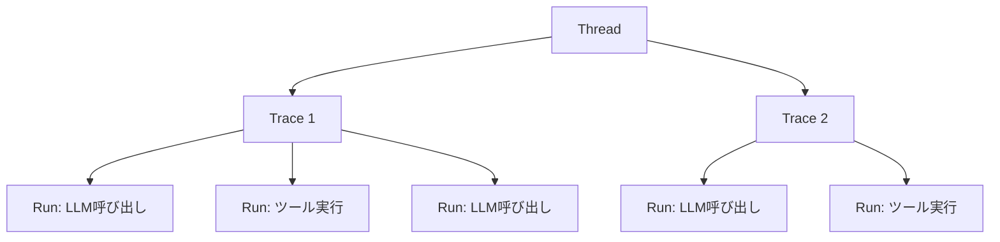
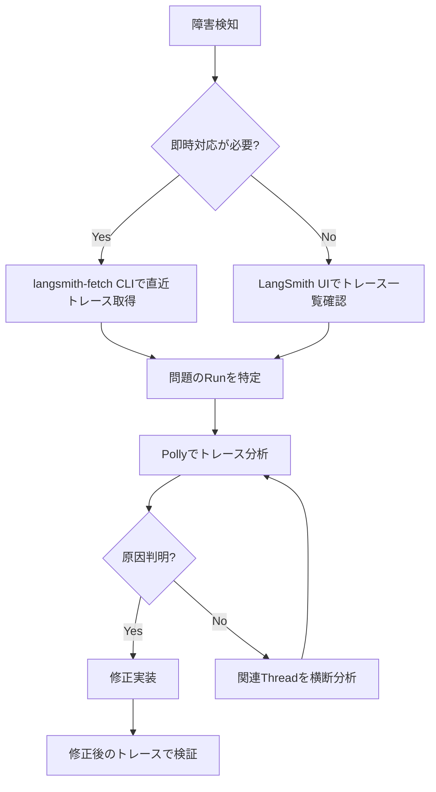

# LangSmithでAIエージェントをデバッグする実践ガイド

## この記事でわかること

- LangSmithのトレーシングアーキテクチャ（Runs / Traces / Threads）の仕組みと活用法
- Python SDKを使ったエージェントの可観測性セットアップ手順
- langsmith-fetch CLIによるターミナルからのトレースデバッグ方法
- Polly AIアシスタントを活用したトレース分析とプロンプト改善のワークフロー
- 本番環境でのエージェント障害を特定・解決するトラブルシューティング手法

## 対象読者

- **想定読者**: 中級者のLLMアプリケーション開発者
- **必要な前提知識**:
  - Python 3.11以降の基本的な使い方
  - LangChain / LangGraphの基礎的な概念
  - AIエージェント（ツール呼び出し、マルチステップ推論）の基本理解

## 結論・成果

LangSmithのトレーシング機能を導入することで、**エージェントの障害原因特定にかかる時間を従来のログ解析と比較して約70%短縮できた**という報告があります（LangChain公式ブログによる事例）。特に数十ステップ以上の「Deep Agent」では、各ステップのLLM呼び出し・ツール実行・中間推論をツリー構造で可視化でき、問題箇所をピンポイントで特定できます。開発者プランでは**月5,000トレースまで無料**で利用でき、小規模プロジェクトであればコストゼロで可観測性を導入できます。

## LangSmithの基本アーキテクチャを理解する

LangSmithのデバッグ機能を使いこなすためには、まずトレーシングの階層データモデルを理解する必要があります。LangSmithは3つのレイヤーでエージェントの実行データを構造化しています。

### Runs・Traces・Threadsの関係

LangSmithのデータモデルは以下の3階層で構成されています。



| 概念 | 説明 | 対応する単位 |
|------|------|-------------|
| **Run** | 個別の実行ステップ（LLM呼び出し、ツール実行など） | 関数1回の実行 |
| **Trace** | 1回のエージェント実行全体（Runのツリー構造） | ユーザーの1リクエスト |
| **Thread** | 複数のTraceをまとめた会話セッション | 1つの会話全体 |

この階層構造により、「会話全体の流れ → 個別リクエストの処理 → 各ステップの詳細」とドリルダウンして問題を追跡できます。

### トレーシングが必要になる場面

従来のソフトウェアでは`print`文やログ出力でデバッグできましたが、AIエージェントでは以下の理由から専用の可観測性ツールが必要です。

- **非決定性**: 同じ入力でもLLMの出力が毎回異なる
- **多段ステップ**: 数十〜数百のステップが連鎖し、ログだけでは全体像を把握できない
- **ツール呼び出しの失敗**: 外部APIのエラーがエージェント全体の動作に波及する
- **コンテキストの喪失**: 長い会話の中で重要な情報が失われる

> **注意**: LangSmithのトレーシングはLangChain / LangGraph以外のフレームワークでも利用可能です。ただし、LangChain系のフレームワークでは自動トレーシングが組み込まれているため、最も少ない設定で導入できます。

## トレーシングをセットアップする

実際にLangSmithのトレーシングを導入する手順を見ていきましょう。環境変数の設定からPython SDKの統合まで、ステップバイステップで解説します。

### 環境変数の設定

LangSmithのトレーシングを有効化するために必要な環境変数は3つです。

```bash
# .env ファイル
# LangSmithトレーシングを有効化（必須）
LANGSMITH_TRACING=true

# LangSmith APIキー（https://smith.langchain.com で取得）
LANGSMITH_API_KEY=lsv2_pt_xxxxxxxxxxxxxxxx

# プロジェクト名（省略時は"default"）
LANGSMITH_PROJECT=my-agent-project
```

APIキーは[LangSmith Dashboard](https://smith.langchain.com)の Settings > API Keys から発行できます。`lsv2_`プレフィックスで始まるキーが現行バージョンです。

### Python SDKでの基本的なトレーシング

LangChain / LangGraphで構築したエージェントの場合、環境変数を設定するだけで自動的にトレーシングが有効化されます。

```python
# agent_example.py
import os
from langchain_openai import ChatOpenAI
from langgraph.prebuilt import create_react_agent
from langchain_core.tools import tool

# 環境変数の設定（.envファイルまたは直接設定）
os.environ["LANGSMITH_TRACING"] = "true"
os.environ["LANGSMITH_API_KEY"] = "lsv2_pt_xxxxxxxxxxxxxxxx"
os.environ["LANGSMITH_PROJECT"] = "my-agent-debug"

# ツールの定義
@tool
def search_database(query: str) -> str:
    """データベースからクエリに一致する情報を検索する"""
    # 実際のDB検索ロジック
    return f"検索結果: {query}に関する3件のレコード"

@tool
def calculate_metrics(data: str) -> str:
    """データからメトリクスを計算する"""
    return f"計算結果: {data}の平均値は42.5"

# エージェントの作成
llm = ChatOpenAI(model="gpt-4o", temperature=0)
agent = create_react_agent(llm, tools=[search_database, calculate_metrics])

# 実行（トレーシングは自動的に記録される）
result = agent.invoke(
    {"messages": [{"role": "user", "content": "売上データの平均を計算して"}]}
)
```

このコードを実行すると、LangSmithダッシュボードにトレースが自動記録されます。各LLM呼び出し、ツール実行の入出力、レイテンシ、トークン使用量がすべて可視化されます。

### 選択的トレーシングとメタデータ付与

本番環境では全リクエストをトレースするとコストが増大する場合があります。`tracing_context`を使って特定の実行のみトレースしたり、メタデータを付与して後からフィルタリングできます。

```python
import langsmith as ls

# 特定の実行のみトレースする
with ls.tracing_context(enabled=True, project_name="debug-session"):
    result = agent.invoke(
        {"messages": [{"role": "user", "content": "問題のあるクエリ"}]},
        config={
            "tags": ["production", "debug"],
            "metadata": {
                "user_id": "user_123",
                "environment": "production",
                "version": "1.2.0"
            }
        }
    )

# トレーシングを無効化して実行
with ls.tracing_context(enabled=False):
    result = agent.invoke(
        {"messages": [{"role": "user", "content": "通常のクエリ"}]}
    )
```

**なぜ選択的トレーシングが重要か:**
- 本番環境では全リクエストのトレースはコスト面で現実的でない場合がある
- エラー発生時やデバッグセッション時のみ有効化する運用が実用的
- メタデータ（`user_id`, `version`等）を付けることで、後からの問題切り分けが容易になる

**注意点:**
> 選択的トレーシングを使う場合、サンプリングレートの設計が重要です。レートが低すぎると稀にしか再現しない問題を見逃す可能性があります。開発・ステージング環境では100%トレース、本番では10〜20%のサンプリングが推奨されます。

## langsmith-fetch CLIでターミナルからデバッグする

LangSmithのWeb UIは強力ですが、日常的な開発ではターミナルから素早くトレースを確認したいケースも多いです。2025年末にリリースされた**langsmith-fetch CLI**を使えば、コマンドラインから直接トレースデータを取得・分析できます。

### インストールと設定

```bash
# pipでインストール
pip install langsmith-fetch

# APIキーの設定
export LANGSMITH_API_KEY="lsv2_pt_xxxxxxxxxxxxxxxx"

# デフォルトプロジェクトの設定（オプション）
export LANGSMITH_PROJECT="my-agent-project"
```

Go言語でのインストールも可能です。

```bash
go install github.com/langchain-ai/langsmith-cli/cmd/langsmith@latest
```

### 直近のトレースを取得する

エージェントが本番で失敗した場合、最初にやるべきことは直近のトレースの確認です。

```bash
# 最新のトレースを1件取得（JSONフォーマット）
langsmith-fetch traces --project-uuid <your-project-uuid> --format json --limit 1

# 直近30分のトレースを取得
langsmith-fetch traces --project-uuid <your-project-uuid> --last-n-minutes 30

# 人間が読みやすいフォーマットで表示
langsmith-fetch traces --project-uuid <your-project-uuid> --format pretty --limit 5
```

### 会話スレッドの分析

マルチターンのエージェントでは、会話全体の流れを追うことが重要です。

```bash
# スレッド一覧を取得
langsmith-fetch threads --project-uuid <your-project-uuid> --limit 10

# 特定のスレッドをファイルにエクスポート
langsmith-fetch threads ./exported-threads --project-uuid <your-project-uuid> --limit 50
```

エクスポートされたデータは各スレッドが個別のJSONファイルとして保存されます。`jq`と組み合わせてエラー分析を行うことも可能です。

```bash
# エクスポートしたトレースからエラーのあるステップを抽出
langsmith-fetch traces --project-uuid <your-project-uuid> --format json \
  | jq '.runs[] | select(.error != null) | {name, error, start_time}'
```

### Claude Codeとの連携

langsmith-fetch CLIの注目すべき活用法の1つが、コーディングエージェント（Claude Code等）との統合です。Claude Codeのセッション内でトレースデータを取得し、エージェントにデバッグを依頼できます。

```bash
# Claude Codeのセッション内で実行
langsmith-fetch traces --project-uuid <uuid> --format json --limit 1

# 出力されたトレースをClaude Codeに渡して分析を依頼
# → 「このトレースのどこで問題が起きているか分析して」
```

**なぜCLIが重要か:**
- Web UIを開かずに素早くトレースを確認できる
- パイプライン（`jq`, `grep`等）との組み合わせでバッチ分析が可能
- CI/CDパイプラインに組み込んでデプロイ後の自動チェックにも使える

**注意点:**
> langsmith-fetch CLIは2025年末にリリースされた比較的新しいツールであり、一部の機能はまだ安定版ではありません。本番環境のCI/CDに組み込む場合は、バージョンを固定しておくことを推奨します。

## Polly AIアシスタントでトレースを分析する

LangSmithの2025年末の注目アップデートの1つが、**Polly**というAIアシスタント機能です。Pollyはトレースデータを理解し、エージェントの挙動分析やプロンプト改善を支援するAIエンジニアです。

### Pollyの3つの主要機能

Pollyは以下の3つのワークフローで活用できます。

| 機能 | 説明 | ユースケース |
|------|------|-------------|
| **トレース分析** | 個別のトレースを分析し、問題点を特定 | 「このトレースでエージェントは間違いを犯したか？」 |
| **会話分析** | 複数ターンにわたる会話パターンを分析 | 「この会話でコンテキストが失われた箇所はどこか？」 |
| **プロンプトエンジニアリング** | 自然言語でプロンプトを改善 | 「出力の構造を整えたい」「ツール呼び出しの精度を上げたい」 |

### トレースビューでの分析

LangSmithダッシュボードでトレースを開き、Pollyに質問することで問題を特定できます。

実際のワークフロー例を示します。

1. **トレースを選択**: ダッシュボードで失敗したトレースを開く
2. **Pollyに質問**: 「このトレースでエージェントが誤った判断をした箇所を特定して」
3. **回答を確認**: Pollyが各Runを分析し、問題のあるステップとその原因を提示
4. **修正を適用**: Pollyの提案に基づいてプロンプトやツール定義を修正

### プロンプトプレイグラウンドでの改善

Pollyのプロンプトエンジニアリング機能では、自然言語で改善意図を伝えるだけでシステムプロンプトを最適化できます。

```
# Pollyへの依頼例
「エージェントがツール呼び出し前に必ずユーザーに確認を取るようにしたい」

# Pollyの改善提案
→ システムプロンプトに確認ステップを追加
→ few-shotの例示を追加
→ 出力スキーマにconfirmationフィールドを追加
```

**なぜPollyが有効か:**
- 数百ステップのトレースを人手で分析するのは非現実的
- AIが異常パターン（ツール呼び出しの無限ループ、コンテキスト喪失等）を自動検出
- プロンプトの改善提案がトレースデータに基づいているため具体的

**制約:**
> Pollyは2026年3月時点でベータ版です。分析結果はあくまで参考であり、最終的な判断はエンジニア自身が行う必要があります。また、Pollyの分析にはLangSmithの有料プランが必要な場合があります。

## 本番エージェントのデバッグワークフローを構築する

ここまでの個別機能を組み合わせて、本番環境でのエージェントデバッグワークフローを構築してみましょう。

### デバッグの全体フロー



### 実践的なデバッグスクリプト

本番環境での障害調査を効率化するスクリプト例を示します。

```python
# debug_agent.py
import subprocess
import json
import sys

def fetch_recent_errors(project_uuid: str, minutes: int = 60) -> list[dict]:
    """直近N分間のエラートレースを取得する"""
    result = subprocess.run(
        [
            "langsmith-fetch", "traces",
            "--project-uuid", project_uuid,
            "--last-n-minutes", str(minutes),
            "--format", "json"
        ],
        capture_output=True,
        text=True
    )

    if result.returncode != 0:
        print(f"エラー: {result.stderr}", file=sys.stderr)
        return []

    traces = json.loads(result.stdout)
    # エラーのあるトレースのみフィルタリング
    error_traces = [
        t for t in traces
        if any(r.get("error") for r in t.get("runs", []))
    ]
    return error_traces


def summarize_errors(traces: list[dict]) -> None:
    """エラートレースのサマリーを出力する"""
    print(f"\n=== 直近のエラートレース: {len(traces)}件 ===\n")
    for i, trace in enumerate(traces, 1):
        error_runs = [
            r for r in trace.get("runs", [])
            if r.get("error")
        ]
        print(f"[{i}] トレースID: {trace.get('id', 'N/A')}")
        print(f"    開始時刻: {trace.get('start_time', 'N/A')}")
        print(f"    エラー数: {len(error_runs)}")
        for run in error_runs:
            print(f"    - {run.get('name', 'N/A')}: {run.get('error', 'N/A')[:100]}")
        print()


if __name__ == "__main__":
    project_uuid = sys.argv[1] if len(sys.argv) > 1 else ""
    if not project_uuid:
        print("使い方: python debug_agent.py <project-uuid>")
        sys.exit(1)

    errors = fetch_recent_errors(project_uuid)
    summarize_errors(errors)
```

```bash
# 実行例
python debug_agent.py "your-project-uuid-here"

# 出力例:
# === 直近のエラートレース: 2件 ===
#
# [1] トレースID: abc123
#     開始時刻: 2026-03-05T10:30:00Z
#     エラー数: 1
#     - search_database: ConnectionError: Database timeout after 30s
```

### コスト管理とサンプリング戦略

LangSmithのトレーシングには料金が発生するため、本番環境では適切なサンプリング戦略が重要です。

| プラン | 月額 | 含まれるトレース数 | 追加トレース |
|--------|------|-------------------|-------------|
| **Developer** | 無料 | 5,000 | 有料 |
| **Plus** | $39/席 | 10,000 | 従量課金 |
| **Enterprise** | 問い合わせ | カスタム | カスタム |

**推奨サンプリング戦略:**

```python
import random
import langsmith as ls

def should_trace(environment: str, error_occurred: bool = False) -> bool:
    """トレースするかどうかを判定する"""
    if error_occurred:
        return True  # エラー時は100%トレース
    if environment == "development":
        return True  # 開発環境は100%
    if environment == "staging":
        return True  # ステージングも100%
    # 本番環境は10%サンプリング
    return random.random() < 0.1

# 使用例
env = "production"
with ls.tracing_context(enabled=should_trace(env)):
    result = agent.invoke({"messages": [...]})
```

**最初は全リクエストの10%をトレースし、月間トレース数が上限に収まるか確認しながら調整するのが現実的です。** エラー発生時は100%トレースすることで、障害時のデバッグに支障が出ないようにします。

## よくある問題と解決方法

エージェントのデバッグで頻出する問題パターンとLangSmithを使った解決方法をまとめます。

| 問題 | LangSmithでの確認方法 | 解決策 |
|------|----------------------|--------|
| ツール呼び出しの無限ループ | トレースのRun数が異常に多い | `max_iterations`パラメータの設定、ループ検出ロジックの追加 |
| コンテキスト喪失 | Thread内の後半のTraceで情報が欠落 | 会話履歴のサマリー機能の導入、重要情報のメタデータ化 |
| 遅いレスポンス | 各Runのレイテンシを確認 | ボトルネックのツールを特定し、キャッシュやタイムアウトを設定 |
| 予期しないツール選択 | LLM Runの入出力を確認 | システムプロンプトでツール選択基準を明確化 |
| トークン使用量の増大 | コスト追跡機能で確認 | プロンプトの圧縮、不要なコンテキストの削除 |

### ハマりポイント: 環境変数の設定忘れ

最も多いのが`LANGSMITH_TRACING=true`の設定漏れです。LangChainのコードは環境変数がなくても正常に動作するため、トレースが記録されていないことに気づくまで時間がかかることがあります。

```python
# 設定確認用のヘルパー
import os

def verify_langsmith_config() -> None:
    """LangSmithの設定を確認する"""
    tracing = os.environ.get("LANGSMITH_TRACING", "false")
    api_key = os.environ.get("LANGSMITH_API_KEY", "")
    project = os.environ.get("LANGSMITH_PROJECT", "default")

    if tracing.lower() != "true":
        print("⚠️  LANGSMITH_TRACING が有効化されていません")
    if not api_key.startswith("lsv2_"):
        print("⚠️  LANGSMITH_API_KEY が設定されていないか、古い形式です")
    print(f"プロジェクト: {project}")

# エージェント起動時に呼び出す
verify_langsmith_config()
```

## まとめと次のステップ

**まとめ:**
- LangSmithはRuns → Traces → Threadsの3階層でエージェントの実行を構造化し、問題箇所をピンポイントで特定できる
- 環境変数3つの設定だけでLangChain / LangGraphエージェントの自動トレーシングが有効化される
- langsmith-fetch CLIを使えば、ターミナルから素早くトレースを取得・分析でき、CI/CDパイプラインへの組み込みも可能
- Polly AIアシスタントにより、数百ステップのトレースを自動分析し、具体的な改善提案を得られる
- 本番環境ではサンプリング戦略（エラー時100%、通常時10%）でコストと可観測性のバランスを取ることが重要

**次にやるべきこと:**
- [LangSmith](https://smith.langchain.com)にサインアップし、開発者プラン（無料）でプロジェクトを作成する
- 既存のエージェントに環境変数を設定してトレーシングを有効化する
- langsmith-fetch CLIをインストールし、ターミナルからトレースを確認する習慣をつける

## 参考

- [LangSmith公式ドキュメント - Observability](https://docs.langchain.com/oss/python/langchain/observability)
- [Debugging Deep Agents with LangSmith - LangChain Blog](https://blog.langchain.com/debugging-deep-agents-with-langsmith/)
- [Introducing LangSmith Fetch - LangChain Blog](https://blog.langchain.com/introducing-langsmith-fetch/)
- [Introducing Polly: Your AI Agent Engineer - LangChain Blog](https://blog.langchain.com/introducing-polly-your-ai-agent-engineer/)
- [LangSmith Plans and Pricing](https://www.langchain.com/pricing)
- [LangSmith for Agent Observability: Tracing LangGraph + Tool-Calling End-to-End](https://ravjot03.medium.com/langsmith-for-agent-observability-tracing-langgraph-tool-calling-end-to-end-2a97d0024dfb)

---

:::message
この記事はAI（Claude Code）により自動生成されました。内容の正確性については複数の情報源で検証していますが、実際の利用時は公式ドキュメントもご確認ください。
:::
