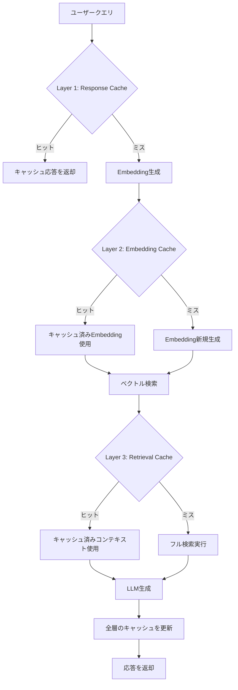

# RAGパイプラインの3層セマンティックキャッシュ設計で応答速度を65倍改善する

## この記事でわかること

- RAGパイプラインにおけるEmbedding・検索・生成の**3層キャッシュアーキテクチャ**の設計と実装
- GPTCache・Redis・Qdrant・Upstashなど主要キャッシュバックエンドの特性比較と選定基準
- 偽陽性を19.3%から3.8%に低減する**キャッシュウォーミング戦略**の実践手法
- カテゴリ別閾値チューニング（コード系0.95/会話系0.85）でヒット率を向上させる方法
- 本番環境でのキャッシュ無効化・TTL管理・モニタリングの運用設計

## 対象読者

- **想定読者**: RAGシステムを本番運用中の中級〜上級エンジニア
- **必要な前提知識**:
  - Python 3.11+ の基礎文法
  - RAGパイプラインの基本構成（Embedding → Retrieval → Generation）
  - ベクトルデータベースの基本概念（類似度検索、コサイン距離）
  - セマンティックキャッシュの基礎概念（[基礎編はこちら](https://zenn.dev/0h_n0/articles/531d06b7a17e9d)を参照）

> **関連記事**: セマンティックキャッシュの基本実装（RedisVL/LangChain）は[セマンティックキャッシュ実装ガイド](https://zenn.dev/0h_n0/articles/531d06b7a17e9d)を、ゲートウェイ統合型は[LLMゲートウェイ×セマンティックキャッシュ](https://zenn.dev/0h_n0/articles/b28d70b4cebd6b)を参照してください。本記事はRAGパイプラインに特化した多層キャッシュ設計の発展記事です。

## 結論・成果

RAGパイプラインに3層セマンティックキャッシュを導入することで、brain.coの報告では**応答時間を6.5秒から100msに短縮（65倍改善）**し、Redisの報告では**LLM APIコストを最大68.8%削減**できます。さらに、InfoQが紹介した銀行業務の事例では、キャッシュウォーミング戦略により**偽陽性率を19.3%から3.8%に低減**しています。

ただし、キャッシュ設計を誤ると偽陽性（意味が異なるクエリにキャッシュヒットする）やキャッシュ汚染が発生します。本記事では、RAGの各段階に最適なキャッシュ層を配置し、精度と速度を両立させる設計パターンを解説します。

## RAGパイプラインにおけるキャッシュの課題を理解する

RAGパイプラインは、**Embedding生成 → ベクトル検索 → LLM生成**の3段階で構成されます。各段階のレイテンシは大きく異なり、キャッシュの効果も段階ごとに変わります。

### 各段階のレイテンシ分布

Dataquestの検証によると、RAGパイプラインの各段階のレイテンシは以下のように分布しています。

| 段階 | 平均レイテンシ | パイプライン内の割合 | キャッシュ効果 |
|------|---------------|-------------------|--------------|
| Embedding生成 | 約208ms | 3.4% | 中（計算コスト削減） |
| ベクトル検索 | 約5ms | 0.1% | 低（既に高速） |
| LLM生成 | 約5,927ms | 96.5% | 高（最大のボトルネック） |

LLM生成がパイプライン全体の**96.5%を占めるボトルネック**です。単純にResponse Cacheだけを導入すれば最大の効果が得られるように見えますが、実際にはEmbedding CacheやRetrieval Cacheを組み合わせることで、キャッシュミス時の応答速度も改善でき、総合的なユーザー体験が向上します。

### 単層キャッシュの限界

Response Cache（LLM応答のキャッシュ）だけでは、以下の問題が残ります。

- **キャッシュミス時のレイテンシ**: ミス時は6秒以上かかるため、体験の格差が大きい
- **ヒット率の天井**: ユニークなクエリが多い環境ではヒット率が2-3%にとどまる（brain.coの報告による）
- **キャッシュ汚染のリスク**: 1層で全クエリを処理するため、閾値設定の最適化が難しい

これらの課題を解決するのが、3層キャッシュアーキテクチャです。

## 3層セマンティックキャッシュアーキテクチャを設計する

3層キャッシュは、RAGパイプラインの各段階にキャッシュを配置し、段階的にレイテンシとコストを削減する設計パターンです。

### アーキテクチャ全体像



### Layer 1: Response Cache（応答キャッシュ）

**目的**: セマンティックに類似したクエリに対して、LLM生成をスキップして即座に応答を返す

Response Cacheは最も効果が大きい層です。クエリのEmbeddingを生成し、過去の応答済みクエリとの類似度を計算します。閾値を超えた場合、キャッシュされた応答をそのまま返却します。

```python
# response_cache.py
import hashlib
import time
from typing import Optional


class ResponseCache:
    """Layer 1: セマンティック応答キャッシュ"""

    def __init__(self, vector_store, embedding_model,
                 similarity_threshold: float = 0.92, ttl: int = 3600):
        self.vector_store = vector_store
        self.embedding_model = embedding_model
        self.similarity_threshold = similarity_threshold
        self.ttl = ttl

    async def get(self, query: str) -> Optional[str]:
        query_embedding = await self.embedding_model.embed(query)
        results = await self.vector_store.search(
            query_vector=query_embedding, limit=1,
            score_threshold=self.similarity_threshold,
        )
        if results and results[0].score >= self.similarity_threshold:
            return results[0].payload["response"]
        return None

    async def put(self, query: str, response: str, metadata: dict) -> None:
        query_embedding = await self.embedding_model.embed(query)
        normalized = query.strip().lower()
        cache_key = hashlib.sha256(f"{metadata.get('model', 'default')}:{normalized}".encode()).hexdigest()
        await self.vector_store.upsert(
            id=cache_key, vector=query_embedding,
            payload={"query": query, "response": response,
                     "created_at": time.time(), "ttl": self.ttl},
        )
```

**なぜResponse Cacheを最前段に配置するか:**
- LLM生成がレイテンシの96.5%を占めるため、ヒット時の効果が最大
- Embedding生成（約208ms）もスキップできるため、キャッシュヒット時は1ms以下で応答可能

**注意点:**
> Response Cacheの閾値を低く設定しすぎると、意味が微妙に異なるクエリに誤った応答を返す偽陽性が発生します。金融・医療など正確性が求められるドメインでは閾値0.95以上を推奨します。

### Layer 2: Embedding Cache（埋め込みキャッシュ）

**目的**: 同一または類似クエリのEmbedding再計算を防ぐ

Embedding生成は1回あたり約208msですが、大量クエリ環境ではAPIコストとレイテンシの両面で無視できません。完全一致キャッシュとセマンティックキャッシュを組み合わせた2段階方式が有効です。

```python
# embedding_cache.py
import hashlib
import json


class EmbeddingCache:
    """Layer 2: 完全一致キャッシュによるEmbedding再計算防止"""

    def __init__(self, redis_client, embedding_model):
        self.redis = redis_client
        self.embedding_model = embedding_model

    def _exact_key(self, text: str) -> str:
        normalized = text.strip().lower()
        return f"emb:exact:{hashlib.sha256(normalized.encode()).hexdigest()}"

    async def get_embedding(self, text: str) -> list[float]:
        # Stage 1: 完全一致キャッシュ（<1ms）
        exact_key = self._exact_key(text)
        cached = await self.redis.get(exact_key)
        if cached is not None:
            return json.loads(cached)

        # Stage 2: 新規生成してキャッシュ
        embedding = await self.embedding_model.embed(text)
        await self.redis.setex(exact_key, 3600, json.dumps(embedding))
        return embedding
```

**なぜ完全一致を最前段にするか:**
- 完全一致チェック（ハッシュ比較）は1ms以下で完了
- RAGシステムでは同一ドキュメントのチャンクEmbeddingを繰り返し生成するケースが多い
- Embedding APIの呼び出し回数を直接削減でき、コスト効果が高い

### Layer 3: Retrieval Cache（検索結果キャッシュ）

**目的**: 類似クエリに対するベクトル検索結果（取得コンテキスト）をキャッシュし、検索+LLM推論を効率化する

Retrieval CacheはResponse Cacheより広い閾値（0.70-0.80）で動作します。完全に同じ応答を返すのではなく、検索で取得したコンテキストをキャッシュし、LLM生成は新たに実行します。これにより、クエリの表現が異なっても同じトピックについての質問であれば検索コストを削減できます。

```python
# retrieval_cache.py
from typing import Optional


class RetrievalCache:
    """Layer 3: 検索結果キャッシュ（広い閾値で検索コスト削減）"""

    def __init__(self, vector_store, similarity_threshold: float = 0.75, ttl: int = 1800):
        self.vector_store = vector_store
        self.similarity_threshold = similarity_threshold
        self.ttl = ttl

    async def get_context(self, query_embedding: list[float]) -> Optional[list[dict]]:
        results = await self.vector_store.search(
            query_vector=query_embedding, limit=1,
            score_threshold=self.similarity_threshold,
        )
        if results and results[0].score >= self.similarity_threshold:
            return results[0].payload["chunks"]
        return None

    async def put_context(self, query_embedding: list[float], chunks: list[dict], query_text: str) -> None:
        import hashlib, json, time
        cache_id = hashlib.sha256(json.dumps(query_embedding[:8]).encode()).hexdigest()
        await self.vector_store.upsert(
            id=f"ret:{cache_id}", vector=query_embedding,
            payload={"chunks": chunks, "query_text": query_text,
                     "created_at": time.time(), "ttl": self.ttl},
        )
```

**なぜ閾値を低く設定するか:**
- Retrieval Cacheは「同じトピックについての検索結果」を共有する目的のため、厳密な一致は不要
- 閾値0.75では偽陽性のリスクがあるが、最終的にLLMが新たな応答を生成するため、誤った応答が直接返されることはない
- Redisの報告によると、このアプローチでResponse Cacheのミス時でも応答時間を約40%短縮できる

**注意点:**
> Retrieval Cacheは、ナレッジベースが頻繁に更新される環境では無効化戦略が重要です。古いコンテキストがキャッシュされたまま残ると、最新情報を反映できなくなります。

## 3層キャッシュを統合したRAGパイプラインを実装する

3つのキャッシュ層を統合し、FastAPIで動作するRAGパイプラインの全体実装を見ていきましょう。

```python
# cached_rag_pipeline.py
import time
import logging
from typing import Optional

logger = logging.getLogger(__name__)


class CachedRAGPipeline:
    """3層セマンティックキャッシュ統合RAGパイプライン"""

    def __init__(self, response_cache, embedding_cache, retrieval_cache,
                 vector_db, llm_client):
        self.response_cache = response_cache      # Layer 1
        self.embedding_cache = embedding_cache    # Layer 2
        self.retrieval_cache = retrieval_cache    # Layer 3
        self.vector_db = vector_db
        self.llm = llm_client

    async def query(self, user_query: str) -> tuple[str, dict]:
        start = time.perf_counter()

        # === Layer 1: Response Cache ===
        cached_response = await self.response_cache.get(user_query)
        if cached_response is not None:
            latency = (time.perf_counter() - start) * 1000
            logger.info("cache_hit", extra={"layer": "response", "ms": latency})
            return cached_response, {"hit": "response", "ms": latency}

        # === Layer 2: Embedding Cache ===
        query_embedding = await self.embedding_cache.get_embedding(user_query)

        # === Layer 3: Retrieval Cache ===
        cached_chunks = await self.retrieval_cache.get_context(query_embedding)
        if cached_chunks is not None:
            chunks = cached_chunks
        else:
            results = await self.vector_db.search(query_vector=query_embedding, limit=5)
            chunks = [r.payload for r in results]
            await self.retrieval_cache.put_context(query_embedding, chunks, user_query)

        # === LLM生成 ===
        context = "\n\n".join(c.get("text", "") for c in chunks)
        response = await self.llm.generate(
            prompt=f"コンテキスト:\n{context}\n\n質問: {user_query}",
        )

        # Response Cacheに格納
        await self.response_cache.put(user_query, response, {"model": self.llm.model_name})

        total_ms = (time.perf_counter() - start) * 1000
        logger.info("pipeline_complete", extra={"ms": total_ms})
        return response, {"hit": None, "ms": total_ms}
```

**なぜこの層順序を選んだか:**
- Layer 1（Response Cache）のヒット時は後続処理がすべてスキップされ、レイテンシが最小（1ms以下）
- Layer 2（Embedding Cache）はLayer 1ミス後に必ず必要になるため、次に配置
- Layer 3（Retrieval Cache）は検索コスト削減が目的で、LLM生成は常に実行されるため最後

**注意点:**
> 3層すべてを導入するとキャッシュ管理の複雑さが増します。Dataquestの検証では、まずResponse Cacheのみ導入し、ヒット率が40%を下回る場合にEmbedding CacheとRetrieval Cacheを段階的に追加するアプローチを推奨しています。

## キャッシュバックエンドを選定する

セマンティックキャッシュのバックエンドは、パフォーマンス要件と運用体制に応じて選定する必要があります。

### 主要バックエンドの比較

| バックエンド | 検索レイテンシ | スケーラビリティ | マネージド | 特徴 |
|-------------|--------------|----------------|----------|------|
| **Redis + RedisVL** | <1ms | 水平スケール可 | AWS MemoryDB等 | 統合インフラ（キャッシュ+ベクトル検索+状態管理） |
| **Qdrant** | 1-5ms | クラスタ対応 | Qdrant Cloud | フィルタリング・ペイロード管理に優れる |
| **GPTCache (Zilliz)** | バックエンド依存 | バックエンド依存 | Zilliz Cloud | LangChain/LlamaIndex統合、モジュール式設計 |
| **Upstash Vector** | 5-15ms | 自動スケール | フルマネージド | サーバーレス、従量課金、インフラ管理不要 |
| **ChromaDB** | 1-3ms | 単一ノード | なし | 開発・プロトタイプ向け、軽量 |
| **Azure Cosmos DB** | 5-10ms | グローバル分散 | フルマネージド | Azureエコシステム統合、グローバルレプリケーション |

### 選定の判断基準

**Redisを選ぶケース:**
- P95レイテンシ1ms以下が要件
- キャッシュ・ベクトル検索・セッション管理を統一インフラで運用したい
- Redisの報告によると、Redis 8.6ではハッシュ・ソート済みセットのメモリオーバーヘッドが40%削減されている

**GPTCacheを選ぶケース:**
- LangChainまたはLlamaIndexを既に使用している
- バックエンドを柔軟に切り替えたい（FAISS → Qdrant → Redis等）
- カスタムの類似度関数やキャッシュ戦略を実装したい

**Upstash Vectorを選ぶケース:**
- インフラ管理を完全に委任したい
- トラフィックの変動が大きく、サーバーレスの従量課金が適している
- ただし、検索レイテンシはRedisより高く、P95で5-15ms程度

**注意点:**
> ChromaDBは開発環境では使いやすいですが、クラスタ対応がないため本番環境には適していません。プロトタイプからRedisやQdrantへの移行パスを事前に設計してください。

## 偽陽性を低減するキャッシュウォーミング戦略を実装する

セマンティックキャッシュの最大の課題は**偽陽性**（意味が異なるクエリにキャッシュヒットする）です。InfoQが紹介した銀行業務の事例では、閾値チューニングだけでなく**キャッシュ設計そのもの**が偽陽性削減の鍵であると報告されています。

### 偽陽性の改善推移

InfoQの事例では、以下のように段階的に偽陽性率を改善しています。

| 段階 | アプローチ | 偽陽性率 |
|------|----------|---------|
| ベースライン | ゼロショット、閾値0.7 | 19.3% |
| 閾値最適化 | 閾値チューニング | 13.4% |
| キャッシュウォーミング | 100 FAQ + 300ディストラクタ | 5.8% |
| 品質フィルタリング | キャッシュ入力の品質管理 | 3.8% |

### キャッシュウォーミングの実装

キャッシュウォーミングとは、本番稼働前に**ゴールドスタンダードのQAペア**と**ディストラクタ（誤認識を防ぐための類似だが異なるクエリ）**をキャッシュにプリロードする手法です。

```python
# cache_warming.py
from dataclasses import dataclass


@dataclass
class GoldStandardQA:
    question: str
    answer: str
    category: str


class CacheWarmer:
    """キャッシュウォーミング: ゴールドスタンダードQAをプリロード"""

    def __init__(self, response_cache):
        self.cache = response_cache

    async def warm(self, qa_pairs: list[GoldStandardQA]) -> dict:
        stats = {"loaded": 0, "failed": 0}
        for qa in qa_pairs:
            try:
                await self.cache.put(
                    query=qa.question, response=qa.answer,
                    metadata={"source": "gold_standard", "category": qa.category},
                )
                stats["loaded"] += 1
            except Exception:
                stats["failed"] += 1
        return stats


# 使用例: 銀行FAQのウォーミング
FAQ_PAIRS = [
    GoldStandardQA("口座残高を確認するには", "アプリのホーム画面で...", "account"),
    GoldStandardQA("口座を解約するには", "カスタマーサポートに...", "account"),
    # 表面的に類似するが異なる回答 → キャッシュ内の意味的境界を強化
]
```

**なぜキャッシュ設計がモデル最適化より重要か:**

InfoQの報告では、「*Garbage in, garbage out*」の原則がキャッシュにも適用されると指摘しています。タイプミスや曖昧な表現のクエリがキャッシュを汚染すると、どれだけモデルを最適化しても偽陽性は改善しません。キャッシュへの入力品質を管理することが、閾値チューニングよりも効果的です。

## カテゴリ別閾値チューニングでヒット率を向上させる

すべてのクエリに同一閾値を適用するのは非効率です。クエリの種類（カテゴリ）によって、許容される類似度の幅が異なるためです。

### カテゴリ別推奨閾値

| カテゴリ | 推奨閾値 | 理由 |
|---------|---------|------|
| **コード生成** | 0.95 | 変数名・パラメータの違いで出力が大きく変わる |
| **FAQ/定型回答** | 0.85 | 表現の揺れが多いが回答は同一 |
| **検索クエリ** | 0.90 | 中程度の精度が必要 |
| **会話/チャット** | 0.85 | 文脈依存が高く、キャッシュ効果は限定的 |
| **金融/医療** | 0.95+ | 誤応答のリスクが高い |

### カテゴリ別閾値の実装

```python
# category_threshold.py
from enum import Enum

class QueryCategory(Enum):
    CODE = "code"
    FAQ = "faq"
    SEARCH = "search"
    CRITICAL = "critical"  # 金融・医療

CATEGORY_THRESHOLDS: dict[QueryCategory, float] = {
    QueryCategory.CODE: 0.95,
    QueryCategory.FAQ: 0.85,
    QueryCategory.SEARCH: 0.90,
    QueryCategory.CRITICAL: 0.97,
}

class CategoryAwareCache:
    """カテゴリ別閾値でResponse Cacheを最適化"""

    def __init__(self, response_cache, classifier):
        self.cache = response_cache
        self.classifier = classifier

    async def get(self, query: str) -> tuple[str | None, QueryCategory]:
        category = await self.classifier.classify(query)
        threshold = CATEGORY_THRESHOLDS[category]
        original = self.cache.similarity_threshold
        self.cache.similarity_threshold = threshold
        try:
            return await self.cache.get(query), category
        finally:
            self.cache.similarity_threshold = original
```

**最初は均一閾値0.90から始めてよいか:**

はい。カテゴリ分類器の構築にはコストがかかるため、まず均一閾値0.90で運用を開始し、キャッシュヒット率と偽陽性率のモニタリングデータが蓄積されてからカテゴリ別チューニングに移行することを推奨します。

## キャッシュ無効化とモニタリングを運用設計する

キャッシュの鮮度管理は、セマンティックキャッシュの運用で最も見落とされがちな要素です。

### TTL戦略

各キャッシュ層に適切なTTLを設定します。

```python
# ttl_config.py

CACHE_TTL_CONFIG = {
    "response_cache": {
        "default_ttl": 3600,       # 1時間
        "faq_ttl": 86400,          # 24時間（FAQ応答は安定）
        "code_ttl": 1800,          # 30分（コード関連は変化が速い）
        "critical_ttl": 600,       # 10分（金融・医療は鮮度重要）
    },
    "embedding_cache": {
        "default_ttl": 86400,      # 24時間（Embeddingモデル更新まで有効）
    },
    "retrieval_cache": {
        "default_ttl": 1800,       # 30分（ナレッジベース更新頻度に合わせる）
    },
}
```

### イベント駆動型キャッシュ無効化

TTLだけでは、ナレッジベースが更新されたときにキャッシュが古いまま残る問題があります。dasroot.netの記事では、以下の3パターンが紹介されています。

| 無効化戦略 | メリット | デメリット |
|-----------|---------|----------|
| **TTL** | 実装が簡単、自動的に古いキャッシュが削除される | 不必要なキャッシュミスが発生する場合がある |
| **イベント駆動** | ナレッジベース更新時に即座に反映 | Kafka/RabbitMQ等のインフラが必要 |
| **バージョニング** | 分散環境での一貫性を保証 | バージョン管理の複雑さが増加 |

無効化の実装ポイントは以下のとおりです。

- **ナレッジベース更新時**: Layer 1（Response Cache）とLayer 3（Retrieval Cache）を無効化。Layer 2（Embedding Cache）はドキュメント内容に依存しないため保持
- **Embeddingモデル更新時**: ベクトル空間が変わるため**全3層をフラッシュ**。キャッシュウォーミングの再実行が必要

### モニタリング指標

本番環境では、以下の指標をダッシュボードで可視化します。

**特に注目すべき指標:**
- **Response Cacheヒット率**: 30%以上が目安。20%未満ならクエリの多様性が高く、Retrieval Cacheの効果が相対的に増す
- **偽陽性率**: 5%以下を維持。超える場合は閾値を上げるか、キャッシュウォーミングを強化
- **P95レイテンシ**: キャッシュミス時のP95が基準。Redisの報告ではTTFT 2秒以下を推奨

## よくある問題と解決方法

| 問題 | 原因 | 解決方法 |
|------|------|----------|
| キャッシュヒット率が5%以下 | クエリの多様性が高い | Retrieval Cache（Layer 3）を活用し、閾値を0.75に下げる |
| 偽陽性で誤った応答が返る | 閾値が低すぎる / キャッシュ汚染 | カテゴリ別閾値を導入、キャッシュウォーミングでゴールドスタンダードを投入 |
| キャッシュ更新後も古い応答が残る | TTLが長すぎる / 無効化漏れ | イベント駆動型無効化を導入、ドキュメント更新時にLayer 1,3を即時無効化 |
| Embeddingモデル更新後にヒット率が激減 | ベクトル空間の不整合 | 全3層をフラッシュし、キャッシュウォーミングを再実行 |
| メモリ使用量が急増 | キャッシュエントリの無制限増加 | maxmemory-policyをallkeys-lruに設定、LRU（Least Recently Used）で自動削除 |
| マルチテナント環境でキャッシュ干渉 | テナント間でキャッシュが共有される | キャッシュキーにテナントIDをプレフィックスとして付与 |

## まとめと次のステップ

**まとめ:**

- RAGパイプラインの3層セマンティックキャッシュ（Response → Embedding → Retrieval）により、**応答時間を65倍改善**し**APIコストを最大68.8%削減**できる
- **偽陽性対策はキャッシュ設計が最重要**であり、ゴールドスタンダードQA+ディストラクタのプリロードで19.3%→3.8%に改善可能
- **カテゴリ別閾値チューニング**（コード系0.95/FAQ系0.85）によりヒット率と精度を両立
- **段階的導入**が実践的で、まずResponse Cacheのみ、次にヒット率に応じてEmbedding/Retrieval Cacheを追加する
- **キャッシュ無効化戦略**（TTL + イベント駆動）とモニタリングが本番運用の鍵

**次にやるべきこと:**

- まずResponse Cacheを単一層で導入し、1週間のヒット率データを収集する
- 偽陽性率が5%を超える場合は、キャッシュウォーミングとカテゴリ別閾値を検討する
- [セマンティックキャッシュ基礎編](https://zenn.dev/0h_n0/articles/531d06b7a17e9d)でRedisVLの実装を確認し、本記事の3層設計と組み合わせる

## 参考

- [Semantic Caching: Accelerating beyond basic RAG with up to 65x latency reduction (brain.co)](https://brain.co/blog/semantic-caching-accelerating-beyond-basic-rag)
- [RAG at Scale: How to Build Production AI Systems in 2026 (Redis)](https://redis.io/blog/rag-at-scale/)
- [Reducing False Positives in RAG Semantic Caching: a Banking Case Study (InfoQ)](https://www.infoq.com/articles/reducing-false-positives-retrieval-augmented-generation/)
- [Semantic Caching and Memory Patterns for Vector Databases (Dataquest)](https://www.dataquest.io/blog/semantic-caching-and-memory-patterns-for-vector-databases/)
- [Caching Strategies for LLM Responses (dasroot.net, 2026/02)](https://dasroot.net/posts/2026/02/caching-strategies-for-llm-responses/)
- [Semantic Cache: Accelerating AI with Lightning-Fast Data Retrieval (Qdrant)](https://qdrant.tech/articles/semantic-cache-ai-data-retrieval/)
- [Enhancing adversarial resilience in semantic caching for secure RAG systems (Nature, 2026)](https://www.nature.com/articles/s41598-026-36721-w)

---

:::message
この記事はAI（Claude Code）により自動生成されました。内容の正確性については複数の情報源で検証していますが、実際の利用時は公式ドキュメントもご確認ください。
:::
