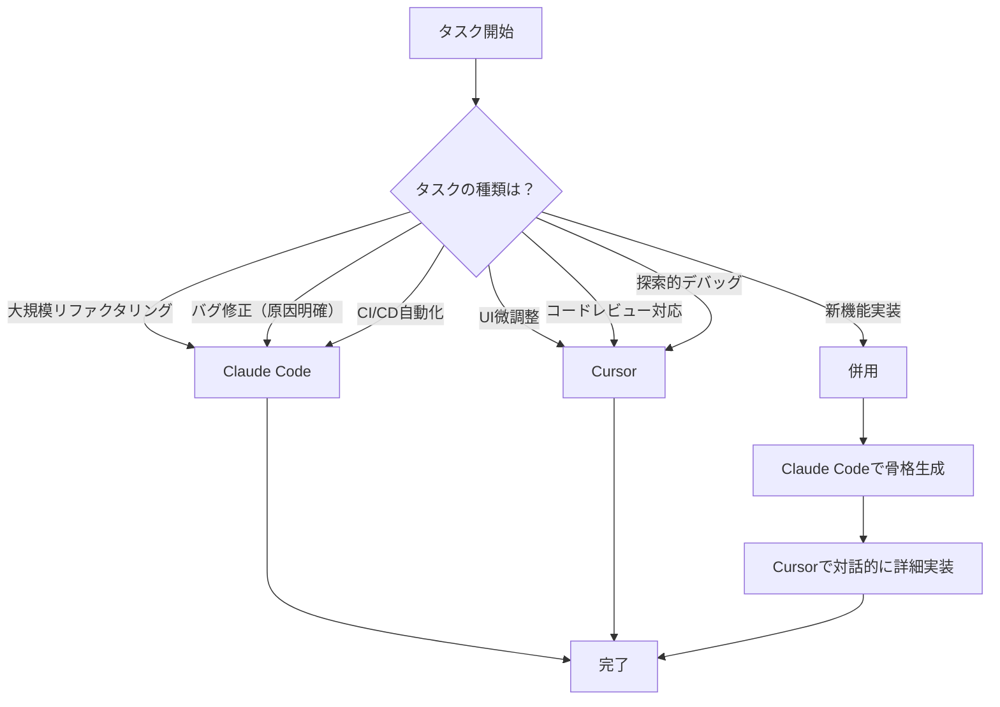
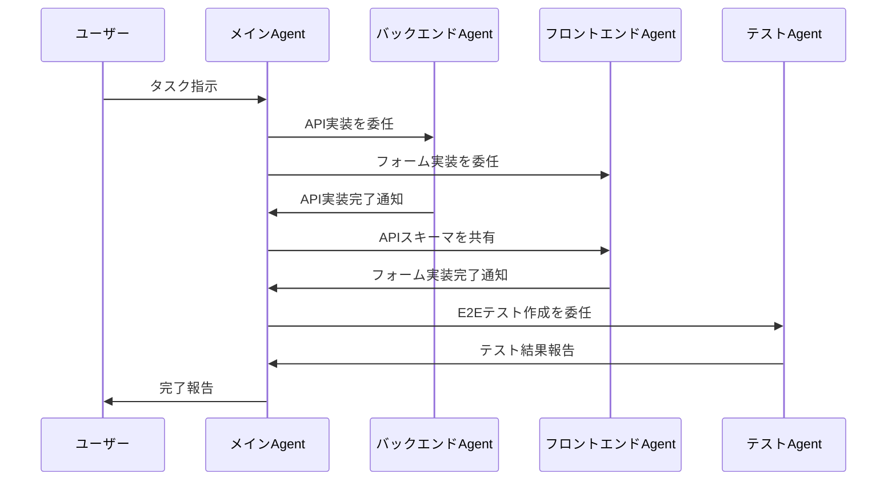

# Claude CodeとCursor IDEの併用で自動コーディング精度を高める実践手法

## この記事でわかること

- Claude CodeとCursor IDEのアーキテクチャの違いと、タスク種別ごとの使い分け基準
- **コンテキストエンジニアリング**によりAIコーディングの精度を向上させる具体的手法（CLAUDE.md設計、Cursor Rules設定）
- 両ツールをMCPサーバー経由で統合し、一貫した開発環境を構築する方法
- 2026年時点のベンチマーク（SWE-bench 80.9%、トークン消費5.5倍差）に基づくツール選定の判断基準
- 実装上のよくある課題（コンテキスト溢れ、ハルシネーション、コード品質低下）への対処パターン

## 対象読者

- **想定読者**: Claude CodeまたはCursor IDEをすでに業務で使用している中級〜上級エンジニア
- **必要な前提知識**:
  - Claude Code CLI（v2.x+）の基本操作経験
  - Cursor IDE（v1.x+）のAgent/Composerモードの利用経験
  - Git、TypeScript/Pythonの基礎知識
  - LLMベースのコーディング支援ツールの基本概念

## 結論・成果

Claude CodeとCursor IDEは「どちらが上か」ではなく「どう組み合わせるか」が2026年の実践解です。Anthropicの公式情報によると、CLAUDE.mdの体系的な最適化だけでコーディング精度が5〜10%向上し、イテレーション回数が35%削減されたとの報告があります。SWE-benchではClaude Opus 4.5/4.6が80.9%/80.8%を記録し、同一タスクでのトークン消費量はCursorの約1/5.5です。一方でCursorはTab補完の平均レイテンシ35msやVisual Web Editorなど、インタラクティブな開発体験で差別化しています。本記事では、両ツールの特性を活かした併用戦略とコンテキストエンジニアリングの実践手法を解説します。

関連記事: [Claude Codeプロンプト管理術：コーディング精度を10%向上させる実践ガイド](https://zenn.dev/0h_n0/articles/21f1740dc0ddd9)

## Claude CodeとCursor IDEのアーキテクチャを理解する

両ツールは設計思想が根本的に異なります。Claude Codeは**ターミナルネイティブのエージェント型ツール**で、コードベース全体を自動マッピングし、ファイル操作・ターミナルコマンド実行・Git操作を自律的に行います。対してCursorは**VS Codeフォークのエディタ統合型ツール**で、AIがエディタのあらゆる機能に統合され、リアルタイムの補完と対話的なフィードバックを提供します。

### 3層フレームワークでの分類

両ツールの機能を整理するために、以下の3層フレームワークが有用です。

| 層 | 役割 | Claude Code | Cursor |
|---|---|---|---|
| **Agent層** | 自律実行 | メイン機能（ターミナルから大規模タスクを委任） | Background Agent（クラウドVMで自律実行） |
| **Interaction層** | 対話的編集 | 対話モード（質問→修正のサイクル） | Agent/Chat/Composerモード（エディタ内リアルタイム編集） |
| **Integration層** | 外部連携 | MCP、Hooks、Skills | MCP、.cursor/rules/*.mdc |

**よくある間違い**: Claude Codeを「CLIだから低機能」と判断するケースがあります。実際にはAgent Teams機能（2026年2月リリース）により複数エージェントが協調動作し、バックエンドAPIリファクタリング・フロントエンド更新・テスト作成を並列実行できます。ターミナル上で動作することは制約ではなく、Unix哲学に基づいたパイプライン統合の強みです。

### ベンチマークで見る精度の違い

2026年2月時点のSWE-bench Verifiedスコアを比較します。

| モデル / ツール | SWE-bench スコア | 備考 |
|---|---|---|
| Claude Opus 4.5（Claude Code経由） | 80.9% | 業界最高スコア |
| Claude Opus 4.6（Claude Code経由） | 80.8% | Opus 4.5とほぼ同等 |
| Claude Sonnet 4.6（Claude Code経由） | 79.9% | コスト効率が高い |
| Cursor + Claude Opus 4.6 | 75.1%（推定） | IDEオーバーヘッドあり |
| GitHub Copilot（Claude 3.7 Sonnet） | 56.0% | 差が大きい |

> **注意**: SWE-benchのスコアはモデル単体の能力とツールとしての性能を分けて考える必要があります。Cursorは同じClaude Opus 4.6を使っていても、IDEの統合レイヤーによるコンテキスト処理の違いでスコアが変動します。

**制約条件**: SWE-benchはオープンソースのバグ修正タスクが中心です。新規機能開発やUIデザインなど、異なるタスク種別では結果が異なる可能性があります。

## コンテキストエンジニアリングで精度を向上させる

Martin Fowler氏の定義によると、コンテキストエンジニアリングとは「モデルが見るものをキュレーションし、より良い結果を得ること」です。従来のプロンプトエンジニアリングがプロンプト単体の改善に焦点を当てるのに対し、コンテキストエンジニアリングはプロンプト・コンテキストインターフェース・設定機能を包括的に設計します。

### CLAUDE.mdの設計原則

Claude Codeの精度を左右する最も重要な設定ファイルがCLAUDE.mdです。Anthropicの公式ガイドラインに基づく設計原則を紹介します。

```markdown
# CLAUDE.md 設計テンプレート（推奨50-100行）

## プロジェクト概要
- 技術スタック: Next.js 15.x, TypeScript 5.7, PostgreSQL 17
- パッケージマネージャ: pnpm
- テストフレームワーク: Vitest + Playwright

## コーディング規約
- 型定義: Zodスキーマを単一ソースとして使い、TypeScript型を派生させる
- エラーハンドリング: Result型パターンを使用（例外throwは外部ライブラリ境界のみ）
- ファイル構成: feature-based directory structure

## テスト方針
- 新規機能: 必ずユニットテストを同時作成
- バグ修正: 再現テスト(Red)を先に作成
- E2E: Playwrightで主要ユーザーフローをカバー

## 禁止事項
- any型の使用禁止（unknown + 型ガードを使用）
- console.logでのデバッグ禁止（構造化ロガーを使用）
- default exportの使用禁止（named exportのみ）

## 参照
- API設計: src/api/README.md:1-50
- DB スキーマ: prisma/schema.prisma:1-100
```

**なぜこの構造を選んだか:**

- **50-100行に収める理由**: Anthropicの公式情報によると、フロンティアモデルは約150-200の指示を合理的な精度で追従できますが、指示数が増えるほど各指示への注意力が分散します。不要な指示を削ることで、重要な規約の遵守率が向上します
- **コードスニペットを含めない理由**: CLAUDE.mdに埋め込んだコード例は時間とともに陳腐化します。代わりに`file:line`形式で実コードへの参照を記載し、常に最新のコードをコンテキストとして読み込ませます
- **禁止事項の明示**: 「〜してください」より「〜しないでください」のほうがLLMの行動制約として機能しやすいことが実践で確認されています

**ハマりポイント**: LLM生成のCLAUDE.mdを使うと、精度がかえって低下します。ETH ZurichとDeepMindの2026年2月の研究によると、LLM生成のコンテキストファイルはタスク成功率を約2-3%低下させ、推論コストも20%以上増加しました。一方、開発者自身が書いたコンテキストファイルでは約4%の精度向上が見られました。

### Cursor Rulesの設計原則

Cursorでは2026年時点で`.cursorrules`は非推奨となり、`.cursor/rules/`ディレクトリ内の個別`.mdc`ファイルに移行しています。

```markdown
# .cursor/rules/typescript.mdc
---
description: TypeScriptファイルのコーディング規約
globs: ["**/*.ts", "**/*.tsx"]
alwaysApply: false
---

## 型安全性
- any型は使用しない。unknown + 型ガードで対応する
- 外部APIレスポンスは必ずZodでバリデーションする
- genericsの型パラメータには意味のある名前をつける（T → TUser, TResponse）

## インポート
- 絶対パスインポートを使用する（@/ prefix）
- バレルエクスポート（index.ts）は使用しない
```

```markdown
# .cursor/rules/testing.mdc
---
description: テストファイルの作成規約
globs: ["**/*.test.ts", "**/*.spec.ts"]
alwaysApply: false
---

## テスト構造
- describe → it の2階層まで（ネストしすぎない）
- テスト名は日本語で「〜の場合、〜となること」形式
- モックは外部サービスのみ。DB等は実インスタンスを使用する
```

**なぜ分割するのか:**

- **1ファイル1関心**: 巨大なルールファイルはトークンを浪費し、無関係なルールが干渉します。TypeScriptファイルの編集時にPython用のルールが読み込まれる無駄を排除します
- **globs指定による精密な適用**: ファイルパターンを指定することで、必要な場面だけルールがアクティベートされます
- **alwaysApply: false**: 不要なルールが常時読み込まれることを防ぎ、コンテキストウィンドウを節約します

**制約条件**: Cursorのコンテキストウィンドウは公称200Kトークンですが、複数のユーザー報告によると、内部のトランケーションやパフォーマンスセーフガードにより70K-120Kトークンで制限がかかるケースがあります。ルールファイルの合計サイズは意識して管理する必要があります。

## タスク種別ごとの使い分け戦略を実装する

両ツールの特性を活かすには、タスクの性質に応じた使い分けが有効です。実際のプロジェクトで検証されたワークフローパターンを紹介します。

### フェーズ別の推奨ツール



### 併用ワークフローの実装例

新機能実装時の具体的な手順を示します。ここではNext.jsアプリケーションにユーザーダッシュボード機能を追加するケースを例に取ります。

**Step 1: Claude Codeで骨格を生成する**

```bash
# Claude Codeに大規模な構造生成を委任
claude "ユーザーダッシュボード機能を実装してください。
要件:
- /dashboard ルートにアクセス時、ログインユーザーのアクティビティ一覧を表示
- Server Componentで初期データフェッチ
- React Suspenseでローディング状態管理
- src/features/dashboard/ 配下に feature-based で構成

CLAUDE.mdの規約に従ってください。"
```

Claude Codeはコードベース全体を解析し、既存のファイル構成・命名規則・パターンを踏まえて複数ファイルを一括生成します。

**Step 2: Cursorで対話的に詳細を実装する**

```typescript
// src/features/dashboard/components/ActivityFeed.tsx
// Claude Codeが生成した骨格をCursorで改善する例

import { Suspense } from "react";
import { ActivityList } from "./ActivityList";
import { ActivitySkeleton } from "./ActivitySkeleton";
import { fetchUserActivities } from "../api/activities";

// Cursorのインライン編集で型定義を追加
interface ActivityFeedProps {
  userId: string;
  limit?: number;
  /** フィルタリング対象のアクティビティ種別 */
  activityTypes?: ActivityType[];
}

export async function ActivityFeed({
  userId,
  limit = 20,
  activityTypes,
}: ActivityFeedProps) {
  // Cursor Agent: "このfetchにエラーハンドリングを追加して"
  const result = await fetchUserActivities(userId, {
    limit,
    types: activityTypes,
  });

  if (!result.ok) {
    // Result型パターン: CLAUDE.mdの規約に従う
    return <ActivityFeedError error={result.error} />;
  }

  return (
    <Suspense fallback={<ActivitySkeleton count={limit} />}>
      <ActivityList activities={result.data} />
    </Suspense>
  );
}
```

**なぜこの分担が有効か:**

- Claude Codeは**コードベース全体のコンテキスト**を保持しながら一貫性のある構造を生成できます（トークン効率が5.5倍高い）
- Cursorは**エディタ内でのリアルタイムフィードバック**（Tab補完35ms、差分プレビュー）により、細かい調整を高速に反復できます
- 生成されたコードをCursorで開くと、型エラーや未使用変数がリアルタイムで可視化されます

### MCP統合で一貫した環境を構築する

Model Context Protocol（MCP）は両ツールで共通して使える統合プロトコルです。一度MCPサーバーを設定すれば、Claude CodeでもCursorでも同じサーバーを利用できます。

```json
// .cursor/mcp.json（Cursor側の設定）
{
  "mcpServers": {
    "postgres": {
      "command": "npx",
      "args": ["-y", "@modelcontextprotocol/server-postgres"],
      "env": {
        "DATABASE_URL": "postgresql://localhost:5432/myapp_dev"
      }
    },
    "github": {
      "command": "npx",
      "args": ["-y", "@modelcontextprotocol/server-github"],
      "env": {
        "GITHUB_TOKEN": "${GITHUB_TOKEN}"
      }
    }
  }
}
```

```bash
# Claude Code側の設定（CLI管理）
claude mcp add postgres -- npx -y @modelcontextprotocol/server-postgres
claude mcp add github -- npx -y @modelcontextprotocol/server-github
```

この統合により、どちらのツールからでも同じデータベーススキーマを参照し、同じGitHubイシューを確認しながらコーディングできます。

## 実装上のよくある課題と解決パターン

AIコーディングツールの精度を低下させる主要な課題と、実践的な解決策を整理します。

### 課題1: コンテキスト溢れ（Context Overflow）

大規模プロジェクトで作業すると、AIが参照すべきファイル数がコンテキストウィンドウを超え、重要な情報が欠落します。

**対処パターン: コンテキストの階層化**

```markdown
# CLAUDE.md（ルート: 常時ロード、50行以下）
## プロジェクト概要
- 技術スタック概要のみ記載

## 詳細参照
- API設計: @docs/api-conventions.md
- DB設計: @docs/database-design.md
- テスト方針: @docs/testing-strategy.md
```

Claude Codeではルートの`CLAUDE.md`に加え、サブディレクトリごとの`CLAUDE.md`が自動的にスコープされます。`src/api/CLAUDE.md`はAPI関連のタスクでのみ読み込まれ、不要なコンテキストを排除します。

Cursorでは`.cursor/rules/*.mdc`のglobs指定で同様のスコーピングを実現します。`globs: ["src/api/**/*.ts"]`と指定すれば、API関連ファイルの編集時だけルールが適用されます。

### 課題2: ハルシネーション（存在しないAPIの生成）

AIが存在しないライブラリのAPIや、古いバージョンのインターフェースを生成してしまうケースは頻繁に発生します。

**対処パターン: ドキュメントのコンテキスト注入**

```bash
# Claude Codeでの対処: 公式ドキュメントを直接参照させる
claude "Next.js 15.2のServer Actionsを使って
フォーム送信を実装してください。

参照: https://nextjs.org/docs/app/building-your-application/data-fetching/server-actions-and-mutations"
```

Cursorでは`@Docs`機能を使い、外部ドキュメントをインデックス化できます。

```
# Cursor Chatでの対処
@Docs nextjs を使って、Server Actionsでフォーム送信を実装してください。
バリデーションにはZodを使い、エラー状態はuseActionStateで管理してください。
```

Addy Osmani氏のワークフロー解説によると、「ニッチなライブラリや新しいAPIを使う場合、公式ドキュメントをコンテキストに貼ることで出力品質が大幅に向上する」とされています。これは、モデルが推測ではなく事実に基づいて生成できるようになるためです。

**トレードオフ**: ドキュメントを大量にコンテキストに含めるとトークン消費が増え、レスポンス速度が低下します。必要な部分のみを抽出して注入するのがベストプラクティスです。

### 課題3: コード品質の漸進的低下

長時間のセッションでAIとの対話を重ねると、コードの一貫性が徐々に低下する「ドリフト」が発生します。

**対処パターン: Granular Commitsとテスト駆動**

```bash
# 1. タスクを小さく分割して段階的にコミット
claude "fetchUserActivities関数のユニットテストを書いてください。
正常系3パターン、エラー系2パターンでお願いします。"

# テスト通過を確認
pnpm test src/features/dashboard/api/__tests__/activities.test.ts

# 即座にコミット（セーブポイント）
git add . && git commit -m "test: add unit tests for fetchUserActivities"

# 2. 実装に進む
claude "テストが通るようにfetchUserActivitiesを実装してください。"
```

**なぜGranular Commitsが有効か:**

- AIが誤った方向に進んだ場合、直前のコミットに即座にロールバックできます
- 小さなタスク単位で作業することで、コンテキストの一貫性が保たれます
- Addy Osmani氏のワークフロー解説では「コミットをセーブポイントとして扱う」ことが推奨されています

### よくある問題と解決方法

| 問題 | 原因 | 解決方法 |
|------|------|----------|
| Claude Codeが古いAPIを提案する | コンテキストに最新ドキュメントがない | URLを直接指定するか、MCPでドキュメントサーバーを接続 |
| Cursorのコンテキストが70Kで切れる | 内部トランケーション | .mdcのglobs指定でルールを精密にスコーピング |
| 両ツールで生成スタイルが不一致 | 設定ファイルの不統一 | CLAUDE.mdとCursor Rulesを同じ規約から生成 |
| Agent Teamsが競合する | 共有リソースへの同時アクセス | タスク分割を明確にし、ファイルレベルでの排他を設計 |
| 長時間セッションで品質が低下する | コンテキストドリフト | Granular Commits + 定期的にセッションをリセット |

## Agent TeamsとBackground Agentを活用した並列開発

2026年に入り、両ツールとも**マルチエージェント機能**を導入しました。これらを適切に活用することで、開発速度と精度を両立できます。

### Claude Code Agent Teams（2026年2月リリース）

Agent Teamsは複数のAIエージェントが共有タスクリストとメールボックスシステムを通じて直接通信し、協調動作する機能です。

```bash
# Agent Teamsの実行例: フルスタック機能の並列実装
claude "ユーザープロフィール編集機能を実装してください。

Agent分担:
1. バックエンドAgent: API endpoints (PATCH /api/users/:id) + バリデーション
2. フロントエンドAgent: プロフィール編集フォーム + 状態管理
3. テストAgent: 上記2つのAgentの出力に対するE2Eテスト

各Agentは完了時に他のAgentに通知してください。"
```

Agent Teamsの動作フローは以下の通りです。



**注意点**: Agent Teamsは各エージェントが独立したコンテキストウィンドウを持つため、全体のトークン消費量が単一エージェントの3-5倍になる場合があります。小規模なタスクでは単一エージェントのほうが効率的です。

### Cursor Background Agent

CursorのBackground Agentはクラウド上の隔離されたVMで動作し、自身のコードをテストし、作業の様子を動画で記録し、マージ可能なPull Requestを生成します。

```
# Cursor Background Agentの起動例
# Composerで以下を入力し、Background Agentとして実行

"user-settings APIのレスポンスにavatarUrlフィールドを追加してください。
- DBマイグレーション
- APIエンドポイント修正
- 型定義更新
- 既存テストの修正
完了したらPRを作成してください。"
```

Background Agentはバックグラウンドで動作するため、開発者はその間に別のタスクを進められます。完了時にPRが自動作成され、コード変更の差分レビューとテスト結果を確認できます。

**よくある間違い**: Background Agentに複雑な設計判断を含むタスクを任せると、意図しないアーキテクチャ変更が発生することがあります。Background Agentには「明確に定義された実装タスク」を与え、設計判断が必要な部分は対話的なAgentモードで進めましょう。

### 並列開発のベストプラクティス

| パターン | Claude Code Agent Teams | Cursor Background Agent |
|---|---|---|
| **適したタスク** | フルスタックの新機能実装、大規模リファクタリング | 定型的な修正タスク、機能追加 |
| **コンテキスト共有** | メールボックスシステムで明示的に共有 | VM内の同一リポジトリで暗黙的に共有 |
| **コスト** | 各Agent分のトークンが発生（3-5倍） | Cursorプランのクレジットを消費 |
| **出力形式** | ローカルのファイル変更 | PR（マージ可能な形式） |
| **監視方法** | ターミナルのリアルタイム出力 | ダッシュボード + 動画記録 |

**制約条件**: Agent TeamsもBackground Agentも、現時点では完全な自律動作を保証するものではありません。生成されたコードは必ず人間がレビューし、テストスイートが通過することを確認してから本番環境に適用してください。Anthropicの公式情報では「AIの生成コードの90%がClaude Code自身によって書かれている」と報告されていますが、これは熟練したプロンプト設計と継続的なフィードバックループの結果であり、ツールを導入しただけで達成できるものではありません。

## コスト最適化の観点から選択する

精度だけでなくコストも重要な判断基準です。2026年3月時点の料金体系を整理します。

### 月額コスト比較

| プラン | 月額 | 主な特徴 |
|---|---|---|
| Claude Pro | $20 | Claude Code基本利用。ヘビーユースにはMax 5x ($100) / Max 20x ($200) が必要 |
| Cursor Pro | $20 | クレジットベース。プレミアムモデル（Opus等）はクレジット消費が大きい |
| Claude API直接利用 | 従量課金 | Sonnet 4.6: 入力$3/100万トークン、出力$15/100万トークン |

**コスト試算例**: Sonnet 4.6をClaude Codeで使った場合、1回の実行あたり約5万入力トークン + 1万出力トークンで約$0.30。1日10回実行で月額約$90です。

**ハマりポイント**: Claude Proプラン($20/月)は手軽ですが、大規模リファクタリングなどのヘビーなタスクではレート制限にすぐ到達します。業務で常用する場合はMax 5x($100/月)以上、またはAPI直接利用を検討してください。

**トレードオフ**: CursorはClaude以外のモデル（GPT-4o、Gemini 3.1 Pro等）も選択できるため、タスクに応じてコストの安いモデルに切り替える柔軟性があります。Claude Codeは常にClaudeモデルのみですが、その分最適化が深く、同一タスクでのトークン消費が約1/5.5に抑えられます。

## まとめと次のステップ

**まとめ:**

- Claude CodeとCursor IDEは設計思想が異なる（ターミナルエージェント型 vs エディタ統合型）ため、**タスク種別に応じた使い分けが最も効果的**
- コンテキストエンジニアリング（CLAUDE.md 50-100行設計、Cursor Rules分割、MCP統合）により、AIコーディングの精度を体系的に向上できる
- SWE-benchで80.9%（Opus 4.5）の精度は、適切なコンテキスト設計によって実プロジェクトでも再現可能。ただしSWE-benchはバグ修正中心のベンチマークであり、新規機能開発では異なる結果になり得る
- 実装上の主要課題（コンテキスト溢れ、ハルシネーション、品質ドリフト）には、階層化・ドキュメント注入・Granular Commitsで対処する
- LLMは「自信過剰なジュニア開発者」として扱い、人間によるレビューとテスト駆動開発を組み合わせることで信頼性を担保する

**次にやるべきこと:**

1. 自分のプロジェクトにCLAUDE.md（50-100行）を作成し、コーディング規約・禁止事項・ファイル参照を記載する
2. Cursorの`.cursor/rules/`ディレクトリに言語別・関心別の`.mdc`ファイルを配置し、globs指定でスコーピングする
3. MCPサーバーを1つ（DB or GitHub）設定し、両ツールからの共通アクセスを確認する
4. 小さなタスク（バグ修正）でClaude Codeの自律実行を試し、次に新機能実装でCursorとの併用ワークフローを試す

## 参考

- [Claude Code: Best practices for agentic coding（Anthropic公式）](https://www.anthropic.com/engineering/claude-code-best-practices)
- [Context Engineering for Coding Agents（Martin Fowler）](https://martinfowler.com/articles/exploring-gen-ai/context-engineering-coding-agents.html)
- [My LLM coding workflow going into 2026（Addy Osmani）](https://addyosmani.com/blog/ai-coding-workflow/)
- [Claude Code vs Cursor 徹底比較（Qiita）](https://qiita.com/kai_kou/items/dff6191abefd5b76e1c3)
- [Cursor vs Claude Code in 2026: Which AI Coding Tool Fits Your Workflow（Particula）](https://particula.tech/blog/cursor-vs-claude-code-2026-guide)
- [What AGENTS.md Actually Does to Your Coding Agent（ETH Zurich / DeepMind研究）](https://agentic-academy.ai/posts/agents-md-context-files-evaluation/)
- [Claude Code vs Cursor: What to Choose in 2026（Builder.io）](https://www.builder.io/blog/cursor-vs-claude-code)

---

:::message
この記事はAI（Claude Code）により自動生成されました。内容の正確性については複数の情報源で検証していますが、実際の利用時は公式ドキュメントもご確認ください。
:::
