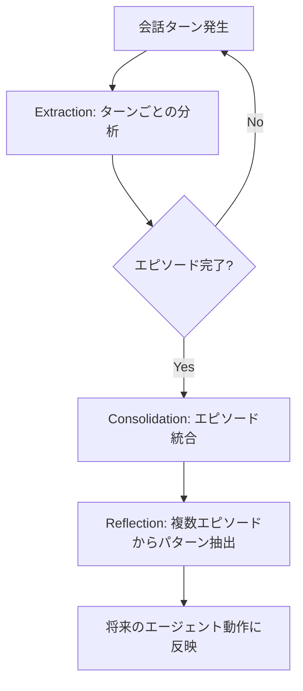
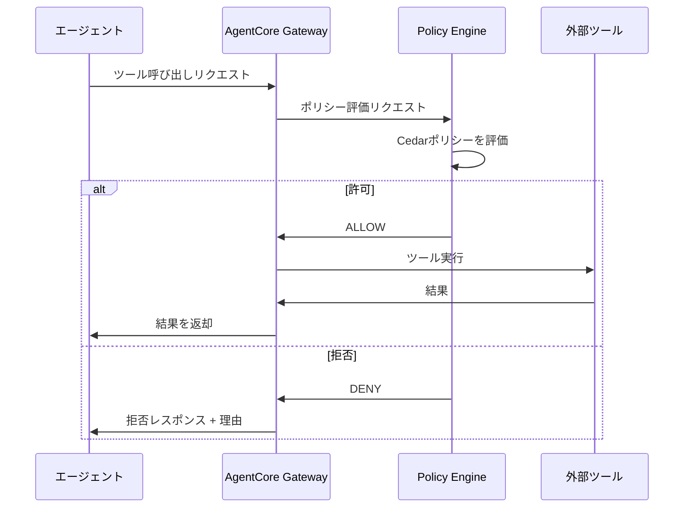
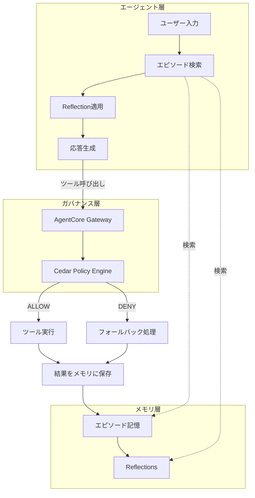

# Bedrock AgentCoreのエピソード記憶×Policy制御でマルチターンエージェントの応答精度を高める

## この記事でわかること

- **Bedrock AgentCore Memory**のエピソード記憶戦略（Extraction→Consolidation→Reflection）と**AgentCore Policy**（Cedar言語）を組み合わせたマルチターンエージェントの設計パターン
- エピソード記憶で蓄積した「成功パターン」と「失敗モード」をReflectionとして活用し、**ターン間一貫性**を向上させる実装手法
- 自然言語→Cedar自動変換によるポリシー定義と、Gateway経由のツール呼び出しインターセプトで**安全な自律学習ループ**を構築する方法
- ポリシー違反時のフォールバック設計と、エピソード肥大化を防ぐTTL・ネームスペース分離の運用指針
- エピソード記憶の「学習済み行動」にポリシーチェックを適用する**ガバナンス付き自律エージェント**の構築手順

## 対象読者

- **想定読者**: 中級〜上級のAWS・LLMアプリケーション開発者
- **必要な前提知識**:
  - AWS Bedrock（Converse API）の基本操作経験
  - Python 3.12+ / boto3 の基礎
  - AIエージェントの会話履歴管理の基本概念
  - IAMポリシーの基本理解

## 結論・成果

エピソード記憶とPolicy制御を組み合わせたマルチターンエージェントでは、以下の改善が見込まれます。

- **ターン間一貫性**: エピソード記憶のReflectionにより、過去の成功パターンを再利用することで、同種の問い合わせに対するエージェント応答のばらつきが低減されると報告されています（[AWS Machine Learning Blog](https://aws.amazon.com/blogs/machine-learning/build-agents-to-learn-from-experiences-using-amazon-bedrock-agentcore-episodic-memory/)）
- **不正操作の防止**: Policy制御（Cedar言語）により、エージェントのツール呼び出しをGateway層でインターセプトし、default-deny + forbid-winsセマンティクスで不正な操作を事前にブロック（[AgentCore Policy公式ドキュメント](https://docs.aws.amazon.com/bedrock-agentcore/latest/devguide/policy.html)）
- **運用コスト**: ポリシー評価はGateway層で実行されるため、エージェントコード側の変更は不要。ポリシー更新もCedar記述の変更のみで完結

> **制約**: エピソード記憶のReflection生成は非同期バックグラウンド処理のため、直後のターンには反映されない場合があります。また、Policyは2026年3月時点でGA（[AWS What's New](https://aws.amazon.com/about-aws/whats-new/2025/12/amazon-bedrock-agentcore-policy-evaluations-preview/)）ですが、一部機能はプレビュー段階です。

## エピソード記憶の仕組みを理解する

エピソード記憶は、AgentCore Memoryの長期記憶戦略の1つです。セマンティック記憶やサマリー記憶が「何を知っているか」を保存するのに対し、エピソード記憶は**「何を経験したか」**を構造化して保存します。

### Extraction→Consolidation→Reflectionの3段階処理

エピソード記憶は以下の3段階で処理されます（[公式ドキュメント](https://docs.aws.amazon.com/bedrock-agentcore/latest/devguide/episodic-memory-strategy.html)）。



**Extraction**（抽出）では、会話の各ターンを分析し、エピソードの完了判定を行います。公式ドキュメントのシステムプロンプトによると、各ターンについて以下の要素を構造化します（[System prompts for episodic memory](https://docs.aws.amazon.com/bedrock-agentcore/latest/devguide/memory-episodic-prompt.html)）。

```xml
<summary_turn>
  <turn_id>0</turn_id>
  <situation>ユーザーが注文キャンセルを要求</situation>
  <intent>キャンセルポリシーを確認して対応を判断</intent>
  <action>get_order_status ツールを呼び出し</action>
  <thought>注文ステータスにより対応が変わるため、まず現状を確認</thought>
  <assessment_assistant>Yes</assessment_assistant>
  <assessment_user>No</assessment_user>
</summary_turn>
```

**Consolidation**（統合）では、完了したエピソードの全ターンを1つのサマリーにまとめます。

```xml
<summary>
  <situation>出荷済み注文のキャンセル要求</situation>
  <intent>返品手続きへの誘導と送料負担の説明</intent>
  <assessment>Yes</assessment>
  <justification>返品ラベル発行と集荷手配を完了</justification>
  <reflection>出荷済み注文の場合、キャンセルではなく返品フローに
  誘導するのが正しいパターン。送料負担を先に説明すると
  ユーザーの不満を軽減できる</reflection>
</summary>
```

**Reflection**（リフレクション）は複数のエピソードを横断して分析し、再利用可能な知見を抽出します。

```xml
<reflections>
  <reflection>
    <operator>add</operator>
    <title>出荷済み注文の対応パターン</title>
    <use_cases>出荷済み商品のキャンセル・変更リクエスト時に適用。
    ユーザーが「キャンセルしたい」と言っても、実際には返品フローが
    必要なケースを正しく判別する</use_cases>
    <hints>1. まずget_order_statusでステータスを確認
    2. shipped以降はキャンセル不可であることを明示
    3. 返品フローの案内時に送料負担を先に説明
    4. 返品ラベル発行→集荷手配の順で処理</hints>
    <confidence>0.85</confidence>
  </reflection>
</reflections>
```

### エピソード記憶をエージェントに統合する

`bedrock-agentcore` SDKを使って、エピソード記憶をStrands Agentsと統合する実装例を見ていきましょう。

```python
# agent_with_memory.py
import boto3
from bedrock_agentcore.memory import MemoryClient

# メモリクライアントの初期化
memory_client = MemoryClient(
    region_name="us-west-2"
)

# エピソード記憶戦略を使用するメモリの取得
MEMORY_ID = "your-memory-id"


def retrieve_relevant_episodes(
    user_message: str,
    actor_id: str,
    session_id: str,
) -> list[dict]:
    """過去のエピソードとリフレクションを検索して返す"""
    response = memory_client.retrieve_memories(
        memory_id=MEMORY_ID,
        namespace=f"strategy/episodic/actor/{actor_id}",
        query=user_message,
        max_results=5,
    )
    return response.get("memories", [])


def store_conversation_event(
    actor_id: str,
    session_id: str,
    event_data: dict,
) -> None:
    """会話イベントをメモリに保存（Extraction→Consolidation→Reflectionが自動実行）"""
    memory_client.create_event(
        memory_id=MEMORY_ID,
        actor_id=actor_id,
        session_id=session_id,
        event=event_data,
    )
```

**なぜこの実装を選んだか:**
- `create_event` APIに会話イベントを投入するだけで、Extraction→Consolidation→Reflectionの3段階処理がバックグラウンドで自動実行される
- ネームスペースを`actor/{actor_id}`レベルに設定することで、ユーザーごとのエピソードを分離

**注意点:**
> Reflectionの生成は非同期で実行されるため、エピソード完了直後のターンにはまだ反映されていない場合があります。リアルタイム性が求められるケースでは、エピソード単体の`reflection`フィールド（Consolidation出力）を直接参照する方法が有効です。

## Policy制御でエージェントのツール呼び出しを制限する

エピソード記憶で「過去の経験」からエージェントが学習する一方、学習した行動が常に安全とは限りません。AgentCore Policyは、エージェントコードの**外側**でツール呼び出しを制御する仕組みです（[Policy core concepts](https://docs.aws.amazon.com/bedrock-agentcore/latest/devguide/policy-core-concepts.html)）。

### Policy制御のアーキテクチャ

AgentCore Policyは**Gateway層**でツール呼び出しをインターセプトし、Cedarポリシーエンジンで評価します。



この設計には以下のメリットがあります。

| 特徴 | 説明 |
|------|------|
| **Default-deny** | 明示的にpermitされない限り、すべてのツール呼び出しが拒否される |
| **Forbid-wins** | forbidポリシーがpermitより常に優先される |
| **コード外制御** | エージェントコードを変更せずにポリシーを更新可能 |
| **自動スキーマ検証** | Gatewayのツール定義からCedarスキーマを自動生成 |

### Cedarポリシーの記述パターン

実際のCedarポリシーを見てみましょう。以下は公式ドキュメントの例を参考に、注文管理エージェント向けのポリシーを構成した例です（[Example policies](https://docs.aws.amazon.com/bedrock-agentcore/latest/devguide/example-policies.html)）。

**パターン1: ロールベースのアクセス制御**

```cedar
// カスタマーサポート担当者のみ返金ツールを使用可能
permit(
  principal is AgentCore::OAuthUser,
  action == AgentCore::Action::"OrderAPI__process_refund",
  resource == AgentCore::Gateway::"arn:aws:bedrock-agentcore:us-west-2:123456789012:gateway/order-mgmt"
) when {
  principal.hasTag("role") &&
  principal.getTag("role") == "support-agent"
};
```

**パターン2: 入力パラメータの制約**

```cedar
// 返金額を500ドル未満に制限（それ以上はマネージャー承認が必要）
permit(
  principal is AgentCore::OAuthUser,
  action == AgentCore::Action::"OrderAPI__process_refund",
  resource == AgentCore::Gateway::"arn:aws:bedrock-agentcore:us-west-2:123456789012:gateway/order-mgmt"
) when {
  principal.hasTag("role") &&
  principal.getTag("role") == "support-agent" &&
  context.input has amount &&
  context.input.amount < 500
};
```

**パターン3: 必須フィールドの強制**

```cedar
// 返金理由なしの返金処理を禁止
forbid(
  principal is AgentCore::OAuthUser,
  action == AgentCore::Action::"OrderAPI__process_refund",
  resource == AgentCore::Gateway::"arn:aws:bedrock-agentcore:us-west-2:123456789012:gateway/order-mgmt"
) unless {
  context.input has reason
};
```

### 自然言語からCedarポリシーを自動生成する

AgentCore Policyは**自然言語でポリシーを記述し、Cedar言語に自動変換する機能**を提供しています（[Writing policies in natural language](https://docs.aws.amazon.com/bedrock-agentcore/latest/devguide/policy-natural-language.html)）。

自然言語入力の例:
> 「サポート担当者は返金処理を実行できるが、金額は500ドル未満に限り、必ず理由を記載すること」

この入力から、以下の処理が自動で行われます。

1. **意図の解釈**: 自然言語からprincipal、action、resource、conditionを抽出
2. **候補ポリシー生成**: Cedar構文に変換
3. **スキーマ検証**: Gatewayのツール定義と照合
4. **自動推論によるバリデーション**: 過度に許容的（always-allow）、過度に制限的（always-deny）、充足不能な条件を検出

**なぜ自然言語変換が重要か:**
- コンプライアンスチームがCedar構文を学ばずにポリシーを定義可能
- 自動推論によるバリデーションで、意図しない許可・拒否を事前に検出
- ツールスキーマとの整合性チェックで、存在しないフィールドへの条件設定を防止

**注意点:**
> 自然言語から生成されたCedarポリシーは、必ず人間がレビューしてからデプロイしてください。特に`forbid`ポリシーは、意図しないツール呼び出しの全面拒否を引き起こす場合があります。公式ドキュメントでは、生成後の自動推論結果を確認し、「overly permissive」「overly restrictive」の警告がないことを確認するよう推奨されています。

## エピソード記憶×Policy制御を組み合わせた安全な自律学習ループを構築する

ここからが本記事の核心です。エピソード記憶で蓄積した知見をエージェントの行動に反映しつつ、Policy制御でその行動の安全性を担保する「**ガバナンス付き自律学習ループ**」を設計します。

### 全体アーキテクチャ



この設計のポイントは3つあります。

1. **学習と制御の分離**: エピソード記憶（何を学んだか）とPolicy（何が許可されるか）を独立したレイヤーで管理
2. **DENY時の学習**: ポリシー拒否された行動もエピソードとして記録し、「このケースではこのツールが使えない」というReflectionを生成
3. **段階的な権限拡大**: Reflectionの`confidence`スコアに基づいて、信頼度の高いパターンのみ自動適用

### 実装: ガバナンス付きエージェントの構築

以下に、エピソード記憶とPolicy制御を統合したエージェントの実装例を示します。

```python
# governed_agent.py
import json
import logging
from datetime import datetime, timezone

import boto3
from bedrock_agentcore.memory import MemoryClient

logger = logging.getLogger(__name__)

# クライアント初期化
bedrock_runtime = boto3.client("bedrock-runtime", region_name="us-west-2")
memory_client = MemoryClient(region_name="us-west-2")

MEMORY_ID = "order-support-memory"
MODEL_ID = "anthropic.claude-sonnet-4-6-20250514"
CONFIDENCE_THRESHOLD = 0.7


def build_system_prompt(
    reflections: list[dict],
    episodes: list[dict],
) -> str:
    """Reflectionとエピソードからシステムプロンプトを構築する"""
    base_prompt = (
        "あなたは注文管理サポートエージェントです。"
        "過去の対応経験から学習した知見を活用して、"
        "一貫性のある対応を行ってください。\n\n"
    )

    # 信頼度の高いReflectionのみをプロンプトに含める
    high_confidence = [
        r for r in reflections
        if r.get("confidence", 0) >= CONFIDENCE_THRESHOLD
    ]

    if high_confidence:
        base_prompt += "## 過去の対応から学習した知見\n\n"
        for ref in high_confidence:
            base_prompt += (
                f"### {ref['title']}\n"
                f"- 適用場面: {ref['use_cases']}\n"
                f"- 推奨対応: {ref['hints']}\n"
                f"- 信頼度: {ref['confidence']}\n\n"
            )

    # 類似エピソードがあれば参考として追加
    if episodes:
        base_prompt += "## 類似の過去事例（参考）\n\n"
        for ep in episodes[:3]:
            base_prompt += (
                f"- 状況: {ep.get('situation', 'N/A')}\n"
                f"  対応: {ep.get('reflection', 'N/A')}\n\n"
            )

    return base_prompt


def handle_policy_denial(
    tool_name: str,
    denial_reason: str,
    actor_id: str,
    session_id: str,
) -> str:
    """Policy拒否時のフォールバック処理とエピソード記録"""
    # 拒否イベントをメモリに記録
    memory_client.create_event(
        memory_id=MEMORY_ID,
        actor_id=actor_id,
        session_id=session_id,
        event={
            "type": "TOOL_DENIAL",
            "timestamp": datetime.now(tz=timezone.utc).isoformat(),
            "tool_name": tool_name,
            "denial_reason": denial_reason,
            "action": "escalate_to_human",
        },
    )

    logger.warning(
        json.dumps({
            "event": "policy_denial",
            "level": "WARN",
            "ts": datetime.now(tz=timezone.utc).isoformat(),
            "tool_name": tool_name,
            "denial_reason": denial_reason,
        })
    )

    return (
        f"申し訳ございません。{tool_name}の実行権限がありません。"
        "担当者にエスカレーションいたします。"
    )


def run_agent_turn(
    user_message: str,
    actor_id: str,
    session_id: str,
    conversation_history: list[dict],
) -> str:
    """1ターンのエージェント処理を実行する"""

    # 1. 過去のエピソードとReflectionを検索
    memories = memory_client.retrieve_memories(
        memory_id=MEMORY_ID,
        namespace=f"strategy/episodic/actor/{actor_id}",
        query=user_message,
        max_results=5,
    )
    episodes = [
        m for m in memories.get("memories", [])
        if m.get("type") == "episode"
    ]
    reflections = [
        m for m in memories.get("memories", [])
        if m.get("type") == "reflection"
    ]

    # 2. Reflection付きシステムプロンプトを構築
    system_prompt = build_system_prompt(reflections, episodes)

    # 3. Bedrock Converse APIで応答を生成
    messages = conversation_history + [
        {"role": "user", "content": [{"text": user_message}]}
    ]
    response = bedrock_runtime.converse(
        modelId=MODEL_ID,
        system=[{"text": system_prompt}],
        messages=messages,
    )

    assistant_message = response["output"]["message"]["content"][0]["text"]

    # 4. 会話イベントをメモリに保存
    memory_client.create_event(
        memory_id=MEMORY_ID,
        actor_id=actor_id,
        session_id=session_id,
        event={
            "type": "CONVERSATION",
            "timestamp": datetime.now(tz=timezone.utc).isoformat(),
            "user_message": user_message,
            "assistant_response": assistant_message,
        },
    )

    return assistant_message
```

**なぜこの設計を選んだか:**
- `CONFIDENCE_THRESHOLD`でReflectionのフィルタリングを行うことで、信頼度の低い「学習済みパターン」がプロンプトに混入するのを防止
- Policy拒否時のイベントもメモリに記録することで、「このツールは使えない」というネガティブReflectionが将来生成される
- ツール呼び出し自体はGateway経由で行われるため、エージェントコード側でポリシーチェックのロジックを実装する必要がない

### ポリシー設計のベストプラクティス

エピソード記憶と組み合わせる場合、以下のポリシー設計パターンが有効です。

| パターン | 目的 | Cedar例 |
|----------|------|---------|
| **金額上限** | 高額操作のエスカレーション強制 | `context.input.amount < 500` |
| **必須フィールド** | 理由なき操作の防止 | `unless { context.input has reason }` |
| **ロール制限** | 権限のないツール呼び出しの防止 | `principal.getTag("role") == "support-agent"` |
| **時間帯制限** | 営業時間外の操作防止 | `context.input has timestamp && ...` |

**よくある間違い:**

最初はエージェントコード内に`if role == "admin"`のような条件分岐を実装しようとしがちですが、これではエージェントのプロンプトインジェクションやコードの改変によってバイパスされる可能性があります。AgentCore Policyはエージェントコードの**外側**（Gateway層）で制御するため、エージェント自身がポリシーを回避することはできません。

## 運用時のネームスペース設計とTTL管理を最適化する

エピソード記憶を本番運用する場合、エピソードの肥大化とReflectionの精度管理が課題になります。

### ネームスペース階層設計

AgentCore Memoryのネームスペースは以下の階層で設計します（[公式ドキュメント](https://docs.aws.amazon.com/bedrock-agentcore/latest/devguide/episodic-memory-strategy.html)）。

```
/strategy/{memoryStrategyId}/
  └── /actor/{actorId}/
        └── /session/{sessionId}/
```

エピソード記憶の場合、Reflectionの生成範囲はネームスペースの階層に依存します。

| ネームスペース構成 | エピソード範囲 | Reflection範囲 | ユースケース |
|-------------------|--------------|----------------|-------------|
| `/strategy/episodic/actor/{userId}` | ユーザー別 | ユーザー別 | パーソナライズ重視 |
| `/strategy/episodic/` | 全ユーザー共有 | 全ユーザー共有 | ナレッジ共有型 |
| `/strategy/episodic/actor/{teamId}` | チーム別 | チーム別 | マルチテナント |

**トレードオフ**: ユーザー別ネームスペースではパーソナライズされたReflectionが得られますが、エピソード数が少ないと有意なパターンが抽出されにくくなります。一方、全ユーザー共有では豊富なエピソードからReflectionが生成されますが、特定ユーザーの文脈に合わないパターンが含まれる場合があります。

> **プライバシーに関する注意**: Reflectionは複数のactorのエピソードを横断して生成される場合があります。PII（個人識別情報）がReflectionに含まれないよう、Extractionプロンプトに「Do not include any PII or user-specific data in your output」という指示が公式プロンプトに含まれていますが、運用環境ではGuardrailsのPII検出と組み合わせることを推奨します。

### TTL設定によるエピソード肥大化の防止

エピソードが際限なく蓄積されると、検索の精度低下とコスト増加を招きます。以下のTTL戦略が有効です。

```python
# TTL設定の例
EPISODE_TTL_CONFIG = {
    "episode_ttl_days": 90,        # エピソードの保持期間
    "reflection_ttl_days": 365,    # Reflectionの保持期間（エピソードより長く保持）
    "max_episodes_per_actor": 500, # ユーザーあたりのエピソード上限
}
```

Reflectionはエピソードを要約・抽象化した知見であるため、元のエピソードより長い保持期間を設定するのが一般的です。エピソードが期限切れで削除されても、Reflectionとして抽出された知見は残ります。

## よくある問題と解決方法

| 問題 | 原因 | 解決方法 |
|------|------|----------|
| Reflectionが生成されない | エピソードが1件のみで完了判定されていない | `create_event`に`TOOL`結果を含める。エピソードは**単一セッション**から生成される |
| ポリシー拒否が多発する | default-denyにpermitポリシーが不足 | Cedarスキーマからすべてのアクションを確認し、必要なpermitを追加 |
| Reflection精度が低い | ネームスペースが広すぎて無関係なエピソードが混在 | actor単位のネームスペースに分離 |
| レイテンシが増加する | メモリ検索+ポリシー評価の2段階オーバーヘッド | メモリ検索結果をキャッシュ（TTL 5分程度）、ポリシー評価はGateway層で最適化済み |
| エピソード直後にReflectionが反映されない | Reflection生成は非同期バックグラウンド処理 | Consolidation出力の`reflection`フィールドを直接参照してフォールバック |

## まとめと次のステップ

**まとめ:**
- **エピソード記憶**はExtraction→Consolidation→Reflectionの3段階で「経験」を構造化し、再利用可能な知見として蓄積する
- **AgentCore Policy**はCedar言語でツール呼び出しをGateway層で制御し、エージェントコード外で一貫したガバナンスを実現する
- 両者を組み合わせることで、「学習した行動にもポリシーチェックを適用」する安全な自律学習ループが構築可能
- Policy拒否イベントもエピソードとして記録し、ネガティブReflectionを生成することで、エージェントが自律的に「やってはいけないこと」を学習する
- ネームスペース設計とTTL管理で、エピソードの肥大化とReflection精度のバランスを取る

**次にやるべきこと:**
- [AgentCore Memory公式ドキュメント](https://docs.aws.amazon.com/bedrock-agentcore/latest/devguide/memory.html)でエピソード記憶のセットアップを完了する
- [AgentCore Policy公式ドキュメント](https://docs.aws.amazon.com/bedrock-agentcore/latest/devguide/policy.html)でCedarポリシーの定義とGatewayへの適用を実施する
- 自然言語→Cedar変換機能を試し、コンプライアンスチームと連携してポリシーレビュープロセスを確立する

**関連記事:**
- [Bedrock AgentCoreエピソード記憶で顧客サポートの応答一貫性を向上させる](https://zenn.dev/0h_n0/articles/43fd3b0e65a835) — エピソード記憶単体の詳細解説
- [LangGraph×Bedrock AgentCore Memoryで社内検索エージェントのメモリを本番運用する](https://zenn.dev/0h_n0/articles/b622546d617231) — LangGraphとの統合パターン

## 参考

- [Episodic memory strategy - Amazon Bedrock AgentCore](https://docs.aws.amazon.com/bedrock-agentcore/latest/devguide/episodic-memory-strategy.html)
- [System prompts for episodic memory strategy - Amazon Bedrock AgentCore](https://docs.aws.amazon.com/bedrock-agentcore/latest/devguide/memory-episodic-prompt.html)
- [Policy in Amazon Bedrock AgentCore](https://docs.aws.amazon.com/bedrock-agentcore/latest/devguide/policy.html)
- [Example policies - Amazon Bedrock AgentCore](https://docs.aws.amazon.com/bedrock-agentcore/latest/devguide/example-policies.html)
- [Policy core concepts - Amazon Bedrock AgentCore](https://docs.aws.amazon.com/bedrock-agentcore/latest/devguide/policy-core-concepts.html)
- [Writing policies in natural language - Amazon Bedrock AgentCore](https://docs.aws.amazon.com/bedrock-agentcore/latest/devguide/policy-natural-language.html)
- [Build agents to learn from experiences using Amazon Bedrock AgentCore episodic memory - AWS Machine Learning Blog](https://aws.amazon.com/blogs/machine-learning/build-agents-to-learn-from-experiences-using-amazon-bedrock-agentcore-episodic-memory/)
- [Amazon Bedrock AgentCore adds quality evaluations and policy controls - AWS News Blog](https://aws.amazon.com/blogs/aws/amazon-bedrock-agentcore-adds-quality-evaluations-and-policy-controls-for-deploying-trusted-ai-agents/)

---

:::message
この記事はAI（Claude Code）により自動生成されました。内容の正確性については複数の情報源で検証していますが、実際の利用時は公式ドキュメントもご確認ください。
:::

## 関連する深掘り記事

この記事で紹介した技術について、さらに深掘りした記事を書きました：

- [論文解説: Agent-R — エピソード記憶を用いたリアルタイムリフレクション](https://0h-n0.github.io/posts/paper-2501-04682/) - arXiv論文解説
- [PLDI 2024論文解説: Cedar — 認可言語の設計と形式検証](https://0h-n0.github.io/posts/paper-2403-04651/) - カンファレンス論文解説
- [AWS解説: AgentCore Gateway interceptorsによるアクセス制御](https://0h-n0.github.io/posts/techblog-agentcore-gateway-interceptors/) - テックブログ解説
- [AWS解説: AgentCore長期記憶の設計原則](https://0h-n0.github.io/posts/techblog-agentcore-memory-deep-dive/) - テックブログ解説
- [論文解説: LlamaFirewall — エージェント向けガードレールシステム](https://0h-n0.github.io/posts/paper-2505-03574/) - arXiv論文解説

:::message
これらの記事は修士学生レベルを想定した技術的詳細（数式・実装の深掘り）を含みます。
:::
