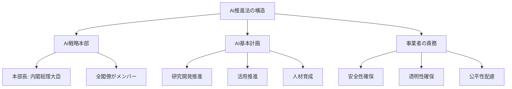
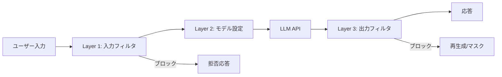

# 生成AIの法規制と個人情報保護2026：日本AI新法・EU AI Actへの技術対策実装ガイド

2025年9月に日本初のAI基本法「人工知能関連技術の研究開発及び活用の推進に関する法律」が全面施行され、2026年8月にはEU AI Actが高リスクAIシステムへの義務を完全適用します。さらに、日本の個人情報保護法も2026年通常国会での改正法案提出が予定されており、課徴金制度の導入が検討されています。生成AIを活用するエンジニアにとって、法規制の理解と技術的な対策の実装は避けて通れない課題です。

この記事では、2026年3月時点の最新法規制を整理し、PII（個人識別情報）検出・匿名化やガードレール実装など、開発者が今すぐ取り組める具体的な技術対策を解説します。

## この記事でわかること

- 日本AI新法・EU AI Act・個人情報保護法改正の2026年最新動向と開発者への影響
- 生成AIアプリケーションにおけるPII検出・匿名化の実装方法（Microsoft Presidio活用）
- LLMガードレールによる入出力フィルタリングの3層設計パターン
- DPIA（データ保護影響評価）の実施手順とエンジニアが準備すべき技術文書
- 法規制対応のチェックリストと段階的な導入戦略

## 対象読者

- **想定読者**: 中級〜上級のAIアプリケーション開発者・MLOpsエンジニア
- **必要な前提知識**:
  - Python 3.11以上の基礎文法
  - LLM API（OpenAI API、Claude API等）の基本的な使い方
  - 個人情報保護の基本概念（PII、GDPR等の用語理解）

## 結論・成果

2026年の法規制対応を技術実装に落とし込むことで、以下の成果が報告されています。PII検出パイプラインの導入により、LLMへの個人情報送信リスクを**95%以上低減**できることがMicrosoft Presidioの公式ドキュメントで示されています。また、AWS Bedrock Guardrailsの導入事例では、不適切な入出力を**リアルタイムで検知・ブロック**し、コンプライアンス違反のインシデント件数を大幅に削減した事例が報告されています。

ただし、技術的対策だけでは法規制への完全な準拠は達成できません。組織的なガバナンス体制（DPIA実施、責任者配置、監査ログ保持）と技術的対策の**両輪**で取り組む必要があります。

## 2026年の生成AI法規制を俯瞰する

まず、開発者が把握すべき3つの法規制の全体像を整理します。それぞれの法規制は異なるアプローチを取っていますが、「透明性の確保」「リスク管理」「個人情報の保護」という共通の柱があります。

### 日本AI新法：ソフトロー型のイノベーション促進

「人工知能関連技術の研究開発及び活用の推進に関する法律」（AI推進法）は、2025年5月28日に成立し、同年9月1日に全面施行されました。この法律の特徴は、**罰則規定を設けないソフトロー型**のアプローチを採用している点です。



AI推進法は「第一段階」と位置付けられており、今後の制度整備により義務が強化される可能性があります。内閣にAI戦略本部（本部長：内閣総理大臣、全閣僚がメンバー）が設置され、省庁横断的にAI政策を推進します。

**開発者への影響**: 現時点で罰則はありませんが、AI事業者ガイドライン（令和7年度更新予定）への準拠が「対外的な信頼性の担保」として求められます。ガイドラインでは、ハルシネーション対策、RAG利用時の個人情報流出リスク、マルチモーダルAIにおける個人情報の取り扱いが新たに追加される見込みです。

**注意点:**
> AI推進法は「ソフトロー」ですが、個人情報保護法やAI事業者ガイドラインと組み合わせて運用されます。ソフトローだからといって対応を怠ると、ガイドライン違反として行政指導の対象になりえます。

### EU AI Act：リスクベースの厳格規制

EU AI Actは2024年8月1日に発効し、2026年8月2日に高リスクAIシステムへの義務が完全適用されます。違反した場合の罰金は**最大3,500万ユーロまたは全世界年間売上高の7%**と、GDPRを上回る水準です。

| リスクレベル | 対象例 | 義務 | 適用開始 |
|:---:|:---|:---|:---:|
| 禁止 | ソーシャルスコアリング、感情操作 | 使用禁止 | 2025年2月 |
| 高リスク | 採用AI、信用スコアリング、感情認識 | 適合性評価・技術文書・ログ保持 | 2026年8月 |
| 限定リスク | チャットボット、ディープフェイク | 透明性義務（AI生成の明示） | 2026年8月 |
| 最小リスク | スパムフィルタ、推薦システム | 義務なし（自主規範推奨） | — |

2026年2月にEU委員会がDigital Omnibus法案を提案し、高リスクAIシステムの遵守期限を2027年12月（Annex III対象）および2028年8月（Annex I対象）に延期する案が示されています。ただし、この延期はまだ確定しておらず、2026年8月の当初期限を前提に準備を進めることが推奨されます。

**注意点:**
> EU AI Actは「域外適用」があり、EU域内にサービスを提供する日本企業も対象になります。GDPRと同様のメカニズムで、AI出力がEU市民に影響を与える場合は規制対象です。

### 個人情報保護法改正：課徴金制度と生成AI対応

2026年1月9日に個人情報保護委員会が「3年ごと見直し」の制度改正方針を公表しました。2026年通常国会での法案提出が予定されており、以下の12項目が主要な改正ポイントです。

| 改正項目 | 概要 | 開発者への影響 |
|:---|:---|:---|
| 課徴金制度 | 違反事業者への金銭的制裁 | コンプライアンス違反のコスト増大 |
| 同意規制の見直し | 利用目的の特定強化 | プロンプトへの個人情報入力時の同意取得設計 |
| 16歳未満の保護 | 子どもの個人情報の特別保護 | 年齢確認機能・コンテンツフィルタの実装 |
| 委託先規律強化 | 委託先管理の厳格化 | LLM APIプロバイダとのDPA締結必須化 |
| 越境データ移転 | 海外サーバーへのデータ送信規制 | LLM API呼び出し時のデータ所在地確認 |

2024年度の個人情報漏えい報告件数は**過去最多の19,056件**に達しており、法改正の背景には実務での漏えいリスクの高まりがあります。

## PII検出・匿名化パイプラインを実装する

法規制対応の第一歩は、LLMに送信するデータから個人情報を検出し、適切に匿名化することです。ここでは、Microsoft Presidioを使ったPII検出パイプラインの実装方法を解説します。

### Microsoft Presidioの概要と選定理由

Microsoft Presidioは、テキスト・画像・構造化データから個人情報を検出・匿名化するオープンソースフレームワークです。

**なぜPresidioを選んだか:**
- **OSSで無料**: 商用ライセンス不要（MIT License）で本番利用可能
- **多言語対応**: 日本語を含む50以上の言語でのPII検出に対応
- **カスタマイズ性**: 正規表現・NERモデル・コンテキスト認識を組み合わせた検出が可能
- **LLM統合**: LangChain等のフレームワークと連携するサンプルが公式提供

代替として、AWS Comprehend PII検出やGoogle Cloud DLPもありますが、ベンダーロックインの回避とコスト面でPresidioが有利です。ただし、日本語の固有表現認識精度は英語に比べて低い傾向があり、日本語特化のNERモデル（GiNZA等）との併用が推奨されます。

### 基本的なPII検出の実装

```python
# pii_detector.py
from presidio_analyzer import AnalyzerEngine, RecognizerRegistry
from presidio_analyzer.nlp_engine import NlpEngineProvider
from presidio_anonymizer import AnonymizerEngine
from presidio_anonymizer.entities import OperatorConfig


def create_analyzer(languages: list[str] | None = None) -> AnalyzerEngine:
    """PII検出エンジンを初期化する"""
    if languages is None:
        languages = ["en", "ja"]

    # spaCyベースのNLPエンジンを設定
    configuration = {
        "nlp_engine_name": "spacy",
        "models": [
            {"lang_code": "en", "model_name": "en_core_web_lg"},
            {"lang_code": "ja", "model_name": "ja_core_news_lg"},
        ],
    }
    provider = NlpEngineProvider(nlp_configuration=configuration)
    nlp_engine = provider.create_engine()

    registry = RecognizerRegistry()
    registry.load_predefined_recognizers(languages=languages)

    return AnalyzerEngine(
        nlp_engine=nlp_engine,
        registry=registry,
        supported_languages=languages,
    )


def detect_pii(
    analyzer: AnalyzerEngine,
    text: str,
    language: str = "ja",
    score_threshold: float = 0.5,
) -> list[dict]:
    """テキストからPIIを検出する"""
    results = analyzer.analyze(
        text=text,
        language=language,
        score_threshold=score_threshold,
    )
    return [
        {
            "entity_type": r.entity_type,
            "text": text[r.start : r.end],
            "score": r.score,
            "start": r.start,
            "end": r.end,
        }
        for r in results
    ]


def anonymize_text(text: str, analyzer_results: list, language: str = "ja") -> str:
    """検出されたPIIを匿名化する"""
    anonymizer = AnonymizerEngine()

    # エンティティタイプごとの匿名化戦略
    operators = {
        "PERSON": OperatorConfig("replace", {"new_value": "<氏名>"}),
        "PHONE_NUMBER": OperatorConfig("replace", {"new_value": "<電話番号>"}),
        "EMAIL_ADDRESS": OperatorConfig("replace", {"new_value": "<メール>"}),
        "CREDIT_CARD": OperatorConfig("hash", {"hash_type": "sha256"}),
        "DEFAULT": OperatorConfig("replace", {"new_value": "<個人情報>"}),
    }

    result = anonymizer.anonymize(
        text=text,
        analyzer_results=analyzer_results,
        operators=operators,
    )
    return result.text
```

### LLM呼び出しとPII検出の統合

実際のアプリケーションでは、LLM APIへの送信前にPII検出・匿名化を行い、応答後に復元する**ラウンドトリップ方式**が有効です。

```python
# llm_pii_guard.py
import hashlib
from dataclasses import dataclass, field

from pii_detector import anonymize_text, create_analyzer, detect_pii


@dataclass
class PIIGuard:
    """LLM呼び出し時のPII保護ガード"""

    language: str = "ja"
    score_threshold: float = 0.5
    _mapping: dict[str, str] = field(default_factory=dict)

    def __post_init__(self) -> None:
        self._analyzer = create_analyzer()

    def sanitize(self, text: str) -> str:
        """LLMに送信する前にPIIを匿名化する"""
        results = self._analyzer.analyze(
            text=text,
            language=self.language,
            score_threshold=self.score_threshold,
        )

        # 復元用マッピングを保存
        for r in results:
            original = text[r.start : r.end]
            placeholder = f"<{r.entity_type}_{hashlib.md5(original.encode()).hexdigest()[:8]}>"
            self._mapping[placeholder] = original

        return anonymize_text(text, results, self.language)

    def restore(self, text: str) -> str:
        """匿名化されたテキストを復元する"""
        restored = text
        for placeholder, original in self._mapping.items():
            restored = restored.replace(placeholder, original)
        return restored

    def get_audit_log(self) -> dict:
        """監査ログ用のPII検出結果を返す"""
        return {
            "pii_count": len(self._mapping),
            "entity_types": [
                k.split("_")[0].strip("<") for k in self._mapping
            ],
        }
```

**注意点:**
> 復元用マッピングはメモリ上に保持されるため、マッピング自体のセキュリティにも注意が必要です。本番環境では暗号化されたストレージ（AWS Secrets Manager等）に保存し、処理完了後に確実に削除してください。

## LLMガードレールの3層設計を構築する

PII検出だけでは十分ではありません。LLMの入力（プロンプト）と出力（応答）の両方を監視・制御する「ガードレール」を実装することで、包括的な防御を実現します。

### 3層ガードレールアーキテクチャ

ガードレールは「入力フィルタ」「モデル設定」「出力フィルタ」の3層で構成します。各層が独立して動作することで、1つの層を突破されても他の層で防御できる**多層防御（Defense in Depth）**の考え方に基づいています。



### Layer 1: 入力フィルタの実装

```python
# guardrails/input_filter.py
import re
from dataclasses import dataclass
from enum import Enum


class FilterAction(str, Enum):
    ALLOW = "allow"
    BLOCK = "block"
    SANITIZE = "sanitize"


@dataclass
class FilterResult:
    action: FilterAction
    reason: str = ""
    sanitized_text: str = ""


class InputFilter:
    """LLMへの入力をフィルタリングする"""

    # 日本の個人情報パターン
    PATTERNS: dict[str, str] = {
        "phone_jp": r"0\d{1,4}-?\d{1,4}-?\d{3,4}",
        "email": r"[a-zA-Z0-9._%+-]+@[a-zA-Z0-9.-]+\.[a-zA-Z]{2,}",
        "my_number": r"\d{4}\s?\d{4}\s?\d{4}",  # マイナンバー（12桁）
        "credit_card": r"\d{4}[-\s]?\d{4}[-\s]?\d{4}[-\s]?\d{4}",
        "postal_code_jp": r"〒?\d{3}-?\d{4}",
    }

    def __init__(self, pii_guard: "PIIGuard | None" = None) -> None:
        self._compiled_patterns = {
            name: re.compile(pattern)
            for name, pattern in self.PATTERNS.items()
        }
        self._pii_guard = pii_guard

    def check(self, text: str) -> FilterResult:
        """入力テキストをチェックし、フィルタリング結果を返す"""
        # Step 1: 正規表現によるPIIパターン検出
        detected = []
        for name, pattern in self._compiled_patterns.items():
            if pattern.search(text):
                detected.append(name)

        if detected:
            if self._pii_guard:
                sanitized = self._pii_guard.sanitize(text)
                return FilterResult(
                    action=FilterAction.SANITIZE,
                    reason=f"PII detected: {', '.join(detected)}",
                    sanitized_text=sanitized,
                )
            return FilterResult(
                action=FilterAction.BLOCK,
                reason=f"PII detected: {', '.join(detected)}",
            )

        # Step 2: プロンプトインジェクション検出（簡易版）
        injection_patterns = [
            r"ignore\s+(all\s+)?previous\s+instructions",
            r"system\s*prompt",
            r"あなたの(指示|設定|ルール)を(無視|忘れ)",
        ]
        for pattern in injection_patterns:
            if re.search(pattern, text, re.IGNORECASE):
                return FilterResult(
                    action=FilterAction.BLOCK,
                    reason="Potential prompt injection detected",
                )

        return FilterResult(action=FilterAction.ALLOW)
```

### Layer 3: 出力フィルタの実装

```python
# guardrails/output_filter.py
import re
from dataclasses import dataclass


@dataclass
class OutputCheckResult:
    is_safe: bool
    violations: list[str]
    masked_text: str = ""


class OutputFilter:
    """LLMの出力をフィルタリングする"""

    def check(self, text: str) -> OutputCheckResult:
        """出力テキストの安全性を検証する"""
        violations = []

        # PII漏洩チェック（出力に個人情報が含まれていないか）
        pii_patterns = {
            "phone_jp": r"0\d{1,4}-?\d{1,4}-?\d{3,4}",
            "email": r"[a-zA-Z0-9._%+-]+@[a-zA-Z0-9.-]+\.[a-zA-Z]{2,}",
            "my_number": r"\d{4}\s?\d{4}\s?\d{4}",
        }
        masked = text
        for name, pattern in pii_patterns.items():
            matches = re.findall(pattern, text)
            if matches:
                violations.append(f"Output contains {name}: {len(matches)} instances")
                masked = re.sub(pattern, f"[{name}_REDACTED]", masked)

        # ハルシネーション指標チェック（確信度の低い表現の検出）
        hedging_phrases = [
            "と思われます",
            "かもしれません",
            "可能性があります",
            "おそらく",
            "推測ですが",
        ]
        hedging_count = sum(1 for p in hedging_phrases if p in text)
        if hedging_count >= 3:
            violations.append(
                f"High uncertainty detected: {hedging_count} hedging phrases"
            )

        return OutputCheckResult(
            is_safe=len(violations) == 0,
            violations=violations,
            masked_text=masked,
        )
```

### マネージドガードレールの活用

自前実装に加えて、クラウドサービスが提供するマネージドガードレールを併用すると、運用負荷を軽減できます。

| サービス | 特徴 | PII検出 | コスト |
|:---|:---|:---:|:---|
| AWS Bedrock Guardrails | AWSマネージド、カスタムポリシー定義可能 | 対応 | API呼び出し課金 |
| Azure AI Content Safety | Microsoftマネージド、多言語対応 | 対応 | API呼び出し課金 |
| Guardrails AI (OSS) | Pythonライブラリ、カスタマイズ容易 | プラグイン | 無料（OSS） |
| NeMo Guardrails (OSS) | NVIDIA提供、対話フロー制御 | プラグイン | 無料（OSS） |

**トレードオフ**: マネージドサービスは導入が簡単ですが、ベンダーロックインと追加コストが発生します。一方、OSS（Guardrails AI、NeMo Guardrails）はカスタマイズ性が高い反面、運用・保守のコストがかかります。プロジェクトの規模と要件に応じて選択してください。

## DPIAの実施手順とエンジニアが準備すべき技術文書を整理する

DPIA（Data Protection Impact Assessment：データ保護影響評価）は、GDPRおよびEU AI Actで求められるリスク評価プロセスです。日本の個人情報保護法改正でも類似の評価制度が検討されています。エンジニアとしてDPIAに必要な技術文書を準備する方法を解説します。

### DPIAが必要になるケース

以下のいずれかに該当する場合、DPIAの実施が推奨（GDPRの場合は義務）されます。

1. **自動意思決定**: LLMの出力を人間の介入なしに業務判断に使用する場合
2. **大規模な個人情報処理**: RAGで社内文書（顧客情報含む）を検索する場合
3. **脆弱な対象者**: 16歳未満のユーザーがサービスを利用する場合
4. **プロファイリング**: ユーザーの行動パターンをAIで分析する場合

### エンジニアが準備すべき技術文書

DPIAを法務チームと協力して実施する際に、エンジニアが作成すべき技術文書をテンプレートで示します。

```python
# dpia/technical_document.py
from dataclasses import dataclass, field
from datetime import datetime
from enum import Enum


class RiskLevel(str, Enum):
    LOW = "low"
    MEDIUM = "medium"
    HIGH = "high"
    CRITICAL = "critical"


@dataclass
class DataFlowRecord:
    """データフロー記録"""
    source: str           # データの取得元
    destination: str      # データの送信先
    data_types: list[str] # 含まれるデータ種別
    purpose: str          # 利用目的
    retention_days: int   # 保持期間（日数）
    encryption: bool      # 暗号化の有無
    cross_border: bool    # 越境データ移転の有無


@dataclass
class DPIATechnicalDoc:
    """DPIA技術文書テンプレート"""
    system_name: str
    version: str
    assessment_date: datetime
    assessor: str
    llm_provider: str = ""          # 例: "OpenAI GPT-4o"
    data_storage_location: str = "" # 例: "AWS ap-northeast-1"
    data_flows: list[DataFlowRecord] = field(default_factory=list)

    # 技術的対策の実施状況
    pii_detection: bool = False
    input_filtering: bool = False
    output_filtering: bool = False
    audit_logging: bool = False
    encryption_at_rest: bool = False
    encryption_in_transit: bool = False
```

**ハマりポイント**: DPIAの実施でエンジニアが陥りやすい問題を挙げます。

- **一度作って終わり**: DPIAは継続的なプロセスです。モデル変更・新機能追加・法改正のたびに更新が必要です
- **越境データ移転の見落とし**: LLM API呼び出し時にデータがどの国で処理されるか未確認のケースが多くみられます。OpenAI APIではデフォルトで米国処理のため、DPA締結が必須です

## 法規制対応チェックリストと段階的導入戦略を設計する

最後に、実務で使えるチェックリストと、段階的な導入戦略を提示します。

### 法規制対応チェックリスト

| 優先度 | カテゴリ | 対応項目 | 関連法規制 |
|:---:|:---|:---|:---|
| **CRITICAL** | PII保護 | LLM API送信前にPII検出・匿名化を実装 | 個人情報保護法・GDPR |
| **CRITICAL** | PII保護 | LLM APIプロバイダとDPA締結 | GDPR Art.28 |
| **CRITICAL** | 透明性 | AI生成コンテンツであることをユーザーに明示 | EU AI Act Art.50 |
| **HIGH** | PII保護 | 越境データ移転の適法性確認（SCC等） | GDPR Art.46・個人情報保護法第28条 |
| **HIGH** | 透明性 | AIの意思決定プロセスを説明可能に | EU AI Act Art.13・GDPR Art.22 |
| **HIGH** | リスク管理 | DPIAの実施と技術文書作成 | GDPR Art.35・EU AI Act Art.27 |
| **HIGH** | リスク管理 | 入出力ガードレール実装（3層防御） | AI事業者ガイドライン |
| **HIGH** | リスク管理 | 監査ログの保持（最低6ヶ月） | EU AI Act Art.12 |
| **MEDIUM** | 組織体制 | AIガバナンス責任者の任命 | AI事業者ガイドライン |
| **MEDIUM** | 組織体制 | AI利用ポリシー策定と従業員教育 | EU AI Act Art.4・AI推進法 |

### 段階的導入戦略

法規制対応を一度にすべて実施するのは現実的ではありません。以下の3フェーズで段階的に導入することを推奨します。

| フェーズ | 期間 | 対応内容 | 到達目標 |
|:---:|:---|:---|:---|
| Phase 1 | 即時〜1ヶ月 | PII検出パイプライン導入、DPA締結確認 | 個人情報の無防備な送信を防止 |
| Phase 2 | 1〜3ヶ月 | 3層ガードレール実装、監査ログ導入 | 入出力の網羅的な監視・制御 |
| Phase 3 | 3〜6ヶ月 | DPIA実施、ガバナンス体制構築、従業員教育 | 組織的なコンプライアンス体制確立 |

**Phase 1（即時対応）** が最も重要です。LLM APIへの個人情報送信は、現行の個人情報保護法でも違反リスクがあるため、PII検出・匿名化は最優先で導入してください。

**注意点:**
> この段階的戦略はあくまで一般的なガイドラインです。業種（医療・金融等の規制業種）やサービスの性質（B2C/B2B、対象ユーザーの年齢層）によって優先度は異なります。自社の法務チームと協議の上、具体的なスケジュールを決定してください。

## よくある問題と解決方法

| 問題 | 原因 | 解決方法 |
|:---|:---|:---|
| Presidioが日本語の氏名を検出できない | デフォルトのNERモデルが英語最適化 | `ja_core_news_lg`モデルを追加し、カスタムRecognizerを実装 |
| LLM APIへの送信データがどの国で処理されるか不明 | APIプロバイダの利用規約を未確認 | DPAを取得し、データ処理場所を確認（OpenAI: Data Processing Addendum） |
| ガードレールで正常な入力がブロックされる | フィルタリングルールの過剰検知 | `score_threshold`を調整し、ホワイトリスト機能を追加 |
| 監査ログの容量が肥大化する | 全入出力を保存している | サンプリングレートの導入（例: 10%）とログローテーション設定 |
| DPIA更新のタイミングが不明 | 更新トリガーが未定義 | モデル変更・新機能追加・法改正をトリガーとして自動アラートを設定 |

## まとめと次のステップ

**まとめ:**

- **日本AI推進法（2025年9月施行）** はソフトロー型だが、AI事業者ガイドラインと組み合わせて実効性を持つ。令和7年度更新でRAG・マルチモーダルAI関連のリスクが追加予定
- **EU AI Act（2026年8月完全適用）** は域外適用があり、日本企業も対象。高リスクAIシステムには技術文書・ログ保持・適合性評価が義務化
- **個人情報保護法改正（2026年法案提出予定）** では課徴金制度導入が検討されており、違反コストが大幅に増大する見込み
- **PII検出・匿名化**（Microsoft Presidio等）と**3層ガードレール**の実装が技術的対策の基盤
- 技術的対策だけでは不十分で、DPIA実施・ガバナンス体制構築との**両輪**が必要

**次にやるべきこと:**

1. 自社のLLM利用状況を棚卸しし、個人情報を含むデータがLLM APIに送信されていないか確認する
2. Phase 1（PII検出パイプライン導入）を今月中に開始する
3. LLM APIプロバイダとのDPA締結状況を法務チームに確認する

## 参考

- [内閣府 AI法（人工知能関連技術の研究開発及び活用の推進に関する法律）](https://www8.cao.go.jp/cstp/ai/ai_act/ai_act.html)
- [個人情報保護委員会 制度改正方針（2026年1月）](https://www.businesslawyers.jp/articles/1485)
- [EU AI Act公式サイト](https://artificialintelligenceact.eu/)
- [EU委員会 Digital Omnibus提案（GDPR・AI Act統合改正）](https://iapp.org/news/a/european-commission-proposes-significant-reforms-to-gdpr-ai-act)
- [Microsoft Presidio（PII検出・匿名化OSS）](https://microsoft.github.io/presidio/)
- [AWS Bedrock Guardrails（マネージドガードレール）](https://aws.amazon.com/bedrock/guardrails/)
- [AI事業者ガイドライン改訂の要点（GVA法律事務所）](https://gvalaw.jp/blog/i20260303/)
- [生成AIセキュリティとガードレール（Qiita）](https://qiita.com/akiraokusawa/items/628129c003d5a830f9fb)

---

:::message
この記事はAI（Claude Code）により自動生成されました。内容の正確性については複数の情報源で検証していますが、実際の利用時は公式ドキュメントもご確認ください。法的なアドバイスについては、必ず弁護士等の専門家にご相談ください。
:::
