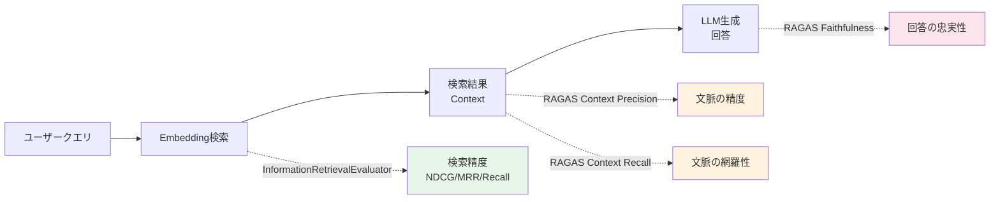
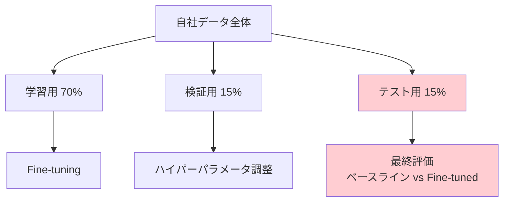

# 自社データで実践するEmbeddingモデル精度評価パイプライン構築

## この記事でわかること

- 公開ベンチマーク（MTEB/JMTEB）のスコアだけでは判断できない理由と、自社データ評価の必要性
- sentence-transformers の `InformationRetrievalEvaluator` を使ったカスタム評価パイプラインの実装方法
- NDCG@10・MRR@10・Recall@5 など主要検索指標の計算と結果の読み解き方
- RAGAS の Context Precision / Context Recall を用いた RAG 全体の検索品質評価
- 2026年時点の主要モデル（Voyage 4・Qwen3-Embedding-8B・PLaMo-Embedding-1B）を自社データで比較する手順

## 対象読者

- **想定読者**: 中級者〜上級者のMLエンジニア・バックエンドエンジニア
- **必要な前提知識**:
  - Python 3.11+ の基本操作
  - コサイン類似度・ベクトル検索の基礎概念
  - RAG（Retrieval-Augmented Generation）パイプラインの基本構成

## 結論・成果

公開ベンチマークMTEBで上位のモデルが、自社ドメインの検索タスクでも上位とは限りません。Databricksのレポートによると、ドメイン特化データでのFine-tuningにより検索精度（NDCG@10）が10〜30%向上する事例が報告されています。本記事で紹介する評価パイプラインを使えば、**3つのモデルの比較評価を約2時間で完了**でき、自社データに適したモデルを客観的に選定できます。

関連記事: [MTEB×JMTEBで選ぶEmbeddingモデル：精度評価の実践ガイド](https://zenn.dev/0h_n0/articles/6388d71c6bcb23)（ベンチマークの読み方・評価指標の基礎はこちらを参照）

## 公開ベンチマークの限界を理解する

Embeddingモデルの選定で最初に参照するのは、MTEB（Massive Text Embedding Benchmark）やJMTEBなどの公開ベンチマークです。しかし、ベンチマークスコアをそのまま信じると、実運用で期待どおりの精度が出ないケースがあります。

### ベンチマークと実データのギャップが生じる3つの理由

**1. ドメインの語彙分布が異なる**

MTEBの評価データセットはWikipedia・Webコーパスなど一般ドメインが中心です。医療、法務、製造業のマニュアルなど専門用語が多いドメインでは、一般ドメインでの学習が十分に活かされません。BES4RAG（ACL 2025 CLiC-it）の分析でも、QAベースの評価とMTEBスコアの順位が逆転するケースが確認されています。

**2. 文書の長さ・構造が異なる**

ベンチマークの文書は比較的短い段落が中心ですが、実務では数千文字の技術ドキュメントやFAQなど構造が多様です。チャンク分割戦略によってEmbeddingの品質が大きく変わるため、ベンチマークの条件と自社の条件は一致しません。

**3. クエリの性質が異なる**

ベンチマークでは整形された質問文が使われますが、実際のユーザークエリはキーワード羅列や口語的な表現が多く、Embeddingモデルの得意・不得意が変わります。

> **制約条件**: 以降の評価パイプラインは検索（Retrieval）タスクに特化しています。分類やクラスタリングの評価には異なるアプローチが必要です。

### 2026年時点の主要Embeddingモデル

評価対象として、以下の3モデルを使用します。いずれも2025〜2026年にリリースされた最新モデルです。

| モデル | パラメータ数 | 最大トークン | 次元数 | MTEB Retrieval | 特徴 |
|--------|------------|------------|--------|---------------|------|
| **Voyage 4-large** | 非公開（MoE） | 32,000 | 2048 | RTEB 29データセット1位 | 共有Embedding空間、Matryoshka対応 |
| **Qwen3-Embedding-8B** | 8B | 8,192 | 4096 | MTEB多言語1位（70.58） | 100+言語対応、instruction-aware |
| **PLaMo-Embedding-1B** | 1B | 4,096 | 2048 | JMTEB 76.10（日本語1位） | LLM2Vec変換、Apache 2.0 |

Voyage 4-largeはMoE（Mixture of Experts）アーキテクチャを採用し、同等品質の密なモデルと比較してサービングコストが40%低いとVoyage AIが報告しています。Qwen3-Embedding-8Bは3段階学習（弱教師あり事前学習→教師あり微調整→モデルマージ）で多言語性能を実現しています。PLaMo-Embedding-1Bは1BパラメータながらOpenAI text-embedding-3-large（JMTEB 74.05）を上回るJMTEB 76.10を記録し、Preferred Networksが開発・Apache 2.0で公開しています。

## 評価用データセットを準備する

自社データでの評価には、**クエリ・コーパス・正解ラベル**の3要素が必要です。ここでは、実際のRAGシステムで蓄積されるデータから評価セットを構築する方法を紹介します。

### 評価データセットの構造

sentence-transformers の `InformationRetrievalEvaluator` が期待するデータ形式に合わせて準備します。

```python
# eval_dataset.py
from dataclasses import dataclass

@dataclass
class IREvalDataset:
    """情報検索評価用データセット"""
    queries: dict[str, str]       # {query_id: query_text}
    corpus: dict[str, str]        # {doc_id: doc_text}
    relevant_docs: dict[str, set[str]]  # {query_id: {relevant_doc_ids}}
```

実際のプロジェクトでは、以下の3つの方法で評価セットを構築できます。

### 方法1: 既存のQAログから構築する

RAGシステムのログにユーザークエリと参照された文書IDが記録されている場合、それをそのまま評価データに変換できます。

```python
# build_eval_from_logs.py
import json
from pathlib import Path

def build_eval_dataset_from_logs(
    log_path: Path,
    corpus_path: Path,
    min_relevance_score: float = 0.7,
) -> IREvalDataset:
    """QAログから評価データセットを構築する

    Args:
        log_path: QAログのJSONLファイルパス
        corpus_path: コーパスのJSONLファイルパス
        min_relevance_score: 正解とみなすスコアの閾値
    """
    # コーパス読み込み
    corpus: dict[str, str] = {}
    with open(corpus_path) as f:
        for line in f:
            doc = json.loads(line)
            corpus[doc["doc_id"]] = doc["text"]

    # QAログから正解ペアを抽出
    queries: dict[str, str] = {}
    relevant_docs: dict[str, set[str]] = {}

    with open(log_path) as f:
        for line in f:
            entry = json.loads(line)
            qid = entry["query_id"]
            queries[qid] = entry["query_text"]
            relevant_docs[qid] = {
                ref["doc_id"]
                for ref in entry["references"]
                if ref.get("relevance_score", 0) >= min_relevance_score
            }

    # 正解が0件のクエリを除外
    queries = {qid: q for qid, q in queries.items() if relevant_docs.get(qid)}
    relevant_docs = {qid: docs for qid, docs in relevant_docs.items() if docs}

    return IREvalDataset(
        queries=queries,
        corpus=corpus,
        relevant_docs=relevant_docs,
    )
```

**注意点:**
> QAログベースの評価セットは「過去のシステムが検索できた文書」に偏ります。未検索の正解文書が含まれないため、Recall の数値は過大評価になりがちです。この偏りを緩和するには、方法2の人手アノテーションと併用してください。

### 方法2: LLMを使った合成クエリ生成

コーパスはあるがクエリと正解ラベルがない場合、LLMで合成クエリを生成できます。

```python
# generate_synthetic_queries.py
import anthropic

def generate_queries_for_document(
    doc_id: str,
    doc_text: str,
    n_queries: int = 3,
) -> list[dict[str, str]]:
    """文書からLLMで検索クエリを合成する"""
    client = anthropic.Anthropic()
    prompt = (
        f"以下の文書を検索するためにユーザーが入力しそうなクエリを"
        f"{n_queries}個生成してください。"
        f"キーワード羅列型と自然文型を混ぜてください。\n\n"
        f"文書:\n{doc_text[:2000]}\n\n各クエリを1行ずつ出力してください。"
    )
    response = client.messages.create(
        model="claude-sonnet-4-6",
        max_tokens=500,
        messages=[{"role": "user", "content": prompt}],
    )
    lines = response.content[0].text.strip().split("\n")
    return [
        {"query_text": line.strip().lstrip("0123456789.-) "), "doc_id": doc_id}
        for line in lines
        if line.strip()
    ]
```

**なぜ合成クエリ生成を選ぶのか:**
- 人手アノテーションのコストが高い場合に有効（数百クエリを数分で生成可能）
- Philipp Schmidのガイド（Hugging Face）でもFine-tuning評価データとして推奨されている

**ハマりポイント:**
> 合成クエリはLLMの生成傾向に依存するため、実際のユーザークエリの分布とズレが生じます。本番運用前には実際のユーザーログから50〜100件を追加構築し、精度差を確認してください。

### 評価セットのサイズ目安

| 用途 | クエリ数 | コーパスサイズ | 所要時間（人手） |
|------|---------|-------------|----------------|
| 初期スクリーニング | 50-100 | 1,000-5,000 | 合成クエリで1時間 |
| 本格評価 | 200-500 | 全コーパス | アノテーションで1-2日 |
| 継続モニタリング | 50-100（固定） | 全コーパス | 初回のみ |

## 評価パイプラインを実装する

ここから、sentence-transformers の `InformationRetrievalEvaluator` を使った評価パイプラインを実装します。

### 環境構築

```bash
# Python 3.11+ 推奨
uv init embedding-eval && cd embedding-eval
uv add sentence-transformers==5.2.0 voyageai anthropic torch numpy pandas
```

sentence-transformers 5.2.0（2025年リリース）では、多言語NanoBEIR評価器が追加され、カスタムデータセットでの評価APIも整理されています。

### 基本の評価スクリプト

```python
# evaluate_models.py
"""Embeddingモデルの検索精度を自社データで比較評価する"""
import json
import time
from pathlib import Path

import numpy as np
import pandas as pd
from sentence_transformers import SentenceTransformer
from sentence_transformers.evaluation import InformationRetrievalEvaluator


def load_eval_dataset(dataset_dir: Path) -> tuple[dict, dict, dict]:
    """評価データセットを読み込む"""
    with open(dataset_dir / "queries.json") as f:
        queries = json.load(f)
    with open(dataset_dir / "corpus.json") as f:
        corpus = json.load(f)
    with open(dataset_dir / "relevant_docs.json") as f:
        raw = json.load(f)
        relevant_docs = {k: set(v) for k, v in raw.items()}
    return queries, corpus, relevant_docs


def evaluate_single_model(
    model_name: str,
    queries: dict[str, str],
    corpus: dict[str, str],
    relevant_docs: dict[str, set[str]],
    query_prompt: str | None = None,
    batch_size: int = 32,
) -> dict[str, float]:
    """単一モデルの検索精度を評価する"""
    model = SentenceTransformer(model_name, trust_remote_code=True)

    evaluator = InformationRetrievalEvaluator(
        queries=queries,
        corpus=corpus,
        relevant_docs=relevant_docs,
        ndcg_at_k=[5, 10],
        mrr_at_k=[10],
        accuracy_at_k=[1, 5, 10],
        precision_recall_at_k=[5, 10],
        map_at_k=[100],
        batch_size=batch_size,
        query_prompt=query_prompt,
        name=model_name.replace("/", "_"),
    )

    start = time.time()
    results = evaluator(model)
    elapsed = time.time() - start

    results["evaluation_time_sec"] = elapsed
    return results
```

**なぜ `InformationRetrievalEvaluator` を使うのか:**
- sentence-transformers に統合されており追加依存が不要
- NDCG・MRR・Recall・MAP・Precisionを一括計算できる
- 代替案の手動実装と比較して、バグ混入リスクが低い

### 複数モデルの一括比較

```python
# compare_models.py
"""複数Embeddingモデルを一括比較する"""

# Voyage 4はsentence-transformersに未対応のためAPI経由で評価
# ここではsentence-transformers対応モデルの比較例
MODEL_CONFIGS = [
    {
        "name": "pfnet/plamo-embedding-1b",
        "query_prompt": "次の文章に対して、関連する文章を検索してください: ",
    },
    {
        "name": "Qwen/Qwen3-Embedding-0.6B",
        "query_prompt": "Instruct: 関連するドキュメントを検索してください\nQuery: ",
    },
    {
        "name": "intfloat/multilingual-e5-large-instruct",
        "query_prompt": "query: ",
    },
]


def compare_models(dataset_dir: Path) -> pd.DataFrame:
    """複数モデルの評価結果を比較テーブルにまとめる"""
    queries, corpus, relevant_docs = load_eval_dataset(dataset_dir)
    all_results = []

    for config in MODEL_CONFIGS:
        print(f"Evaluating: {config['name']}")
        results = evaluate_single_model(
            model_name=config["name"],
            queries=queries,
            corpus=corpus,
            relevant_docs=relevant_docs,
            query_prompt=config.get("query_prompt"),
        )
        results["model"] = config["name"]
        all_results.append(results)

    df = pd.DataFrame(all_results)
    # 主要指標のみ抽出して見やすくする
    key_cols = ["model", "ndcg_at_10", "mrr_at_10", "recall_at_10",
                "precision_at_10", "map_at_100", "evaluation_time_sec"]
    display_cols = [c for c in key_cols if c in df.columns]
    return df[display_cols].sort_values("ndcg_at_10", ascending=False)


if __name__ == "__main__":
    dataset_dir = Path("eval_data")
    result_df = compare_models(dataset_dir)
    print("\n=== 評価結果 ===")
    print(result_df.to_markdown(index=False))
    result_df.to_csv("eval_results.csv", index=False)
```

### Voyage 4をAPI経由で評価する

Voyage 4はsentence-transformersに直接対応していないため、API経由でEmbeddingを取得し、手動で検索評価を行います。

```python
# evaluate_voyage.py
"""Voyage 4 APIを使った検索精度評価"""
import voyageai
import numpy as np

def evaluate_voyage_retrieval(
    queries: dict[str, str],
    corpus: dict[str, str],
    relevant_docs: dict[str, set[str]],
    model: str = "voyage-4",
    top_k: int = 10,
) -> dict[str, float]:
    """Voyage Embeddingでの検索精度を評価する"""
    client = voyageai.Client()
    query_ids = list(queries.keys())
    doc_ids = list(corpus.keys())

    # Embedding取得（input_typeでクエリと文書を区別）
    query_embs = np.array(
        client.embed([queries[q] for q in query_ids],
                     model=model, input_type="query").embeddings
    )
    doc_embs = np.array(
        client.embed([corpus[d] for d in doc_ids],
                     model=model, input_type="document").embeddings
    )

    # コサイン類似度で検索
    query_norms = query_embs / np.linalg.norm(query_embs, axis=1, keepdims=True)
    doc_norms = doc_embs / np.linalg.norm(doc_embs, axis=1, keepdims=True)
    sim_matrix = query_norms @ doc_norms.T

    ndcg_scores, mrr_scores, recall_scores = [], [], []
    for i, qid in enumerate(query_ids):
        gold = relevant_docs.get(qid, set())
        if not gold:
            continue
        ranked = [doc_ids[idx] for idx in np.argsort(-sim_matrix[i])[:top_k]]

        # NDCG@K
        dcg = sum(1.0 / np.log2(r + 2) for r, d in enumerate(ranked) if d in gold)
        idcg = sum(1.0 / np.log2(r + 2) for r in range(min(len(gold), top_k)))
        ndcg_scores.append(dcg / idcg if idcg > 0 else 0.0)
        # MRR@K
        mrr = next((1.0 / (r + 1) for r, d in enumerate(ranked) if d in gold), 0.0)
        mrr_scores.append(mrr)
        # Recall@K
        recall_scores.append(sum(1 for d in ranked if d in gold) / len(gold))

    return {
        "model": model,
        f"ndcg_at_{top_k}": float(np.mean(ndcg_scores)),
        f"mrr_at_{top_k}": float(np.mean(mrr_scores)),
        f"recall_at_{top_k}": float(np.mean(recall_scores)),
    }
```

**よくある間違い:**
> Voyage 4では `input_type` パラメータでクエリとドキュメントを区別する設計になっています。両方とも `"document"` で埋め込むと、非対称検索の利点が失われ精度が低下します。公式ドキュメントに従い、必ずクエリには `"query"`、文書には `"document"` を指定してください。

## RAGASで検索品質をエンド・ツー・エンド評価する

Embeddingモデル単体の評価に加えて、RAGパイプライン全体での検索品質も確認しましょう。RAGASフレームワークのContext Precision / Context Recallを使うと、「検索された文脈が回答に役立つか」を評価できます。

### RAGASによる評価の位置づけ



`InformationRetrievalEvaluator` はEmbeddingモデルの検索能力を直接測定します。一方RAGASは、検索結果がLLMの回答にどう影響するかまで含めた評価です。両者を組み合わせることで、「検索は正確だが回答に活用されていない」などの問題も検出できます。

### RAGAS評価の実装

```python
# ragas_eval.py
"""RAGASによるContext Precision/Recall評価"""
from ragas import EvaluationDataset, SingleTurnSample, evaluate
from ragas.metrics import LLMContextPrecisionWithoutReference, LLMContextRecall


def build_ragas_dataset(
    questions: list[str],
    retrieved_contexts: list[list[str]],
    reference_answers: list[str],
    llm_responses: list[str],
) -> EvaluationDataset:
    """RAGAS評価用データセットを構築する"""
    samples = []
    for q, ctx, ref, resp in zip(
        questions, retrieved_contexts, reference_answers, llm_responses
    ):
        samples.append(
            SingleTurnSample(
                user_input=q,
                retrieved_contexts=ctx,
                reference=ref,
                response=resp,
            )
        )
    return EvaluationDataset(samples=samples)


def evaluate_context_quality(
    dataset: EvaluationDataset,
) -> dict[str, float]:
    """検索コンテキストの品質を評価する"""
    metrics = [
        LLMContextPrecisionWithoutReference(),
        LLMContextRecall(),
    ]
    result = evaluate(dataset=dataset, metrics=metrics)
    return {
        "context_precision": float(result["llm_context_precision_without_reference"]),
        "context_recall": float(result["llm_context_recall"]),
    }
```

**トレードオフ:**
RAGAS評価はLLMの判断に依存するため、評価自体にコストがかかります。100クエリの評価でClaude Sonnet 4.6を使う場合、APIコストは約$2〜5程度です。大規模な評価には `InformationRetrievalEvaluator` を主軸とし、RAGASは重要なサンプル50〜100件に絞って実行するのが実用的です。

## 評価結果を分析して判断する

評価パイプラインの出力から、どのモデルを採用するか判断するための分析手順を解説します。

### 結果の読み解き方

評価結果が以下のようになったとします（架空のドメイン特化データでの例）。

| モデル | NDCG@10 | MRR@10 | Recall@10 | 評価時間(秒) |
|--------|---------|--------|-----------|------------|
| PLaMo-Embedding-1B | 0.72 | 0.68 | 0.85 | 45 |
| Qwen3-Embedding-0.6B | 0.69 | 0.65 | 0.82 | 38 |
| multilingual-e5-large-instruct | 0.65 | 0.61 | 0.78 | 52 |

この結果を見る際のポイントは以下のとおりです。

**NDCG@10**: 検索結果の上位に正解文書が集まっているかを示します。値が高いほど「正解が上位に来ている」ことを意味し、ユーザー体験に直結します。

**MRR@10**: 最初の正解文書が何位に来るかの逆数平均です。「1件目の正解が見つかるまでの速さ」を評価するため、ユーザーが最初の結果だけを見るUIでは特に重要です。

**Recall@10**: 上位10件に正解文書がどれだけ含まれるかを示します。RAGで複数の文脈を参照する場合、Recallが高いモデルの方がLLMに適切な情報を渡せます。

### エラー分析の実装

数値だけでなく、どのクエリで失敗しているかを分析することが改善の鍵です。

```python
# error_analysis.py
"""検索失敗クエリの分析"""

def find_failure_queries(
    queries: dict[str, str],
    corpus: dict[str, str],
    relevant_docs: dict[str, set[str]],
    ranked_results: dict[str, list[str]],
    threshold_recall: float = 0.5,
    top_k: int = 10,
) -> list[dict]:
    """Recall@Kが閾値以下のクエリを抽出する"""
    failures = []
    for qid, gold in relevant_docs.items():
        if not gold:
            continue
        retrieved = set(ranked_results.get(qid, [])[:top_k])
        recall = len(retrieved & gold) / len(gold)
        if recall < threshold_recall:
            missed = gold - retrieved
            failures.append({
                "query_id": qid,
                "query_text": queries[qid],
                "recall": recall,
                "missed_doc_previews": [corpus[d][:100] for d in missed if d in corpus],
            })
    return sorted(failures, key=lambda x: x["recall"])
```

**次のアクションにつなげる:**

失敗パターンの分析結果は、次のアクションに直結します。

| 失敗パターン | 対処法 |
|------------|-------|
| 用語のミスマッチ | 同義語辞書の構築、ハイブリッド検索（BM25併用）の導入 |
| 長文書の分散 | チャンク戦略の見直し（オーバーラップ増加、親子チャンク） |
| 曖昧なクエリ | クエリ拡張（Query Expansion）の導入 |
| 専門用語の未対応 | ドメイン特化Fine-tuningの検討 |

## Fine-tuning前後の精度比較を設計する

エラー分析の結果、ドメイン特化Fine-tuningが有効と判断した場合の評価設計について解説します。

### 評価設計の原則

Fine-tuningの効果を正しく測定するには、**学習データと評価データの厳密な分離**が不可欠です。



**テストデータは最終評価でのみ使用します。** 検証データでハイパーパラメータを調整した後、テストデータで1回だけ評価する設計にしてください。テストデータを繰り返し参照すると、過学習の検出ができなくなります。

### Fine-tuning前後の比較スクリプト

```python
# finetune_comparison.py
"""Fine-tuning前後の精度比較（前述のevaluate_single_model関数を再利用）"""
from pathlib import Path

def compare_baseline_vs_finetuned(
    baseline_model: str,
    finetuned_model_path: str,
    test_dataset_dir: Path,
    query_prompt: str | None = None,
) -> None:
    """ベースラインとFine-tunedモデルのNDCG@10を比較する"""
    queries, corpus, relevant_docs = load_eval_dataset(test_dataset_dir)

    base_result = evaluate_single_model(
        baseline_model, queries, corpus, relevant_docs, query_prompt)
    ft_result = evaluate_single_model(
        finetuned_model_path, queries, corpus, relevant_docs, query_prompt)

    base_ndcg = base_result["ndcg_at_10"]
    ft_ndcg = ft_result["ndcg_at_10"]
    improvement = (ft_ndcg - base_ndcg) / base_ndcg * 100
    print(f"Baseline NDCG@10: {base_ndcg:.4f}")
    print(f"Fine-tuned NDCG@10: {ft_ndcg:.4f}")
    print(f"改善率: {improvement:+.1f}%")
```

Databricksのブログによると、ドメイン特化データでのFine-tuningにより、検索精度（NDCG@10）が10〜30%向上する事例が報告されています。ただし、この改善幅はドメインの特殊性やデータ量に依存し、一般的なWebテキストに近いドメインでは改善幅が小さくなる傾向があります。

## よくある問題と解決方法

| 問題 | 原因 | 解決方法 |
|------|------|----------|
| 評価スコアが異常に高い（NDCG@10 > 0.95） | 評価セットが簡単すぎる（クエリと文書がほぼ同一文） | Hard Negativesを追加し、類似だが不正解の文書を含める |
| モデル間のスコア差がほぼない | コーパスが小さく差が出にくい | コーパスを5,000件以上に拡大する |
| GPU OOMエラー | バッチサイズが大きすぎる | `batch_size=8` に縮小、またはCPU評価に切り替え |
| Voyage APIのレート制限 | 短時間に大量リクエスト | `time.sleep(0.5)` でリクエスト間隔を調整 |
| 日本語の評価スコアが低い | モデルの日本語対応が不十分 | PLaMo-Embedding-1BなどJMTEB上位モデルを優先 |
| Fine-tuning後にRecallが低下 | カタストロフィック・フォーゲッティング | 学習率を下げる（1e-6〜5e-6）、元データの一部を混ぜて学習 |

## まとめと次のステップ

**まとめ:**
- 公開ベンチマーク（MTEB/JMTEB）のスコアは参考値であり、自社データでの実測が不可欠
- sentence-transformers の `InformationRetrievalEvaluator` で、NDCG・MRR・Recallを一括評価可能
- RAGASの Context Precision / Recall でRAGパイプライン全体の検索品質を評価できる
- エラー分析で失敗パターンを特定し、チャンク戦略やFine-tuningなどの対策につなげる
- Fine-tuning評価では学習・検証・テストデータの厳密な分離が必須

**次にやるべきこと:**
- 自社データから50〜100件の評価セット（クエリ・正解文書ペア）を構築する
- 本記事のスクリプトで候補モデル2〜3個を比較評価する
- エラー分析結果に基づいて、ハイブリッド検索やFine-tuningの導入を検討する

## 参考

- [MTEB: Massive Text Embedding Benchmark（GitHub）](https://github.com/embeddings-benchmark/mteb)
- [MMTEB: Massive Multilingual Text Embedding Benchmark（arxiv:2502.13595）](https://arxiv.org/abs/2502.13595)
- [sentence-transformers Evaluation（公式ドキュメント）](https://sbert.net/docs/package_reference/sentence_transformer/evaluation.html)
- [Voyage 4 Model Family（Voyage AI Blog）](https://blog.voyageai.com/2026/01/15/voyage-4/)
- [PLaMo-Embedding-1Bの開発（Preferred Networks Tech Blog）](https://tech.preferred.jp/ja/blog/plamo-embedding-1b/)
- [Qwen3 Embedding（Qwen公式ブログ）](https://qwenlm.github.io/blog/qwen3-embedding/)
- [RAGAS: Automated Evaluation of RAG（公式ドキュメント）](https://docs.ragas.io/en/stable/)
- [Improving Retrieval and RAG with Embedding Model Finetuning（Databricks Blog）](https://www.databricks.com/blog/improving-retrieval-and-rag-embedding-model-finetuning)
- [Fine-tune Embedding models for RAG（Philipp Schmid）](https://www.philschmid.de/fine-tune-embedding-model-for-rag)

---

## 関連する深掘り記事

この記事で紹介した技術について、さらに深掘りした記事を書きました：

- [論文解説: MMTEB — 500+タスク×250+言語の大規模多言語テキスト埋め込みベンチマーク](https://0h-n0.github.io/posts/paper-mmteb-2502-13595/) - arXiv解説
- [Databricks解説: Embeddingモデルのファインチューニングで検索・RAG精度を向上させる](https://0h-n0.github.io/posts/techblog-databricks-embedding-finetuning-rag/) - tech_blog解説
- [Voyage AI解説: Voyage 4 — MoEアーキテクチャと共有Embedding空間](https://0h-n0.github.io/posts/techblog-voyage-4-moe-embedding/) - tech_blog解説
- [PFN解説: PLaMo-Embedding-1B — LLM2Vecで実現した日本語JMTEBトップクラスの埋め込みモデル](https://0h-n0.github.io/posts/techblog-plamo-embedding-1b/) - tech_blog解説
- [論文解説: Qwen3 Embedding — 3段階学習とモデルマージで実現した多言語テキスト埋め込み](https://0h-n0.github.io/posts/paper-qwen3-embedding/) - arXiv解説

:::message
これらの記事は修士学生レベルを想定した技術的詳細（数式・実装の深掘り）を含みます。
:::

---

:::message
この記事はAI（Claude Code）により自動生成されました。内容の正確性については複数の情報源で検証していますが、実際の利用時は公式ドキュメントもご確認ください。
:::
