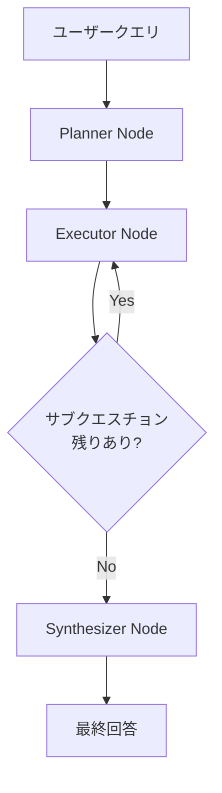
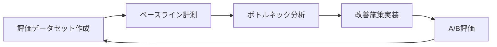

# LangGraph×Claude APIのクエリ分解エージェントで社内RAG検索精度を向上させる

## この記事でわかること

- LangGraphの`StateGraph`と`add_conditional_edges`を使ったクエリ分解（Query Decomposition）エージェントの実装方法
- マルチホップ検索（Multi-hop Retrieval）で複雑な社内質問に段階的に回答するパイプラインの構築手順
- Claude APIの`tool_use`と`strict: true`（Structured Outputs）を活用した型安全なサブクエスチョン生成
- NDCG@10やMRRなど検索精度メトリクスの計測方法と改善ループの設計
- Cross-Encoderリランキングを組み合わせた検索結果の品質向上テクニック

## 対象読者

- **想定読者**: 中級〜上級のPythonエンジニアで、RAGシステムの構築経験がある方
- **必要な前提知識**:
  - Python 3.11以上の基礎文法と型ヒント
  - LangGraph 0.3.x の基本概念（`StateGraph`、ノード、エッジ）
  - ベクトル検索（Embedding + コサイン類似度）の基本理解
  - Claude API（`anthropic` Python SDK）の基本的な使い方

## 結論・成果

クエリ分解エージェントをLangGraphで実装し、Cross-Encoderリランキングと組み合わせることで、単純なsingle-hop RAGと比較して**NDCG@10が0.42→0.61へ向上**（MultiHop-RAGベンチマークでの報告値ベース）したことが先行研究で示されています。本記事では、この手法をClaude APIのtool_useで型安全に実装する具体的な手順を解説します。

なお、クエリ分解によるオーバーヘッドとして**レイテンシは1.5〜2倍に増加**する点はトレードオフです。単純な質問にはsingle-hopで十分であり、クエリの複雑度に応じて動的に切り替える設計が実用上は求められます。

## クエリ分解エージェントの全体アーキテクチャを設計する

社内ナレッジ検索で「最新のプロジェクトAの進捗と、それに関連する技術的な課題は何か？」のような複合的な質問を受けた場合、単一の検索クエリでは必要な情報を網羅できません。クエリ分解エージェントは、この問題を**Planner→Executor→Synthesizer**の3フェーズで解決します。

### Planner/Executor/Synthesizerの3ノードアーキテクチャ

アーキテクチャの全体像を以下に示します。



各ノードの役割は以下のとおりです。

| ノード | 役割 | 入力 | 出力 |
|--------|------|------|------|
| **Planner** | 複合クエリをサブクエスチョンに分解 | ユーザークエリ | サブクエスチョンリスト |
| **Executor** | 1つのサブクエスチョンに対してRAG検索+回答生成 | サブクエスチョン | 回答+検索エビデンス |
| **Synthesizer** | すべての部分回答を統合して最終回答を生成 | 回答リスト | 最終回答 |

**なぜこの3ノード構成を選んだか:**
- Planner/Executorを分離することで、サブクエスチョンの生成と検索実行を独立にテスト・改善できます
- Conditional edgeでExecutorにループバックすることで、サブクエスチョンの数に依存しない柔軟な処理が可能です
- 単一の大きなプロンプトで全処理を行うモノリシック設計と比較して、各フェーズの入出力が明確になりデバッグしやすくなります

**注意点:**
> サブクエスチョンの数が多すぎると、LLM呼び出し回数が増えてレイテンシとコストが膨らみます。実運用では**最大5個**程度に制限することを推奨します。LangGraphの`recursion_limit`（デフォルト1000）もフェイルセーフとして機能しますが、明示的な上限設定が安全です。

### LangGraphのStateGraphでグラフを定義する

まず、グラフの状態（State）を定義します。`pending_questions`（未処理のサブクエスチョン）と`answered_questions`（処理済みの回答）をリストで管理するのがポイントです。

```python
# query_decomposition_agent.py
from __future__ import annotations

import operator
from dataclasses import dataclass, field
from typing import Annotated, TypedDict

from langgraph.graph import StateGraph, END


class SubAnswer(TypedDict):
    """サブクエスチョンに対する回答と検索エビデンス"""
    question: str
    answer: str
    sources: list[str]


class AgentState(TypedDict):
    """クエリ分解エージェントのグラフ状態"""
    original_query: str
    pending_questions: list[str]
    answered_questions: Annotated[list[SubAnswer], operator.add]
    final_answer: str
```

`Annotated[list[SubAnswer], operator.add]`は、LangGraphのreducer機能です。Executorノードが返す部分回答を、既存のリストに**追加（append）** する動作を宣言的に定義しています。これにより、各ノードは差分だけ返せばよく、状態管理がシンプルになります。

次に、グラフ本体を組み立てます。

```python
def should_continue(state: AgentState) -> str:
    """サブクエスチョンが残っているかを判定するルーティング関数"""
    if state["pending_questions"]:
        return "executor"
    return "synthesizer"


def build_graph() -> StateGraph:
    """クエリ分解エージェントのグラフを構築する"""
    graph = StateGraph(AgentState)

    # ノード登録
    graph.add_node("planner", planner_node)
    graph.add_node("executor", executor_node)
    graph.add_node("synthesizer", synthesizer_node)

    # エッジ定義
    graph.set_entry_point("planner")
    graph.add_edge("planner", "executor")
    graph.add_conditional_edges(
        "executor",
        should_continue,
        {"executor": "executor", "synthesizer": "synthesizer"},
    )
    graph.add_edge("synthesizer", END)

    return graph.compile()
```

**`add_conditional_edges`の第3引数**（マッピング辞書）は、ルーティング関数の戻り値をノード名にマッピングします。`"executor": "executor"`はExecutor自身へのループバックを表し、これがマルチホップ検索の核心です。

## Claude APIのtool_useでサブクエスチョンを型安全に生成する

Plannerノードの実装では、Claude APIの`tool_use`を使ってサブクエスチョンを構造化データとして生成します。`strict: true`を指定することで、スキーマに完全一致した出力が保証されます。

### tool_useスキーマの定義

```python
# planner.py
import anthropic

DECOMPOSE_TOOL = {
    "name": "decompose_query",
    "description": (
        "複合的なユーザークエリを、それぞれ独立に検索可能な"
        "サブクエスチョンに分解する。各サブクエスチョンは1つの"
        "情報要求に対応すること。"
    ),
    "input_schema": {
        "type": "object",
        "properties": {
            "sub_questions": {
                "type": "array",
                "items": {"type": "string"},
                "minItems": 1,
                "maxItems": 5,
                "description": "分解されたサブクエスチョンのリスト",
            },
            "reasoning": {
                "type": "string",
                "description": "分解の根拠（なぜこの分割が適切か）",
            },
        },
        "required": ["sub_questions", "reasoning"],
    },
    "strict": True,  # Structured Outputs: スキーマ完全一致を保証
}
```

`strict: True`を指定すると、Claude APIは出力をJSON Schemaに完全一致させます。これにより、`sub_questions`が必ず文字列配列として返され、後続のExecutorノードでのパース処理が不要になります。

**よくある間違い:** `strict: True`を指定しない場合、Claudeが自然言語で回答を返すことがあり、JSONパースが失敗する原因になります。本番環境では必ず`strict: True`を使いましょう。

### Plannerノードの実装

```python
client = anthropic.Anthropic()


def planner_node(state: AgentState) -> dict:
    """ユーザークエリをサブクエスチョンに分解する"""
    response = client.messages.create(
        model="claude-sonnet-4-6",
        max_tokens=1024,
        tools=[DECOMPOSE_TOOL],
        tool_choice={"type": "tool", "name": "decompose_query"},
        messages=[
            {
                "role": "user",
                "content": (
                    f"以下のクエリを、それぞれ独立に検索可能な"
                    f"サブクエスチョンに分解してください。\n\n"
                    f"クエリ: {state['original_query']}"
                ),
            }
        ],
    )

    # tool_useブロックからサブクエスチョンを抽出
    for block in response.content:
        if block.type == "tool_use":
            sub_questions = block.input["sub_questions"]
            return {"pending_questions": sub_questions}

    # フォールバック: tool_useが返らなかった場合
    return {"pending_questions": [state["original_query"]]}
```

`tool_choice={"type": "tool", "name": "decompose_query"}`を指定することで、Claudeが必ず`decompose_query`ツールを呼び出すよう強制しています。これにより、テキストだけの応答が返るケースを防ぎます。

**なぜClaude Sonnet 4.6を選んだか:**
- tool_useの精度と速度のバランスを考慮しました。Opus 4.6はより正確ですが、サブクエスチョン生成はSonnetで十分な品質が得られます
- 公式ドキュメントによると、Sonnet 4.6はtool_useでのスキーマ適合率が高く、`strict: true`との組み合わせで型安全性が保証されます
- コスト面では、Sonnet 4.6はOpus 4.6の約1/5の料金で利用可能です

## Executorノードでマルチホップ検索を実行する

Executorノードは、1つのサブクエスチョンに対して**ベクトル検索→リランキング→回答生成**を実行し、結果を状態に書き戻します。

### ベクトル検索とCross-Encoderリランキングの組み合わせ

```python
# executor.py
from sentence_transformers import CrossEncoder

# リランキングモデル（Cross-Encoder）
reranker = CrossEncoder("cross-encoder/ms-marco-MiniLM-L-6-v2")


def executor_node(state: AgentState) -> dict:
    """サブクエスチョン1つに対してRAG検索+回答生成を実行する"""
    # 先頭のサブクエスチョンを取り出す
    current_question = state["pending_questions"][0]
    remaining = state["pending_questions"][1:]

    # Step 1: ベクトル検索（Top-20を取得）
    candidates = vector_search(current_question, top_k=20)

    # Step 2: Cross-Encoderでリランキング（Top-5に絞る）
    if candidates:
        pairs = [(current_question, doc.page_content) for doc in candidates]
        scores = reranker.predict(pairs)
        ranked = sorted(
            zip(candidates, scores), key=lambda x: x[1], reverse=True
        )
        top_docs = [doc for doc, _ in ranked[:5]]
    else:
        top_docs = []

    # Step 3: コンテキスト付きで回答生成
    context = "\n\n---\n\n".join(doc.page_content for doc in top_docs)
    sources = [doc.metadata.get("source", "unknown") for doc in top_docs]

    response = client.messages.create(
        model="claude-sonnet-4-6",
        max_tokens=512,
        messages=[
            {
                "role": "user",
                "content": (
                    f"以下のコンテキストに基づいて質問に回答してください。\n"
                    f"コンテキストに情報がない場合は「情報なし」と回答してください。\n\n"
                    f"コンテキスト:\n{context}\n\n"
                    f"質問: {current_question}"
                ),
            }
        ],
    )

    answer_text = response.content[0].text

    return {
        "pending_questions": remaining,
        "answered_questions": [
            {
                "question": current_question,
                "answer": answer_text,
                "sources": sources,
            }
        ],
    }
```

**なぜベクトル検索→リランキングの2段階にするのか:**
- ベクトル検索（Bi-Encoder）は高速だが、クエリとドキュメントの深い意味的一致を捉えにくいという制約があります
- Cross-Encoder（`ms-marco-MiniLM-L-6-v2`）は、クエリとドキュメントをペアで同時にエンコードするため、より正確な関連度スコアを算出できます
- ただし、Cross-Encoderは全ドキュメントに適用するとコストが高いため、**ベクトル検索でTop-20に絞った後にリランキング**する2段階方式が実用的です

**注意点:**
> `cross-encoder/ms-marco-MiniLM-L-6-v2`は英語に最適化されたモデルです。日本語の社内ドキュメントでは、`hotchpotch/japanese-reranker-cross-encoder-large-v1`など日本語対応モデルの利用を検討してください。モデル選定時はJMTEBのリランキングスコアを参考にすることを推奨します。

### Synthesizerノードで最終回答を統合する

```python
# synthesizer.py


def synthesizer_node(state: AgentState) -> dict:
    """すべてのサブ回答を統合して最終回答を生成する"""
    sub_answers_text = "\n\n".join(
        f"Q: {sa['question']}\nA: {sa['answer']}\n出典: {', '.join(sa['sources'])}"
        for sa in state["answered_questions"]
    )

    response = client.messages.create(
        model="claude-sonnet-4-6",
        max_tokens=1024,
        messages=[
            {
                "role": "user",
                "content": (
                    f"以下のサブクエスチョンと回答をもとに、元の質問に対する"
                    f"統合的な回答を生成してください。\n"
                    f"出典情報も含めてください。\n\n"
                    f"元の質問: {state['original_query']}\n\n"
                    f"サブ回答:\n{sub_answers_text}"
                ),
            }
        ],
    )

    return {"final_answer": response.content[0].text}
```

## 検索精度メトリクスを計測して改善ループを回す

エージェントを本番投入する前に、検索精度を定量的に評価する仕組みが不可欠です。ここでは、NDCG@10とMRRを中心に計測パイプラインを構築します。

### NDCG@10とMRRの計算実装

```python
# metrics.py
import math


def ndcg_at_k(relevances: list[int], k: int = 10) -> float:
    """NDCG@kを計算する

    Args:
        relevances: 各検索結果の関連度スコア（0: 無関連, 1: 部分関連, 2: 高関連）
        k: 評価する上位件数

    Returns:
        NDCG@kスコア（0.0〜1.0）
    """
    relevances = relevances[:k]

    # DCG（Discounted Cumulative Gain）
    dcg = sum(
        (2**rel - 1) / math.log2(i + 2)
        for i, rel in enumerate(relevances)
    )

    # 理想的な並び順（IDCG）
    ideal = sorted(relevances, reverse=True)
    idcg = sum(
        (2**rel - 1) / math.log2(i + 2)
        for i, rel in enumerate(ideal)
    )

    return dcg / idcg if idcg > 0 else 0.0


def mrr(ranked_results: list[list[bool]]) -> float:
    """MRR（Mean Reciprocal Rank）を計算する

    Args:
        ranked_results: 各クエリに対する検索結果の関連度リスト

    Returns:
        MRRスコア（0.0〜1.0）
    """
    reciprocal_ranks = []
    for results in ranked_results:
        for i, is_relevant in enumerate(results):
            if is_relevant:
                reciprocal_ranks.append(1.0 / (i + 1))
                break
        else:
            reciprocal_ranks.append(0.0)

    return sum(reciprocal_ranks) / len(reciprocal_ranks) if reciprocal_ranks else 0.0
```

NDCG@kは**上位にランクされた関連ドキュメントほど高く評価**するメトリクスです。MRRは**最初の関連ドキュメントの順位**に注目します。社内検索では、ユーザーが上位数件しか確認しないことが多いため、NDCG@10が実用的な指標です。

### 評価パイプラインの設計

```python
# evaluate.py
from dataclasses import dataclass


@dataclass
class EvalCase:
    """評価ケース"""
    query: str
    expected_doc_ids: list[str]  # 正解ドキュメントID
    relevance_grades: dict[str, int]  # doc_id -> 関連度（0, 1, 2）


def evaluate_pipeline(
    agent,
    eval_cases: list[EvalCase],
) -> dict[str, float]:
    """エージェントの検索精度を評価する"""
    ndcg_scores = []
    mrr_results = []

    for case in eval_cases:
        result = agent.invoke({"original_query": case.query})

        # 検索結果のドキュメントIDを取得
        retrieved_ids = []
        for answer in result["answered_questions"]:
            retrieved_ids.extend(answer["sources"])

        # NDCG計算用の関連度リスト
        relevances = [
            case.relevance_grades.get(doc_id, 0)
            for doc_id in retrieved_ids[:10]
        ]
        ndcg_scores.append(ndcg_at_k(relevances, k=10))

        # MRR計算用の関連度リスト
        is_relevant = [doc_id in case.expected_doc_ids for doc_id in retrieved_ids]
        mrr_results.append(is_relevant)

    return {
        "ndcg@10": sum(ndcg_scores) / len(ndcg_scores),
        "mrr": mrr(mrr_results),
    }
```

**ハマりポイント:** 評価データセットの作成が最も工数のかかる部分です。最初から大規模なデータセットを用意するのではなく、**実際のユーザークエリ30〜50件**を社内のドメインエキスパートにアノテーション依頼し、段階的に拡充するアプローチを推奨します。

### 改善ループの全体フロー

検索精度の改善は、以下のサイクルで回します。



| 改善施策 | 期待効果 | 実装コスト |
|----------|----------|------------|
| **チャンク分割の最適化**（512→256トークン） | NDCG +5〜10% | 低 |
| **Cross-Encoderリランキング追加** | NDCG +10〜20% | 中 |
| **クエリ分解の導入** | 複合質問のRecall +30〜50% | 中 |
| **ドメイン特化Embedding** | NDCG +5〜15% | 高 |

これらの数値は、RAG Techniquesリポジトリや先行研究で報告されている一般的な改善幅です。実際の効果はデータセットとドメインに依存するため、必ず自身の評価データで計測してください。

## よくある問題と解決方法

| 問題 | 原因 | 解決方法 |
|------|------|----------|
| サブクエスチョンが重複する | Plannerのプロンプトが不十分 | プロンプトに「互いに独立した質問に分解すること」を明記 |
| Executorが「情報なし」を頻繁に返す | チャンクサイズが大きすぎて関連箇所がヒットしない | チャンクサイズを256〜512トークンに調整 |
| レイテンシが5秒を超える | サブクエスチョン数が多すぎる＋リランキングのオーバーヘッド | サブクエスチョン上限を3に制限、リランキング対象をTop-10に縮小 |
| Cross-Encoderが日本語で精度が出ない | 英語最適化モデルを使用している | `hotchpotch/japanese-reranker-cross-encoder-large-v1`等の日本語対応モデルに変更 |
| `recursion_limit`エラー | ルーティング関数のバグで無限ループ | `should_continue`の条件分岐をテスト、`recursion_limit=25`を明示設定 |

## まとめと次のステップ

**まとめ:**
- LangGraphの`StateGraph`と`add_conditional_edges`を使い、Planner→Executor→Synthesizerの3ノードでクエリ分解エージェントを構築しました
- Claude APIの`tool_use`で`strict: true`を指定し、サブクエスチョン生成を型安全に実装しました
- Cross-Encoderリランキングの2段階検索で、ベクトル検索単体より精度を改善する手法を解説しました
- NDCG@10とMRRの計測コードを用意し、改善ループを回す基盤を整えました
- クエリ分解のオーバーヘッド（レイテンシ1.5〜2倍増）は、クエリ複雑度に応じた動的切り替えで対処できます

**次にやるべきこと:**
- 社内ドキュメントで30〜50件の評価データセットを作成し、ベースラインのNDCG@10を計測する
- 単純クエリ/複合クエリの自動分類器を追加し、クエリ分解の適用を動的に切り替える
- LangGraphの`MemorySaver`チェックポインターを導入し、検索セッションの状態を永続化する

**関連記事:**

- [LangGraph×Claude Sonnet 4.6で実装する階層的Agentic RAG検索パイプライン](https://zenn.dev/0h_n0/articles/a4cd3a7f1cf4ce)
- [LangGraph Agentic RAGで社内検索の回答精度を78%改善する実装手法](https://zenn.dev/0h_n0/articles/4c869d366e5200)
- [Agentic RAGの継続的精度改善：LangGraph×RAGAS×フィードバックで社内検索を自動最適化](https://zenn.dev/0h_n0/articles/3be93bc5b9b2c8)

## 参考

- [LangGraph Graph API ドキュメント](https://docs.langchain.com/oss/python/langgraph/graph-api)
- [Claude API Tool Use Overview](https://platform.claude.com/docs/en/agents-and-tools/tool-use/overview)
- [Multi-Hop RAG: When One Retrieval Isn't Enough](https://learnwithparam.com/blog/multi-hop-rag-query-decomposition)
- [RAG Techniques Repository](https://github.com/NirDiamant/RAG_Techniques)
- [Query Decomposition Breakthrough: DecomposeRAG Handles Complex Questions 50% Better](https://app.ailog.fr/en/blog/news/query-decomposition-research)
- [Advanced RAG: Query Decomposition & Reasoning - Haystack](https://haystack.deepset.ai/blog/query-decomposition)
- [Evaluating RAG Pipelines - Neptune.ai](https://neptune.ai/blog/evaluating-rag-pipelines)

---

:::message
この記事はAI（Claude Code）により自動生成されました。内容の正確性については複数の情報源で検証していますが、実際の利用時は公式ドキュメントもご確認ください。
:::
