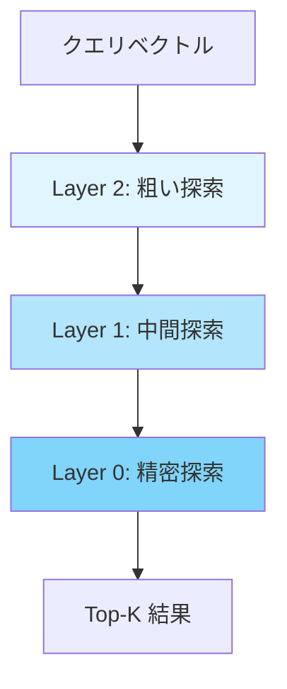
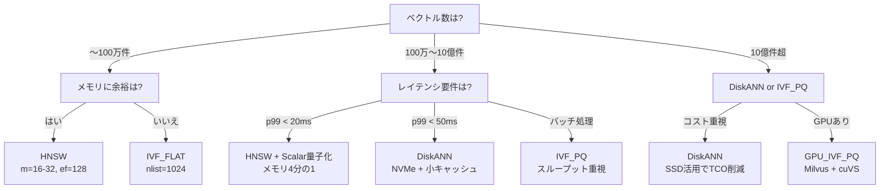

# ベクトルDBインデックス戦略の実測比較：HNSW・IVF・DiskANNのチューニング実践

## この記事でわかること

- **HNSW・IVF・DiskANN**の3大ANNインデックスアルゴリズムの仕組みと使い分け
- pgvector 0.8 / Qdrant 1.15 / Milvus 2.5 でのパラメータチューニング手法
- 100万〜10億ベクトル規模でのベンチマークに基づく性能特性の比較
- ワークロード別（リアルタイム検索・バッチ処理・コスト重視）の選定フローチャート
- 量子化（Scalar・Binary・Product Quantization）によるメモリ削減と速度改善の実践

## 対象読者

- **想定読者**: 中級者以上のバックエンド/MLエンジニア
- **必要な前提知識**:
  - Python 3.11+ の基本的な使い方
  - ベクトル埋め込み（embedding）の基本概念（コサイン類似度、次元数）
  - PostgreSQLまたは他のデータベースの基礎運用経験

:::message
ベクトルDB製品の選定ガイドについては、関連記事「[2026年版ベクトルDB選定ガイド：pgvector・Qdrant・Pineconeを本番ベンチマークで比較](https://zenn.dev/0h_n0/articles/8c8bb192985b64)」もあわせてご参照ください。本記事ではプロダクト選定ではなく、**インデックスアルゴリズムのチューニング**に焦点を当てます。
:::

## 結論・成果

インデックスアルゴリズムの選択とパラメータチューニングにより、**同じデータセットでもQPS（秒間クエリ数）に最大11倍、メモリ使用量に最大90%の差**が生じます。ANN-Benchmarks等の公開ベンチマークでは、HNSWがSIFT1Mデータセットで95% recall@10を1-2msで達成する一方、DiskANNは10億規模で同等のrecallをメモリ使用量90%削減で実現しています。適切なチューニングなしにデフォルト設定で運用すると、必要以上のインフラコストを払うことになります。

## 3大ANNインデックスアルゴリズムを理解する

ベクトル検索で使われるANN（Approximate Nearest Neighbor）アルゴリズムは、**精度（recall）・速度（QPS/latency）・リソース消費（メモリ/ディスク）**のトレードオフを制御する仕組みです。2026年現在、実用的な選択肢は大きく3つに分かれます。

### HNSW（Hierarchical Navigable Small World）

HNSWは**多層グラフ構造**を用いたアルゴリズムです。データポイントを複数の階層に配置し、上位層で大まかな位置を特定してから下位層で精密な探索を行います。高速道路から一般道へと降りていくイメージです。



**主要パラメータ**:

| パラメータ | 役割 | デフォルト値 | 推奨範囲 |
|-----------|------|------------|---------|
| `m` | 各ノードの最大接続数 | 16 | 12-48 |
| `ef_construction` | インデックス構築時の探索幅 | 64 | 64-512 |
| `ef_search` | 検索時の探索幅 | 40 | 50-500 |

`m`を増やすとグラフが密になり検索精度が向上しますが、メモリ使用量とインデックス構築時間が増加します。ANN-Benchmarksの報告では、HNSWはSIFT1M（100万ベクトル、128次元）で**95% recall@10を1-2ms/query**で達成しており、グラフベース手法の中で一貫してPareto最適フロントに位置しています。

**HNSWの強み**: 動的なデータセット（頻繁な追加・削除）に対応でき、任意の距離関数を扱えます。数百万〜数億件規模のインメモリ運用に適しています。

> **よくある間違い**: `ef_construction`をデフォルトの64のまま運用するケースが多いですが、recall要件が95%以上の場合は128-256に引き上げる必要があります。ただし構築時間が2-4倍に増加するため、更新頻度との兼ね合いで判断してください。

### IVF（Inverted File Index）

IVFは**クラスタリングベース**のアルゴリズムです。事前にk-means等でベクトル全体をクラスタ（セル）に分割し、検索時は対象クエリに近いクラスタのみを探索します。

**主要パラメータ**:

| パラメータ | 役割 | 推奨設定 |
|-----------|------|---------|
| `nlist` | クラスタ数 | $\sqrt{N}$ ～ $4\sqrt{N}$（$N$はベクトル数） |
| `nprobe` | 検索時に探索するクラスタ数 | nlistの1-10% |

IVFの検索コストは $O(\text{nprobe} \times \frac{N}{\text{nlist}})$ で、`nprobe`を増やすとrecallが向上しますがレイテンシも増加します。Milvusの公式ドキュメントによると、512文字チャンクのデータセットでHNSWがIVF-FlatをAcc@3で約3.3ポイント上回る一方、IVF-Flatはメモリ消費で優位です。

**IVFの強み**: フィルタ検索（メタデータ条件付き検索）で2段階の絞り込みが可能です。まずセントロイドレベルで粗い絞り込みを行い、次に選択されたクラスタ内で距離計算を実行します。また、Product Quantization（PQ）と組み合わせた**IVF_PQ**は、10億規模のディスクベース検索で有効です。

> **制約条件**: IVFはインデックス構築前に全データのクラスタリングが必要なため、データの追加・削除が頻繁なワークロードには不向きです。クラスタの再構築コストが高いため、バッチ更新が中心のユースケースで検討してください。

### DiskANN

DiskANNはMicrosoft Researchが開発した**SSD最適化型**のグラフベースアルゴリズムです。Vamanaグラフ構造を使い、NVMeストレージをメモリの論理的拡張として扱います。HNSWがデータ全体をRAMに載せる前提であるのに対し、DiskANNはSSD上のデータを効率的に参照します。

公開されている2025年のベンチマークによると、10億規模のデータセットにおいて以下の特性が報告されています。

| 指標 | HNSW | DiskANN | 備考 |
|------|------|---------|------|
| **p95レイテンシ** | 12ms | 15ms | HNSW: M=48, efSearch=96 |
| **recall@50** | 0.94 | 0.95 | DiskANNがわずかに優位 |
| **メモリ使用量** | 55GB RAM | 16GB cache + 350GB NVMe | **DiskANNが約70%削減** |
| **TCO（月額推定）** | 高（大容量RAM必須） | 低（NVMe活用） | DiskANNがコスト優位 |

SQL Server 2025ではDiskANNがネイティブ実装され、10億規模でsub-10msレイテンシと95%+のrecallを両立しています。

**DiskANNの強み**: メモリコストの大幅削減です。RAMの単価はNVMe SSDの約10倍であるため、10億ベクトル規模ではインフラコストに大きな差が出ます。

> **トレードオフ**: DiskANNのレイテンシはI/O性能に依存するため、NVMe SSDの品質がボトルネックになります。p50レイテンシではHNSWが安定して優位であり、リアルタイム性が最優先のユースケースではHNSWを検討してください。

### 3アルゴリズムの比較まとめ

| 特性 | HNSW | IVF | DiskANN |
|------|------|-----|---------|
| **データ構造** | 多層グラフ | クラスタ+転置インデックス | Vamanaグラフ（SSD最適化） |
| **探索計算量** | $O(\log N)$ | $O(\text{nprobe} \times N/\text{nlist})$ | $O(\log N)$（+ディスクI/O） |
| **メモリ効率** | 低（全データRAM必須） | 中（PQ併用で圧縮可） | 高（SSD活用） |
| **動的更新** | 得意 | 苦手（再クラスタリング必要） | 中程度 |
| **フィルタ検索** | 後フィルタ | 2段階フィルタ（得意） | 後フィルタ |
| **推奨規模** | ～数億件 | ～数十億件（PQ併用） | ～数十億件 |

## パラメータチューニングを実践する

アルゴリズムの選択だけでなく、パラメータの調整で性能が大きく変わります。実際のコード例を見ていきましょう。

### pgvector 0.8でHNSWインデックスをチューニングする

pgvector 0.8.0（2024年11月リリース）では、**反復インデックススキャン**と**並列ビルド**が導入され、チューニングの幅が広がりました。

```python
# pgvector_hnsw_tuning.py
import psycopg2

def create_optimized_hnsw_index(conn, table_name: str, dimension: int, target_recall: float = 0.95):
    """
    recallターゲットに応じたHNSWインデックスを構築する。
    target_recall: 0.90-0.99（高いほどm, ef_constructionを増やす）
    """
    # recall要件に基づくパラメータ決定
    if target_recall >= 0.99:
        m, ef_construction = 48, 256
    elif target_recall >= 0.95:
        m, ef_construction = 32, 128
    else:
        m, ef_construction = 16, 64  # デフォルト

    with conn.cursor() as cur:
        # 並列ビルドの設定（pgvector 0.8+）
        # maintenance_work_memをグラフ全体が収まるサイズに設定
        estimated_mem_mb = (dimension * 4 * m * 2) // (1024 * 1024) + 512
        cur.execute(f"SET maintenance_work_mem = '{estimated_mem_mb}MB'")
        cur.execute("SET max_parallel_maintenance_workers = 4")

        # HNSWインデックス作成
        cur.execute(f"""
            CREATE INDEX idx_{table_name}_embedding
            ON {table_name}
            USING hnsw (embedding vector_cosine_ops)
            WITH (m = {m}, ef_construction = {ef_construction})
        """)

        # 検索時のef_searchを設定（セッション単位）
        ef_search = max(m * 2, 100)
        cur.execute(f"SET hnsw.ef_search = {ef_search}")

        # pgvector 0.8の反復スキャンを有効化
        # フィルタ条件付きクエリでの取りこぼしを防止
        cur.execute("SET hnsw.iterative_scan = relaxed_order")

    conn.commit()
    return {"m": m, "ef_construction": ef_construction, "ef_search": ef_search}
```

**パラメータの影響を理解する**:

`maintenance_work_mem`はインデックス構築速度に直結します。Crunchy Data社のブログによると、グラフ全体がこのメモリに収まる場合はインメモリ構築、超える場合はディスクベースの構築に切り替わり、**構築速度が数倍から数十倍遅くなる**と報告されています。

```python
# パラメータ探索の例: recall-latencyトレードオフを測定
def benchmark_ef_search(conn, table_name: str, query_vector: list, ground_truth: list, k: int = 10):
    """ef_searchを変えながらrecall@kとレイテンシを計測する。"""
    import time

    results = []
    for ef in [50, 100, 200, 400]:
        with conn.cursor() as cur:
            cur.execute(f"SET hnsw.ef_search = {ef}")

            start = time.perf_counter()
            cur.execute(f"""
                SELECT id FROM {table_name}
                ORDER BY embedding <=> %s::vector
                LIMIT {k}
            """, (query_vector,))
            elapsed_ms = (time.perf_counter() - start) * 1000

            retrieved = [row[0] for row in cur.fetchall()]
            recall = len(set(retrieved) & set(ground_truth[:k])) / k
            results.append({"ef_search": ef, "recall": recall, "latency_ms": elapsed_ms})

    return results
```

**pgvector 0.8の反復スキャン機能について**: `hnsw.iterative_scan`を`relaxed_order`に設定すると、フィルタ条件付きクエリで最初のスキャンが十分な結果を返さない場合、自動的にスキャン範囲を拡大します。`WHERE category = 'tech'`のようなフィルタを使うRAGシステムでは、この設定が検索漏れの防止に有効です。

> **ハマりポイント**: 並列HNSWビルドを使う場合、Dockerコンテナの`--shm-size`を`maintenance_work_mem`以上に設定する必要があります。デフォルトの64MBでは`ERROR: could not resize shared memory segment`が発生します。

### Qdrant 1.15で量子化を適用する

Qdrantはスカラー量子化・バイナリ量子化・プロダクト量子化の3種類を提供しており、用途に応じて使い分けます。Qdrant公式ドキュメントに基づく性能特性は以下のとおりです。

| 量子化方式 | 圧縮率 | 速度向上 | 精度 | 推奨ユースケース |
|-----------|-------|---------|------|---------------|
| **Scalar（int8）** | 4x | 2x | 0.99 | デフォルト推奨、精度重視 |
| **Binary（1-bit）** | 32x | 40x | 0.95 | 1536次元以上、速度重視 |
| **Binary（2-bit）** | 16x | 20x | 0.95+ | ゼロ近傍値が多いデータ |
| **Product** | 64x | 0.5x | 0.7 | ストレージ極小化 |

```python
# qdrant_quantization.py
from qdrant_client import QdrantClient, models

client = QdrantClient(url="http://localhost:6333")

def create_collection_with_scalar_quantization(name: str, dimension: int):
    """
    Scalar量子化コレクションを作成する。
    精度0.99を維持しつつメモリを4分の1に削減。
    """
    client.create_collection(
        collection_name=name,
        vectors_config=models.VectorParams(
            size=dimension,
            distance=models.Distance.COSINE,
        ),
        # HNSWインデックス設定
        hnsw_config=models.HnswConfigDiff(
            m=16,
            ef_construct=128,
            full_scan_threshold=10000,  # 10000件以下はフルスキャン
        ),
        # Scalar量子化: float32 → int8
        quantization_config=models.ScalarQuantization(
            scalar=models.ScalarQuantizationConfig(
                type=models.ScalarType.INT8,
                quantile=0.99,      # 外れ値1%を除外
                always_ram=True,    # 量子化ベクトルをRAMに常駐
            ),
        ),
    )

def create_collection_with_binary_quantization(name: str, dimension: int):
    """
    Binary量子化コレクションを作成する（1536次元以上推奨）。
    メモリ32分の1、検索速度最大40倍。ただしrecallは約0.95。
    """
    if dimension < 1536:
        raise ValueError(
            f"Binary量子化は1536次元以上を推奨（現在: {dimension}次元）。"
            "低次元ではrecallが大幅に低下します。"
        )

    client.create_collection(
        collection_name=name,
        vectors_config=models.VectorParams(
            size=dimension,
            distance=models.Distance.COSINE,
        ),
        quantization_config=models.BinaryQuantization(
            binary=models.BinaryQuantizationConfig(
                always_ram=True,
            ),
        ),
    )
```

**検索時のリスコアリング設定**が精度維持の鍵です。

```python
def search_with_rescore(collection_name: str, query_vector: list[float], top_k: int = 10):
    """
    量子化ベクトルで高速に候補を絞り、
    元のfloat32ベクトルでリスコアリングして精度を回復する。
    """
    results = client.query_points(
        collection_name=collection_name,
        query=query_vector,
        search_params=models.SearchParams(
            hnsw_ef=128,
            quantization=models.QuantizationSearchParams(
                ignore=False,       # 量子化ベクトルを使用
                rescore=True,       # 元ベクトルでリランキング
                oversampling=2.0,   # 候補をtop_kの2倍取得
            ),
        ),
        limit=top_k,
    )
    return results
```

**なぜrescore=Trueが重要か**:

量子化により距離計算の精度が下がるため、`oversampling=2.0`で2倍の候補を取得し、元のfloat32ベクトルで再ランキングします。Qdrant公式ドキュメントによると、この設定でScalar量子化のrecallは0.95→0.99に回復します。

> **注意点**: Qdrant 1.15で導入された「HNSW healing」機能により、インデックス最適化時に既存グラフ情報を再利用できるようになりました。大規模コレクションの再インデックスが必要な場合に構築時間を削減できます。ただし、この機能はデータの大幅な変更（50%以上の入れ替え）には効果が限定的です。

### Milvus 2.5でIVFインデックスとGPUを活用する

Milvusは複数のIVFバリアントを提供しています。NVIDIA cuVSとの統合により、GPUアクセラレーションも利用可能です。

```python
# milvus_ivf_setup.py
from pymilvus import MilvusClient

client = MilvusClient(uri="http://localhost:19530")

def create_collection_with_ivf_index(
    name: str,
    dimension: int,
    num_vectors: int,
    use_gpu: bool = False,
):
    """
    データ規模に応じたIVFインデックスを構成する。
    num_vectors: 想定ベクトル数（nlist計算に使用）
    """
    import math

    # nlistの決定: sqrt(N) ~ 4*sqrt(N)
    nlist = int(math.sqrt(num_vectors) * 2)
    nlist = max(128, min(nlist, 65536))

    # データ規模に応じたインデックスタイプ選択
    if num_vectors < 1_000_000:
        # 100万件未満: IVF_FLAT（圧縮なし、精度最大）
        index_type = "GPU_IVF_FLAT" if use_gpu else "IVF_FLAT"
        index_params = {"nlist": nlist}
    elif num_vectors < 100_000_000:
        # 1億件未満: IVF_SQ8（スカラー量子化、メモリ75%削減）
        index_type = "IVF_SQ8"
        index_params = {"nlist": nlist}
    else:
        # 1億件以上: IVF_PQ（プロダクト量子化、メモリ大幅削減）
        index_type = "GPU_IVF_PQ" if use_gpu else "IVF_PQ"
        # mはdimensionの約数にする
        m_pq = 8 if dimension % 8 == 0 else 4
        index_params = {"nlist": nlist, "m": m_pq, "nbits": 8}

    # コレクション作成
    client.create_collection(
        collection_name=name,
        dimension=dimension,
    )

    # インデックス作成
    index_config = {
        "index_type": index_type,
        "metric_type": "COSINE",
        "params": index_params,
    }
    client.create_index(
        collection_name=name,
        field_name="vector",
        index_params=index_config,
    )

    return {
        "index_type": index_type,
        "nlist": nlist,
        "estimated_nprobe": max(1, nlist // 100),
    }
```

NVIDIA Technical Blogの報告によると、cuVSライブラリとの統合で以下の性能改善が実現されています。

| 指標 | CPU（IVF_FLAT） | GPU（GPU_IVF_FLAT） | 改善率 |
|------|----------------|-------------------|-------|
| インデックス構築 | 6.22日 | 56分 | **160倍高速** |
| 検索レイテンシ | ベースライン | 10%（90%削減） | **10倍高速** |
| 対象データ | 635M / 1024次元 | 8x DGX H100 | - |

```python
# 検索時のnprobe調整
def search_with_optimal_nprobe(
    client: MilvusClient,
    collection_name: str,
    query_vectors: list[list[float]],
    nlist: int,
    target_recall: float = 0.95,
    top_k: int = 10,
):
    """nprobeをrecallターゲットに合わせて調整する。"""
    # 経験則: recall 0.9 → nprobe=nlist*1%, recall 0.95 → 5%, recall 0.99 → 10%
    recall_to_ratio = {0.90: 0.01, 0.95: 0.05, 0.99: 0.10}
    ratio = recall_to_ratio.get(target_recall, 0.05)
    nprobe = max(1, int(nlist * ratio))

    results = client.search(
        collection_name=collection_name,
        data=query_vectors,
        limit=top_k,
        search_params={"nprobe": nprobe},
    )
    return results
```

> **よくある間違い**: GPU_IVF_PQのインデックス構築は高速ですが、少量データ（10万件未満）ではGPUのオーバーヘッドが検索レイテンシを増加させることがあります。GPU活用は100万件以上のデータセットから効果が出始めます。

## ワークロード別の選定フローチャートを設計する

実際の選定では、データ規模・レイテンシ要件・予算の3軸で判断します。



### 選定の具体的な判断基準

**ケース1: RAGシステムの社内検索（100万件、リアルタイム）**

PostgreSQLを既に使っている場合は**pgvector + HNSW**が第一選択です。追加のインフラなしで導入でき、m=32、ef_construction=128、ef_search=100の設定でrecall 95%+を実現できます。pgvector 0.8の反復スキャンにより、メタデータフィルタ付き検索の精度も改善されています。

**ケース2: Eコマースの商品検索（1000万件、低レイテンシ）**

Qdrant + Scalar量子化がバランスの良い選択です。HNSWの精度を維持しつつメモリを4分の1に削減し、`rescore=True`で99%のrecallを確保できます。OpenAI text-embedding-3-small（1536次元）を使う場合はBinary量子化も検討対象に入ります。

**ケース3: ログ分析の類似検索（10億件、バッチ処理）**

DiskANNまたはIVF_PQが適しています。リアルタイム性が不要であれば、IVF_PQ（Milvus + GPU）でスループットを最大化できます。NVIDIAの報告では、8台のDGX H100で635Mベクトル（1024次元）のインデックス構築が56分で完了しています。

### コスト試算の例

10億ベクトル（768次元）を運用する場合の月額コスト概算です。

| 構成 | メモリ | ストレージ | 月額概算（AWS） |
|------|-------|----------|-------------|
| HNSW（RAM全載せ） | 3TB RAM | - | $15,000-20,000 |
| HNSW + Scalar量子化 | 750GB RAM | - | $5,000-7,000 |
| DiskANN | 64GB RAM | 3TB NVMe | $2,000-3,000 |
| IVF_PQ | 128GB RAM | 1TB NVMe | $2,500-3,500 |

> **制約条件**: 上記は概算であり、実際のコストはクラウドプロバイダーのインスタンスタイプ、リザーブドインスタンスの有無、データ転送量により変動します。本番導入前に実データでのベンチマークを推奨します。

## よくある問題と解決方法

| 問題 | 原因 | 解決方法 |
|------|------|----------|
| HNSWのrecallが90%に届かない | `ef_search`が低すぎる | `ef_search`をm*4以上に増加（例: m=32なら128以上） |
| インデックス構築が遅い（pgvector） | `maintenance_work_mem`不足 | グラフ全体が収まるサイズに増加（例: 4GB→16GB） |
| フィルタ検索で結果が少ない | HNSWの後フィルタで取りこぼし | pgvector 0.8の`hnsw.iterative_scan = relaxed_order`を有効化 |
| Binary量子化でrecallが低い | 低次元ベクトルで使用 | 1536次元未満ではScalar量子化に切り替え |
| GPU_IVF_PQで検索が遅い | データ量が少なすぎる | 100万件未満ではCPU版IVF_FLATの方が高速 |
| DiskANNのレイテンシが不安定 | SSDのI/O帯域が不足 | NVMe SSDの品質を確認、IOPS 100K+を推奨 |

## まとめと次のステップ

**まとめ:**

- **HNSW**は数百万〜数億件のインメモリ検索で最も汎用的な選択肢。pgvector 0.8の反復スキャン・並列ビルドにより、PostgreSQL環境での実用性が向上
- **IVF（+PQ）**はメモリ効率とフィルタ検索に優れ、バッチ処理やGPU活用で10億規模に対応可能。Milvus + cuVSでインデックス構築を160倍高速化
- **DiskANN**は10億規模でHNSW比70-90%のメモリ削減を実現し、TCOを大幅に削減。SQL Server 2025でのネイティブサポートにより導入障壁が低下
- **量子化**はどのアルゴリズムとも組み合わせ可能。Scalar量子化（4x圧縮/精度0.99）がデフォルト推奨、1536次元以上ではBinary量子化（32x圧縮/速度40x）も検討
- パラメータチューニングの効果は大きく、**デフォルト設定からの最適化でQPSが2-5倍改善**することが一般的

**次にやるべきこと:**

1. 自分のデータセットでrecall-latencyカーブを計測する（本記事のベンチマークコードを参考）
2. 本番トラフィックのp50/p95/p99レイテンシを監視し、`ef_search`や`nprobe`を段階的に調整する
3. データ規模の増加予測に基づき、HNSW→DiskANNへの移行タイミングを検討する

## 参考

- [HNSW Indexes with Postgres and pgvector - Crunchy Data Blog](https://www.crunchydata.com/blog/hnsw-indexes-with-postgres-and-pgvector)
- [pgvector 0.8.0 Released! - PostgreSQL](https://www.postgresql.org/about/news/pgvector-080-released-2952/)
- [Quantization - Qdrant Documentation](https://qdrant.tech/documentation/guides/quantization/)
- [How to Choose Between IVF and HNSW for ANN Vector Search - Milvus Blog](https://milvus.io/blog/understanding-ivf-vector-index-how-It-works-and-when-to-choose-it-over-hnsw.md)
- [Enhancing GPU-Accelerated Vector Search in Faiss with NVIDIA cuVS - NVIDIA Technical Blog](https://developer.nvidia.com/blog/enhancing-gpu-accelerated-vector-search-in-faiss-with-nvidia-cuvs/)
- [HNSW vs. DiskANN - Tiger Data](https://www.tigerdata.com/learn/hnsw-vs-diskann)
- [ANN-Benchmarks](https://ann-benchmarks.com/)
- [Faster similarity search with pgvector indexes - Google Cloud Blog](https://cloud.google.com/blog/products/databases/faster-similarity-search-performance-with-pgvector-indexes)

---

:::message
この記事はAI（Claude Code）により自動生成されました。内容の正確性については複数の情報源で検証していますが、実際の利用時は公式ドキュメントもご確認ください。
:::
