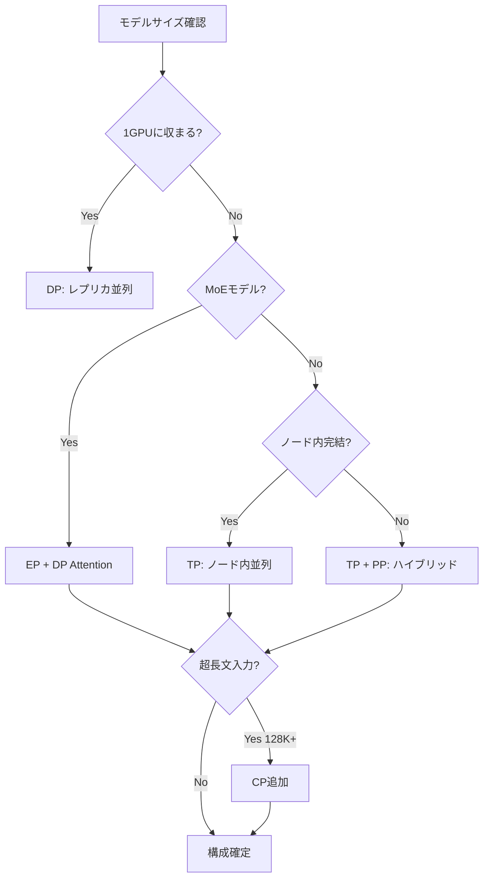
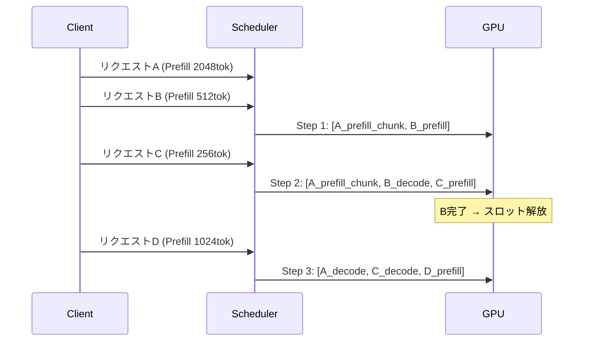
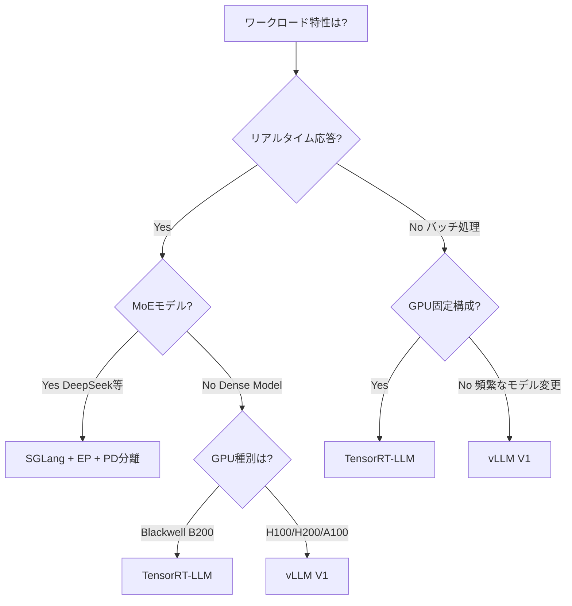

# vLLM・SGLang・TensorRT-LLMのマルチGPU並列推論比較と最適化実践

## この記事でわかること

- LLM推論における**5種類の並列化戦略**（TP・PP・DP・EP・CP）の使い分け
- vLLM V1エンジンのアーキテクチャ変更と**V0比1.7倍のスループット改善**を引き出す設定方法
- SGLangのDP Attention＋Expert Parallelismで**DeepSeek-R1を52.3k入力tok/s/node**で配信する構成
- Prefill/Decode分離アーキテクチャによる**レイテンシばらつき最大20倍改善**の仕組み
- 3エンジンのベンチマーク比較から導く**ワークロード別の選定基準**

## 対象読者

- **想定読者**: 中級〜上級のLLMインフラエンジニア・MLOpsエンジニア
- **必要な前提知識**:
  - Python 3.11+の非同期処理（async/await）
  - CUDA・GPU メモリ管理の基礎
  - Transformerアーキテクチャ（Attention、MLP層）の基本理解
  - LLM推論の基本概念（KVキャッシュ、トークン生成）
- **動作確認環境**: vLLM 0.8.x（V1エンジン）、SGLang v0.4+、TensorRT-LLM 0.18.x、NVIDIA H100/H200（2026年2月時点）

## 結論・成果

マルチGPU並列推論の最適化により、以下の成果が報告されています。

- **vLLM V1**: V0比最大**1.7倍のスループット改善**、H200で**2.2k tok/s/GPU**を達成（vLLM公式ブログによる）
- **SGLang**: 96台のH100で**52.3k入力tok/s/node**、DeepSeek API公式価格の**1/5のコスト**を実現（LMSYS公式ベンチマークによる）
- **TensorRT-LLM**: NVIDIA Blackwell（B200）環境でvLLM・SGLangを上回るスループット（Clarifai社のベンチマークによる）

ただし、これらの数値は特定のモデル・ハードウェア・ワークロードでの測定値であり、環境によって結果は異なります。自社の要件に合った構成を選ぶことが重要です。

> 関連記事: [LLMバッチ処理最適化：APIコスト50%削減と推論スループット23倍を実現する実践ガイド](https://zenn.dev/0h_n0/articles/fdb73841a9ac71) — API Batch処理（OpenAI/Anthropic）とvLLMの基礎を解説しています。本記事ではマルチGPU環境での並列推論最適化に焦点を当てます。

## マルチGPU並列化の5つの戦略を理解する

LLM推論のマルチGPU並列化には5つの主要な戦略があります。それぞれの特性を理解することで、ワークロードに最適な構成を選択できます。

### Tensor Parallelism（TP）: 層内分割で低レイテンシを実現する

Tensor Parallelismは、モデルの個々のレイヤー（Attention層やMLP層）を複数GPUに分割して並列計算する手法です。レイテンシ削減に有効ですが、GPU間通信（allreduce）がボトルネックになる場合があります。

```python
# vLLM: Tensor Parallelismの設定例
# tensor_parallel_size でGPU分割数を指定
from vllm import LLM, SamplingParams

# 4GPU Tensor Parallelism
llm = LLM(
    model="meta-llama/Llama-3.3-70B-Instruct",
    tensor_parallel_size=4,  # 4GPU間でレイヤーを分割
    dtype="auto",
    gpu_memory_utilization=0.90,
)

sampling_params = SamplingParams(temperature=0.7, max_tokens=512)
outputs = llm.generate(["Explain tensor parallelism in LLM inference"], sampling_params)
```

**TPの適用指針**:
- モデルが1GPUのVRAMに収まらない場合に必須
- NVLink/NVSwitch接続のGPU間で効果が高い（InfiniBand跨ぎではオーバーヘッド増大）
- Metaの報告では、allreduce通信がエンドツーエンドレイテンシの**最大30%**を占めるケースがあり、DDA（Direct Data Access）アルゴリズムで改善を図っている

> **注意**: TPの分割数を増やすほどGPU間通信が増加します。通常、1ノード内の8GPU以下に留めることが推奨されます。ノード間TPは高速インターコネクトがない限り実用的ではありません。

### Pipeline Parallelism（PP）: レイヤー群を直列配置する

Pipeline Parallelismは、モデルのレイヤー群を複数GPUに順番に配置し、各GPUがパイプラインの1ステージを担当する手法です。

```python
# vLLM: Pipeline Parallelism + Tensor Parallelismの組み合わせ
# 8GPU = TP4 × PP2 で構成する例
llm = LLM(
    model="meta-llama/Llama-3.3-70B-Instruct",
    tensor_parallel_size=4,
    pipeline_parallel_size=2,  # 2段パイプライン
)
```

**PP vs TPの使い分け**:

| 観点 | Tensor Parallelism | Pipeline Parallelism |
|------|-------------------|---------------------|
| レイテンシ | 低い（並列実行） | 高い（直列実行） |
| 通信量 | 大きい（毎レイヤーallreduce） | 小さい（ステージ間のみ） |
| 適用場面 | ノード内8GPU以下 | ノード間分散 |
| GPU稼働率 | 高い | パイプラインバブルで低下の可能性 |

**注意点**: vLLM V1エンジンでは2026年2月時点でPipeline Parallelismが未サポートです。PPが必要な場合はV0エンジンまたはTensorRT-LLMを検討してください。

### Data Parallelism（DP）: レプリカで帯域を稼ぐ

Data Parallelismは、モデルを複数GPUに複製し、入力バッチを分割して並列処理する手法です。各GPUが独立にリクエストを処理するため、スループットがGPU数にほぼ比例してスケールします。

```bash
# vLLM: Data Parallelismは複数プロセスで実現
# ロードバランサ(nginx等)で複数vLLMインスタンスにリクエスト分散

# インスタンス1（GPU 0-3: TP=4）
CUDA_VISIBLE_DEVICES=0,1,2,3 vllm serve meta-llama/Llama-3.3-70B-Instruct \
    --tensor-parallel-size 4 --port 8000

# インスタンス2（GPU 4-7: TP=4）
CUDA_VISIBLE_DEVICES=4,5,6,7 vllm serve meta-llama/Llama-3.3-70B-Instruct \
    --tensor-parallel-size 4 --port 8001
```

### Expert Parallelism（EP）: MoEモデル専用の最適化

Expert Parallelism は、Mixture-of-Experts（MoE）モデル（DeepSeek-V3/R1など）の各Expertを異なるGPUに配置し、必要なExpertのみアクティベートする手法です。

SGLangの報告によると、DeepSeek-R1（671Bパラメータ、アクティブ37B）をTP単独で配信する場合と比較して、EP構成では**最大5倍のスループット向上**を達成しています。

```bash
# SGLang: Expert Parallelismの設定
# 8GPU環境でEP8（8-way Expert Parallelism）
python -m sglang.launch_server \
    --model deepseek-ai/DeepSeek-R1 \
    --tp 1 --dp 8 \
    --enable-ep \
    --trust-remote-code
```

### Context Parallelism（CP）: 超長文入力を分割処理する

Context Parallelismは、128Kトークン以上の超長文入力を複数GPUに分割して並列処理する手法です。Metaの報告では、**100万トークンの入力を1分未満**で処理できたとされています（H100 8GPUノード、Llama 3 405B）。

**CPの利用場面**:
- 128K+ トークンのプロンプト処理
- コードリポジトリ全体の一括解析
- 長文ドキュメントの要約

> **制約**: CPはPrefillフェーズ専用の最適化です。Decodeフェーズでは効果がありません。また、実装が複雑でフレームワークサポートが限定的です（2026年2月時点でMeta内部・NVIDIA Megatron中心）。

### 並列化戦略の選定フローチャート



## vLLM V1エンジンの最適化を実践する

vLLM V1は2025年1月にアルファリリースされ、V0からアーキテクチャを根本的に刷新しました。vLLM公式ブログの報告では、V0比で**最大1.7倍のスループット改善**を達成しています。

### V1エンジンの主要な改善点

V1では以下の設計変更により、CPUボトルネックを解消しています。

1. **統一スケジューラ**: PrefillとDecodeを区別せず、`{request_id: num_tokens}`の辞書で管理。Chunked PrefillとPrefix Cachingが自然に統合
2. **マルチプロセスアーキテクチャ**: EngineCore（スケジューラ＋モデル実行）を独立プロセスに分離。トークナイゼーションやデトークナイゼーションのCPU負荷がGPU実行をブロックしない
3. **Persistent Batch**: 入力テンソルをキャッシュし、差分のみ適用。ステップごとのテンソル再生成コストを削減
4. **ゼロオーバーヘッドPrefix Caching**: キャッシュヒット率0%でもオーバーヘッドがほぼゼロ。V1ではデフォルトで有効

```python
# vLLM V1エンジンの有効化と最適化設定
import os

# V1エンジンを有効化（vLLM 0.8.x ではデフォルト）
os.environ["VLLM_USE_V1"] = "1"

from vllm import LLM, SamplingParams

llm = LLM(
    model="meta-llama/Llama-3.3-70B-Instruct",
    tensor_parallel_size=4,
    gpu_memory_utilization=0.92,          # VRAMの92%をKVキャッシュに割り当て
    max_num_seqs=256,                     # 同時処理リクエスト上限
    enable_chunked_prefill=True,          # 長文プロンプトの分割処理
    max_num_batched_tokens=8192,          # 1ステップで処理する最大トークン数
)

# バッチ推論の実行
prompts = [f"Summarize the concept of {topic}" for topic in topics_list]
sampling_params = SamplingParams(temperature=0.0, max_tokens=1024)
results = llm.generate(prompts, sampling_params)
```

**なぜV1を選ぶのか:**
- V0と同じAPIで、環境変数1つで切り替え可能
- Prefix Cachingが自動で効く（RAGのように共通プレフィックスが多いワークロードで特に有効）
- torch.compile統合により、カスタムカーネルなしでモデル最適化が効く

### Chunked Prefillで長文入力のレイテンシスパイクを防ぐ

Chunked Prefillは、32Kトークン以上の長文プロンプトを小さなチャンクに分割し、Decodeリクエストとインターリーブして処理する機能です。これにより、長文Prefill処理中に既存のDecodeリクエストが待たされる（Head-of-Line Blocking）問題を解消します。

```python
# Chunked Prefillの動作イメージ
# 長文プロンプト（32Kトークン）を4096トークンずつ分割

# ステップ1: [Prefill chunk 1: 4096 tok] + [Decode: req_1, req_2, req_3]
# ステップ2: [Prefill chunk 2: 4096 tok] + [Decode: req_1, req_2, req_3, req_4]
# ステップ3: [Prefill chunk 3: 4096 tok] + [Decode: req_2, req_3, req_4]
# ...

# vLLM V1ではチャンクサイズをmax_num_batched_tokensで制御
llm = LLM(
    model="meta-llama/Llama-3.3-70B-Instruct",
    tensor_parallel_size=4,
    enable_chunked_prefill=True,
    max_num_batched_tokens=4096,  # チャンクサイズ上限
)
```

**トレードオフ**: チャンクサイズを小さくするとDecodeのレイテンシが安定しますが、Prefillのスループット（TTFT: Time to First Token）は悪化します。バッチ処理中心のオフラインワークロードでは`max_num_batched_tokens`を大きめ（8192〜16384）に設定するのが有効です。

### Continuous Batchingの内部動作を把握する

vLLMのContinuous Batching（連続バッチング）は、従来のStatic Batchingとは異なり、リクエストが完了するたびに新しいリクエストをバッチに追加します。



**Static Batchingとの性能差**: Continuous Batchingにより、GPU稼働率は報告によって異なりますが、vLLM公式では**3〜10倍のスループット向上**が得られるとされています。特にリクエストの出力長にばらつきがある場合に効果が大きく、短いリクエストが完了次第すぐにスロットが再利用されます。

## SGLangのDP Attention＋EPで MoEモデルを高速配信する

SGLangは、LMSYS（Chatbot Arenaの運営チーム）が開発する高性能推論フレームワークです。特にMoEモデル（DeepSeek-V3/R1）向けの最適化が充実しています。

### DP Attention: KVキャッシュの重複を排除する

SGLang v0.4で導入されたDP Attentionは、通常のData Parallelismと異なり、**Attention層にのみData Parallelismを適用**し、MLP/Expert層にはExpert Parallelismを適用するハイブリッド戦略です。

```python
# SGLangのDP Attention構成イメージ
# 8GPU環境の場合

# 従来のTP8構成:
#   - 各GPUが全レイヤーの1/8を保持
#   - KVキャッシュは8GPU間で分散 → 各GPUのKVキャッシュ容量が制限

# DP8 + EP構成（SGLang）:
#   - Attention層: 各GPUが独立にKVキャッシュを保持（DP）
#   - Expert層: Expertを8GPUに分散配置（EP）
#   - 通信: Expert層でのall-to-allのみ（Attention層はローカル計算）
```

この構成により、以下の利点があります。

- **KVキャッシュ容量の増大**: TP構成では各GPUのKVキャッシュが制限されるが、DP構成では各GPUが独立にKVキャッシュを管理
- **通信量の削減**: LMSYS公式の報告では、TP単独比で通信コストが**50%削減**
- **Decodeスループットの向上**: DeepSeekモデルのMulti-head Latent Attention（MLA）構造との相性が良く、LMSYS報告では**最大1.9倍のDecodeスループット改善**

### 大規模EP構成でDeepSeek-R1を配信する

LMSYS公式ブログの報告によると、96台のH100 GPU（12ノード）でDeepSeek-R1を配信し、以下の成果を達成しています。

```bash
# SGLang: 96 H100 GPUでの大規模配信構成例
# 12ノード × 8GPU/ノード = 96 GPU

# Prefillノード（4ノード = 32 GPU）
python -m sglang.launch_server \
    --model deepseek-ai/DeepSeek-R1 \
    --tp 1 --dp 8 --enable-ep \
    --node-rank 0 --nnodes 4 \
    --disagg-mode prefill \
    --trust-remote-code

# Decodeノード（8ノード = 64 GPU）
python -m sglang.launch_server \
    --model deepseek-ai/DeepSeek-R1 \
    --tp 1 --dp 8 --enable-ep \
    --node-rank 0 --nnodes 8 \
    --disagg-mode decode \
    --trust-remote-code
```

**LMSYS報告の達成数値（96 H100, 2000トークン入力シーケンス）:**

| 指標 | 数値 |
|------|------|
| 入力トークンスループット | 52.3k tok/s/node |
| 出力トークンスループット | 22.3k tok/s/node |
| コスト | $0.20/M output tokens |
| TP単独比スループット | 5倍改善 |

**最適化テクニックの内訳:**

1. **Two-Batch Overlap（TBO）**: 計算と通信をオーバーラップし、レイテンシを27-35%削減。バッチサイズを40.5%拡大可能に
2. **Expert Parallel Load Balancer（EPLB）**: Expert間のワークロード不均衡を最適化し、Prefill 1.49倍・Decode 2.54倍の高速化
3. **DeepEP・DeepGEMM統合**: DeepSeek社提供の最適化カーネルを活用

**ハマりポイント**: EP構成ではExpert間のトークンルーティングにall-to-all通信が必要です。ノード間のネットワーク帯域がボトルネックになることがあり、InfiniBand 400Gbps以上の環境が推奨されます。低帯域環境ではTP構成の方が実効スループットが高くなる場合があります。

## TensorRT-LLMのハードウェア最適化とIn-Flight Batchingを活用する

TensorRT-LLMはNVIDIA公式の推論最適化ライブラリで、NVIDIAハードウェアとの最深レベルの統合が強みです。

### In-Flight Batchingの仕組み

TensorRT-LLMのIn-Flight Batchingは、vLLMのContinuous Batchingと同様の概念ですが、NVIDIAのカスタムカーネルと緊密に統合されている点が異なります。

```python
# TensorRT-LLM: In-Flight Batchingの設定
# trtllm-buildでエンジンをビルドし、tritonserver で配信

# Step 1: エンジンビルド（Tensor Parallelism 4GPU）
# trtllm-build \
#     --checkpoint_dir ./llama-70b-checkpoint \
#     --output_dir ./llama-70b-engine \
#     --tp_size 4 \
#     --max_batch_size 256 \
#     --max_input_len 4096 \
#     --max_seq_len 8192 \
#     --use_paged_kv_cache \
#     --enable_chunked_context

# Step 2: Triton Inference Serverで配信
# mpirun -n 4 --allow-run-as-root \
#     tritonserver \
#     --model-repository ./triton_model_repo \
#     --grpc-port 8001 \
#     --http-port 8000
```

**TensorRT-LLMの独自最適化:**
- **カスタムAttentionカーネル**: FP8/INT8量子化対応のfused Attentionカーネル
- **Paged KV Cache**: vLLMのPagedAttentionと同様のページベースメモリ管理
- **Speculative Decoding**: Draft modelによる投機的デコードのネイティブサポート

### Blackwell GPU（B200）での性能優位

Clarifai社のベンチマーク（GPT-OSS-120B、2×GPU構成）によると、B200環境ではTensorRT-LLMが全指標でvLLM・SGLangを上回ったとされています。これはNVIDIAが最新ハードウェア向けに先行してカーネル最適化を行うためです。

一方、H100環境では異なる結果が報告されています。

| エンジン | H100 スループット (tok/s, 100並列) | H100 TTFT特性 | 備考 |
|----------|-----------------------------------|---------------|------|
| vLLM | 4,741 | 最速（全並列度で一貫） | GPT-OSS-120B, 2×H100 |
| SGLang | やや低い | 安定（4-21ms/tok） | 低レイテンシばらつき |
| TensorRT-LLM | 中程度 | 中程度 | ビルド工程が必要 |

> 出典: [Comparing SGLANG, vLLM, and TensorRT-LLM with GPT-OSS-120B](https://www.clarifai.com/blog/comparing-sglang-vllm-and-tensorrt-llm-with-gpt-oss-120b)（Clarifai社ベンチマーク、2025年）

**トレードオフ**: TensorRT-LLMはエンジンビルドのステップが必要で、モデル変更のたびに再ビルドが発生します。vLLM・SGLangはHugging Faceモデルをそのまま読み込めるため、開発イテレーションが速いです。本番環境でモデルが固定されている場合にはTensorRT-LLMの性能メリットが活きます。

## Prefill/Decode分離アーキテクチャを構築する

2025年以降、Prefill（入力処理）とDecode（トークン生成）をそれぞれ独立したGPUクラスタで実行する**Prefill/Decode分離（PD Disaggregation）**が、多くのプロダクション環境で標準アーキテクチャになっています。Meta、LinkedIn、Mistral、HuggingFaceがvLLMベースのPD分離を本番運用しています。

### なぜ分離するのか

PrefillとDecodeは計算特性が根本的に異なります。

| フェーズ | ボトルネック | GPU利用パターン | 最適ハードウェア |
|---------|-------------|----------------|-----------------|
| Prefill | **計算律速** | 大行列の並列乗算 | 高FLOPSのGPU（H100 SXM） |
| Decode | **メモリ帯域律速** | KVキャッシュ読み出し | 高HBM帯域のGPU（H200） |

同一GPU上で両フェーズを混在実行すると、長文PrefillがDecodeの応答をブロックし（Head-of-Line Blocking）、Inter-Token Latency（ITL）のテールレイテンシが悪化します。

### vLLMでのPD分離構成

```bash
# vLLM: Prefill/Decode分離構成（実験的機能、vLLM 0.8.x）

# Prefillワーカー（高FLOPS GPU割り当て）
VLLM_USE_V1=1 vllm serve meta-llama/Llama-3.3-70B-Instruct \
    --tensor-parallel-size 4 \
    --port 8100 \
    --kv-connector PyNcclConnector \
    --kv-role kv_producer \
    --kv-parallel-size 4 \
    --kv-buffer-size 1e10

# Decodeワーカー（高メモリ帯域GPU割り当て）
VLLM_USE_V1=1 vllm serve meta-llama/Llama-3.3-70B-Instruct \
    --tensor-parallel-size 4 \
    --port 8200 \
    --kv-connector PyNcclConnector \
    --kv-role kv_consumer \
    --kv-parallel-size 4 \
    --kv-buffer-size 1e10
```

**PD分離の効果:**
- **ITLテールレイテンシの削減**: 長文Prefillの影響がDecodeに波及しない
- **独立スケーリング**: Prefillノードの数をDecodeノードと独立に増減可能
- **インフラコスト15-40%削減の可能性**: DistServe論文（OSDI '24）の著者らの実験による報告

**制約と注意点**:
- PD分離は**スループットを改善するわけではない**（vLLM公式ドキュメントに明記）
- KVキャッシュをPrefillノードからDecodeノードへ転送するため、**高速ネットワーク（NVLink/InfiniBand）が必須**
- 構成の複雑さが増し、運用負荷が上がる
- vLLMでは2026年2月時点で実験的機能（Experimental）

## ワークロード別のエンジン選定とよくある問題を整理する

### 選定判断フロー



### ワークロード別の推奨構成

| ワークロード | 推奨エンジン | 並列化戦略 | 根拠 |
|-------------|-------------|-----------|------|
| オンライン配信（Dense） | vLLM V1 | TP | TTFT最速（Clarifai報告） |
| オンライン配信（MoE） | SGLang | EP + DP Attention | DeepSeekで最高スループット（LMSYS報告） |
| オフラインバッチ | vLLM V1 | TP + DP | Continuous Batchingが自動で効く |
| 超長文入力（128K+） | SGLang/vLLM | TP + CP | CP対応は限定的 |
| Blackwell GPU固定 | TensorRT-LLM | TP | ハードウェア最適化が効く |
| 本番固定モデル | TensorRT-LLM | TP + PP | ビルド済みエンジンで最高性能 |

### よくある問題と解決方法

| 問題 | 原因 | 解決方法 |
|------|------|----------|
| GPU稼働率が低い（<50%） | バッチサイズ不足 | `max_num_seqs`を増やす / DP構成でリクエスト集約 |
| OOM（Out of Memory） | KVキャッシュ過大 | `gpu_memory_utilization`を下げる / TP数を増やす |
| TTFT遅延（>5秒） | 長文Prefillがボトルネック | Chunked Prefill有効化 / PD分離 |
| ITLテールレイテンシ大 | Prefill/Decode混在実行 | PD分離構成を検討 |
| EP構成でスループット出ない | ネットワーク帯域不足 | InfiniBand 400Gbps+を確保 / TP構成に切替 |
| TensorRT-LLMビルドエラー | モデル未対応 | サポートモデルリスト確認 / vLLM/SGLangへ切替 |

## まとめと次のステップ

**まとめ:**

- LLM推論の並列化は**TP・PP・DP・EP・CP**の5戦略があり、モデル種別・ハードウェア・ワークロードに応じた使い分けが重要
- **vLLM V1**はV0比1.7倍のスループット改善を達成し、ゼロオーバーヘッドPrefix CachingとChunked Prefillが標準搭載
- **SGLang**はDP Attention + EPのハイブリッド構成でMoEモデルに強く、DeepSeek-R1で52.3k入力tok/s/node（LMSYS報告）
- **TensorRT-LLM**はNVIDIA最新GPUとの深い統合が強みで、Blackwell環境で最高性能
- **Prefill/Decode分離**は2025年以降の標準アーキテクチャになりつつあるが、構成の複雑さとネットワーク要件がトレードオフ
- 各ベンチマーク数値は特定条件下での測定値であり、実環境では自社ワークロードでの計測が不可欠

**次にやるべきこと:**

1. 自社のモデル・GPU構成で3エンジンを実際にベンチマーク（[vLLM benchmark suite](https://docs.vllm.ai/en/stable/performance/benchmarks.html)を活用）
2. MoEモデルを使う場合はSGLangのEP構成を検証し、TP構成と比較
3. 本番環境ではPD分離の導入を段階的に検討（まずはChunked Prefillから開始）

## 参考

- [vLLM V1: A Major Upgrade to vLLM's Core Architecture](https://blog.vllm.ai/2025/01/27/v1-alpha-release.html) — vLLM V1アーキテクチャ詳解
- [Inside vLLM: Anatomy of a High-Throughput LLM Inference System](https://blog.vllm.ai/2025/09/05/anatomy-of-vllm.html) — vLLM V1内部動作の解説
- [vLLM Large Scale Serving: DeepSeek @ 2.2k tok/s/H200 with Wide-EP](https://blog.vllm.ai/2025/12/17/large-scale-serving.html) — vLLMの大規模EP配信
- [Deploying DeepSeek with PD Disaggregation and Large-Scale EP on 96 H100 GPUs](https://lmsys.org/blog/2025-05-05-large-scale-ep/) — SGLang公式ベンチマーク
- [Scaling LLM Inference: Innovations in Tensor Parallelism, Context Parallelism, and Expert Parallelism](https://engineering.fb.com/2025/10/17/ai-research/scaling-llm-inference-innovations-tensor-parallelism-context-parallelism-expert-parallelism/) — Meta Engineering Blog
- [Data, tensor, pipeline, expert and hybrid parallelisms](https://bentoml.com/llm/inference-optimization/data-tensor-pipeline-expert-hybrid-parallelism) — BentoML LLM Inference Handbook
- [Comparing SGLANG, vLLM, and TensorRT-LLM with GPT-OSS-120B](https://www.clarifai.com/blog/comparing-sglang-vllm-and-tensorrt-llm-with-gpt-oss-120b) — 3エンジンベンチマーク比較
- [Disaggregated Prefilling — vLLM Documentation](https://docs.vllm.ai/en/latest/features/disagg_prefill/) — PD分離の公式ドキュメント
- [DistServe: Disaggregating Prefill and Decoding for Goodput-optimized Large Language Model Serving](https://www.usenix.org/system/files/osdi24-zhong-yinmin.pdf) — OSDI '24論文

---

:::message
この記事はAI（Claude Code）により自動生成されました。内容の正確性については複数の情報源で検証していますが、実際の利用時は公式ドキュメントもご確認ください。
:::
