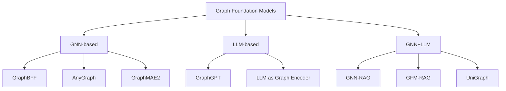
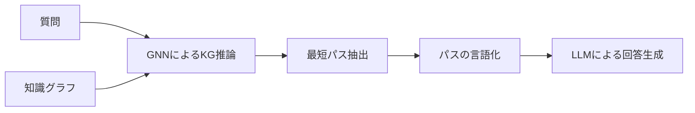
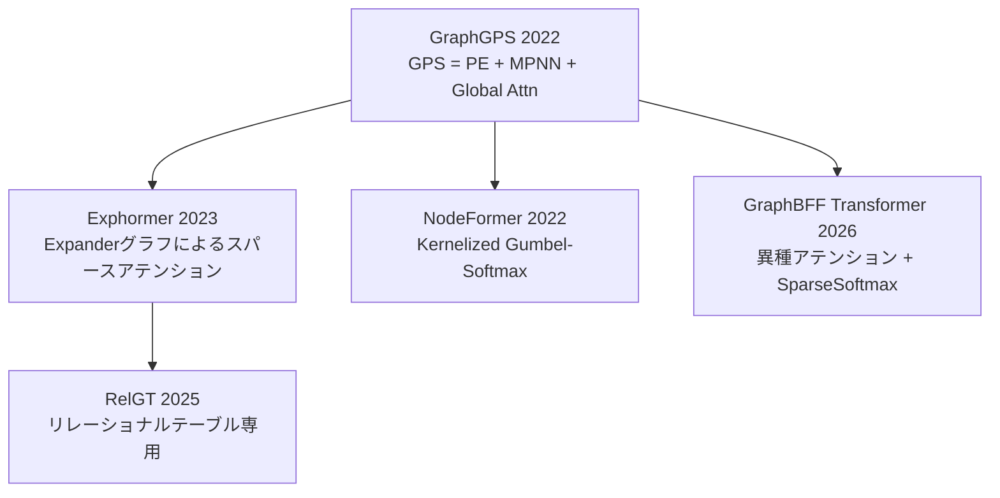
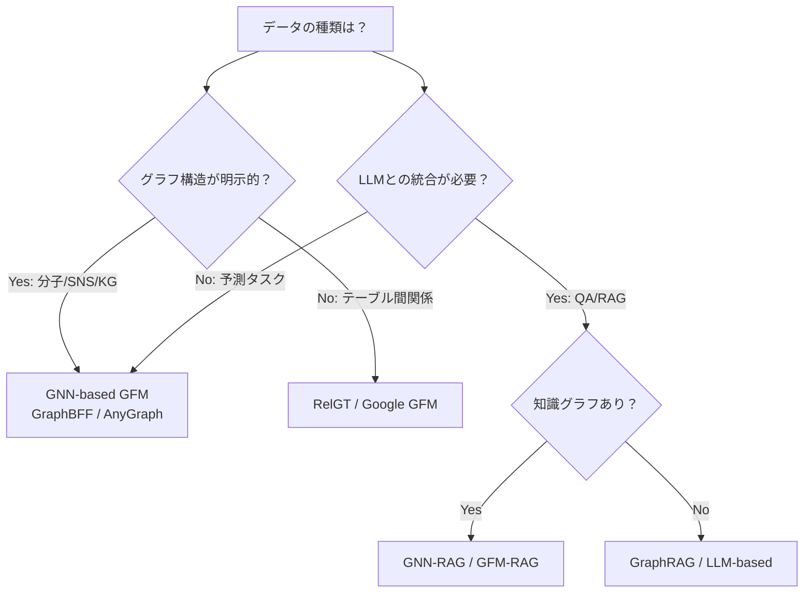

# グラフファウンデーションモデル2025-2026年最前線：GraphBFF・AnyGraph・GFM-RAGで変わるGNNの世界

## この記事でわかること

- グラフファウンデーションモデル（GFM）の3つのアプローチ（GNN-based / LLM-based / GNN+LLM）と代表手法の違い
- GraphBFF・AnyGraph・GraphGPTなど2025-2026年の主要GFMの技術的特徴とベンチマーク結果
- GNN-RAG・GFM-RAGによるグラフ構造を活用した検索拡張生成（RAG）の実装パターン
- Graph Transformerの進化（GPS → Exphormer → RelGT）とスケーラビリティの改善
- PyG 2.7での実装方法とtorch.compile対応による高速化の実践

## 対象読者

- **想定読者**: 中級〜上級のML/データサイエンスエンジニア
- **必要な前提知識**:
  - PyTorch の基本操作（テンソル、モデル定義、学習ループ）
  - GNNの基本概念（メッセージパッシング、ノード分類、リンク予測）
  - Transformerアーキテクチャの基本理解

## 結論・成果

2025-2026年にかけてグラフファウンデーションモデル（GFM）は急速に進展しています。GraphBFFは**14億パラメータ**のGFMで初のグラフにおけるニューラルスケーリング則を実証し、AnyGraphは**38データセット**でのゼロショット学習で創発的能力を確認しました。GoogleのGFMはリレーショナルデータで**平均精度3〜40倍**の向上を報告しています。GNNとLLMの統合ではGNN-RAGが**7BのLLMでGPT-4に匹敵するKGQA性能**を達成し、GFM-RAGは**60知識グラフ・14Mトリプル**で学習してゼロショット検索を実現しました。ここからは、これらの技術の詳細と実装パターンを見ていきます。

## GFMの全体像を理解する

グラフファウンデーションモデル（GFM）とは、大規模なグラフコーパスで事前学習し、ノード分類・リンク予測・グラフ分類など多様なタスクにゼロショットまたはファインチューニングで適用可能な汎用モデルです。2025年5月に公開されたサーベイ論文（arXiv 2505.15116）では、GFMを以下の3アプローチに分類しています。



### 3アプローチの特徴と比較

| アプローチ | 代表手法 | 強み | 課題 |
|-----------|---------|------|------|
| GNN-based | GraphBFF, AnyGraph | グラフ構造の帰納バイアスを活用、スケーラブル | テキスト属性の活用が限定的 |
| LLM-based | GraphGPT | 既存LLMの知識を活用可能 | グラフ特有の位相情報の損失リスク |
| GNN+LLM | GNN-RAG, GFM-RAG | 構造推論と言語理解を相補的に統合 | 学習・推論コストが高い |

**なぜ3アプローチが並立するか：** 自然言語のトークン列と異なり、グラフには非ユークリッド構造・可変サイズ・異種ノード/エッジという固有の課題があります。1つのアプローチでこれらすべてを解決するのは困難なため、タスクやデータ特性に応じた使い分けが必要です。

> グラフの「トークン化」は未解決問題であり、テキストのように一意なシーケンスに変換できない点がLLM時代のGNN研究の中核的課題になっています。この問題に対し、各アプローチが異なる戦略をとっています。

## 主要GFMの技術詳細を比較する

### GraphBFF：初のBillion-scaleグラフ基盤モデル

GraphBFF（Graph Billion-Foundation-Fusion, arXiv 2602.04768）は2026年2月に発表された、初の**14億パラメータ規模**のGFMです。

**アーキテクチャの特徴：**

GraphBFF Transformerは、異種グラフを効率的に処理するために2つの異種アテンションコンポーネントを組み合わせ、スパースSoftmaxを導入しています。

$$
\text{Attention}(Q, K, V) = \text{SparseSoftmax}\left(\frac{QK^T}{\sqrt{d_k}}\right)V
$$

ここで $Q, K, V$ はそれぞれクエリ・キー・バリュー行列、$d_k$ はキーの次元数です。SparseSoftmaxにより、計算量を抑えつつ大規模異種グラフの表現力を維持します。

**スケーリング則の実証：**

論文の著者らの実験では、モデル容量または学習データのいずれかをスケールさせると、損失が予測可能に減少することが示されています。これはグラフドメインで初めて実証されたスケーリング則です。

**主要な結果（論文のベンチマークより）：**
- 10億サンプル以上での事前学習
- ゼロショット・Few-shot・プロービングで幅広いタスクに一貫した性能向上
- 学習中に見ていないグラフへの汎化能力を確認

**学習効率のための工夫：**

GraphBFFはKL-BatchingとRound-Robin Batchingという2つのバッチング戦略を導入しています。

```python
# GraphBFF風のKL-Batchingの概念的な実装例
# 異なるドメインのグラフを均等にサンプリングする戦略
import torch
from torch_geometric.data import Data, Batch
from typing import Dict, List
import random


def kl_batching(
    domain_datasets: Dict[str, List[Data]],
    batch_size: int,
    target_distribution: Dict[str, float] | None = None,
) -> Batch:
    """
    KL-Batchingの概念実装: ドメイン間の分布を均等化してバッチを構成する。

    Args:
        domain_datasets: ドメイン名 → グラフリストのマッピング
        batch_size: バッチサイズ
        target_distribution: 目標分布（Noneならドメイン均等）
    Returns:
        構成されたバッチ
    """
    if target_distribution is None:
        n_domains = len(domain_datasets)
        target_distribution = {
            d: 1.0 / n_domains for d in domain_datasets
        }

    sampled_graphs: List[Data] = []
    for domain, ratio in target_distribution.items():
        n_samples = max(1, int(batch_size * ratio))
        graphs = domain_datasets[domain]
        sampled = random.choices(graphs, k=n_samples)
        sampled_graphs.extend(sampled)

    return Batch.from_data_list(sampled_graphs[:batch_size])
```

**注意点:**
> GraphBFFの学習には大規模な計算資源が必要です。論文のベンチマークではTPU/GPU環境が前提であり、個人環境での再現は困難です。事前学習済みモデルの利用やファインチューニングからの活用が現実的です。

### AnyGraph：MoEアーキテクチャによる汎用GFM

AnyGraph（ICLR 2025）は、**Mixture-of-Experts（MoE）アーキテクチャ**を活用し、構造の異質性と特徴の異質性を同時に処理するGFMです。

**技術的特徴：**

AnyGraphの中核は、グラフの「ドメインシフト」に対処するExpert Routing機構です。入力グラフの構造的・特徴的特性に応じて、適切なExpertを動的に選択します。

$$
y = \sum_{i=1}^{N} g_i(\mathbf{x}) \cdot E_i(\mathbf{x})
$$

ここで $g_i(\mathbf{x})$ はゲーティング関数によるExpert $E_i$ の選択重み、$\mathbf{x}$ は入力グラフの特徴量です。

**ベンチマーク結果（論文より）：**

| 指標 | 結果 |
|------|------|
| 評価データセット数 | 38（ソーシャル、ウェブ、学術、分子等） |
| ゼロショット性能 | 多くのドメインで教師あり手法に匹敵 |
| スケーリング則 | モデルサイズ・データ量増加に伴い性能向上を確認 |
| 創発的能力 | 一定規模を超えると汎化性能が急激に改善 |

**なぜMoEか：**
- グラフドメインは極めて多様（分子グラフ vs ソーシャルネットワーク vs 知識グラフ）
- 単一のモデルですべてのドメインを処理するには、タスク固有のExpertを動的に組み合わせる戦略が有効
- 代替案のドメインごとの個別モデルと比較して、共通知識の共有による効率化が期待できる

### GraphGPT：オイラーパスによるグラフのシーケンス変換

GraphGPT（ICML 2025, Alibaba）は、**Graph Eulerian Transformer（GET）**というアーキテクチャを提案し、グラフをシーケンスに変換する新しいアプローチを採用しています。

**核心的アイデア：**

グラフの辺を走査するオイラーパス（すべての辺をちょうど1回ずつ通る経路）を用いて、グラフをノード・エッジ・属性のトークン列に**可逆的に**変換します。これにより、標準的なTransformerのEncoder/Decoderをそのまま適用できます。

```python
# オイラーパスによるグラフ→シーケンス変換の概念例
import networkx as nx
from typing import List, Tuple


def graph_to_eulerian_sequence(
    G: nx.Graph,
) -> List[Tuple[str, dict]]:
    """
    グラフをオイラーパスに基づくトークン列に変換する。
    前提: Gが連結でオイラーパスを持つ（すべてのノードの次数が偶数）。

    Args:
        G: NetworkXグラフ（必要に応じて辺を追加してオイラー化）
    Returns:
        トークン列（ノードID, エッジ属性のペア）
    """
    # オイラーパスが存在しない場合、辺を追加してオイラー化
    if not nx.is_eulerian(G):
        G = nx.eulerize(G)

    euler_path = list(nx.eulerian_circuit(G))
    tokens: List[Tuple[str, dict]] = []

    for u, v in euler_path:
        edge_data = G.edges[u, v]
        tokens.append((f"node_{u}", dict(G.nodes[u])))
        tokens.append((f"edge_{u}_{v}", edge_data))

    return tokens


# 使用例
G = nx.karate_club_graph()
sequence = graph_to_eulerian_sequence(G)
print(f"グラフ: {G.number_of_nodes()}ノード → {len(sequence)}トークン")
```

**制約条件：**
> オイラーパスの存在条件（すべてのノードの次数が偶数）を満たさないグラフでは、辺の追加（eulerize）が必要になり、冗長なトークンが生じます。大規模グラフではシーケンス長が爆発的に増加するため、サブグラフサンプリングとの併用が前提です。

## GNNとLLMの統合によるRAGを実装する

2025-2026年のGNN研究で注目されているのが、**グラフ構造を活用したRAG（Retrieval-Augmented Generation）**です。従来のベクトル検索ベースのRAGでは捉えきれない複雑な関係性を、GNNの構造推論能力で補完します。

### GNN-RAG：GNNの推論とLLMの言語理解の融合

GNN-RAG（ACL 2025 Findings）は、知識グラフ質問応答（KGQA）において、GNNとLLMを**2段階のパイプライン**で統合する手法です。



**処理の流れ：**

1. **GNNフェーズ**: 質問に関連する密なKGサブグラフ上でGNNが推論し、回答候補を取得
2. **パス抽出**: 質問エンティティと回答候補を結ぶ最短パスをKGから抽出
3. **言語化**: 抽出パスを自然言語に変換してLLMに入力
4. **LLM推論**: RAGスタイルでLLMが最終回答を生成

**性能（論文のベンチマークより）：**

| ベンチマーク | GNN-RAG (7B LLM) | GPT-4 | 差分 |
|-------------|-------------------|-------|------|
| WebQSP (Hits@1) | GPT-4に匹敵 | ベースライン | - |
| CWQ（マルチホップ） | 競合手法を8.9〜15.5%上回る | - | +8.9〜15.5% |

**なぜGNN+LLMの2段階構成か：**
- GNN単体ではKGの推論能力は高いが、質問の言語理解に限界がある
- LLM単体ではKGの構造的推論が苦手で、マルチホップ推論の精度が低下する
- 2段階構成により、各モデルの強みを相補的に活用できる

```python
# GNN-RAG風のパイプラインの概念的な実装パターン
import torch
from torch_geometric.nn import GATConv
from torch_geometric.data import Data
from typing import List


class KGReasoningGNN(torch.nn.Module):
    """知識グラフ上で推論するGNNモジュール。"""

    def __init__(self, in_channels: int, hidden_channels: int, out_channels: int):
        super().__init__()
        self.conv1 = GATConv(in_channels, hidden_channels, heads=4)
        self.conv2 = GATConv(hidden_channels * 4, out_channels, heads=1)

    def forward(self, x: torch.Tensor, edge_index: torch.Tensor) -> torch.Tensor:
        """ノード埋め込みを計算し、回答候補のスコアを返す。"""
        x = self.conv1(x, edge_index).relu()
        x = self.conv2(x, edge_index)
        return x


def extract_reasoning_paths(
    edge_index: torch.Tensor,
    question_entities: List[int],
    answer_candidates: List[int],
    max_hops: int = 3,
) -> List[List[int]]:
    """
    質問エンティティと回答候補を結ぶ最短パスを抽出する。

    Args:
        edge_index: グラフの辺インデックス
        question_entities: 質問に含まれるエンティティのID
        answer_candidates: GNNが予測した回答候補のID
        max_hops: 最大ホップ数
    Returns:
        推論パスのリスト
    """
    import networkx as nx

    # edge_indexからNetworkXグラフを構築
    G = nx.Graph()
    src, dst = edge_index[0].tolist(), edge_index[1].tolist()
    G.add_edges_from(zip(src, dst))

    paths: List[List[int]] = []
    for q_ent in question_entities:
        for a_ent in answer_candidates:
            try:
                path = nx.shortest_path(G, q_ent, a_ent)
                if len(path) <= max_hops + 1:
                    paths.append(path)
            except nx.NetworkXNoPath:
                continue
    return paths


def verbalize_path(path: List[int], entity_names: dict, relation_names: dict) -> str:
    """推論パスを自然言語に変換する。"""
    parts: List[str] = []
    for i, node_id in enumerate(path):
        name = entity_names.get(node_id, f"Entity_{node_id}")
        parts.append(name)
        if i < len(path) - 1:
            rel = relation_names.get((node_id, path[i + 1]), "related_to")
            parts.append(f"--[{rel}]-->")
    return " ".join(parts)
```

### GFM-RAG：グラフ基盤モデルによるゼロショットRAG

GFM-RAG（NeurIPS 2025, ICLR 2026）は、GNN-RAGをさらに発展させ、**事前学習済みのグラフ基盤モデル**によるゼロショット検索を実現した手法です。

**技術仕様：**
- パラメータ数: **8M**（比較的軽量）
- 学習データ: **60知識グラフ、14Mトリプル、700kドキュメント**
- 2段階の学習プロセス

**GNN-RAGとの比較：**

| 項目 | GNN-RAG | GFM-RAG |
|------|---------|---------|
| ファインチューニング | タスクごとに必要 | 不要（ゼロショット） |
| パラメータ数 | タスク依存 | 8M（固定） |
| 対応タスク | KGQA特化 | マルチホップQA + ドメイン特化RAG |
| 汎化性能 | 学習済みKGに依存 | 未知のデータセットにも適用可能 |
| 発表 | ACL 2025 | NeurIPS 2025 / ICLR 2026 |

**ハマりポイント：**
> GFM-RAGは8Mパラメータと軽量ですが、60知識グラフでの事前学習が前提です。カスタムドメインでのKG構築自体がボトルネックになるケースが多く、ドメイン固有の知識グラフの品質がRAG性能を大きく左右します。

## Graph Transformerの進化を追う

GNNの限界を克服するGraph Transformerは、2022年のGraphGPS以降急速に発展しています。次の図はその進化の流れを示します。



### GraphGPS：基盤レシピ

GraphGPS（NeurIPS 2022）は、Graph Transformerを構築するための「レシピ」を提案しました。3つの要素を組み合わせます：

1. **位置・構造エンコーディング（PE/SE）**: ランダムウォーク、ラプラシアン固有ベクトルなど
2. **局所メッセージパッシング（MPNN）**: GCN、GINなどの局所GNN層
3. **大域アテンション**: 全ノード間の注意機構

### Exphormer：スパースアテンションによるスケーリング

Exphormer（ICML 2023, Google Research）は、**Expanderグラフ**を用いたスパースアテンションにより、Graph Transformerのスケーラビリティを改善しました。

**性能（公式ブログより報告）：**
- **10,000ノード以上**のグラフ（Coauthorデータセット）に対応
- ogbn-arxivデータセット（170Kノード、1.1Mエッジ）でも動作
- 密なアテンションと同等以上の性能を、少ないパラメータで実現

### RelGT：リレーショナルテーブル専用のGraph Transformer

RelGT（Relational Graph Transformer, 2025年5月）は、リレーショナルデータベースのテーブル間関係に特化した初のGraph Transformerです。

**ベンチマーク結果（論文より）：**
- **RelBench**の21タスクでGNNベースラインを**最大18%**上回る
- テーブルの行をノード、外部キーをエッジとしてグラフを構成

**制約条件：**
> RelGTはリレーショナルデータに特化しているため、分子グラフやソーシャルネットワークには直接適用できません。汎用的なGFMが必要な場合はGraphBFFやAnyGraphを検討してください。

## PyG 2.7でGFMの実装基盤を構築する

ここまで見てきたGFMの多くは、**PyG（PyTorch Geometric）**を実装基盤としています。PyG 2.7の主要アップデートを実際のコードで確認してみましょう。

### torch.compileによる高速化

PyG 2.7ではtorch.compile()に完全対応し、GCNやGraphSAGEで**最大約3倍**の高速化が報告されています。

```python
# PyG 2.7 + torch.compileによるGNN高速化の例
import torch
import torch.nn.functional as F
from torch_geometric.nn import GCNConv, SAGEConv
from torch_geometric.data import Data


class GraphClassifier(torch.nn.Module):
    """torch.compile対応のグラフ分類モデル。"""

    def __init__(self, in_channels: int, hidden_channels: int, num_classes: int):
        super().__init__()
        self.conv1 = SAGEConv(in_channels, hidden_channels)
        self.conv2 = SAGEConv(hidden_channels, hidden_channels)
        self.lin = torch.nn.Linear(hidden_channels, num_classes)

    def forward(
        self, x: torch.Tensor, edge_index: torch.Tensor, batch: torch.Tensor
    ) -> torch.Tensor:
        x = self.conv1(x, edge_index).relu()
        x = F.dropout(x, p=0.5, training=self.training)
        x = self.conv2(x, edge_index).relu()

        # グローバルプーリング
        from torch_geometric.nn import global_mean_pool
        x = global_mean_pool(x, batch)
        return self.lin(x)


# torch.compileでモデルを最適化
model = GraphClassifier(in_channels=128, hidden_channels=256, num_classes=10)
compiled_model = torch.compile(model)

# ベンチマーク例（概念的）
dummy_data = Data(
    x=torch.randn(1000, 128),
    edge_index=torch.randint(0, 1000, (2, 5000)),
    batch=torch.zeros(1000, dtype=torch.long),
)

# compiled_model(dummy_data.x, dummy_data.edge_index, dummy_data.batch)
print("torch.compile対応: GraphSAGEで最大約3倍の高速化が期待できます")
```

### EdgeIndexによる効率的なメッセージパッシング

PyG 2.7では**EdgeIndex**が導入され、COO形式のエッジインデックスから最適な計算を自動選択します。

```python
# EdgeIndexの使用例
from torch_geometric.data import Data
import torch

# 従来のCOO形式
edge_index_coo = torch.tensor([[0, 1, 1, 2], [1, 0, 2, 1]])

# EdgeIndexを使用すると、内部で最適なスパース表現を自動選択
data = Data(
    x=torch.randn(3, 16),
    edge_index=edge_index_coo,
)

# PyG 2.7ではEdgeIndexが自動的にソートやCSR変換を管理
# SparseTensorは将来的にEdgeIndexに置き換えられる予定
print(f"エッジ数: {data.num_edges}")
print(f"ノード数: {data.num_nodes}")
```

### 異種グラフ（HeteroData）の扱い

GFMでは異種グラフ（複数のノード/エッジタイプ）の処理が重要です。PyGのHeteroDataを使った実装パターンを紹介します。

```python
# 異種グラフの構築例（論文引用ネットワーク）
from torch_geometric.data import HeteroData
import torch


def build_citation_hetero_graph(
    num_papers: int = 100,
    num_authors: int = 50,
    num_venues: int = 10,
) -> HeteroData:
    """異種引用グラフを構築する。"""
    data = HeteroData()

    # ノード特徴量
    data["paper"].x = torch.randn(num_papers, 128)
    data["author"].x = torch.randn(num_authors, 64)
    data["venue"].x = torch.randn(num_venues, 32)

    # エッジ（関係）の定義
    data["paper", "cites", "paper"].edge_index = torch.randint(
        0, num_papers, (2, 300)
    )
    data["author", "writes", "paper"].edge_index = torch.randint(
        0, min(num_authors, num_papers), (2, 150)
    )
    data["paper", "published_at", "venue"].edge_index = torch.randint(
        0, min(num_papers, num_venues), (2, num_papers)
    )

    return data


hetero_data = build_citation_hetero_graph()
print(f"ノードタイプ: {hetero_data.node_types}")
print(f"エッジタイプ: {hetero_data.edge_types}")
```

## Googleの産業応用から学ぶGFMの実践

GoogleはGFMをリレーショナルデータの分類タスク（広告スパム検出など）に適用し、**平均精度3〜40倍**の向上を報告しています（Google Research Blog, 2025年）。

### 産業適用のポイント

1. **テーブル→グラフ変換**: リレーショナルDBの各行をノード、外部キーをエッジに
2. **特徴量の汎化**: ハードコードされた埋め込みテーブルではなく、特徴量間の相互作用を学習
3. **スケール**: 数十億ノード・エッジ規模の処理をJAX+TPU基盤で実現

**よくある間違い：**

最初はテーブルデータをそのまま表形式モデル（XGBoost等）に入力すれば十分と考えがちですが、実際にはテーブル間の関係性（外部キーの接続構造）が分類性能に大きく影響します。Googleの報告では、グラフ構造を考慮しない単一テーブルのベースラインと比較して、3〜40倍の精度向上が得られています。

### GFM適用の判断フローチャート



## よくある問題と解決方法

| 問題 | 原因 | 解決方法 |
|------|------|----------|
| GFMの学習が収束しない | 異種グラフのバッチ構成が不適切 | KL-Batching等のドメイン均等化戦略を使用 |
| ゼロショット性能が低い | 事前学習データとターゲットドメインの分布が乖離 | Few-shotファインチューニングを検討 |
| メモリ不足（OOM） | 大規模グラフの全ノードアテンション | Exphormerのスパースアテンションまたはサブグラフサンプリング |
| GNN-RAGのパス抽出が遅い | 知識グラフのサイズが大きすぎる | サブグラフの事前フィルタリング、最大ホップ数の制限 |
| PyG torch.compileでエラー | 動的形状のテンソル操作 | `torch.compile(dynamic=True)` を指定 |

## まとめと次のステップ

**まとめ:**

- **GFMは3アプローチ**（GNN-based / LLM-based / GNN+LLM）が並立し、タスク特性に応じた選択が必要
- **GraphBFF**が14億パラメータで初のスケーリング則を実証し、**AnyGraph**がMoEで38データセットのゼロショット汎化を達成
- **GNN-RAG / GFM-RAG**がグラフ構造を活用したRAGで、7B LLMでもGPT-4に匹敵するKGQA性能を実現
- **Graph Transformer**はGPS→Exphormer→RelGTと進化し、10万ノード規模のグラフに対応
- **PyG 2.7**のtorch.compile対応により、GNNの実装・実行環境が大幅に改善

**次にやるべきこと:**

- PyG 2.7でGraphSAGE + torch.compileの高速化を自分のデータで検証する
- GFM-RAGのリポジトリ（GitHub: RManLuo/gfm-rag）で自分のKGでの性能を評価する
- AnyGraphの事前学習モデル（GitHub: HKUDS/AnyGraph）でゼロショット分類を試す

## 参考

- [Graph Foundation Models: A Comprehensive Survey (arXiv 2505.15116)](https://arxiv.org/abs/2505.15116)
- [Billion-Scale Graph Foundation Models: GraphBFF (arXiv 2602.04768)](https://arxiv.org/abs/2602.04768)
- [AnyGraph: Graph Foundation Model in the Wild (ICLR 2025)](https://arxiv.org/abs/2408.10700)
- [GraphGPT: Generative Pre-trained Graph Eulerian Transformer (ICML 2025)](https://github.com/alibaba/graph-gpt)
- [GNN-RAG: Graph Neural Retrieval for Large Language Model Reasoning (ACL 2025)](https://arxiv.org/abs/2405.20139)
- [GFM-RAG: Graph Foundation Model for Retrieval Augmented Generation (NeurIPS 2025 / ICLR 2026)](https://arxiv.org/abs/2502.01113)
- [Google Research: Graph Foundation Models for Relational Data](https://research.google/blog/graph-foundation-models-for-relational-data/)
- [Exphormer: Sparse Transformers for Graphs (ICML 2023)](https://arxiv.org/abs/2303.06147)
- [RelGT: Relational Graph Transformer (arXiv 2505.10960)](https://arxiv.org/abs/2505.10960)
- [PyG (PyTorch Geometric) 2.7](https://pyg.org/)

---

## 関連する深掘り記事

この記事で紹介した技術について、さらに深掘りした記事を書きました：

- [論文解説: GraphBFF — 初のBillion-Scaleグラフファウンデーションモデル](https://0h-n0.github.io/posts/paper-graphbff-2602-04768/) - arxiv解説
- [論文解説: GFM-RAG — グラフファウンデーションモデルによるゼロショットRAG](https://0h-n0.github.io/posts/paper-gfm-rag-2502-01113/) - arxiv解説
- [ACL 2025論文解説: GNN-RAG — GNNとLLMの融合によるKGQA](https://0h-n0.github.io/posts/conf-acl2025-gnn-rag/) - conference解説
- [論文解説: AnyGraph — MoEによる汎用グラフファウンデーションモデル](https://0h-n0.github.io/posts/paper-anygraph-2408-10700/) - arxiv解説
- [Google Research解説: リレーショナルデータのためのGFM](https://0h-n0.github.io/posts/techblog-google-gfm-relational/) - tech_blog解説

:::message
これらの記事は修士学生レベルを想定した技術的詳細（数式・実装の深掘り）を含みます。
:::

---

:::message
この記事はAI（Claude Code）により自動生成されました。内容の正確性については複数の情報源で検証していますが、実際の利用時は公式ドキュメントもご確認ください。
:::
