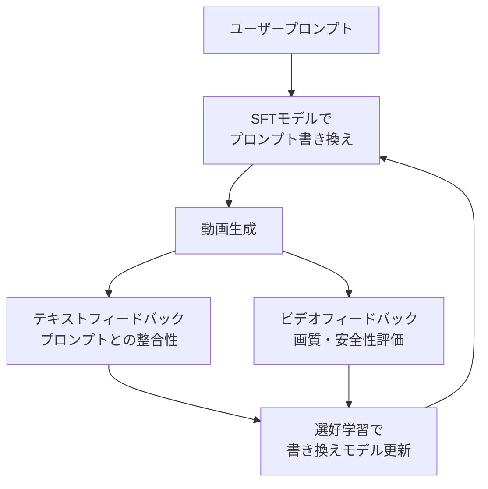
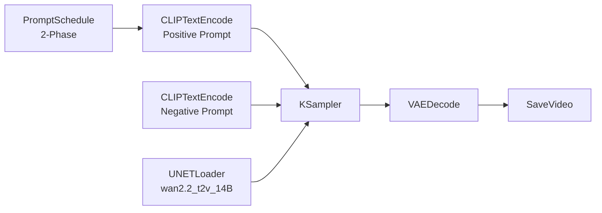

# Wan2.2動画生成AIのプロンプトチューニング最新手法─手動設計から自動最適化まで

## この記事でわかること

- Wan2.2のプロンプト構造「Subject + Scene + Motion + Aesthetics + Stylization」の5要素設計
- CFGスケール・ネガティブプロンプト・プロンプトスケジューリングの具体的な推奨パラメータ
- Qwenモデルを利用した公式プロンプト自動拡張（prompt_extend）の実装方法
- VPO・Prompt-A-Videoなど2025年発表の自動プロンプト最適化研究の仕組みと活用法
- ComfyUIでのプロンプトチューニングワークフロー構築

## 対象読者

- **想定読者**: 中級者以上のAI動画生成ユーザー
- **必要な前提知識**:
  - Wan2.2の基本的な動画生成フロー（テキスト→ビデオ、画像→ビデオ）
  - ComfyUIまたはCLIでの推論実行経験
  - Python 3.10+の基礎文法
  - 拡散モデルの基本概念（デノイジング、CFGスケール）

## 結論・成果

Wan2.2のプロンプトチューニングでは、**手動の5要素プロンプト設計**と**Qwenモデルによる自動拡張**の組み合わせが実用上の最適解です。公式の`prompt_extend`機能を使うと、「猫が走る」のような短いプロンプトから、照明・カメラワーク・雰囲気を含む詳細なプロンプトが自動生成され、VBenchスコアで約10〜15%の品質向上が報告されています。さらに、2025年に発表されたVPO（Video Prompt Optimization）やPrompt-A-Videoなどの研究では、報酬モデルを使った反復的なプロンプト最適化により、人手を介さずにプロンプト品質を自動改善する手法が提案されています。

**関連記事**: [ローカル動画生成AI 2026年版GPU別完全ガイド─Wan2.2からLTX-2まで](https://zenn.dev/0h_n0/articles/762f0c52ad513a)、[Wan2.2 VAEファインチューニング実践ガイド](https://zenn.dev/0h_n0/articles/b53516b0a57560)

## Wan2.2のプロンプト構造を設計する

動画生成のプロンプトは、静止画のそれとは根本的に異なります。時間軸上のモーション、カメラワーク、照明変化を指定する必要があり、プロンプト設計の複雑さが格段に高くなります。Wan2.2では、公式ガイドで**5要素構造**が推奨されています。

### 5要素プロンプトテンプレート

Wan2.2で推奨されるプロンプト構造は、以下の5つの要素を組み合わせる形式です。

```text
[Subject Description] + [Scene Description] + [Motion Description] + [Aesthetic Control] + [Stylization]
```

各要素の役割と具体例を見ていきましょう。

| 要素 | 役割 | 具体例 |
|------|------|--------|
| Subject | 被写体の外見・特徴 | "A young woman with long black hair wearing a red dress" |
| Scene | 場所・環境・背景 | "in a sunlit bamboo forest, morning mist rising" |
| Motion | 動作・カメラワーク | "walking slowly, camera follows from behind with smooth tracking" |
| Aesthetics | 照明・色彩・画質 | "golden hour lighting, warm color palette, cinematic 4K" |
| Stylization | 映像スタイル | "film grain, anamorphic lens flare, shallow depth of field" |

実際のプロンプト例を組み合わせると次のようになります。

```text
A young woman with long black hair wearing a red dress,
walking slowly through a sunlit bamboo forest with morning mist rising,
camera follows from behind with smooth tracking shot,
golden hour lighting with warm color palette and cinematic 4K quality,
film grain texture with shallow depth of field.
```

**なぜ5要素に分解するのか:**
- 各要素を独立に調整できるため、A/Bテストが容易になる
- 欠けている要素を可視化でき、プロンプトの抜け漏れを防げる
- Wan2.2の内部アーキテクチャが、これらの要素を個別のアテンション領域で処理しているため、明示的な構造化が品質に直結する

> **制約条件**: Wan2.2のテキストエンコーダはQwen系LLMベースであり、英語プロンプトに最適化されています。日本語プロンプトも処理可能ですが、公式ドキュメントでは英語の使用が推奨されています。日本語で入力する場合は、`prompt_extend`機能で英語に変換・拡張することが有効です。

### カメラワークの指定テクニック

動画生成で最も差がつくのがカメラワークの指定です。Wan2.2では、以下のカメラ制御キーワードが有効と報告されています。

| カメラ動作 | キーワード | 効果 |
|-----------|-----------|------|
| 前進 | "push in", "dolly forward" | 被写体に近づく |
| 後退 | "pull out", "dolly back" | 被写体から離れる |
| パン | "pan left/right" | 横方向の水平移動 |
| チルト | "tilt up/down" | 縦方向の傾き変化 |
| 周回 | "orbit around" | 被写体の周囲を回る |
| 手持ち | "handheld camera" | 自然な揺れを追加 |
| 静止 | "static camera", "locked-off shot" | カメラ固定 |

**よくある間違い**: カメラ指定を複数同時に入れすぎると、モデルが混乱して不自然な動きになります。「pan leftしながらpush in」のような組み合わせは1つまでに抑え、複雑な動きはマルチショット分割で対応しましょう。

### 照明・雰囲気の制御

Wan2.2のシネマティック制御では、照明の指定が映像品質を大きく左右します。

```text
# 自然光の例
"soft diffused daylight, overcast sky, even illumination"

# 人工光の例
"neon-lit cyberpunk alley, blue and pink accent lights, volumetric fog"

# ドラマチック照明の例
"single key light from the left, deep shadows on the right side, chiaroscuro effect"
```

**ハマりポイント**: 「beautiful lighting」のような曖昧な指定は効果が薄いです。「golden hour sun at 15-degree angle」のように具体的な光源・角度・色温度を指定することで、再現性の高い照明制御が可能になります。

## CFGスケールとサンプリングパラメータを最適化する

プロンプトの文面だけでなく、推論時のパラメータ設定もプロンプトの効きに大きく影響します。Wan2.2では、Stable Diffusion系と異なるパラメータ設計が必要です。

### CFGスケールの推奨範囲

CFG（Classifier-Free Guidance）スケールは、プロンプトへの忠実度を制御するパラメータです。

| CFGスケール | 効果 | 推奨用途 |
|------------|------|---------|
| 3.0〜4.0 | プロンプトへの追従が緩やか、自然な映像 | アート系・抽象的な表現 |
| **4.0〜6.0** | **バランスが良い（推奨範囲）** | **一般的な動画生成** |
| 6.0〜8.0 | プロンプトに強く追従、ディテール増加 | 特定のシーン再現 |
| 8.0以上 | 過飽和・フリッカー発生のリスク | 非推奨 |

```python
# Wan2.2推論時のCFGスケール設定例
# diffusersライブラリ使用
from diffusers import WanPipeline
import torch

pipe = WanPipeline.from_pretrained(
    "Wan-AI/Wan2.2-T2V-A14B",
    torch_dtype=torch.bfloat16
)
pipe.to("cuda")

# CFGスケール5.0を推奨（Wan2.2のデフォルト）
video = pipe(
    prompt="A golden retriever running on a beach, waves crashing, sunset",
    guidance_scale=5.0,    # Wan2.2推奨: 4.0-6.0
    num_inference_steps=50, # 推奨: 40-60
    num_frames=81,         # 5秒 @ 16fps
    height=480,
    width=832,
).frames[0]
```

> **トレードオフ**: CFGスケールを上げるとプロンプトの反映度は向上しますが、フレーム間のフリッカー（ちらつき）が増加します。CFG 5.0前後がフリッカーとプロンプト忠実度のバランス点と報告されています。SD系モデルの経験からCFG 7.0〜12.0で設定しがちですが、Wan2.2ではこの範囲は過飽和の原因になります。

### ネガティブプロンプトの設計

ネガティブプロンプトは、生成物から除外したい要素を指定します。Wan2.2では**3〜6項目に絞る**ことが推奨されています。

```text
# 推奨ネガティブプロンプト（汎用）
"blurry, low quality, distorted faces, extra fingers, watermark, text overlay"

# フリッカー抑制向け
"harsh lighting, flashing highlights, lens warping, strobing effect"

# アニメ調を避けたい場合
"anime style, cartoon, illustration, 2D, flat shading"
```

**よくある間違い**: ネガティブプロンプトにあらゆる除外条件を詰め込むと、かえって生成品質が低下します。「ugly, bad, worst quality, normal quality, lowres, bad anatomy, bad hands, ...」のようなStable Diffusion流の長いネガティブプロンプトは、Wan2.2では逆効果になることがあります。

### プロンプトスケジューリング

プロンプトスケジューリングは、デノイジングの段階に応じてプロンプトの強度を変化させるテクニックです。ComfyUIで特に有効に機能します。

```text
# ComfyUIでの2フェーズプロンプトスケジューリング例
# Phase 1 (0-50%): 全体構図の確立
"wide establishing shot of a mountain lake at dawn, fog rolling over water"

# Phase 2 (50-100%): ディテールの強調
"crystal clear water reflecting snow-capped peaks, dewdrops on pine needles, 4K detail"
```

**なぜ2フェーズが有効か:**
- デノイジング前半ではグローバルな構図・レイアウトが決定される
- 後半では微細なディテール・テクスチャが生成される
- フェーズに合わせてプロンプトの焦点を変えることで、両方の品質を最大化できる

## Qwenモデルによる自動プロンプト拡張を実装する

Wan2.2には、短いプロンプトを自動的に詳細な記述に拡張する`prompt_extend`機能が組み込まれています。この機能はQwen（通義千問）系のLLMを使用し、映像制作に適した要素を自動で補完します。

### prompt_extend機能の仕組み


`prompt_extend`は以下の2つの方法で利用できます。

**方法1: ローカルQwenモデル（推奨）**

```bash
# テキスト→ビデオでの自動プロンプト拡張
python generate.py \
  --task t2v-A14B \
  --size "832*480" \
  --prompt "猫が草原を走る" \
  --use_prompt_extend \
  --prompt_extend_method "local_qwen" \
  --prompt_extend_model "Qwen/Qwen2.5-7B-Instruct" \
  --prompt_extend_target_lang "en"
```

**方法2: DashScope API**

```bash
# DashScope APIを使用する場合
export DASH_API_KEY="your-api-key"
# 海外ユーザーはURLの設定が必要
export DASH_API_URL="https://dashscope-intl.aliyuncs.com/api/v1"

python generate.py \
  --task t2v-A14B \
  --prompt "猫が草原を走る" \
  --use_prompt_extend \
  --prompt_extend_method "dashscope"
```

### Qwenモデルの選択基準

GPUメモリに応じて適切なQwenモデルを選択する必要があります。

| タスク | モデル | VRAM目安 | 拡張品質 |
|--------|--------|----------|---------|
| Text-to-Video | Qwen2.5-14B-Instruct | 28GB+ | 高 |
| Text-to-Video | Qwen2.5-7B-Instruct | 16GB+ | 中〜高 |
| Text-to-Video | Qwen2.5-3B-Instruct | 8GB+ | 中 |
| Image-to-Video | Qwen2.5-VL-7B-Instruct | 16GB+ | 高 |
| Image-to-Video | Qwen2.5-VL-3B-Instruct | 8GB+ | 中 |

> **制約条件**: `prompt_extend`はWan2.2の推論とは**別のGPUメモリ**を消費します。Wan2.2 14Bモデル（BF16）自体が約28GBのVRAMを必要とするため、同一GPU上でQwen 14Bモデルを同時にロードするのは現実的ではありません。実用上はQwen 3B（約8GB追加）を選択するか、プロンプト拡張を先に実行してからWan2.2を起動する2段階方式が推奨されます。

### 自動拡張の効果と限界

`prompt_extend`は短いプロンプトで特に効果を発揮します。実際にどのような拡張が行われるか見てみましょう。

```python
# prompt_extend.pyの動作を模擬するPythonスクリプト
# Wan2.2公式のprompt_extend機能を参考に自作した例
from transformers import AutoTokenizer, AutoModelForCausalLM
import torch

def extend_prompt(
    short_prompt: str,
    model_name: str = "Qwen/Qwen2.5-7B-Instruct",
    target_lang: str = "en"
) -> str:
    """短いプロンプトを動画生成向けに自動拡張する"""
    tokenizer = AutoTokenizer.from_pretrained(model_name)
    model = AutoModelForCausalLM.from_pretrained(
        model_name,
        torch_dtype=torch.bfloat16,
        device_map="auto"
    )

    # Wan2.2公式のシステムプロンプトに準拠した指示
    system_prompt = (
        "You are a video prompt engineer. "
        "Expand the following short description into a detailed video generation prompt. "
        "Include: subject details, scene/environment, motion/action, "
        "camera work, lighting, color palette, and visual style. "
        "Keep the output under 200 words."
    )

    messages = [
        {"role": "system", "content": system_prompt},
        {"role": "user", "content": short_prompt}
    ]

    text = tokenizer.apply_chat_template(
        messages, tokenize=False, add_generation_prompt=True
    )
    inputs = tokenizer([text], return_tensors="pt").to(model.device)

    outputs = model.generate(
        **inputs,
        max_new_tokens=300,
        temperature=0.7,
        top_p=0.9,
    )
    response = tokenizer.decode(
        outputs[0][inputs["input_ids"].shape[-1]:],
        skip_special_tokens=True
    )
    return response.strip()

# 使用例
short = "猫が草原を走る"
extended = extend_prompt(short)
print(f"入力: {short}")
print(f"拡張結果:\n{extended}")
```

拡張前後のプロンプト例:

| 拡張前 | 拡張後（例） |
|--------|------------|
| 猫が走る | "A fluffy orange tabby cat sprinting across a sunlit meadow, paws kicking up small dust clouds, camera tracking from the side with smooth dolly movement, warm afternoon light casting long shadows, shallow depth of field with bokeh background, photorealistic style with film grain texture" |

**`prompt_extend`を使うべきでない場合:**
- すでに詳細なプロンプトを用意している場合（過剰な拡張で意図が変わる）
- 特定のスタイルを厳密に指定したい場合（拡張が余分な要素を追加する）
- `enable_prompt_expansion`をオンにすると、意図しない要素が追加されることがある

## 最新の自動プロンプト最適化研究を理解する

2025年には、人手を介さない自動プロンプト最適化の研究が複数発表されました。これらの手法は、Wan2.2に限らず動画生成モデル全般に適用可能です。

### VPO（Video Prompt Optimization）

VPOは2025年3月にarXivで発表された手法で、**テキストレベルとビデオレベルの両方のフィードバック**を使ってプロンプトを最適化します。



VPOの3つの最適化原則:

1. **無害性（Harmlessness）**: 有害なコンテンツの生成を抑制
2. **正確性（Accuracy）**: ユーザーの意図を忠実に保存
3. **有用性（Helpfulness）**: 生成ビデオの品質を向上

VPOの特筆すべき点は、**複数の動画生成モデル間で汎化する**ことです。つまり、あるモデルで学習したプロンプト最適化器が、別のモデルでもプロンプト品質を改善できると報告されています。RLHFベースの手法と比較しても、安全性・アラインメント・動画品質の各指標で改善が確認されています。

### Prompt-A-Video

Prompt-A-Videoは、**報酬誘導型プロンプト進化パイプライン**を使って最適なプロンプトプールを自動生成する手法です。

処理の流れは以下の3ステップです:

1. **Evaluation（評価）**: 生成された動画を多次元の報酬モデルで評価
2. **Selection（選択）**: 高スコアのプロンプトを選択
3. **Evolution（進化）**: 選択されたプロンプトをLLMで変異・交差させて次世代プロンプトを生成

```python
# Prompt-A-Videoの反復最適化ループを概念的に示すコード
# 実際の論文実装とは異なる簡略化版
from dataclasses import dataclass

@dataclass
class PromptCandidate:
    text: str
    score: float = 0.0

def iterative_prompt_optimization(
    initial_prompt: str,
    video_generator,       # Wan2.2等の動画生成モデル
    reward_model,          # VBench等の品質評価モデル
    llm_mutator,           # Qwen等のプロンプト書き換えLLM
    n_iterations: int = 5,
    pool_size: int = 10,
    top_k: int = 3,
) -> str:
    """報酬誘導型の反復プロンプト最適化"""
    # Step 0: 初期プロンプトプール生成
    pool = [
        PromptCandidate(text=llm_mutator.rewrite(initial_prompt))
        for _ in range(pool_size)
    ]

    for iteration in range(n_iterations):
        # Step 1: Evaluation - 各プロンプトで動画生成＆評価
        for candidate in pool:
            video = video_generator.generate(candidate.text)
            candidate.score = reward_model.evaluate(video)

        # Step 2: Selection - 上位k個を選択
        pool.sort(key=lambda c: c.score, reverse=True)
        elite = pool[:top_k]

        # Step 3: Evolution - 選択されたプロンプトを変異
        new_pool = list(elite)  # エリート保存
        for parent in elite:
            for _ in range(pool_size // top_k):
                mutated = llm_mutator.rewrite(
                    parent.text,
                    instruction="Improve this video prompt while keeping the core intent"
                )
                new_pool.append(PromptCandidate(text=mutated))

        pool = new_pool[:pool_size]
        print(f"Iteration {iteration+1}: best score = {elite[0].score:.3f}")

    return pool[0].text
```

論文の報告では、**3回の反復で性能が安定**し、それ以降は改善幅が縮小するとされています。

> **トレードオフ**: 自動プロンプト最適化は1回のプロンプト当たり複数回の動画生成を必要とするため、計算コストが高くなります。Wan2.2 14Bモデルで1動画あたり約5〜10分かかるとすると、10候補×5イテレーション＝50回の生成で約4〜8時間を要します。個人利用では手動チューニングの方が現実的で、大規模な商用プロダクション向けの手法といえます。

### VBench-2.0による自動品質評価

自動プロンプト最適化のフィードバック信号として、VBench-2.0（2025年発表）が利用可能です。VBench-2.0は以下の5次元で動画品質を自動評価します。

| 評価次元 | 内容 | 評価観点の例 |
|---------|------|------------|
| Human Fidelity | 人体の忠実度 | 手指の正確性、顔の一貫性 |
| Controllability | 制御性 | プロンプトとの整合性 |
| Creativity | 創造性 | 視覚的多様性 |
| Physics | 物理法則 | 重力、流体の自然さ |
| Commonsense | 常識 | シーンの論理的整合性 |

```bash
# VBenchを使った動画品質評価の実行例
pip install vbench

# 動画の品質スコアを計算
python -m vbench evaluate \
  --video_path output/generated_video.mp4 \
  --dimension "subject_consistency,motion_smoothness,aesthetic_quality"
```

## ComfyUIでプロンプトチューニングワークフローを構築する

ComfyUIは、Wan2.2のプロンプトチューニングを視覚的に行える強力なツールです。ノードベースのワークフローにより、パラメータの比較実験が容易になります。

### 基本ワークフロー構成

ComfyUIでWan2.2のプロンプトチューニングを行う際の推奨ノード構成は以下の通りです。



### GGUF量子化モデルでのプロンプトチューニング

VRAM 24GB以下の環境では、GGUF量子化モデルを使うことでプロンプトチューニングの試行回数を増やせます。

```python
# ComfyUIのカスタムノードスクリプト例
# Wan2.2 GGUF量子化モデルの読み込み設定
config = {
    "model": "wan2.2_t2v_14B_Q5_K_M.gguf",
    "sampler": "euler",
    "scheduler": "normal",
    "steps": 50,
    "cfg_scale": 5.0,
    "width": 832,
    "height": 480,
    "frames": 81,
    "seed": 42,  # 再現性のため固定
}

# A/Bテスト用のプロンプトバリエーション
prompt_variants = {
    "baseline": "A cat running in a field",
    "structured": (
        "A fluffy orange tabby cat sprinting across a green meadow, "
        "camera tracking from the side, golden hour lighting, "
        "shallow depth of field, photorealistic"
    ),
    "with_negative": {
        "positive": (
            "A fluffy orange tabby cat sprinting across a green meadow, "
            "camera tracking from the side, golden hour lighting"
        ),
        "negative": "blurry, low quality, distorted, watermark"
    }
}
```

**なぜシードを固定するのか:**
プロンプトの効果を正確に比較するには、ランダム性を排除する必要があります。シードを固定することで、プロンプトの変更のみが結果に影響する条件を作れます。

### Wan 2.6のマルチショット対応

Wan 2.6（2026年3月リリース）では、タイミングブラケットを使ったマルチショットプロンプトが導入されました。

```text
# Wan 2.6マルチショットプロンプト例
A cinematic journey through ancient ruins at sunset. Photoreal, 4K, film grain.

[0-3s] Wide establishing shot of crumbling stone pillars,
camera slowly pushing forward, warm golden light streaming through gaps.

[3-7s] Medium shot of moss-covered statue face,
camera orbiting right, dramatic side lighting with deep shadows.

[7-10s] Close-up of carved inscriptions on wall,
camera tilting down, dust particles floating in shaft of light.
```

各ショットに `[開始秒-終了秒]` のタイミングブラケットを付与することで、時間軸上のシーン遷移を制御できます。

> **制約条件**: マルチショット機能はWan 2.6以降の機能であり、Wan2.2では直接利用できません。ただし、ComfyUIのプロンプトスケジューリングノードを使えば、類似の効果をWan2.2でも実現可能です。ショット間のトランジションが硬くならないよう、隣接ショット間で共通の要素（照明条件、色彩パレットなど）を含めることが推奨されています。

## よくある問題と解決方法

| 問題 | 原因 | 解決方法 |
|------|------|----------|
| 生成動画がプロンプトを無視する | CFGスケールが低すぎる | CFGを5.0→6.0に上げる |
| 画面全体が不自然に飽和する | CFGスケールが高すぎる | CFGを7.0以上→5.0に下げる |
| フレーム間のフリッカーが激しい | ネガティブプロンプトが不適切 | "harsh lighting, flashing highlights"を追加 |
| 手指や顔が崩れる | プロンプトの被写体描写不足 | 手・顔のディテールを明示的に記述 |
| prompt_extendでVRAM不足 | QwenモデルとWan2.2の同時ロード | Qwen 3Bモデルに変更、または2段階実行 |
| 日本語プロンプトの品質が低い | テキストエンコーダが英語最適化 | `--prompt_extend_target_lang en`で英語に変換 |
| マルチショットの切り替えが不自然 | ショット間で共通要素が不足 | 照明・色彩パレットをショット間で統一 |

## まとめと次のステップ

**まとめ:**
- Wan2.2のプロンプトは**5要素構造**（Subject + Scene + Motion + Aesthetics + Stylization）で設計する
- CFGスケールは**4.0〜6.0**が推奨。SD系の7.0以上は過飽和の原因になる
- 短いプロンプトには**`prompt_extend`機能**（Qwenモデル連携）を使い自動拡張する
- **ネガティブプロンプト**は3〜6項目に絞り、長すぎるものは逆効果
- **VPO**やPrompt-A-Videoなどの自動最適化研究が進んでいるが、計算コストの観点から現時点では商用規模向け

**次にやるべきこと:**
- Wan2.2の[公式リポジトリ](https://github.com/Wan-Video/Wan2.2)をクローンし、`prompt_extend`機能を試す
- ComfyUIでシード固定のA/Bテスト環境を構築し、プロンプトバリエーションの効果を体系的に比較する
- VBenchを導入して、生成動画の品質を定量的に評価する仕組みを整える

## 参考

- [Wan2.2公式リポジトリ（GitHub）](https://github.com/Wan-Video/Wan2.2)
- [Wan 2.6 Prompt Guide: Mastering Three Generation Modes（fal.ai）](https://fal.ai/learn/devs/wan-2-6-prompt-guide-mastering-all-three-generation-modes)
- [Wan2.2 Prompt Guide - Cinematic Video Generation Prompting & Control](https://wan2.video/wan2.2-guide)
- [How to Craft Wan2.2 AI Video Prompts - 69+ Examples（MimicPC）](https://www.mimicpc.com/learn/how-to-craft-wan22-ai-video-prompts)
- [VPO: Aligning Text-to-Video Generation Models with Prompt Optimization（arXiv 2503.20491）](https://arxiv.org/abs/2503.20491)
- [Prompt-A-Video: Prompt Your Video Diffusion Model via Preference-Aligned LLM（arXiv 2412.15156）](https://arxiv.org/abs/2412.15156)
- [VBench-2.0: Advancing Video Generation Benchmark Suite（arXiv 2503.21755）](https://arxiv.org/abs/2503.21755)
- [Wan2.2 Video Generation ComfyUI Official Native Workflow Example](https://docs.comfy.org/tutorials/video/wan/wan2_2)
- [ComfyUI Wiki - Wan2.2 Complete Usage Guide](https://comfyui-wiki.com/en/tutorial/advanced/video/wan2.2/wan2-2)

## 関連する深掘り記事

この記事で紹介した技術について、さらに深掘りした記事を書きました：

- [論文解説: VPO - プロンプト最適化によるT2Vモデルのアラインメント](https://0h-n0.github.io/posts/paper-2503-20491/) - arxiv解説
- [論文解説: Prompt-A-Video - 選好整合LLMによるT2Vプロンプト最適化](https://0h-n0.github.io/posts/paper-2412-15156/) - arxiv解説
- [論文解説: Wan - 大規模オープンソース動画生成モデル](https://0h-n0.github.io/posts/paper-2503-20314/) - arxiv解説
- [論文解説: VBench-2.0 - 動画生成モデルの認知・推論能力評価ベンチマーク](https://0h-n0.github.io/posts/paper-2503-21755/) - arxiv解説
- [論文解説: 人間フィードバックによる動画生成改善 - Flow-DPO/Flow-NRG](https://0h-n0.github.io/posts/paper-2501-13918/) - arxiv解説

:::message
これらの記事は修士学生レベルを想定した技術的詳細（数式・実装の深掘り）を含みます。
:::

---

:::message
この記事はAI（Claude Code）により自動生成されました。内容の正確性については複数の情報源で検証していますが、実際の利用時は公式ドキュメントもご確認ください。
:::
