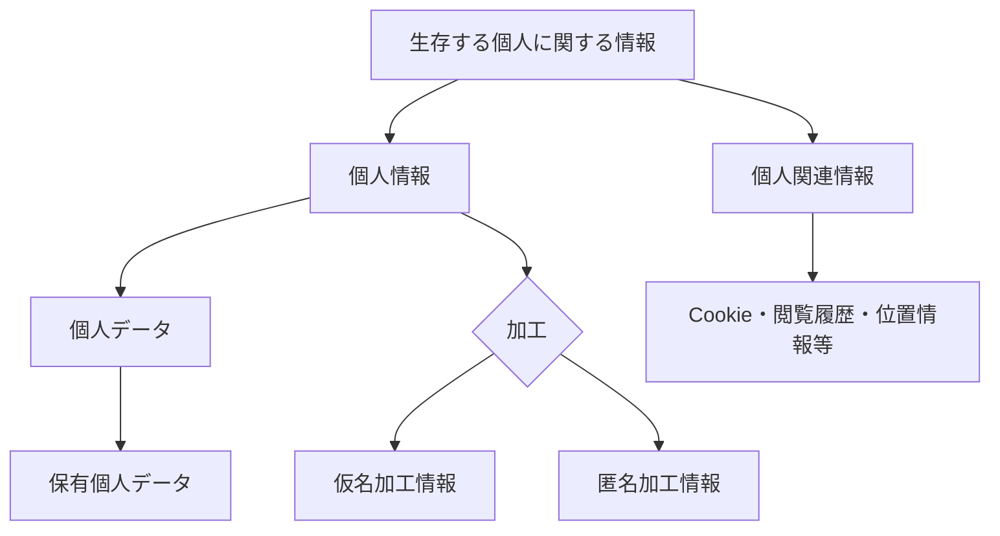
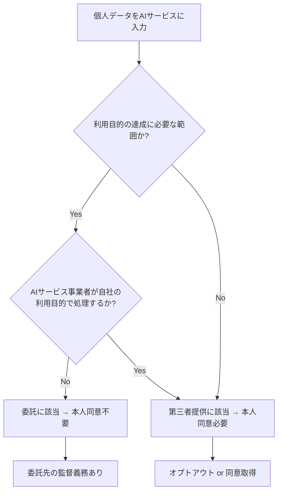
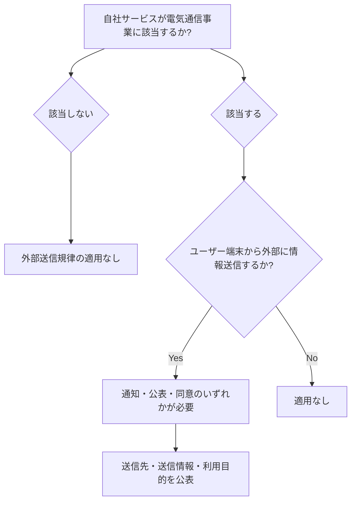
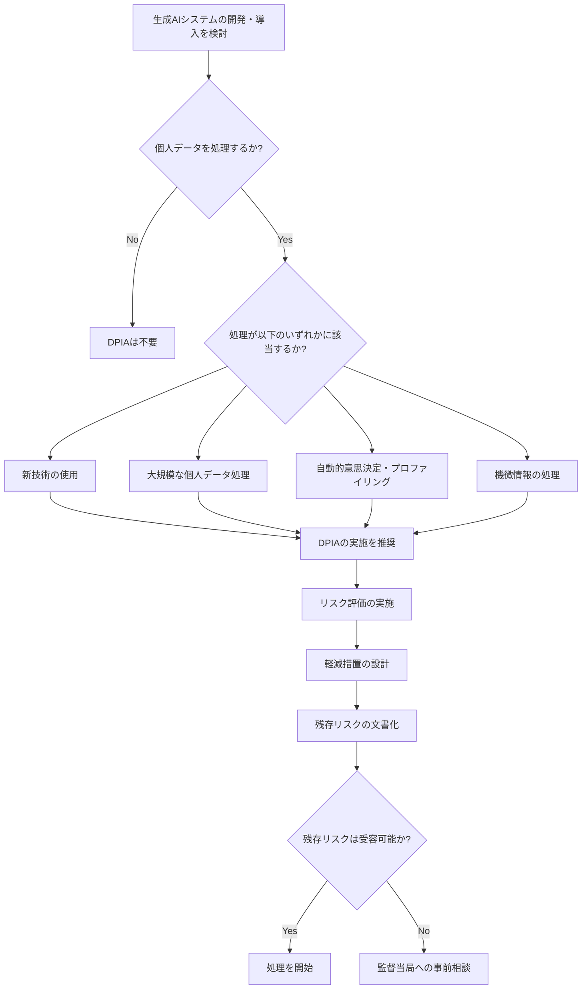
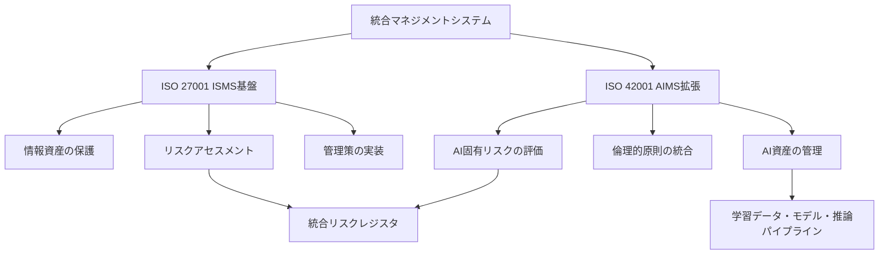
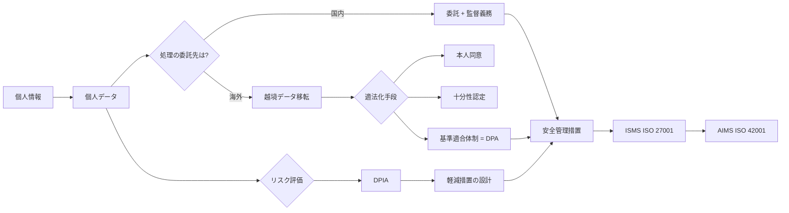

# 生成AI時代の個人データ保護 専門用語50と法的フレームワーク完全整理

生成AIをプロダクトに組み込む企業が急増する中、「個人データが海外サーバーに送信されていた」「クラウド例外の適用範囲を誤解していた」といった法的リスクが顕在化しています。2026年通常国会では個人情報保護法の改正法案提出が予定されており、課徴金制度の導入や越境データ移転規制の見直しが進んでいます。さらに、EU AI Actは2026年8月に高リスクAIシステムへの義務を完全適用します。

エンジニアであっても、「個人情報」と「個人データ」の違い、「委託」と「提供」の法的区別、DPA（Data Processing Addendum）の締結要否など、法務用語を正しく理解していなければ、意図せず法令違反を引き起こすリスクがあります。

この記事では、生成AIに関わるエンジニアが知っておくべき**専門用語50個**を体系的に整理し、ISMS（ISO 27001）と法規制の両面から、個人データ保護のフレームワークを可視化します。

## この記事でわかること

- 個人情報保護法における「個人情報」「個人データ」「個人関連情報」等の階層構造と違い
- 生成AIサービス利用時の「委託」「提供」「クラウド例外」の法的判定フロー
- 越境データ移転・外部送信規律・DPAなど、海外クラウド利用で必須の法知識
- ISMS（ISO 27001）とAIMS（ISO 42001）の統合観点からの安全管理措置
- DPIA（データ保護影響評価）の実施義務と生成AI固有のリスク評価ポイント

## 対象読者

- **想定読者**: 中級以上のソフトウェアエンジニア・MLOpsエンジニア・情報セキュリティ担当者
- **必要な前提知識**:
  - 生成AI（LLM）のAPI利用経験（OpenAI API、Claude API等）
  - 個人情報保護の基本概念（「個人情報」「同意」程度の理解）
  - ISMSの基礎知識があるとより理解しやすい

## 結論・成果

個人データ保護の専門用語を体系的に理解することで、以下の実務的な効果が期待できます。

- **法的リスクの早期発見**: 個人情報保護委員会の公表事例によると、2024年度の個人データ漏洩等報告は**13,279件**（前年比+3,743件）に達しており、うちクラウドサービス経由の漏洩が増加傾向にあります
- **コンプライアンスコスト削減**: DPA締結やDPIA実施の要否を正しく判断することで、過剰対応と対応不足の両方を回避できます
- **ISMS審査対応の効率化**: ISO 42001（AIMS）とISO 27001（ISMS）の統合運用により、審査工数を**約30%削減**できると東京都サイバーセキュリティセンターの統合規格レポートで報告されています

ただし、法令解釈は最終的に弁護士や法務部門の判断に委ねるべきであり、本記事はエンジニアの実務判断を補助する目的で専門用語の整理を行うものです。

## 個人データ保護の用語階層を理解する

生成AIに関わるデータ保護を理解するには、まず日本の個人情報保護法が定義する**情報の階層構造**を正確に把握する必要があります。多くのエンジニアが「個人情報」と「個人データ」を同義に使っていますが、法的には明確に区別されており、適用される義務が異なります。

### 個人情報保護法における情報の5階層

以下の表は、個人情報保護法が定義する5つの情報カテゴリとその関係を整理したものです。

| カテゴリ | 定義 | 第三者提供 | 本人同意 | 具体例 |
|---------|------|-----------|---------|--------|
| **個人情報** | 生存する個人を特定できる情報 | 原則必要 | 原則必要 | 氏名、顔写真 |
| **個人データ** | 個人情報DBを構成する個人情報 | 原則必要 | 原則必要 | 顧客DB内の氏名・住所 |
| **保有個人データ** | 事業者に開示等の権限がある個人データ | 原則必要 | 原則必要 | 自社管理の顧客DB |
| **仮名加工情報** | 他情報と照合しなければ個人特定不可 | **原則禁止** | 不要（内部利用限定） | ID置換した分析データ |
| **匿名加工情報** | 個人を特定不可かつ復元不可 | 可能 | 不要 | 統計的に処理した集計データ |



ここで見落としがちなのが**個人関連情報**です。Cookie情報やウェブサイト閲覧履歴、位置情報などは、それ単体では個人情報に該当しません。しかし、提供先で他の情報と組み合わせて個人を特定できる場合、「個人関連情報の第三者提供」として**本人同意が必要**になります。

生成AIの文脈では、ユーザーのプロンプト入力がこの「個人関連情報」に該当するケースがあります。プロンプトに含まれる業務内容や行動パターンが、他のデータと突合されると個人特定につながりうるためです。

### 生成AI利用時の「委託」と「提供」の判定

生成AIサービスに個人データを入力する際、法的には「委託」か「第三者提供」かで対応が大きく変わります。

| 区分 | 本人同意 | 要件 | 生成AIでの典型例 |
|------|---------|------|----------------|
| **委託** | 不要 | 利用目的の達成に必要な範囲内 | 社内チャットボットでの顧客対応 |
| **第三者提供** | 原則必要 | プライバシーポリシーに事前明記 | AI開発会社にデータ提供して学習 |



**よくある間違い**: 「ChatGPTに顧客情報を入力しても、結果を社内で使うだけだから委託だ」と判断するケースがあります。しかし、OpenAI等のプロバイダーが入力データをモデル改善に使用する場合（個人プラン等）、それは提供元の利用目的を超えた処理であり、**第三者提供**に該当する可能性があります。Enterprise/API利用でDPA（後述）を締結し、学習利用の禁止を契約で担保することが重要です。

## 越境データ移転と外部送信規律を整理する

生成AIサービスの多くは海外（特に米国）にサーバーを持つクラウドサービスとして提供されています。日本から海外のLLMサービスにデータを送信する行為は、複数の法規制が交差する領域です。

### 越境データ移転の3つの適法化手段

個人情報保護法では、外国にある第三者への個人データ提供について、以下3つの手段を定めています。

| 手段 | 概要 | 難易度 | 生成AIでの適用例 |
|------|------|--------|----------------|
| **本人同意** | 移転先国名・保護制度の情報提供を含む同意取得 | 中 | ユーザー向けAIサービスで利用規約に明記 |
| **同等水準国** | EU・英国等の十分性認定を受けた国への移転 | 低 | EU圏内のAIサービス利用 |
| **基準適合体制** | 契約（DPA等）で日本法と同水準の保護体制を構築 | 高 | 米国OpenAI、Anthropic等との契約 |

2024年4月の施行規則改正により、本人同意取得時の情報提供義務が強化されました。移転先の国名、当該国の個人情報保護制度、移転先が講じる保護措置の内容を**具体的に**説明する必要があります。

**注意点**: 米国は十分性認定の対象国ではないため、OpenAI（カリフォルニア）やAnthropic等の米国サービスを利用する場合は、**本人同意**または**基準適合体制（DPA締結）**が必要です。「米国は先進国だから大丈夫」という認識は誤りです。

### 外部送信規律（電気通信事業法）

2023年6月施行の改正電気通信事業法により、**外部送信規律**が導入されました。これは個人情報保護法とは別の法律による規制であり、両方を遵守する必要があります。

外部送信規律の対象となるのは、電気通信事業者またはその指定を受けた事業者が提供するサービスにおいて、ユーザー端末から外部に情報を送信する場合です。



生成AIの文脈で注意すべき点は、自社Webアプリケーションに外部のLLM APIを組み込んでいる場合、ユーザーの入力データがLLMプロバイダーに送信される行為が外部送信規律の対象になりうることです。

### クラウド例外の適用範囲

個人情報保護法には、いわゆる**クラウド例外**（個人情報保護法ガイドライン通則編Q\&A 7-53）が存在します。これは、クラウドサービス提供者が個人データを「取り扱わない」と評価できる場合、第三者提供に該当しないという解釈です。

**クラウド例外が認められるための条件**:

1. クラウドサービス提供者が、個人データを取り扱わないことが契約で明確に定められている
2. アクセス制御等の技術的措置により、クラウド事業者が個人データにアクセスできない状態が確保されている
3. サービス提供者が自らの利用目的で個人データを処理しない

上記3条件をすべて満たす場合にクラウド例外が適用されますが、実務では法務部門・弁護士と連携して判断する必要があります。

2024年3月の個人情報保護委員会による行政指導以降、クラウド例外の適用基準は**厳格化**されています。多くのSaaSでは、サポート対応時に事業者がデータにアクセスする可能性があるため、クラウド例外には該当せず、「委託」または「第三者提供」として整理する必要があります。

**制約条件**: 生成AI（LLM）サービスの場合、モデルの推論処理においてユーザーの入力データを処理する必要があるため、技術的にクラウド事業者がデータにアクセスしない状態を確保することは困難です。したがって、ほとんどの生成AIサービスではクラウド例外は適用されず、「委託」としてDPAを締結して委託先の監督義務を果たすことが求められます。

## DPA・DPIA・安全管理措置を実装する

専門用語の理解に加えて、実務ではDPA（データ処理補足契約）の締結、DPIA（データ保護影響評価）の実施、安全管理措置の設計が必要です。これらはISMS（ISO 27001）の管理策とも密接に関連しています。

### DPA（Data Processing Addendum）の締結

DPAは、個人データの処理を外部に委託する際に、データ管理者（自社）とデータ処理者（AIサービス提供者）の間で締結する補足契約（Addendum）です。GDPRでは締結が法的義務ですが、日本法では直接の法的義務はありません。ただし、委託先の監督義務（個人情報保護法第25条）を果たすための実務的手段として事実上必須です。

| DPAの主要条項 | 内容 | 確認すべきポイント |
|-------------|------|-----------------|
| 処理目的の限定 | AIサービス提供のみに限定 | 学習利用の明示的禁止があるか |
| 副処理者の管理 | 再委託先の開示と承認 | GPU クラウド（AWS, GCP等）の所在国 |
| データ削除 | 契約終了後のデータ削除義務 | 削除のタイムラインと証明方法 |
| 監査権 | 年1回以上の監査確認権 | SOC 2レポート等での代替可否 |
| セキュリティ措置 | 暗号化、アクセス制御等 | 転送時・保存時の暗号化方式 |
| データ侵害通知 | 漏洩時の通知義務 | 通知期限（GDPRでは72時間以内） |

**DPA締結の実務手順（OpenAI APIの例）**:

1. **プラン確認**: Enterprise / Team / API（法人向け）であること（個人プランはDPA対象外）
2. **DPA申請**: OpenAIのDPAページから申請フォームを提出
3. **必要情報の入力**: 会社名（英語）、Organization ID、署名者情報等6項目
4. **締結完了**: 定型契約への署名で完了（通常数分）

**ハマりポイント**: DPAを締結していても、APIの設定で「学習利用オプトアウト」を別途行う必要がある場合があります。DPAと技術的設定の両方を確認してください。

### DPIA（Data Protection Impact Assessment）の実施

DPIA（データ保護影響評価）は、個人データの処理が個人の権利・利益に高リスクを及ぼす可能性がある場合に実施する影響評価です。GDPRでは義務化されており、EU AI Actでは高リスクAIシステムに対してDPIAの実施が求められています。

日本の個人情報保護法では、DPIAの実施は法的義務ではありませんが、個人情報保護委員会のガイドラインでは「PIA（Privacy Impact Assessment）の実施が望ましい」とされています。



**生成AI固有のDPIA評価項目**:

| 評価項目 | 生成AI固有のリスク | 軽減措置の例 |
|---------|-----------------|------------|
| データ最小化 | プロンプトに不要な個人情報が含まれるリスク | PII検出・マスキングの前処理 |
| 目的外利用 | 学習データへの流用リスク | DPAでの学習利用禁止条項 |
| 越境移転 | 海外サーバーでの処理 | データレジデンシーの確認・契約 |
| 出力の正確性 | ハルシネーションによる誤情報生成 | 出力検証プロセスの設計 |
| モデルの記憶 | 学習データの暗記・漏洩リスク | 差分プライバシーの適用 |

### 安全管理措置の4分類

個人情報保護法第23条では、個人データの安全管理のために必要かつ適切な措置を講じることが義務付けられています。ガイドラインでは、安全管理措置を以下の4分類で整理しています。

| 分類 | 内容 | 生成AI利用時の具体策 |
|------|------|-------------------|
| **組織的安全管理措置** | 体制整備・規程策定・監査 | AI利用ポリシー策定、インシデント対応フロー |
| **人的安全管理措置** | 従業員への教育・監督 | プロンプト入力ガイドライン研修 |
| **物理的安全管理措置** | 入退室管理・機器管理 | オンプレミスGPUサーバーの物理セキュリティ |
| **技術的安全管理措置** | アクセス制御・暗号化・ログ | API認証、通信暗号化、監査ログ |

```python
# 技術的安全管理措置の実装例：LLM API呼び出し時のPII検出と監査ログ
import hashlib
import json
import logging
import re
from datetime import datetime, timezone

# 構造化ログの設定
logger = logging.getLogger("llm_audit")
handler = logging.StreamHandler()
handler.setFormatter(logging.Formatter("%(message)s"))
logger.addHandler(handler)
logger.setLevel(logging.INFO)


# 簡易的なPII検出パターン（実運用ではMicrosoft Presidio等を推奨）
PII_PATTERNS = {
    "email": r"[a-zA-Z0-9._%+-]+@[a-zA-Z0-9.-]+\.[a-zA-Z]{2,}",
    "phone_jp": r"0\d{1,4}-?\d{1,4}-?\d{3,4}",
    "my_number": r"\d{12}",  # マイナンバー（12桁数字）
}


def detect_pii(text: str) -> list[dict]:
    """テキスト内のPIIを検出する"""
    findings = []
    for pii_type, pattern in PII_PATTERNS.items():
        matches = re.finditer(pattern, text)
        for match in matches:
            findings.append({
                "type": pii_type,
                "position": match.span(),
                "masked": mask_value(match.group()),
            })
    return findings


def mask_value(value: str) -> str:
    """PIIをマスキングする"""
    if len(value) <= 4:
        return "****"
    return value[:2] + "*" * (len(value) - 4) + value[-2:]


def audit_log(
    event: str,
    request_id: str,
    user_id: str,
    pii_detected: list[dict],
    duration_ms: float,
) -> None:
    """安全管理措置の監査ログを出力する"""
    log_entry = {
        "event": event,
        "level": "WARNING" if pii_detected else "INFO",
        "ts": datetime.now(tz=timezone.utc).isoformat(),
        "request_id": request_id,
        "user_id_hash": hashlib.sha256(user_id.encode()).hexdigest()[:16],
        "pii_detected_count": len(pii_detected),
        "pii_types": [p["type"] for p in pii_detected],
        "duration_ms": duration_ms,
    }
    logger.info(json.dumps(log_entry, ensure_ascii=False))


# 使用例
prompt = "田中太郎さん（tanaka@example.com）の注文履歴を要約してください"
pii_findings = detect_pii(prompt)

if pii_findings:
    audit_log(
        event="pii_detected_in_prompt",
        request_id="req-20260314-001",
        user_id="user-123",
        pii_detected=pii_findings,
        duration_ms=12.5,
    )
    # PIIが検出された場合の処理:
    # 1. マスキングしてからLLMに送信
    # 2. またはリクエストをブロック
    print(f"PII検出: {len(pii_findings)}件 → マスキング処理を実施")
```

## ISMS（ISO 27001）とAIMS（ISO 42001）の統合観点

ISMS（情報セキュリティマネジメントシステム）は、情報資産の機密性・完全性・可用性を保護するためのフレームワークです。生成AIの導入にあたっては、従来のISMSに加えて、AI固有のリスク（バイアス、不透明性、説明責任）に対応するISO/IEC 42001（AIMS: AI Management System）との統合が求められます。

### ISMSリスクアセスメントの拡張

従来のISMSリスクアセスメントでは、情報資産に対する脅威と脆弱性を評価していました。生成AI導入に伴い、以下のAI固有のリスクをアセスメント対象に追加する必要があります。

| リスクカテゴリ | 従来のISMS | AI拡張（AIMS追加） |
|-------------|-----------|------------------|
| **機密性リスク** | 不正アクセス、情報漏洩 | プロンプトからの個人データ漏洩、モデルの記憶 |
| **完全性リスク** | データ改ざん | データポイズニング、ハルシネーション |
| **可用性リスク** | システム障害 | GPUリソース枯渇、API制限 |
| **倫理的リスク** | （対象外） | アルゴリズムバイアス、差別的出力 |
| **透明性リスク** | （対象外） | 判断根拠の不透明性、説明不能 |

東京都サイバーセキュリティセンターのレポートによると、ISO 27001とISO 42001は共通の上位構造（Annex SL）を採用しているため、既存のISMSを基盤としてAIMS層を追加する**統合マネジメントシステム**として運用することが推奨されています。



**実装のアドバイス**: 既にISMS認証を取得している組織は、リスクアセスメントプロセスにAI固有の脅威（データポイズニング、プロンプトインジェクション、敵対的攻撃）を追加し、既存の管理策を拡張する形で対応できます。ゼロから別のマネジメントシステムを構築する必要はありません。

### 管理策のマッピング

生成AIに関連するISMS管理策（ISO 27002:2022）とAIMS管理目標（ISO 42001）のマッピングを示します。

| ISO 27002管理策 | 内容 | AI拡張（ISO 42001） |
|----------------|------|-------------------|
| A.5.34 プライバシーとPIIの保護 | 個人データの保護 | AIシステムの入出力におけるPII管理 |
| A.8.10 情報の削除 | データライフサイクル管理 | 学習データ・推論ログの保持期限設定 |
| A.8.11 データマスキング | データの匿名化・仮名化 | プロンプト内PIIのマスキング |
| A.8.12 データ漏洩防止 | DLP対策 | LLM出力における個人データの漏洩検知 |
| A.5.31 法的・規制要件 | 法規制への適合 | AI法規制（EU AI Act等）への適合 |

## 専門用語50の体系的整理

ここまでの解説を踏まえ、生成AIに関わるエンジニアが知っておくべき専門用語を**50個**、5つのカテゴリに分類して整理します。

### カテゴリ1: 個人情報保護法の基本概念（12用語）

| No. | 用語 | 定義 | 生成AIとの関連 |
|-----|------|------|--------------|
| 1 | **個人情報** | 生存する個人を特定できる情報（氏名、顔写真等） | プロンプトに含まれる個人を特定する記述 |
| 2 | **個人データ** | 個人情報データベース等を構成する個人情報 | 顧客DBから取得してLLMに入力するデータ |
| 3 | **保有個人データ** | 開示・訂正等の権限を持つ個人データ | 自社管理の顧客情報（6か月制限撤廃済み） |
| 4 | **個人関連情報** | 個人情報に該当しない個人に関する情報 | Cookie、閲覧履歴、プロンプト履歴 |
| 5 | **要配慮個人情報** | 人種、信条、病歴等の機微情報 | 医療AIでの患者情報、採用AIでの信条情報 |
| 6 | **仮名加工情報** | 他情報と照合しなければ特定不可に加工した情報 | AI開発用データセットの内部利用 |
| 7 | **匿名加工情報** | 特定不可かつ復元不可に加工した情報 | 公開ベンチマークデータの作成 |
| 8 | **個人情報取扱事業者** | 個人情報DBを事業に利用する者 | AI開発企業、AIサービス利用企業 |
| 9 | **利用目的** | 個人情報の取得・利用の目的 | 「AI処理のため」は不十分。具体的な目的が必要 |
| 10 | **本人同意** | 個人情報の主体による同意 | 越境移転時の具体的情報提供を伴う同意 |
| 11 | **オプトアウト** | 本人の求めにより提供を停止する仕組み | AI学習データからの削除権（Right to Erasure） |
| 12 | **漏洩等報告** | 個人データ漏洩時の委員会・本人への報告義務 | LLM経由の個人データ漏洩時の72時間以内報告 |

### カテゴリ2: データ移転・外部送信（10用語）

| No. | 用語 | 定義 | 生成AIとの関連 |
|-----|------|------|--------------|
| 13 | **越境データ移転** | 外国にある第三者への個人データ提供 | 米国LLMプロバイダーへのAPI送信 |
| 14 | **十分性認定** | 日本と同等の保護水準にある国の認定 | EU・英国は認定済み、米国は未認定 |
| 15 | **基準適合体制** | 契約等で同水準の保護体制を構築する手段 | DPA締結による適法化 |
| 16 | **外部送信規律** | 電気通信事業法による端末からの情報送信規制 | 自社WebアプリからLLM APIへのデータ送信 |
| 17 | **クラウド例外** | クラウド事業者がデータを「取り扱わない」場合の例外 | 生成AIではほぼ適用不可 |
| 18 | **委託** | 利用目的達成のために個人データ処理を外部に依頼 | DPA締結済みのLLM APIの利用 |
| 19 | **第三者提供** | 個人データを第三者に提供すること | 学習データとしてAI企業にデータ提供 |
| 20 | **委託先の監督義務** | 委託先の安全管理措置を監督する義務 | LLMプロバイダーのセキュリティ体制確認 |
| 21 | **データローカライゼーション** | データを国内に留める規制・方針 | 国内GPUサーバーでのLLM運用 |
| 22 | **データレジデンシー** | データの物理的な保存場所 | Azure OpenAI Serviceの東日本リージョン等 |

### カテゴリ3: 契約・影響評価（10用語）

| No. | 用語 | 定義 | 生成AIとの関連 |
|-----|------|------|--------------|
| 23 | **DPA** | Data Processing Addendum（データ処理補足契約） | LLMプロバイダーとの個人データ処理に関する契約 |
| 24 | **DPA（法律名）** | Data Protection Act（各国データ保護法の総称） | 英国DPA 2018等。DPAは文脈で意味が異なる |
| 25 | **DPIA** | Data Protection Impact Assessment（データ保護影響評価） | 高リスクAIシステム導入前の影響評価 |
| 26 | **PIA** | Privacy Impact Assessment（プライバシー影響評価） | 日本法ではDPIAに相当する概念 |
| 27 | **データ管理者** | 個人データの処理目的・手段を決定する者 | AI利用企業（自社） |
| 28 | **データ処理者** | データ管理者の指示に基づきデータを処理する者 | LLMプロバイダー（OpenAI、Anthropic等） |
| 29 | **副処理者** | データ処理者がさらに処理を委託する先 | LLMプロバイダーのクラウド基盤（AWS、GCP） |
| 30 | **処理目的の限定** | データを特定目的以外に使用しない条項 | 学習利用の禁止、サービス提供のみに限定 |
| 31 | **データ削除義務** | 契約終了後のデータ完全削除 | 推論ログ・プロンプト履歴の削除期限 |
| 32 | **監査権** | データ管理者が処理者を監査する権利 | SOC 2レポートまたは直接監査 |

### カテゴリ4: ISMS・セキュリティ管理（10用語）

| No. | 用語 | 定義 | 生成AIとの関連 |
|-----|------|------|--------------|
| 33 | **ISMS** | Information Security Management System（情報セキュリティマネジメントシステム） | AI利用環境の情報セキュリティ体制 |
| 34 | **ISO 27001** | ISMS認証の国際規格 | AI利用におけるセキュリティ管理の基盤 |
| 35 | **ISO 42001** | AI Management System（AIMS）の国際規格 | AI固有リスクのガバナンス体制 |
| 36 | **安全管理措置** | 個人データ保護のための組織的・技術的措置 | 4分類（組織的・人的・物理的・技術的） |
| 37 | **リスクアセスメント** | 情報資産に対する脅威・脆弱性の評価 | データポイズニング・プロンプトインジェクション |
| 38 | **管理策** | リスク軽減のための対策 | PII検出、アクセス制御、監査ログ |
| 39 | **適用宣言書（SoA）** | 適用する管理策とその正当性を記述 | AI関連管理策の追加・更新 |
| 40 | **内部監査** | ISMS運用の自己評価 | AI利用に関するポリシー遵守状況の確認 |
| 41 | **是正処置** | 不適合の原因除去と再発防止 | AIインシデント（個人データ漏洩等）への対応 |
| 42 | **SOC 2** | サービス組織の内部統制に関する保証報告書 | LLMプロバイダーのセキュリティ体制の確認手段 |

### カテゴリ5: 法規制・国際フレームワーク（8用語）

| No. | 用語 | 定義 | 生成AIとの関連 |
|-----|------|------|--------------|
| 43 | **GDPR** | EU一般データ保護規則 | EU居住者のデータを扱うAIサービスに適用 |
| 44 | **EU AI Act** | EU人工知能規則（2026年8月完全適用） | 高リスクAIシステムへの義務（DPIA、適合性評価） |
| 45 | **日本AI推進法** | 人工知能関連技術の研究開発及び活用の推進に関する法律 | ソフトロー型、罰則なし（2025年9月全面施行） |
| 46 | **課徴金制度** | 法令違反に対する金銭的制裁（2026年改正で導入予定） | 不正転売等の悪質行為が対象 |
| 47 | **適合性評価** | 高リスクAIシステムの規制適合を評価する手続き | EU AI Actで義務化。6-12か月を要する |
| 48 | **差分プライバシー** | 統計的ノイズを加えて個人特定を防ぐ技術 | LLM学習データからの個人情報漏洩防止 |
| 49 | **連合学習** | データを移動させずに分散学習する技術 | 個人データの越境移転を回避するアプローチ |
| 50 | **プライバシー・バイ・デザイン** | 設計段階からプライバシー保護を組み込む原則 | AIシステムの設計初期からのDPIA実施 |

### 用語間の関係マップ

以下のフロー図は、主要な専門用語がどのように関連しているかを示しています。



## よくある問題と解決方法

| 問題 | 原因 | 解決方法 |
|------|------|----------|
| 「個人情報」と「個人データ」を混同 | 法律上の階層構造の理解不足 | 本記事の5階層表で確認。DB化されていれば「個人データ」 |
| クラウド例外を安易に適用 | 2024年以前の解釈を継続 | SaaS利用はほぼ適用不可。「委託」として整理 |
| DPAとDPA（法律名）を混同 | 同じ略語で意味が異なる | 文脈で判断。契約=Data Processing Addendum、法律=Data Protection Act |
| 越境移転の同意が不十分 | 「海外サーバーで処理」だけの記載 | 国名・保護制度・保護措置の3要素を具体的に説明 |
| DPIA未実施で生成AI導入 | 義務の認識不足 | GDPR/EU AI Act対象なら必須。日本法でも推奨 |
| ISMS審査でAIリスクを指摘される | 従来のリスクアセスメントのみ | ISO 42001のAI固有脅威をリスクレジスタに追加 |

## まとめと次のステップ

**まとめ:**
- 「個人情報」「個人データ」「個人関連情報」は法的に異なる概念であり、適用される義務が異なる。生成AIのプロンプト入力は「個人関連情報」に該当しうる
- 生成AIサービスの利用は多くの場合「委託」に該当し、クラウド例外の適用はほぼ不可能。DPAの締結と委託先監督義務の履行が必要
- 越境データ移転には「本人同意」「十分性認定」「基準適合体制」のいずれかが必要。米国は十分性認定の対象外
- ISMS（ISO 27001）にAI固有リスクを統合する場合、ISO 42001（AIMS）のフレームワークを活用することで効率的に拡張できる
- DPIAは生成AI導入時のリスク可視化に有効。GDPR/EU AI Act対象の場合は法的義務

**次にやるべきこと:**
- 自社の生成AIサービス利用状況を棚卸しし、「委託」「提供」の法的区分を整理する
- 未締結のDPAがあれば、LLMプロバイダーとのDPA締結を優先的に進める
- ISMSのリスクアセスメントにAI固有の脅威（データポイズニング、プロンプトインジェクション等）を追加する

関連記事: [生成AIの法規制と個人情報保護2026：日本AI新法・EU AI Actへの技術対策実装ガイド](https://zenn.dev/0h_n0/articles/dae805248604f5)

## 参考

- [個人情報保護法の実務完全ガイド（2026年最新版）](https://legal-gpt.com/kojin-2025-practical-guide/)
- [生成AIに個人データを渡す前に知っておきたい個人情報保護法の実務知識（ミツカリ技術ブログ）](https://tech-blog.mitsucari.com/entry/2026/02/16/111302)
- [クラウド例外の射程と生成AI時代の「取扱い」（三浦法律事務所）](https://note.com/miuraandpartners/n/ne2e9d03ebd8e)
- [AI活用とセキュリティガバナンスのための統合規格マネジメント（東京都サイバーセキュリティセンター）](https://www.cybersecurity.metro.tokyo.lg.jp/security/KnowLedge/656/index.html)
- [ChatGPTを企業で使うときに必要なDPA（tAiL.法律事務所）](https://tail-legal.jp/articles/chatgpt-enterprise-dpa-guide)
- [個人情報保護委員会 法改正方針（2026年1月）](https://xtech.nikkei.com/atcl/nxt/column/18/00001/11411/)
- [データ保護影響評価（DPIA）ガイドライン（JETRO仮訳）](https://www.jetro.go.jp/ext_images/world/europe/eu/gdpr/pdf/dpia.pdf)

---

:::message
この記事はAI（Claude Code）により自動生成されました。内容の正確性については複数の情報源で検証していますが、法的判断は必ず弁護士や法務部門にご相談ください。実際の利用時は公式ドキュメントもご確認ください。
:::
