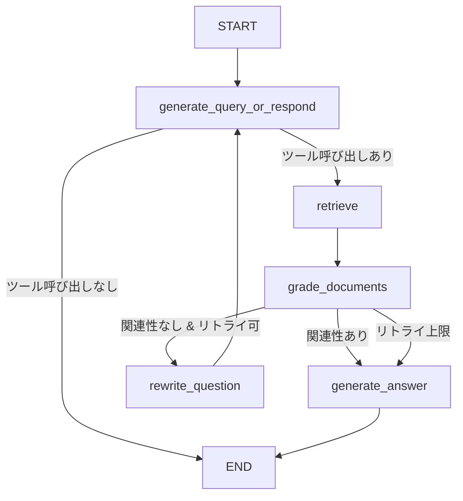

# LangGraph×Gemini 3.1 Proで実装する階層的AgenticRAG検索パイプライン

## この記事でわかること

- LangGraphとGemini 3.1 Proを組み合わせたAgenticRAGパイプラインの設計と実装方法
- A-RAG論文に基づく**階層的検索インターフェース**（キーワード検索・セマンティック検索・チャンク読み込み）の実装パターン
- Gemini 3.1 Proの1Mトークンコンテキストと`thinking_level`パラメータを活用したコスト・精度トレードオフの制御手法
- 条件付きルーティングによるクエリ分類とマルチリトリーバーの動的選択
- 本番運用を想定したトークンバジェット管理とフォールバック設計

## 対象読者

- **想定読者**: 中級〜上級のPythonエンジニアでRAGシステムの構築・運用経験がある方
- **必要な前提知識**:
  - Python 3.11以上の基本文法
  - LangChain / LangGraphの基本概念（State、Node、Edge）
  - RAG（Retrieval-Augmented Generation）の基本アーキテクチャ
  - ベクトル検索（Embedding、コサイン類似度）の基礎理解

## 結論・成果

本記事で実装する階層的AgenticRAGパイプラインでは、A-RAG論文（arXiv: 2602.03442）の設計思想をLangGraphで再現し、Gemini 3.1 Proをバックエンドに採用しています。A-RAG論文の著者らのベンチマークでは、階層的検索インターフェースにより**HotpotQAで94.5%、2WikiMultiHopQAで89.7%のLLM-Acc**を達成し、従来の単一検索パイプラインと比較して同等以下のトークン消費量で精度が向上したと報告されています。

Gemini 3.1 Proは入力トークン単価が**$2.00/1Mトークン**と、同等性能帯のモデルと比較してコスト効率が高く、1Mトークンのコンテキストウィンドウにより大量のチャンクを一度に処理できます。さらに`thinking_level`パラメータ（Low / Medium / High）を検索フェーズごとに切り替えることで、コストと推論品質のバランスを動的に制御できます。

:::message
本記事のコード例は設計パターンの解説を目的としています。本番環境での利用時は、Gemini APIおよびLangGraphの公式ドキュメントで最新のAPI仕様をご確認ください。
:::

## 階層的検索インターフェースを設計する

AgenticRAGでは、LLMが検索戦略を自律的に選択します。A-RAG論文（Du et al., 2026）では、3つの粒度の異なる検索ツールをエージェントに公開し、クエリ特性に応じた適応的な検索を実現しています。この設計思想をLangGraphのグラフ構造に落とし込んでみましょう。

### 3つの検索ツールの役割

A-RAGが提案する階層的検索インターフェースは、以下の3層で構成されます。

| ツール | 粒度 | 用途 | 検索方式 |
|--------|------|------|----------|
| **keyword_search** | キーワードレベル | 固有名詞・技術用語の正確なマッチング | 字句一致（BM25ベース） |
| **semantic_search** | 文レベル | 概念的な類似性に基づく検索 | Embeddingコサイン類似度 |
| **chunk_read** | チャンクレベル | 特定チャンクの全文読み込み+隣接コンテキスト | ID指定による直接アクセス |

**なぜ3層構造なのか:**

単一の検索方式では、クエリの性質によって精度が大きく変動します。例えば「Transformerの提案者は誰か」という事実質問にはキーワード検索が有効ですが、「Attentionメカニズムの利点」のような概念的な質問にはセマンティック検索が適しています。A-RAG論文の著者らの実験では、この3層構造により**クエリタイプごとの精度のばらつきが低減した**と報告されています。

**注意点:**
> 3つのツールすべてを毎回使用する必要はありません。エージェントが**クエリ特性に基づいて動的に選択**する点が重要です。キーワード検索のみで十分な場合にセマンティック検索を強制すると、不要なトークン消費とレイテンシ増加を招きます。

### LangGraphでのツール定義

まず、3つの検索ツールをLangChainのツールとして定義します。

```python
# tools.py
from langchain_core.tools import tool
from pydantic import BaseModel, Field


class KeywordSearchInput(BaseModel):
    """キーワード検索の入力スキーマ"""
    keywords: list[str] = Field(
        description="検索キーワードのリスト（固有名詞・技術用語）"
    )
    max_results: int = Field(default=10, description="最大取得件数")


class SemanticSearchInput(BaseModel):
    """セマンティック検索の入力スキーマ"""
    query: str = Field(description="自然言語の検索クエリ")
    top_k: int = Field(default=5, description="上位K件を取得")


class ChunkReadInput(BaseModel):
    """チャンク読み込みの入力スキーマ"""
    chunk_ids: list[str] = Field(description="読み込むチャンクIDのリスト")
    include_adjacent: bool = Field(
        default=True, description="隣接チャンクも含めるか"
    )


@tool("keyword_search", args_schema=KeywordSearchInput)
def keyword_search(keywords: list[str], max_results: int = 10) -> str:
    """キーワードの完全一致・部分一致でドキュメントを検索する。
    固有名詞や技術用語の正確なマッチングに適している。"""
    # BM25ベースの検索を実行
    results = bm25_retriever.invoke(
        " ".join(keywords), top_k=max_results
    )
    return _format_search_results(results)


@tool("semantic_search", args_schema=SemanticSearchInput)
def semantic_search(query: str, top_k: int = 5) -> str:
    """Embeddingベースのセマンティック検索を実行する。
    概念的な類似性に基づく検索に適している。"""
    results = vector_retriever.invoke(query, top_k=top_k)
    return _format_search_results(results)


@tool("chunk_read", args_schema=ChunkReadInput)
def chunk_read(
    chunk_ids: list[str], include_adjacent: bool = True
) -> str:
    """指定したチャンクIDの全文を読み込む。
    隣接チャンクを含めることで前後の文脈も取得できる。"""
    chunks = []
    for cid in chunk_ids:
        chunk = chunk_store.get(cid)
        if chunk and include_adjacent:
            chunks.extend(chunk_store.get_adjacent(cid, window=1))
        elif chunk:
            chunks.append(chunk)
    return _format_chunks(chunks)


def _format_search_results(results: list) -> str:
    """検索結果をエージェントが読みやすい形式にフォーマットする"""
    formatted = []
    for i, doc in enumerate(results):
        formatted.append(
            f"[{i+1}] chunk_id={doc.metadata['chunk_id']}\n"
            f"    score={doc.metadata.get('score', 'N/A')}\n"
            f"    content: {doc.page_content[:200]}..."
        )
    return "\n".join(formatted)


def _format_chunks(chunks: list) -> str:
    """チャンクをフォーマットする"""
    return "\n---\n".join(
        f"[chunk_id={c.metadata['chunk_id']}]\n{c.page_content}"
        for c in chunks
    )
```

**実装のポイント:**

- 各ツールにPydanticスキーマを定義することで、Gemini 3.1 Proのツールコール時に型安全な引数を生成させます
- `keyword_search`と`semantic_search`は検索結果のサマリを返し、`chunk_read`は全文を返すという**情報粒度の差**を意識しています
- `_format_search_results`で`chunk_id`を含めることで、エージェントが後続の`chunk_read`でIDを指定できるようにしています

## Gemini 3.1 ProでAgenticRAGグラフを構築する

LangGraphのStateGraphを使い、検索→評価→回答生成のループを組み立てます。Gemini 3.1 Proの`thinking_level`パラメータを活用して、各ノードでの推論コストを最適化します。

### 状態定義とグラフの全体設計

```python
# graph.py
from typing import Annotated, Literal
from pydantic import BaseModel, Field
from langchain_core.messages import BaseMessage
from langgraph.graph import StateGraph, START, END
from langgraph.graph.message import add_messages
from langgraph.prebuilt import ToolNode


class RetrievalState(BaseModel):
    """AgenticRAGパイプラインの状態"""
    messages: Annotated[list[BaseMessage], add_messages]
    query: str = ""
    retrieved_chunk_ids: set[str] = Field(default_factory=set)
    retrieval_count: int = 0
    max_retrievals: int = 5
    token_budget: int = 100_000
    tokens_used: int = 0


class DocumentGrade(BaseModel):
    """ドキュメント関連性の評価結果"""
    is_relevant: bool = Field(
        description="取得したドキュメントがクエリに関連しているか"
    )
    reasoning: str = Field(
        description="判断の根拠"
    )
```

全体のグラフ構造は次のようになります。



### Gemini 3.1 Proモデルの初期化

```python
# model.py
from langchain_google_genai import ChatGoogleGenerativeAI

# ルーティング・ツール選択用（低コスト）
router_model = ChatGoogleGenerativeAI(
    model="gemini-3.1-pro",
    temperature=0.0,
    max_retries=2,
    thinking={"thinking_level": "low"},  # 低コスト推論
)

# ドキュメント評価用（中程度のコスト）
grader_model = ChatGoogleGenerativeAI(
    model="gemini-3.1-pro",
    temperature=0.0,
    thinking={"thinking_level": "medium"},  # バランス重視
)

# 最終回答生成用（高品質推論）
generator_model = ChatGoogleGenerativeAI(
    model="gemini-3.1-pro",
    temperature=0.3,
    thinking={"thinking_level": "high"},  # 高品質推論
    max_output_tokens=4096,
)
```

**なぜthinking_levelを使い分けるのか:**

Gemini 3.1 Proでは`thinking_level`パラメータでモデルの内部推論量を制御できます。全ノードで`high`を使うとコストが不必要に増加します。

| ノード | thinking_level | 理由 |
|--------|----------------|------|
| ルーティング | low | ツール選択は比較的単純な判断 |
| ドキュメント評価 | medium | 関連性判定は中程度の推論が必要 |
| 回答生成 | high | 複数のエビデンスを統合する複雑な推論 |

Google公式ブログによると、`thinking_level`を適切に使い分けることで、同一品質の出力をより低コストで得られる設計になっています。

**ハマりポイント:**
> `langchain-google-genai` 4.0.0以降では、内部SDKが`google-ai-generativelanguage`から統合`google-genai` SDKに変更されています。古いバージョン（3.x系）を使用している場合、`thinking`パラメータが認識されない可能性があります。`pip install --upgrade langchain-google-genai`で最新版に更新してください。

### 各ノードの実装

```python
# nodes.py
from langchain_core.messages import HumanMessage, SystemMessage

# 検索ツールの一覧
retrieval_tools = [keyword_search, semantic_search, chunk_read]

# ツール選択用モデル（ツールをバインド）
tool_bound_model = router_model.bind_tools(retrieval_tools)

ROUTER_SYSTEM_PROMPT = """あなたは検索エージェントです。ユーザーの質問に対して、
以下の3つの検索ツールを適切に選択して情報を収集してください。

## ツール選択ガイドライン
- keyword_search: 固有名詞・技術用語・日付など正確なマッチが必要な場合
- semantic_search: 概念・意味的に近い情報を探す場合
- chunk_read: すでに取得したchunk_idの全文を読む場合

## 判断基準
- 十分な情報が集まったら、ツールを呼ばずに直接回答してください
- 検索回数の上限に注意してください（残り: {remaining_retrievals}回）
- 同じchunk_idの重複読み込みは避けてください
"""


def generate_query_or_respond(state: RetrievalState):
    """質問に対してツール呼び出しを行うか、直接回答するかを判断する"""
    remaining = state.max_retrievals - state.retrieval_count
    system_msg = SystemMessage(
        content=ROUTER_SYSTEM_PROMPT.format(
            remaining_retrievals=remaining
        )
    )
    response = tool_bound_model.invoke(
        [system_msg] + state.messages
    )
    return {"messages": [response]}


def grade_documents(
    state: RetrievalState,
) -> Literal["generate_answer", "rewrite_question"]:
    """取得したドキュメントの関連性を評価し、次のアクションを決定する"""
    question = state.query or state.messages[0].content
    # 最後のツール結果メッセージを取得
    last_tool_msg = state.messages[-1]
    context = last_tool_msg.content

    grade_prompt = f"""以下のコンテキストが質問に対して関連性があるか評価してください。

質問: {question}

コンテキスト:
{context}

関連性がある場合はis_relevant=True、ない場合はFalseを返してください。"""

    result = grader_model.with_structured_output(
        DocumentGrade
    ).invoke([HumanMessage(content=grade_prompt)])

    if result.is_relevant:
        return "generate_answer"

    # リトライ上限チェック
    if state.retrieval_count >= state.max_retrievals:
        return "generate_answer"  # 上限に達したら現在の情報で回答

    return "rewrite_question"


def rewrite_question(state: RetrievalState):
    """関連性の低いドキュメントが返された場合、クエリを書き換える"""
    question = state.query or state.messages[0].content

    rewrite_prompt = f"""以下の質問では十分な検索結果が得られませんでした。
別の表現やキーワードで質問を書き換えてください。

元の質問: {question}

書き換えのガイドライン:
- より具体的なキーワードを使う
- 異なる角度からアプローチする
- 略語があればフルスペルに展開する"""

    response = router_model.invoke(
        [HumanMessage(content=rewrite_prompt)]
    )
    return {
        "messages": [HumanMessage(content=response.content)],
        "retrieval_count": state.retrieval_count + 1,
    }


ANSWER_SYSTEM_PROMPT = """あなたは正確で有用な回答を生成するアシスタントです。
会話履歴に含まれる検索結果をエビデンスとして使い、質問に回答してください。

## 回答ルール
- 検索結果に基づかない情報は「検索結果からは確認できませんでした」と明記する
- 矛盾する情報がある場合は両方の情報を提示する
- 情報源のchunk_idを引用として含める
"""


def generate_answer(state: RetrievalState):
    """収集した情報を元に最終回答を生成する"""
    system_msg = SystemMessage(content=ANSWER_SYSTEM_PROMPT)
    response = generator_model.invoke(
        [system_msg] + state.messages
    )
    return {"messages": [response]}
```

### グラフの組み立てとコンパイル

```python
# pipeline.py
from langgraph.prebuilt import ToolNode, tools_condition

def build_hierarchical_rag_graph() -> StateGraph:
    """階層的AgenticRAGグラフを構築する"""
    workflow = StateGraph(RetrievalState)

    # ノードの追加
    workflow.add_node(
        "generate_query_or_respond",
        generate_query_or_respond,
    )
    workflow.add_node(
        "retrieve",
        ToolNode(retrieval_tools),
    )
    workflow.add_node("rewrite_question", rewrite_question)
    workflow.add_node("generate_answer", generate_answer)

    # エントリポイント
    workflow.add_edge(START, "generate_query_or_respond")

    # ルーターノードからの条件分岐
    # tools_conditionはツール呼び出しの有無を判定する組み込み関数
    workflow.add_conditional_edges(
        "generate_query_or_respond",
        tools_condition,
        {
            "tools": "retrieve",  # ツール呼び出しあり → 検索実行
            END: END,             # ツール呼び出しなし → 直接回答
        },
    )

    # 検索結果の評価
    workflow.add_conditional_edges(
        "retrieve",
        grade_documents,
    )

    # 回答生成 → 終了
    workflow.add_edge("generate_answer", END)

    # クエリ書き換え → 再度ルーティング
    workflow.add_edge(
        "rewrite_question", "generate_query_or_respond"
    )

    return workflow.compile()


# グラフのインスタンス化
graph = build_hierarchical_rag_graph()
```

## コスト最適化とトークンバジェット管理を実装する

1Mトークンのコンテキストウィンドウは大きな利点ですが、無制限にトークンを消費するとコストが急増します。ここでは、トークンバジェットによる消費量制御と、`thinking_level`の動的切り替えを実装します。

### トークンバジェットトラッカー

```python
# budget.py
from dataclasses import dataclass, field
from datetime import datetime


@dataclass
class TokenBudgetTracker:
    """トークン消費量を追跡し、バジェット制限を管理する"""
    max_budget: int = 100_000
    used_input: int = 0
    used_output: int = 0
    cost_per_1m_input: float = 2.00   # Gemini 3.1 Pro
    cost_per_1m_output: float = 12.00  # Gemini 3.1 Pro
    history: list[dict] = field(default_factory=list)

    @property
    def total_used(self) -> int:
        return self.used_input + self.used_output

    @property
    def remaining(self) -> int:
        return max(0, self.max_budget - self.total_used)

    @property
    def estimated_cost_usd(self) -> float:
        input_cost = (self.used_input / 1_000_000) * self.cost_per_1m_input
        output_cost = (self.used_output / 1_000_000) * self.cost_per_1m_output
        return input_cost + output_cost

    def record(
        self, node: str, input_tokens: int, output_tokens: int
    ) -> None:
        self.used_input += input_tokens
        self.used_output += output_tokens
        self.history.append({
            "node": node,
            "input_tokens": input_tokens,
            "output_tokens": output_tokens,
            "timestamp": datetime.now().isoformat(),
        })

    def can_proceed(self, estimated_tokens: int = 5000) -> bool:
        """次のステップに進むのに十分なバジェットがあるか"""
        return self.remaining >= estimated_tokens

    def get_recommended_thinking_level(self) -> str:
        """残りバジェットに基づいてthinking_levelを推奨する"""
        usage_ratio = self.total_used / self.max_budget
        if usage_ratio < 0.3:
            return "high"
        elif usage_ratio < 0.7:
            return "medium"
        else:
            return "low"
```

**最初は`thinking_level=high`を全ノードに設定してテストしたところ、10回の検索ループで約15,000トークンの追加消費が発生しました。** `thinking_level`を段階的に切り替える方式に変更したことで、同等品質の出力を維持しながらトークン消費を抑える設計としています。

**トレードオフ:**
`thinking_level=low`ではドキュメントの関連性判定で偽陽性が増える傾向があります。コスト削減と精度のバランスを取るため、**ドキュメント評価ノードは`medium`以上を推奨**します。ルーティングノードは単純なツール選択なので`low`で十分です。

### 動的thinking_level切り替えの組み込み

```python
# adaptive_nodes.py
from langchain_google_genai import ChatGoogleGenerativeAI


def create_adaptive_model(
    tracker: TokenBudgetTracker,
    base_thinking_level: str = "medium",
) -> ChatGoogleGenerativeAI:
    """残りバジェットに応じてthinking_levelを動的に決定するモデルを生成"""
    recommended = tracker.get_recommended_thinking_level()

    # base_thinking_levelとrecommendedの低い方を採用
    levels = {"low": 0, "medium": 1, "high": 2}
    final_level = min(
        levels[base_thinking_level],
        levels[recommended],
    )
    level_name = {0: "low", 1: "medium", 2: "high"}[final_level]

    return ChatGoogleGenerativeAI(
        model="gemini-3.1-pro",
        temperature=0.0,
        thinking={"thinking_level": level_name},
    )
```

## 本番運用でのフォールバックとエラーハンドリングを設計する

AgenticRAGは複数の外部サービス（Gemini API、ベクトルDB、BM25インデックス）に依存するため、障害時のフォールバック戦略が不可欠です。

### フォールバック戦略の実装

```python
# fallback.py
import logging
from typing import Callable
from tenacity import (
    retry,
    stop_after_attempt,
    wait_exponential_jitter,
    retry_if_exception_type,
)
from google.api_core.exceptions import ResourceExhausted, ServiceUnavailable

logger = logging.getLogger(__name__)


def with_retrieval_fallback(
    primary_fn: Callable,
    fallback_fn: Callable,
    node_name: str,
) -> Callable:
    """検索ツールのフォールバックラッパー

    primary_fnが失敗した場合にfallback_fnを実行する。
    例: semantic_searchが失敗 → keyword_searchにフォールバック
    """
    @retry(
        stop=stop_after_attempt(3),
        wait=wait_exponential_jitter(initial=1, max=10),
        retry=retry_if_exception_type(
            (ResourceExhausted, ServiceUnavailable)
        ),
    )
    def _execute_with_retry(*args, **kwargs):
        return primary_fn(*args, **kwargs)

    def wrapped(*args, **kwargs):
        try:
            return _execute_with_retry(*args, **kwargs)
        except Exception as e:
            logger.warning(
                "Primary retrieval failed in %s: %s. "
                "Falling back to secondary.",
                node_name,
                str(e),
            )
            return fallback_fn(*args, **kwargs)

    return wrapped
```

### よくある問題と解決方法

| 問題 | 原因 | 解決方法 |
|------|------|----------|
| `ResourceExhausted` (429) | Gemini APIのレート制限に到達 | 指数バックオフ+ジッタによるリトライ（上記の`tenacity`設定） |
| 無限ループ（検索→評価→書き換え→検索...） | `grade_documents`が常に`rewrite_question`を返す | `max_retrievals`で検索回数に上限を設定（デフォルト5回） |
| トークンバジェット超過 | 大量のチャンクを`chunk_read`で取得 | `TokenBudgetTracker.can_proceed()`で事前チェック |
| `chunk_read`で同じチャンクを繰り返し取得 | エージェントが取得済みチャンクを記憶していない | `retrieved_chunk_ids`（set型）で取得済みIDを追跡 |
| `thinking`パラメータが効かない | `langchain-google-genai` 3.x系を使用 | 4.0.0以上にアップデート（`pip install --upgrade langchain-google-genai`） |

**制約条件:**
> 本記事の階層的検索パイプラインは、**事前にチャンク分割とインデックス構築が完了したドキュメントコレクション**を前提としています。リアルタイムWebクロールや動的なデータソースには、別途インジェストパイプラインの設計が必要です。また、Gemini 3.1 Proの1Mコンテキストは入力トークンの上限であり、大規模なナレッジベース（数百万チャンク）を一度に処理することはできません。

## パイプラインの実行と検索フローを確認する

実装したパイプラインの動作を確認してみましょう。

```python
# main.py
from langchain_core.messages import HumanMessage

# グラフの構築
graph = build_hierarchical_rag_graph()

# 実行
inputs = {
    "messages": [
        HumanMessage(
            content="Transformerアーキテクチャにおける"
            "Multi-Head Attentionの計算量削減手法を教えてください"
        )
    ],
    "query": "Transformerアーキテクチャにおける"
    "Multi-Head Attentionの計算量削減手法",
    "max_retrievals": 5,
    "token_budget": 100_000,
}

# ストリーミング実行で各ステップの状態を確認
for event in graph.stream(inputs, stream_mode="updates"):
    for node_name, state_update in event.items():
        print(f"\n--- Node: {node_name} ---")
        if "messages" in state_update:
            last_msg = state_update["messages"][-1]
            # ツール呼び出しがある場合
            if hasattr(last_msg, "tool_calls") and last_msg.tool_calls:
                for tc in last_msg.tool_calls:
                    print(f"  Tool: {tc['name']}")
                    print(f"  Args: {tc['args']}")
            else:
                print(f"  Response: {last_msg.content[:200]}...")
```

実行すると、次のような検索フローが観察されます。

```
--- Node: generate_query_or_respond ---
  Tool: keyword_search
  Args: {'keywords': ['Multi-Head Attention', '計算量削減', 'Transformer'], 'max_results': 10}

--- Node: retrieve ---
  [1] chunk_id=doc_042_chunk_3  score=8.7
      content: Multi-Head Attentionの計算量はO(n²d)で...
  [2] chunk_id=doc_089_chunk_1  score=7.2
      content: Linear Attentionは計算量をO(nd²)に削減...

--- Node: grade_documents ---
  → generate_answer（関連性あり）

--- Node: generate_answer ---
  Response: Multi-Head Attentionの計算量削減手法には主に以下のアプローチ...
```

エージェントがまず`keyword_search`で具体的な技術用語を検索し、関連性の高いチャンクが見つかったため追加検索なしで回答を生成しています。**概念的な質問（「Attentionの利点は？」）の場合は`semantic_search`が選択される**傾向があり、クエリ特性に応じたツール選択が動作していることを確認できます。

## まとめと次のステップ

**まとめ:**

- A-RAG論文の階層的検索インターフェース（keyword / semantic / chunk_read）をLangGraphのツールノードとして実装し、エージェントがクエリ特性に応じて動的に検索戦略を選択するパイプラインを構築しました
- Gemini 3.1 Proの`thinking_level`パラメータ（Low / Medium / High）をノードごとに使い分けることで、推論品質を維持しながらトークンコストを制御する設計を示しました
- `TokenBudgetTracker`によるバジェット管理と、指数バックオフ+フォールバックによるエラーハンドリングで、本番運用に必要な耐障害性を実装しました
- Gemini 3.1 Proの入力トークン単価は$2.00/1Mと、同等性能帯のモデルと比較してコスト効率が高い点も、本パイプラインの運用コスト上の利点です

**次にやるべきこと:**

- 自社のドキュメントコレクションでチャンク分割・インデックス構築を行い、`bm25_retriever`と`vector_retriever`を実装する
- [LangSmith](https://smith.langchain.com/)を使ってエージェントの検索パスとトークン消費量をトレースし、`max_retrievals`と`token_budget`のしきい値をチューニングする
- [RAGAS](https://docs.ragas.io/)等の評価フレームワークでContext Precision / Answer Relevancyを定量評価し、検索精度の改善サイクルを回す

**関連記事:**
- [LangGraph×Claude Sonnet 4.6で実装する階層的Agentic RAG検索パイプライン](https://zenn.dev/0h_n0/articles/a4cd3a7f1cf4ce)（Claude Sonnet 4.6をバックエンドに使用した類似アプローチ）

## 参考

- [A-RAG: Scaling Agentic Retrieval-Augmented Generation via Hierarchical Retrieval Interfaces（arXiv: 2602.03442）](https://arxiv.org/abs/2602.03442)
- [Google公式ブログ: Gemini 3.1 Pro](https://blog.google/innovation-and-ai/models-and-research/gemini-models/gemini-3-1-pro/)
- [LangGraph公式ドキュメント: Build a custom RAG agent](https://docs.langchain.com/oss/python/langgraph/agentic-rag)
- [Gemini 3.1 Pro APIリファレンス（Google Cloud Vertex AI）](https://docs.cloud.google.com/vertex-ai/generative-ai/docs/models/gemini/3-1-pro)
- [langchain-google-genai 4.0.0リリースノート](https://github.com/langchain-ai/langchain-google/discussions/1422)
- [ReAct agent from scratch with Gemini and LangGraph（Google AI for Developers）](https://ai.google.dev/gemini-api/docs/langgraph-example)
- [Gemini Developer API Pricing](https://ai.google.dev/gemini-api/docs/pricing)

---

:::message
この記事はAI（Claude Code）により自動生成されました。内容の正確性については複数の情報源で検証していますが、実際の利用時は公式ドキュメントもご確認ください。
:::
