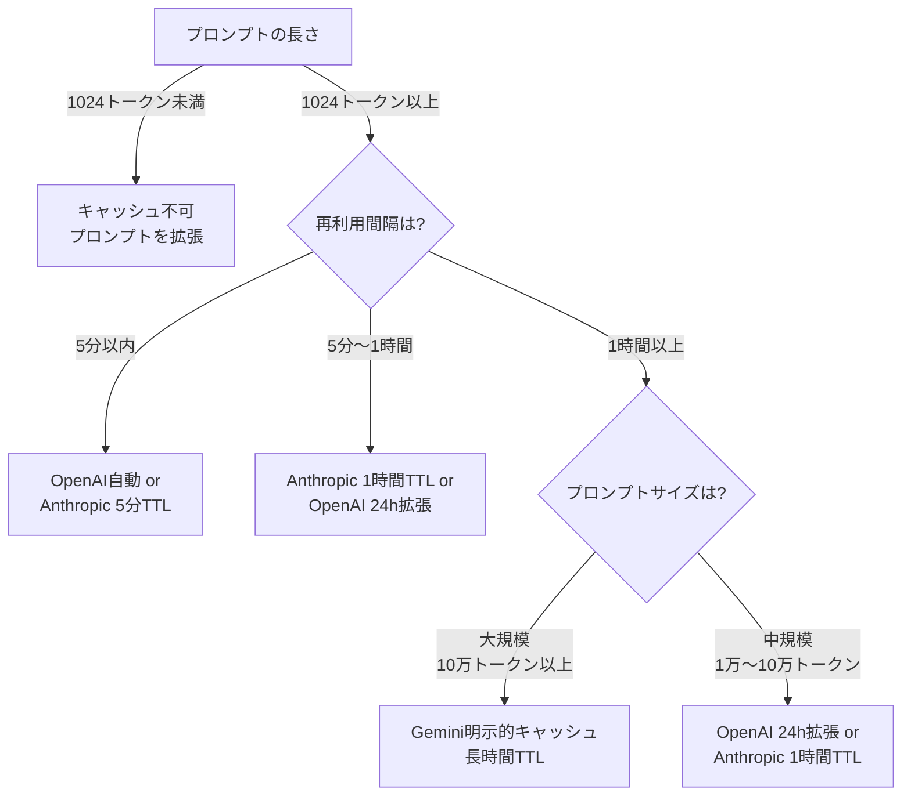
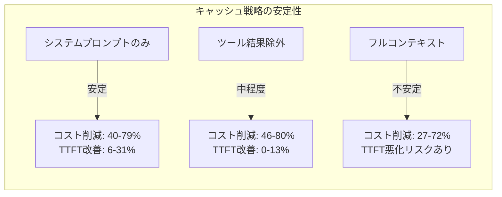

# OpenAI・Anthropic・Gemini プロンプトキャッシュ実装比較2026

## この記事でわかること

- OpenAI・Anthropic・Geminiの3社が提供するプロンプトキャッシュAPIの設計思想と実装方法の違い
- 各プロバイダーのキャッシュ制御粒度・TTL・料金体系の比較と、ワークロード別の選定基準
- 学術論文「Don't Break the Cache」の実測データに基づく、プロバイダー別のコスト削減率・TTFT改善率
- プロンプト構造の設計パターン（静的プレフィックス分離・ブレークポイント配置）とキャッシュヒット率を高める実装手法
- マルチプロバイダー環境でキャッシュ戦略を統一するゲートウェイ層の設計方針

## 対象読者

- **想定読者**: 中級〜上級のLLMアプリケーション開発者で、複数プロバイダーのAPI利用経験がある方
- **必要な前提知識**:
  - Python 3.12+の基礎文法
  - OpenAI API / Anthropic API / Gemini APIいずれかの基本的な利用経験
  - LLMのトークン・プロンプトに関する基本理解
  - REST APIリクエストの基本（HTTPヘッダー、JSONペイロード）

## 結論・成果

学術論文「Don't Break the Cache」（arxiv:2601.06007）のベンチマークによると、最適なキャッシュ戦略を適用した場合、**GPT-5.2でAPIコスト79.6%削減**、**Claude Sonnet 4.5でコスト78.5%削減・TTFT 22.9%改善**、**Gemini 2.5 Proでコスト41.4%削減**が報告されています。一方、フルコンテキストキャッシュを無策に有効化すると、GPT-4oではTTFTが**8.8%悪化**するケースも報告されており、プロバイダーごとの特性を理解した戦略設計が不可欠です。

本記事では、3社のプロンプトキャッシュAPIの設計を比較し、ワークロードに応じた実装パターンを解説します。

> **制約**: 本記事の数値は「Don't Break the Cache」論文（DeepResearchBenchでのマルチターンエージェントタスク）に基づいています。ワークロードやプロンプト構造によって実際の効果は異なるため、自環境での計測を推奨します。

## 3社のキャッシュ設計思想を比較する

プロンプトキャッシュは、LLMの推論過程で生成される**KV（Key-Value）テンソル**をサーバー側に保存し、同一プレフィックスのリクエストで再利用する仕組みです。3社はこの基本原理を共有しつつ、API設計で異なるアプローチを採用しています。

### OpenAI: 完全自動・ゼロ設定

OpenAIのプロンプトキャッシュは**コード変更不要**で動作します。1024トークン以上のプロンプトに対して自動的にキャッシュが適用され、128トークン単位でプレフィックスマッチングが行われます。

```python
# openai_caching.py
from openai import OpenAI

client = OpenAI()

# キャッシュは自動で適用される（追加パラメータ不要）
response = client.chat.completions.create(
    model="gpt-5.1",
    messages=[
        {
            "role": "system",
            "content": "あなたは社内ドキュメント検索システムの応答生成AIです。"
                       "以下のルールに従って回答してください..."
                       # 1024トークン以上のシステムプロンプト
        },
        {"role": "user", "content": "最新の福利厚生制度について教えてください"}
    ]
)

# レスポンスのusageでキャッシュ状況を確認
usage = response.usage
print(f"キャッシュヒット: {usage.prompt_tokens_details.cached_tokens} トークン")
print(f"未キャッシュ: {usage.prompt_tokens - usage.prompt_tokens_details.cached_tokens} トークン")
```

2025年後半にリリースされた**24時間拡張キャッシュ**により、従来の5〜10分から大幅にキャッシュ保持時間が延長されました。GPT-5.1/5.2/GPT-5で利用可能です。

```python
# openai_extended_caching.py
from openai import OpenAI

client = OpenAI()

# 24時間拡張キャッシュを有効化
response = client.chat.completions.create(
    model="gpt-5.1",
    prompt_cache_retention="24h",  # "in_memory"（デフォルト）または "24h"
    messages=[
        {
            "role": "system",
            "content": LONG_SYSTEM_PROMPT  # 1024トークン以上
        },
        {"role": "user", "content": user_query}
    ]
)
```

**なぜこの設計か:**
- 開発者のオンボーディングコストを最小化するため、設定ゼロで恩恵を受けられる設計
- `prompt_cache_key`パラメータで同一プレフィックスのルーティングを最適化可能

**注意点:**
> OpenAIのキャッシュは**プレフィックス完全一致**で動作します。システムプロンプトの先頭1文字でも変わるとキャッシュ全体が無効化されます。タイムスタンプやセッションIDをシステムプロンプトに含めると、キャッシュヒット率が大幅に低下します。

### Anthropic: 明示的ブレークポイントによる細粒度制御

Anthropicは**最大4つのキャッシュブレークポイント**を配置でき、3社の中で最も細かい制御が可能です。自動キャッシュ（トップレベル`cache_control`）と明示的ブレークポイント（ブロック単位`cache_control`）の2方式を提供しています。

```python
# anthropic_caching.py
import anthropic

client = anthropic.Anthropic()

# 方式1: 自動キャッシュ（最もシンプル）
response = client.messages.create(
    model="claude-sonnet-4-6",
    max_tokens=1024,
    cache_control={"type": "ephemeral"},  # トップレベルに指定
    system="あなたは社内ドキュメント検索システムの応答生成AIです...",
    messages=[
        {"role": "user", "content": "最新の福利厚生制度について教えてください"}
    ]
)
```

明示的ブレークポイントでは、プロンプトの各セクションに独立したキャッシュポイントを設定できます。

```python
# anthropic_explicit_caching.py
import anthropic

client = anthropic.Anthropic()

# 方式2: 明示的ブレークポイント（最大4つ）
response = client.messages.create(
    model="claude-sonnet-4-6",
    max_tokens=1024,
    system=[
        {
            "type": "text",
            "text": SYSTEM_INSTRUCTIONS,  # システム指示（変更頻度: 低）
            "cache_control": {"type": "ephemeral", "ttl": "1h"}
            # ← ブレークポイント1: 1時間TTL
        },
        {
            "type": "text",
            "text": TOOL_DEFINITIONS,  # ツール定義（変更頻度: 低）
            "cache_control": {"type": "ephemeral", "ttl": "1h"}
            # ← ブレークポイント2: 1時間TTL
        }
    ],
    messages=[
        {
            "role": "user",
            "content": [
                {
                    "type": "text",
                    "text": rag_context,  # RAG検索結果（変更頻度: 中）
                    "cache_control": {"type": "ephemeral", "ttl": "5m"}
                    # ← ブレークポイント3: 5分TTL
                }
            ]
        },
        {
            "role": "user",
            "content": user_query  # ユーザー入力（変更頻度: 高）
            # キャッシュなし
        }
    ]
)

# キャッシュ使用状況の確認
print(f"キャッシュ作成: {response.usage.cache_creation_input_tokens} トークン")
print(f"キャッシュ読取: {response.usage.cache_read_input_tokens} トークン")
```

**なぜこの設計か:**
- エージェントシステムのように複数の変更頻度が異なるコンテキスト（ツール定義、システムプロンプト、検索結果、会話履歴）を持つアプリケーションで、各層に最適なTTLを割り当てられる
- 1時間TTLと5分TTLの混在が可能（ただし長いTTLを先に配置する制約あり）

**注意点:**
> Anthropicの1時間キャッシュ書込は通常入力の**2倍**のコスト（$6.00/MTok vs $3.00/MTok、Claude Sonnet 4.6の場合）です。5分以内に再利用されるプロンプトに1時間TTLを設定すると、書込コストが無駄に増加します。再利用間隔を計測し、適切なTTLを選択してください。

### Gemini: ストレージベースの長時間キャッシュ

Geminiは**暗黙キャッシュ**（2025年5月〜デフォルト有効）と**明示的キャッシュ**の2方式を提供しています。明示的キャッシュはサーバー側にキャッシュオブジェクトを作成・管理する「ストレージベース」の設計で、TTLを自由にカスタマイズできます。

```python
# gemini_implicit_caching.py
from google import genai
from google.genai import types

client = genai.Client()

# 暗黙キャッシュ: 設定不要（デフォルトで有効）
response = client.models.generate_content(
    model="gemini-2.5-flash",
    contents=[
        types.Content(
            role="user",
            parts=[types.Part(text="長いドキュメントコンテキスト..." + user_query)]
        )
    ],
    config=types.GenerateContentConfig(
        system_instruction="あなたは社内ドキュメント検索AIです..."
    )
)
# Gemini 2.5モデルではキャッシュヒット時に自動で90%割引が適用される
```

明示的キャッシュでは、キャッシュオブジェクトをAPI経由で作成・管理します。

```python
# gemini_explicit_caching.py
from google import genai
from google.genai import types

client = genai.Client()

# Step 1: キャッシュオブジェクトを作成
cache = client.caches.create(
    model="gemini-2.5-flash",
    config=types.CreateCachedContentConfig(
        display_name="社内ドキュメントコンテキスト",
        system_instruction="あなたは社内ドキュメント検索AIです...",
        contents=[
            types.Content(
                role="user",
                parts=[types.Part(text=LARGE_DOCUMENT_CONTEXT)]
            )
        ],
        ttl="3600s",  # 1時間（秒単位で指定）
    )
)
print(f"キャッシュ作成: {cache.name}")
print(f"トークン数: {cache.usage_metadata.total_token_count}")

# Step 2: キャッシュを参照してリクエスト
response = client.models.generate_content(
    model="gemini-2.5-flash",
    contents="最新の福利厚生制度について教えてください",
    config=types.GenerateContentConfig(
        cached_content=cache.name  # キャッシュオブジェクトを参照
    )
)

# Step 3: 不要になったらキャッシュを削除
client.caches.delete(name=cache.name)
```

**なぜこの設計か:**
- Geminiの100万トークンコンテキストウィンドウを活かし、動画・大規模ドキュメントなどの長大コンテンツを長時間キャッシュに保持するユースケースに最適化されている
- キャッシュオブジェクトに`display_name`を付与できるため、複数キャッシュの管理が容易

**注意点:**
> Geminiの明示的キャッシュは**ストレージ課金**が発生します（Gemini 2.5 Flash: $1.00/MTok/時間、Gemini 2.5 Pro: $4.50/MTok/時間、2026年2月時点）。大量のトークンを長時間保持すると保存コストが積み上がるため、TTLの設定と不要キャッシュの削除が重要です。また、最小キャッシュ可能トークン数がモデルによって異なり（Gemini 2.5 Flash: 1,024トークン、Gemini 2.5 Pro: 4,096トークン）、短いプロンプトではキャッシュが適用されません。

## 料金体系とコスト構造を比較する

3社のプロンプトキャッシュは料金設計が大きく異なります。ワークロードの特性に応じて最もコスト効率の高いプロバイダーが変わるため、正確な理解が重要です（以下の料金は2026年2月時点。最新の料金は各社の公式ページを参照してください）。

### 料金比較表

| 項目 | OpenAI | Anthropic | Gemini |
|------|--------|-----------|--------|
| **キャッシュ書込コスト** | 無料（追加料金なし） | 5分TTL: 基本入力の1.25倍 / 1時間TTL: 基本入力の2倍 | 基本入力と同額（初回のみ） |
| **キャッシュ読取コスト** | 基本入力の10%（90%割引） | 基本入力の10%（90%割引） | Gemini 2.5: 基本入力の10% / Gemini 2.0: 基本入力の25% |
| **ストレージ課金** | なし | なし | $1.00〜$4.50/MTok/時間（モデル依存） |
| **デフォルトTTL** | 5〜10分（in_memory） | 5分 | 1時間 |
| **拡張TTL** | 24時間（GPT-5.x） | 1時間 | カスタム（秒単位で自由設定） |
| **最小トークン数** | 1,024 | 1,024（Sonnet）/ 4,096（Opus / Haiku 4.5） | 1,024〜4,096（モデル依存） |
| **最大ブレークポイント数** | なし（自動制御） | 4 | なし（キャッシュオブジェクト単位） |

### コストシミュレーション

以下は、10,000トークンのシステムプロンプトを1日100回のリクエストで使用する場合の月間コスト概算です（入力トークン単価: GPT-5.1 $1.25/MTok、Claude Sonnet 4.6 $3.00/MTok、Gemini 2.5 Flash $0.30/MTok で計算、2026年2月時点）。

| シナリオ | OpenAI GPT-5.1 | Anthropic Claude Sonnet 4.6 | Gemini 2.5 Flash |
|---------|----------------|------------------------------|------------------|
| **キャッシュなし** | $37.50/月 | $90.00/月 | $9.00/月 |
| **キャッシュあり（読取100%想定）** | $3.75/月 | $9.00/月 + 書込コスト | $0.90/月 + ストレージ |
| **削減率** | 90% | 最大90%（書込コスト考慮で約80%） | 90%（ストレージ考慮で約85%） |

> このシミュレーションはキャッシュヒット率100%の理想値です。実運用ではプロンプト構造の変動、TTL超過によるキャッシュミスが発生するため、実測では60-85%のヒット率が現実的な目標値です。

### 損益分岐の判断フロー



**よくある間違い:** 最初は「全プロバイダーでキャッシュを有効化すればコスト削減できる」と考えがちですが、Anthropicの1時間TTL書込コストは通常の2倍です。再利用間隔が短い（5分以内）場合は5分TTLの方が総コストが低くなります。また、Geminiのストレージ課金は時間単位で発生するため、アクセス頻度が低い大規模キャッシュは放置するとコストが膨れます。

## キャッシュヒット率を高めるプロンプト設計パターンを実装する

3社すべてに共通する原則は**「静的コンテンツを先頭、動的コンテンツを末尾」**に配置することです。キャッシュはプレフィックスマッチングで動作するため、先頭部分が変わるとキャッシュ全体が無効化されます。

### パターン1: 静的プレフィックス分離

最も基本的かつ効果の高いパターンです。変更頻度の低いコンテンツを先頭に集約します。

```python
# prompt_structure.py

def build_cache_optimized_prompt(
    system_instructions: str,
    tool_definitions: str,
    rag_context: str,
    conversation_history: list[dict],
    user_query: str
) -> list[dict]:
    """キャッシュヒット率を最大化するプロンプト構造を構築する。

    変更頻度の低い順に配置:
    1. システム指示（変更頻度: 極低、デプロイ時のみ変更）
    2. ツール定義（変更頻度: 低、機能追加時のみ変更）
    3. RAGコンテキスト（変更頻度: 中、クエリごとに変動）
    4. 会話履歴（変更頻度: 高、ターンごとに増加）
    5. ユーザー入力（変更頻度: 極高、毎回変動）
    """
    # NG: タイムスタンプやセッションIDをシステムプロンプトに含めない
    # system_instructions = f"[{datetime.now()}] あなたは..."  # ← キャッシュが毎回無効化される

    # OK: 静的な指示のみをシステムプロンプトに含める
    messages = [
        {"role": "system", "content": system_instructions + "\n\n" + tool_definitions},
        # ↑ 変更頻度が低いコンテンツを結合してプレフィックスを形成
    ]

    # RAGコンテキストと会話履歴は後続に配置
    if rag_context:
        messages.append({
            "role": "user",
            "content": f"参考情報:\n{rag_context}"
        })

    messages.extend(conversation_history)
    messages.append({"role": "user", "content": user_query})

    return messages
```

### パターン2: Anthropicの4層ブレークポイント設計

Anthropicの明示的ブレークポイントを活用し、各コンテンツ層に最適なTTLを割り当てます。

```python
# anthropic_4layer_cache.py
import anthropic

client = anthropic.Anthropic()


def create_4layer_cached_request(
    system_instructions: str,
    tool_definitions: str,
    rag_context: str,
    user_query: str,
) -> anthropic.types.Message:
    """4層キャッシュブレークポイントでリクエストを構築する。

    TTLルール: 長いTTLを先に配置（1h → 1h → 5m → キャッシュなし）
    """
    return client.messages.create(
        model="claude-sonnet-4-6",
        max_tokens=2048,
        system=[
            {
                "type": "text",
                "text": system_instructions,
                "cache_control": {"type": "ephemeral", "ttl": "1h"},
                # Layer 1: システム指示（1時間キャッシュ）
            },
            {
                "type": "text",
                "text": tool_definitions,
                "cache_control": {"type": "ephemeral", "ttl": "1h"},
                # Layer 2: ツール定義（1時間キャッシュ）
            },
        ],
        messages=[
            {
                "role": "user",
                "content": [
                    {
                        "type": "text",
                        "text": f"参考情報:\n{rag_context}",
                        "cache_control": {"type": "ephemeral", "ttl": "5m"},
                        # Layer 3: RAGコンテキスト（5分キャッシュ）
                    },
                ],
            },
            {
                "role": "user",
                "content": user_query,
                # Layer 4: ユーザー入力（キャッシュなし）
            },
        ],
    )
```

### パターン3: Geminiの大規模コンテキストキャッシュ

Geminiの100万トークンコンテキストウィンドウを活かし、大規模ドキュメントを事前にキャッシュオブジェクトとして登録するパターンです。

```python
# gemini_large_context_cache.py
from google import genai
from google.genai import types


def create_document_cache(
    documents: list[str],
    system_instruction: str,
    ttl_seconds: int = 3600,
) -> str:
    """大規模ドキュメントコンテキストのキャッシュを作成する。

    Args:
        documents: キャッシュするドキュメントのリスト
        system_instruction: システム指示
        ttl_seconds: キャッシュの有効期間（秒）

    Returns:
        キャッシュオブジェクトの名前（後続リクエストで参照）
    """
    client = genai.Client()

    combined_context = "\n\n---\n\n".join(documents)

    cache = client.caches.create(
        model="gemini-2.5-flash",
        config=types.CreateCachedContentConfig(
            display_name="document-context-cache",
            system_instruction=system_instruction,
            contents=[
                types.Content(
                    role="user",
                    parts=[types.Part(text=combined_context)],
                )
            ],
            ttl=f"{ttl_seconds}s",
        ),
    )
    return cache.name


def query_with_cache(cache_name: str, user_query: str) -> str:
    """キャッシュを参照してクエリを実行する。"""
    client = genai.Client()

    response = client.models.generate_content(
        model="gemini-2.5-flash",
        contents=user_query,
        config=types.GenerateContentConfig(cached_content=cache_name),
    )
    return response.text
```

**トレードオフ:** Geminiの明示的キャッシュはストレージ課金が発生するため、アクセス頻度が低い場合はコストが増加します。1時間に10回未満のアクセスであれば、暗黙キャッシュ（設定不要）の方がコスト効率が高い場合があります。

## 学術論文の実測データからプロバイダー別の最適戦略を理解する

「Don't Break the Cache: An Evaluation of Prompt Caching for Long-Horizon Agentic Tasks」（arxiv:2601.06007）は、3社のプロンプトキャッシュを統一ベンチマーク（DeepResearchBench）で比較した論文です。500以上のエージェントセッション、10,000トークンのシステムプロンプトを用いた実測結果を紹介します。

### 実測結果サマリー

| モデル | 最適キャッシュ戦略 | コスト削減率 | TTFT改善率 |
|--------|-------------------|------------|-----------|
| GPT-5.2 | ツール結果除外 | 79.6% | 13.0% |
| Claude Sonnet 4.5 | システムプロンプトのみ | 78.5% | 22.9%* |
| Gemini 2.5 Pro | システムプロンプトのみ | 41.4% | 6.1% |
| GPT-4o | システムプロンプトのみ | 45.9% | 30.9%* |

*は統計的に有意なTTFT改善（p < 0.05）を示します。

（出典: [Don't Break the Cache（arxiv:2601.06007）](https://arxiv.org/abs/2601.06007)）

### 戦略別の効果比較

論文では3つのキャッシュ戦略を比較しています。

1. **フルコンテキストキャッシュ**: ツール結果を含む全入力をキャッシュ
2. **ツール結果除外**: ツールの呼び出し結果（動的コンテンツ）をキャッシュから除外
3. **システムプロンプトのみ**: システムプロンプト部分だけをキャッシュ

論文の著者らの実験では、**フルコンテキストキャッシュが逆効果**になるケースが確認されています。GPT-4oではフルコンテキストキャッシュ適用時にTTFTが**8.8%悪化**しました。これは、動的なツール呼び出し結果をキャッシュに書き込むコストが、キャッシュヒットによる恩恵を上回るためです。



### プロバイダー別の推奨戦略

論文の知見を実装に落とし込むと、以下の使い分けが有効です。

| プロバイダー | ツール呼び出しあり | ツール呼び出しなし |
|-------------|-------------------|-------------------|
| **OpenAI** | ツール結果除外（コスト~80%削減） | システムプロンプトのみ（TTFT~31%改善） |
| **Anthropic** | システムプロンプトのみ（コスト~79%削減、TTFT~23%改善） | 同左 |
| **Gemini** | システムプロンプトのみ（コスト~41%削減） | 同左 |

**ハマりポイント:** 「キャッシュは多ければ多いほどよい」という直感は誤りです。エージェントシステムでは、ツール呼び出し結果は毎回変わる動的コンテンツであるため、キャッシュ書込のオーバーヘッドだけが発生し、読取の恩恵を受けられません。**システムプロンプトのみキャッシュが最も安定した効果を発揮**します。

## キャッシュヒット率をモニタリングする

キャッシュ戦略の効果を継続的に計測するために、各プロバイダーのレスポンスからキャッシュメトリクスを抽出し、構造化ログとして記録します。

```python
# cache_monitor.py
import json
import logging
from datetime import datetime, timezone

logger = logging.getLogger(__name__)


def extract_cache_metrics(provider: str, response: dict) -> dict:
    """プロバイダーごとのレスポンスからキャッシュメトリクスを抽出する。"""
    if provider == "openai":
        usage = response.get("usage", {})
        details = usage.get("prompt_tokens_details", {})
        cached = details.get("cached_tokens", 0)
        total = usage.get("prompt_tokens", 1)
    elif provider == "anthropic":
        usage = response.get("usage", {})
        cached = usage.get("cache_read_input_tokens", 0)
        total = usage.get("input_tokens", 0) + cached + usage.get("cache_creation_input_tokens", 0)
    else:  # gemini
        meta = response.get("usage_metadata", {})
        cached = meta.get("cached_content_token_count", 0)
        total = meta.get("prompt_token_count", 1)

    return {
        "provider": provider,
        "cached_tokens": cached,
        "total_input_tokens": total,
        "hit_rate": cached / max(total, 1),
    }


def log_cache_metrics(metrics: dict, request_id: str, duration_ms: float) -> None:
    """キャッシュメトリクスを構造化ログとして出力する。"""
    log_entry = {
        "event": "llm_cache_metrics",
        "level": "INFO",
        "ts": datetime.now(tz=timezone.utc).isoformat(),
        "request_id": request_id,
        "duration_ms": duration_ms,
        **metrics,
    }
    logger.info(json.dumps(log_entry, ensure_ascii=False))
```

**ハマりポイント:** キャッシュヒット率が10%を下回る場合、プロンプトに動的要素（タイムスタンプ、ランダムID、セッションメタデータ）が混入している可能性があります。モニタリングで低ヒット率を検出したら、まずプロンプトの先頭部分が毎回同一であることを確認してください。

> マルチプロバイダー環境では、キャッシュ制御ロジックをアプリケーション層から分離し、ゲートウェイ層で統一管理するアプローチも有効です。ただし、各プロバイダーの固有機能（Anthropicの4ブレークポイント、Geminiのキャッシュオブジェクト管理）を抽象化するため、プロバイダー固有の最適化を一部犠牲にする点に注意してください。

## よくある問題と解決方法

| 問題 | 原因 | 解決方法 |
|------|------|----------|
| キャッシュヒット率が0%のまま | プロンプトが最小トークン数未満 | システムプロンプトを1024トークン以上に拡張 |
| キャッシュがすぐ失効する | TTLが短くリクエスト間隔が長い | OpenAI: 24h拡張、Anthropic: 1h TTL、Gemini: TTLカスタマイズ |
| フルキャッシュでレイテンシ悪化 | 動的コンテンツのキャッシュ書込オーバーヘッド | システムプロンプトのみキャッシュに切り替え |
| Geminiのストレージコスト増大 | TTLが長すぎ、不要キャッシュが残存 | 定期的な`client.caches.delete()`実行、TTL短縮 |
| Anthropicで1hキャッシュのコスト増 | 5分以内に再利用されるのに1h TTLを設定 | 再利用間隔を計測し5m TTLに変更 |
| OpenAIでキャッシュヒットが不安定 | リクエスト頻度が低くサーバーからエビクション | `prompt_cache_key`で同一サーバーにルーティング |

## まとめと次のステップ

**まとめ:**
- **OpenAI**は設定ゼロ・書込コスト無料でキャッシュが自動適用され、24時間拡張キャッシュ（GPT-5.x）で長時間保持も可能。細かい制御はできないが、オンボーディングコストが低い
- **Anthropic**は最大4つのキャッシュブレークポイントと5分/1時間のTTL選択で最も細粒度の制御が可能。エージェントシステムなど複数の変更頻度を持つコンテンツに適している
- **Gemini**はストレージベースの明示的キャッシュで自由なTTL設定が可能。100万トークンの大規模コンテキストキャッシュに強みがあるが、ストレージ課金に注意が必要
- 論文「Don't Break the Cache」の実測データによると、**システムプロンプトのみキャッシュが最も安定した効果を発揮**し、フルコンテキストキャッシュは逆効果になるリスクがある
- キャッシュヒット率のモニタリングを導入し、プロンプト構造の動的要素混入を早期に検出することが継続的なコスト削減の鍵

**次にやるべきこと:**
- 自プロジェクトで使用しているプロバイダーの公式ドキュメントを確認し、最小トークン要件を満たすプロンプト構造に調整する
- キャッシュメトリクスのモニタリングを導入し、ヒット率60%以上を目標にプロンプト設計を最適化する
- 関連記事: [LangGraph×Claude Sonnet 4.6のプロンプトキャッシュ最適化でAgentic RAGコスト90%削減](https://zenn.dev/0h_n0/articles/555a4e799660de) — Anthropic固有の実装をさらに深掘りしたい場合に参照
- 関連記事: [Bedrock AgentCore×1時間キャッシュで社内RAGコスト90%削減](https://zenn.dev/0h_n0/articles/d027acf4081b9d) — AWS Bedrock環境での実装例

## 関連する1次情報記事

本記事で取り上げたトピックに関連する論文の詳細解説記事です。

- [論文解説: Don't Break the Cache — 3プロバイダーKVキャッシュ比較評価](https://0h-n0.github.io/posts/paper-2601-06007/) — 本記事の主要参考論文。3社のプロンプトキャッシュを統一ベンチマークで比較評価
- [論文解説: Prompt Cache — Modular Attention Reuse (MLSys 2024)](https://0h-n0.github.io/posts/paper-2311-04934/) — スキーマベースのモジュラーAttention再利用手法
- [論文解説: SGLang — RadixAttention によるKVキャッシュ自動共有](https://0h-n0.github.io/posts/paper-2312-07104/) — Radix Treeベースの自動プレフィックスキャッシュ共有
- [論文解説: CacheGen — KVキャッシュ圧縮とストリーミング (SIGCOMM 2024)](https://0h-n0.github.io/posts/paper-2310-07240/) — KVキャッシュの高効率圧縮・ネットワーク転送手法
- [論文解説: ChunkAttention — プレフィックスKVキャッシュ共有 (ACL 2024)](https://0h-n0.github.io/posts/paper-2402-15220/) — チャンク分割によるプレフィックス共有とTwo-Phase Partition

## 参考

- [Anthropic Prompt Caching公式ドキュメント](https://platform.claude.com/docs/en/build-with-claude/prompt-caching)
- [OpenAI Prompt Caching公式ドキュメント](https://developers.openai.com/api/docs/guides/prompt-caching/)
- [Gemini Context Caching公式ドキュメント](https://ai.google.dev/gemini-api/docs/caching)
- [Don't Break the Cache: An Evaluation of Prompt Caching for Long-Horizon Agentic Tasks（arxiv:2601.06007）](https://arxiv.org/abs/2601.06007)
- [OpenAI Prompt Caching 201（Cookbook）](https://developers.openai.com/cookbook/examples/prompt_caching_201/)
- [Gemini 2.5 Models now support implicit caching（Google Developers Blog）](https://developers.googleblog.com/en/gemini-2-5-models-now-support-implicit-caching/)
- [PromptHub Blog: Prompt Caching with OpenAI, Anthropic, and Google Models](https://www.prompthub.us/blog/prompt-caching-with-openai-anthropic-and-google-models)

---

:::message
この記事はAI（Claude Code）により自動生成されました。内容の正確性については複数の情報源で検証していますが、実際の利用時は公式ドキュメントもご確認ください。
:::
